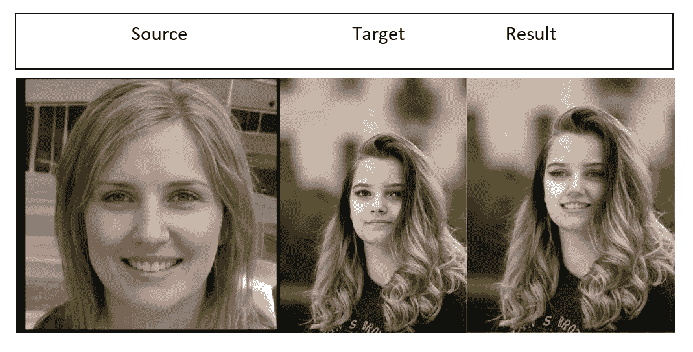
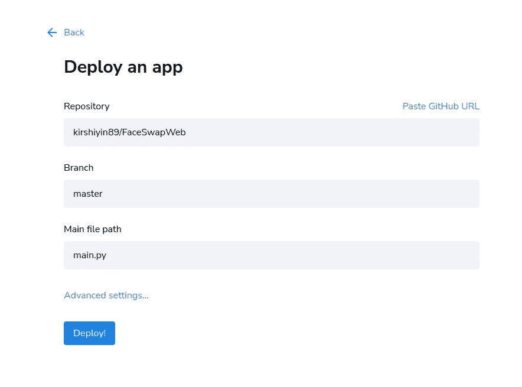
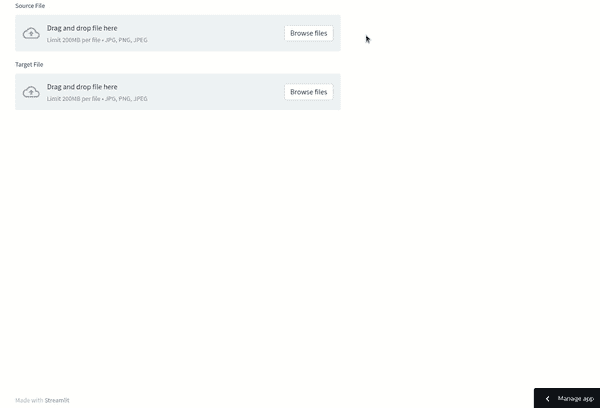

# 使用 Python 和 Streamlit 创建和部署面部交换应用程序

> 原文：<https://betterprogramming.pub/create-and-deploy-a-face-swap-app-using-python-and-streamlit-857b4b5b8ea2>

## 关于如何使用面部交换和 StyleGan 项目来交换真实面部和虚假面部的教程


照片由[瑞德·卫斯理](https://unsplash.com/@rhett__noonan?utm_source=medium&utm_medium=referral)在 [Unsplash](https://unsplash.com?utm_source=medium&utm_medium=referral)

人工智能和机器学习已经变得非常流行，并为各种目的服务。令人惊讶的是，它们甚至被用来制造假的人！

你能想象这个人不存在吗？


来源:由 https://this-person-does-not-exist.com/[自动生成](https://this-person-does-not-exist.com/en)

这张照片是由 [StyleGAN，](https://en.wikipedia.org/wiki/StyleGAN)一个假人生成器工具生成的。

# 如何利用假人代会？

以下是一些可以考虑的想法:

*   你在写一个人工智能算法来区分假脸和真脸。您可以生成任意多的虚拟数据来训练您的模型。
*   你想在网上卖一些你的衣服。如果有人穿这种衣服，广告看起来会更有吸引力。如果你想隐藏你的脸，你可以把它换成一个不存在的脸。
*   你有一个营销活动，想在你的演示文稿中展示一些人。雇个模特是要花钱的。还有，网上有些照片是有版权的。所以，你可以选择一张假照片。

在本文中，您将学习如何:

*   使用 StyleGan 算法生成假的人。
*   使用[换脸](https://github.com/wuhuikai/FaceSwap) Python 项目轻松换脸。
*   使用 [Streamlit](https://share.streamlit.io/) 库创建一个简单的 Web UI 来上传照片和更改面部。
*   只需点击几下鼠标，即可将应用部署到 [Streamlit](https://share.streamlit.io/) Cloud，并与您的朋友分享这个有趣的项目。

我们开始吧！

# 技术概述

## StyleGAN 快速介绍

StyleGAN 是一个开源项目，它使用深度学习算法来生成不同性别和种族组合的人脸的逼真图像。

要观看演示，请访问[https://this-person-does-not-exist.com](https://this-person-does-not-exist.com/en)页面。它会在你每次刷新页面时生成一个新面孔。

要了解更多算法，请查看他们的 [GitHub 库](https://github.com/NVlabs/stylegan)。

## 面部交换快速介绍

Face Swap 是一个公共 Python 项目，可以让你和别人交换脸。它可以用于照片、视频，甚至是直播相机。

你只需要一个源和一个目标图像。代码将生成照片组合的结果。

## 简化快速介绍

Streamlit 是一个开源 Python 框架，用于在短时间内创建和部署 web 应用程序。它主要由数据科学家使用。它不需要前端开发经验，因为它的学习曲线很短。

# 准备项目

现在你知道从哪里得到假面了。

在这一步，我们将基于源图像和目标图像生成新的人脸。

执行以下命令来安装面交换要求:

```
$ git clone [https://github.com/wuhuikai/FaceSwap.git](https://github.com/wuhuikai/FaceSwap.git)$ cd FaceSwap$ python3 -m pip install -r requirements.txt
```

生成结果图像就像运行以下命令一样简单:

```
python3 main.py — src {source.jpg} — dst {target.jpg} — out {result.jpg} — correct_color — no_debug_window
```

参数解释:

*   `--src`是源照片的路径。
*   `--dst`是目标照片的路径。
*   `--out`将是结果照片的路径。
*   `--correct_color`努力使照片的颜色尽可能真实。
*   `--no_debug_window`禁用调试窗口。

脚本输出:



源图由 StyleGan 提供，目标图由@patrikvelich 提供

# 部署项目

到目前为止，我们一直在使用终端执行 Python 脚本来交换面部。如果有一个用户可以上传源照片和目标照片的用户界面就好了。

我们将使用 Streamlit API 为原始的 Face Swap 代码创建一个简单的 UI。实现这一点最简单的方法是派生他们的 GitHub 库并修改`main.py`文件。

为了简洁起见，我不打算在这里粘贴原始代码。如果你想看，请查看下面的参考资料部分。

下面是修改后的代码:

主要变化:

*   增加了`streamlit`和`PIL`的依赖关系。
*   使用`st_uploader`为 UI 创建了浏览按钮。
*   使用`cv2.cvtColor(numpy.array(source_image), cv2.IMREAD_COLOR)`将`PIL`图像转换为`cv2`格式。这是必需的，因为原始代码期望`cv2`。
*   使用`st.image(output,width=500)`显示图像。

接下来，修改`requirements.txt` 文件，简化部署所需的 it:

登录您的 Streamlit 账户[https://share.streamlit.io/](https://share.streamlit.io/)。

选择您的应用程序的 GitHub repo，然后单击部署:



在 Streamlit 中部署新应用

就是这样！

部署过程将需要几分钟时间。喝杯咖啡，然后享受你的新应用。



streamlit 上的面部交换演示

相当令人印象深刻！成绩还不错。注意，为了更好的效果，你应该选择相似的姿势和灯光。如果你想完美的效果，你可以使用你的 Photoshop 技巧。

点击分享，与您的朋友分享应用程序。他们可以通过邀请链接在浏览器中试用这款应用。

# 结论

在本教程中，您学习了一种使用 Face Swap 和 StyleGan 生成和交换面的简单方法。您还知道如何使用 Streamlit 部署 web 应用程序并与其他人共享。

该应用程序的用户界面是最小的演示目的。如果你想让它更有趣，我鼓励你去探索 Streamlit 的 [API 参考](https://docs.streamlit.io/library/api-reference)。

我希望你喜欢这篇文章。感谢您的阅读，下次再见！

# 参考

*   [我的脸互换 GitHub 回购](https://github.com/kirshiyin89/FaceSwapWeb)
*   [原脸互换 GitHub 回购](https://github.com/wuhuikai/FaceSwap)
*   [StyleGan GitHub repo](https://github.com/NVlabs/stylegan)