# 创建 Vue.js 应用程序并将其部署到 Github 页面

> 原文：<https://betterprogramming.pub/create-and-deploy-a-vue-js-app-to-github-pages-706dbf7bc2c4>

## Github pages 提供了直接从存储库托管页面的替代选项。


照片由[乔安娜·科辛斯卡](https://unsplash.com/@joannakosinska?utm_source=medium&utm_medium=referral)在 [Unsplash](https://unsplash.com?utm_source=medium&utm_medium=referral) 上拍摄

> GitHub Pages 是一个静态的站点托管服务，它直接从 GitHub 上的存储库中获取 HTML、CSS 和 JavaScript 文件，可以选择在构建过程中运行这些文件，并发布一个网站。
> 
> —[https://docs . github . com/en/pages/getting-started-with-github-pages/about-github-pages](https://docs.github.com/en/pages/getting-started-with-github-pages/about-github-pages)

尽管是一个静态的文件托管服务，我们可以创建动态的 web 应用程序。在本文中，我们将使用 Vue.js 创建一个应用程序，并将其部署在 github 上。

> Vue(读作/vjuː/，类似于视图)是一个用于构建用户界面的 JavaScript 框架。它建立在标准的 HTML、CSS 和 JavaScript 之上，提供了一个声明性的和基于组件的编程模型，帮助您高效地开发用户界面，无论它是简单的还是复杂的。
> 
> —[https://vuejs.org/guide/introduction.html#what-is-vue](https://vuejs.org/guide/introduction.html#what-is-vue)

# 开源代码库

Github pages 允许三种类型的 GitHub Pages 站点:项目、用户和组织。所选择的类型定义了要创建的存储库的名称。

对于个人站点，存储库名称应该遵循模式`<username>.github.io`。

对于一个组织的网站，必须按照`<organization>.github.io`模式创建一个存储库。它必须属于该组织。

每个 GitHub 帐户可以有一个个人网站，每个组织可以有一个组织类型的网站。至于项目类型，则没有这样的限制。

让我们创建一个项目类型的网站。转到 github 并创建一个新的存储库。由于类型将是项目，我们不必遵循上述模式。

对于本教程，我们将选择`bravecl-public`作为存储库名称。该存储库必须是公共的。

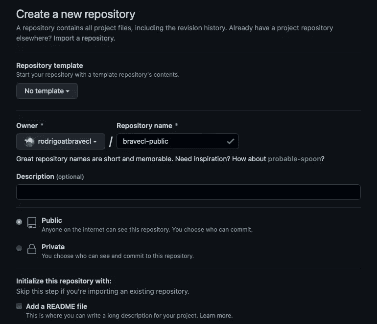

Github 创建一个新的存储库页面。

让我们在本地配置存储库。Github 提供了一个快速设置，显示在库创建之后。您可以直接克隆存储库或使用快速设置选项之一。

用以下内容创建一个 index.html 文件:

在项目类型中，GitHub 建议文件应该在`gh-pages`分支的根目录下。

让我们首先提交我们的`index.html`文件。在终端中运行以下命令:

```
git add index.html
git commit -m "Hello world index.html"
git push -u origin main
```

现在，让我们创建`gh-pages`分支并将其推送到存储库。运行以下命令:

```
git checkout -b gh-pages
git push -u origin gh-pages
```

在 Github 上访问您的项目，然后进入设置。前往左侧菜单中的页面。

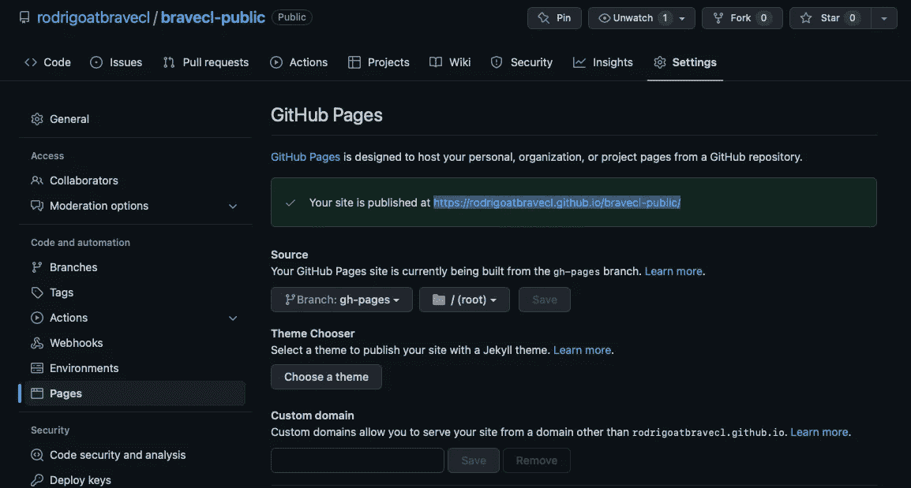

Github 页面设置

现在，您已经在 github 页面上托管和发布了您的站点。您可以使用提供的链接来访问它。

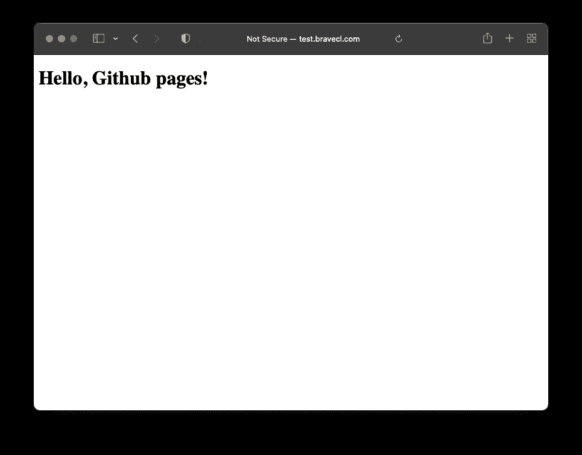

网站已发布

## 自定义域

这一步是可选的。

如果你有一个域名，你可以使用它。在我们的例子中，我们将使用域`test.bravecl.com`而不是`rodrigoatbravecl.github.io/bravecl-public/`。

在“设置”>“页面”上，在“自定义域”下添加您的域，然后单击“保存”。

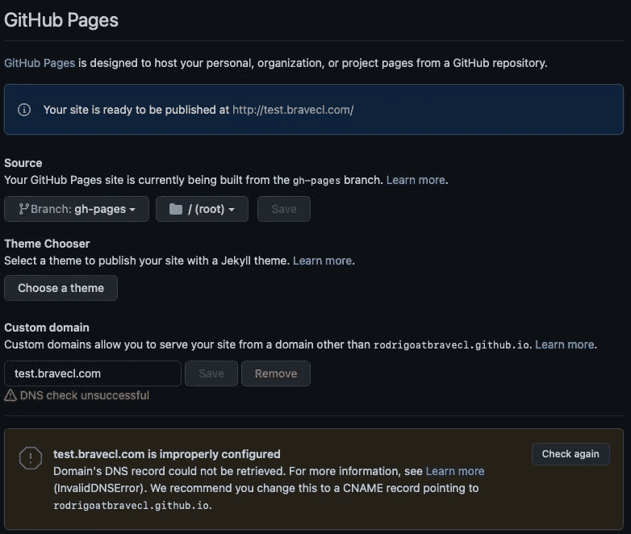

Github 设置>页面

Github 会抱怨你需要配置 DNS。我们需要创造一项 CNAME 记录。注册表名称必须是所选的域，值必须是`<user>.github.io`。在我们的例子中，cname 应该包含名称:test.bravecl.com。值:`rodrigoatbravecl.github.io`。

DNS 配置超出了本文的范围。如果配置正确，可以使用 dig 命令进行测试。在 test.bravecl.com 的情况下，我们可以运行:

```
dig test.bravecl.com cname
```

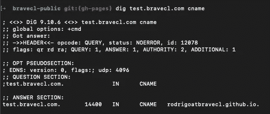

“挖 test.bravecl.com cname”回应

您可以启用强制 HTTPS 功能来提高安全性。

# vue . j

随着我们的 hello world 在 Github 页面上运行，让我们创建我们的 Vue.js 项目。

你需要安装 nodejs，可以从[https://nodejs.org/](https://nodejs.org/)获得。

我们将使用 Visual Studio 代码作为 IDE。打开您的存储库文件夹。在终端中运行以下命令创建 Vue.js 项目:

```
git checkout master
npm init vue@latest dev
```

选择以下选项:

*   添加 TypeScript？不
*   添加 JSX 支持？不
*   添加 Vue 路由器进行单页应用开发？是
*   加 Pinia 进行状态管理？是
*   为单元测试添加 Vitest？不
*   为单元测试和端到端测试添加 Cypress？不
*   为代码质量添加 ESLint？是
*   为代码格式添加更漂亮的？是

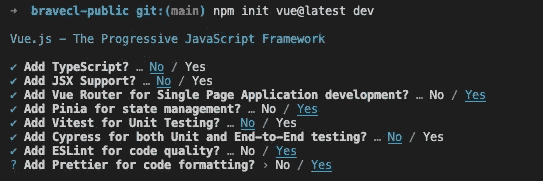

Vue 项目配置

将在 dev 文件夹中创建一个新项目。在终端中运行:

```
cd dev/
npm install
```

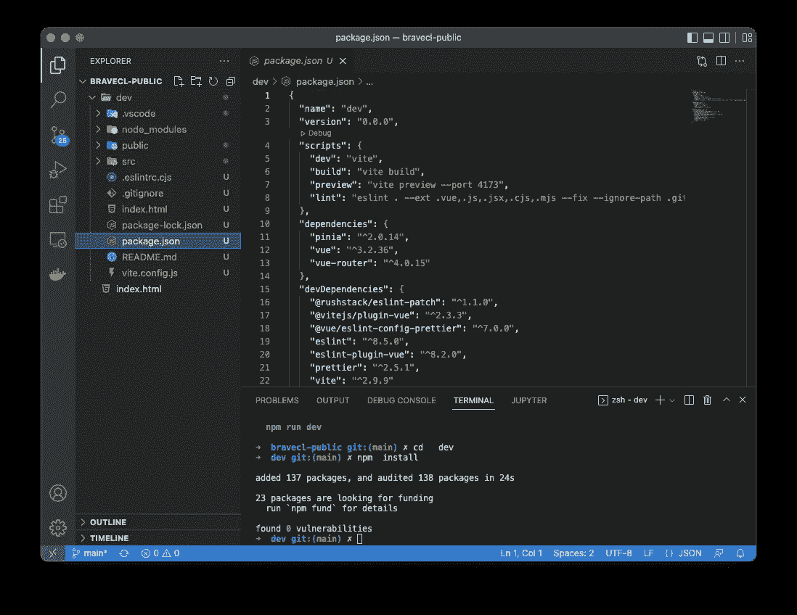

npm 依赖项安装

您的项目应该如上所示。运行 npm 运行 dev 并在浏览器中访问 localhost:3000。

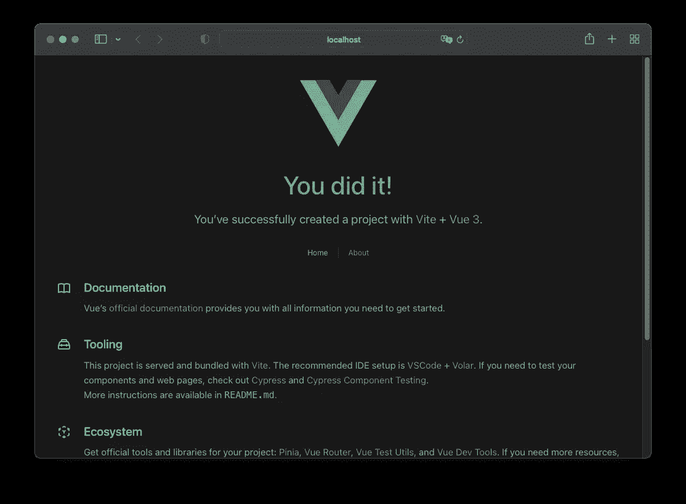

在本地主机上运行的 vue:3000

## 构建和部署

打开`vite.config.js`文件，如下图所示进行编辑。让我们将目标文件夹设置为/docs，位于您的存储库的根目录下。

如果您没有配置自定义域，在项目托管中，您还必须配置基本路径，如下所示，将`/bravecl-public/`替换为`/<repository_name>`。

运行 npm 运行构建。docs 文件夹将创建在您的存储库的根目录下。

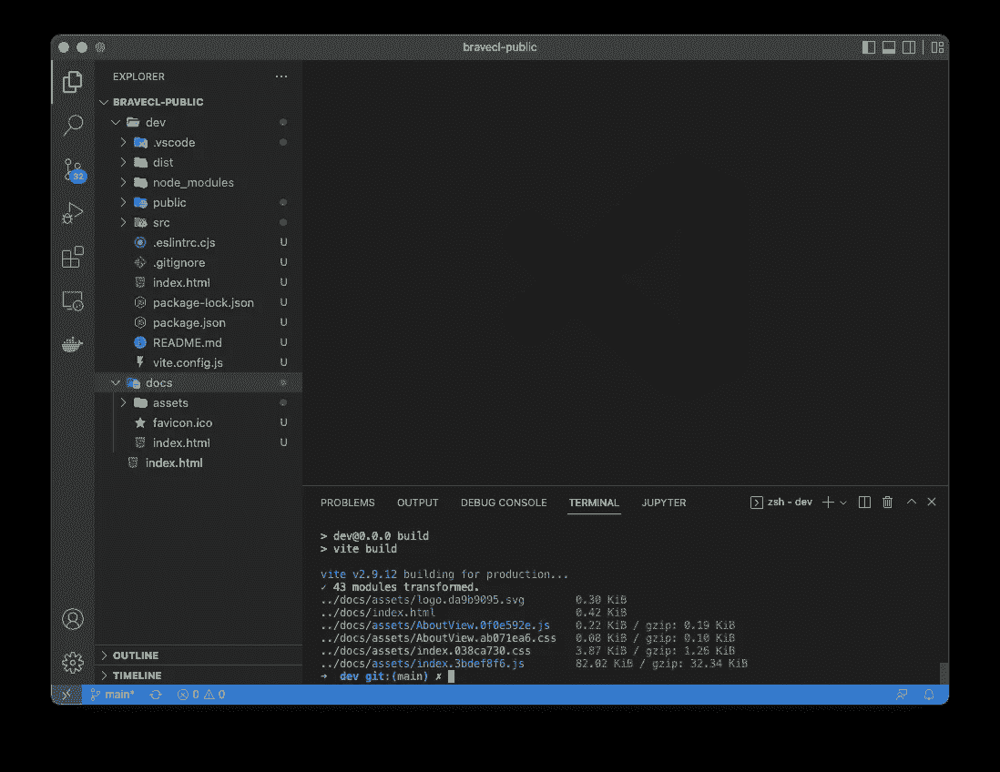

在终端中，输入以下命令:

```
cd ..
git add -A
git commit -m "Vue project creation"
git checkout gh-pages
git merge main
```

以上命令合并了在`gh-pages`分支中创建的 Vue 项目。在 GitHub 上打开你的库的配置页面，在 Source 中将它改为`/docs`。单击保存。

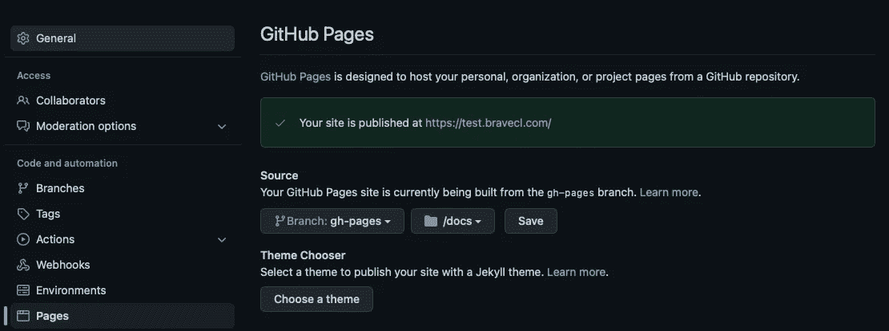

现在，让我们用 GitHub 和 push 更新我们的存储库。如果您使用的是自定义域，git pull 将打开 git 创建的 CNAME 文件，要求您为合并键入一条消息。

```
git pull
git push
```

下面，更新后的网站。

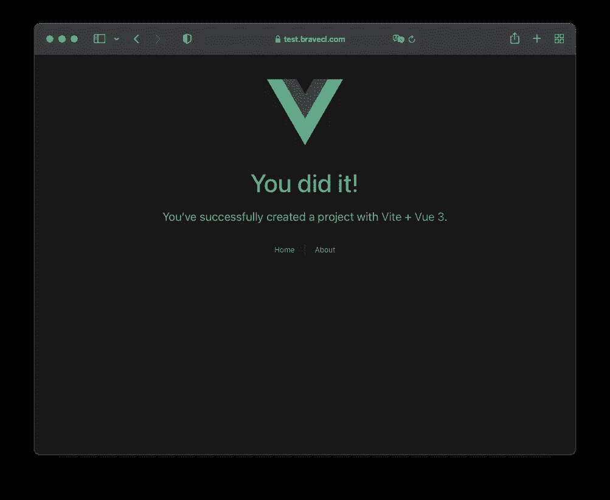