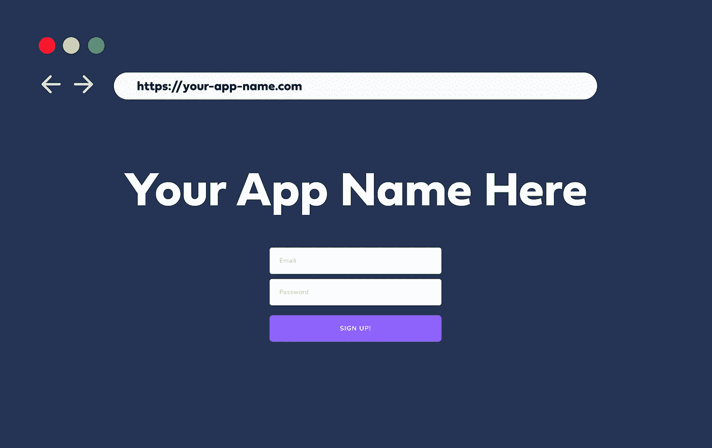
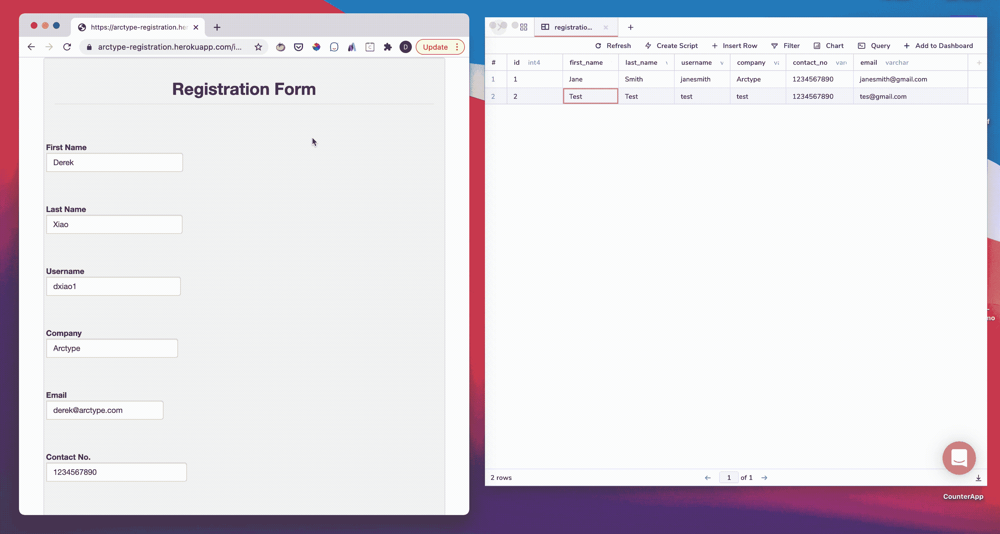
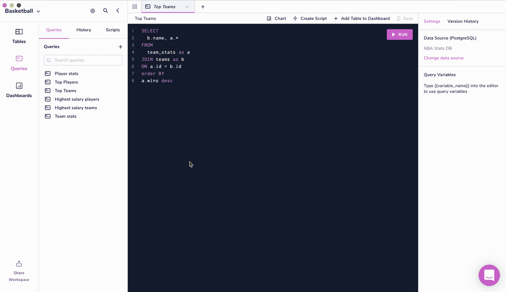
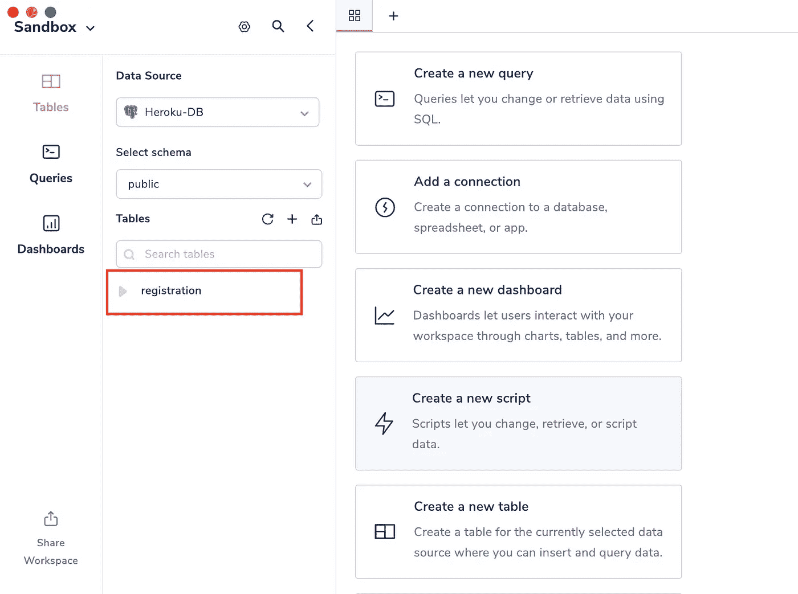
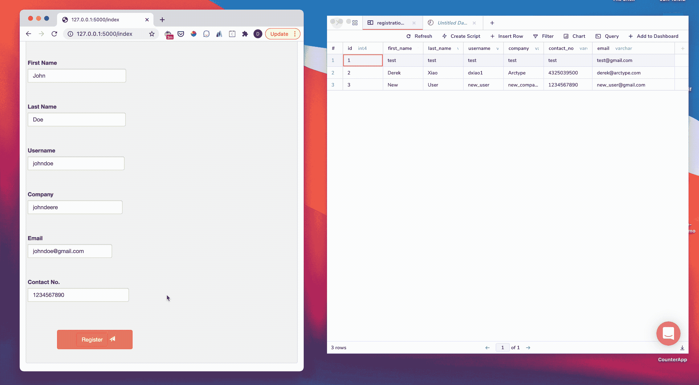
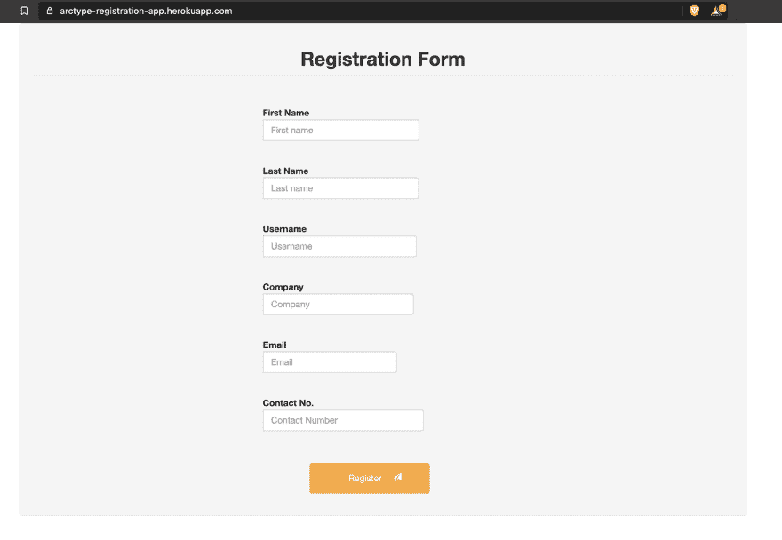

# 用 Python 在 20 分钟内创建并部署一个 Web 应用到云

> 原文：<https://betterprogramming.pub/create-and-deploy-a-web-app-to-the-cloud-with-python-in-20-minutes-7e628b28325d>

## 使用 Flask、Postgres 和 Heroku 构建健壮的应用程序



如果您一直在寻找将您的第一个 web 应用程序部署到云中，那么这篇文章就是为您准备的！

在本教程中，我将展示如何制作下面 GIF 中显示的 web 应用程序和数据库，以及如何将其部署到 Heroku，以便任何人都可以使用。



SQL 编辑器: [Arctype](https://arctype.com/?utm_campaign=postgres-heroku&utm_medium=blog&utm_source=medium)

文章分为三个部分:

1.  创建 Flask 应用程序(用于提交表单的 web 应用程序)
2.  用 Python 建立 Postgres 数据库(存储提交的表单中的数据)
3.  将应用程序部署到 Heroku(将应用程序托管在云中，这样任何人都可以使用它)

在每一节的开始，我提供了对每种技术的简要概述，所以如果您不熟悉其中的一些技术，请不要害怕。

如果你在学习教程的过程中遇到任何问题，我们已经为新程序员创建了一个不和谐频道来回答任何问题:[在这里加入](https://discord.gg/YaZQzBen)。

## 技术要求

本指南面向熟悉编程和使用命令行的初级到中级程序员。

您需要具备以下条件才能开始:

*   **PostgreSQL** :你需要[下载 PostgreSQL](https://www.postgresql.org/download/)并安装在你的本地电脑上
*   **Python 3.6 或更新版本**:不同版本和操作系统的 Python 安装程序可从这里[下载](https://www.python.org/)
*   **Heroku 账号**:如果你还没有的话，你需要[创建一个免费的 Heroku 账号](https://signup.heroku.com/)。这是我们将部署 Flask 应用程序并将其连接到远程 Postgres 数据库的地方。

一旦安装了以上所有组件，我们就可以开始设置我们的开发环境了。

# 为注册表单创建 Flask 应用程序


SQL 编辑器: [Arctype](https://arctype.com/?utm_campaign=postgres-heroku&utm_medium=blog&utm_source=medium)

在本节中，我们将创建如上所示的 Flask 应用程序。

我已经创建了一个示例 Flask 应用程序，它呈现一个简单的注册表单，用于从用户那里收集信息。

Flask 是用 Python 编写的最流行的 web 框架之一。我首先创建的 Flask 应用程序向在`app/routes.py`文件中定义的端点发出请求，以检索显示在注册表单中的数据。

然后，它使用 [Jinja 模板库](https://jinja.palletsprojects.com/en/2.11.x/templates/)呈现包含在`Template`文件夹中的 HTML 页面。

与其从头开始，不如让我们复制我通过克隆 GitHub repo 创建的 Flask 应用程序。

打开一个命令行工具，并运行以下命令:

```
git clone https://github.com/ToluClassics/Web_Registration_Form.git
cd web_registration_form
```

如果您曾经迷路，您可以在这里查看已完成的项目:[烧瓶-postgres app](https://github.com/ToluClassics/flask_postgres) 。

接下来，我们将为这个项目创建一个虚拟环境，并安装所需的依赖项。*虚拟环境*是不同 Python 项目的隔离环境。它们有助于将不同项目之间的包和依赖关系分开。

根据计算机的操作系统，运行以下命令:

```
Windows:
**$** python3 -m venv env
**$** source env/scripts/activate
(env) $ pip install -r requirements.txtMacOS and UNIX:
**$** python -m venv env
**$** source env/bin/activate
(env) $ pip install -r requirements.txt
```

为了测试我们的环境是否设置正确，让我们尝试在虚拟环境中输入`flask run`来启动应用程序。

```
(env) derekxiao@Dereks-MBP Web_Registration_Form % flask run
 * Environment: production
   WARNING: This is a development server. Do not use it in a production deployment.
   Use a production WSGI server instead.
 * Debug mode: off
 * Running on http://127.0.0.1:5000/ (Press CTRL+C to quit)
```

现在，您可以在任何浏览器中输入上面的网址并查看网页表单。

# 为登记表添加输入验证

为了更熟悉代码，让我们向表单类添加输入验证。

我们希望我们的应用程序能够防止用户用相同的用户名或电子邮件地址多次填写表格。

通过`wtforms`，您可以创建一个自定义验证器，通过创建一个名为`validate_<field_name>`的方法，该验证器会自动添加到每个字段中。在`app/form.py`文件中，增加两种方式:`validate_email`和`validate_username`。我们将查询`Registrations`表(我们稍后将创建该表)、用户名和用户输入的电子邮件。如果它返回一个值，我们将引发一个验证错误。

打开`form.py`文件，从`models.py`文件导入`Registrations`(我们稍后会添加该文件)。

```
from app.models import Registration
```

在`RegistrationForm`类中，添加以下验证方法:

```
def validate_email(self, email):
	user = Registration.query.filter_by(email = email.data).first()
	if user is not None:
		raise ValidationError('Please use a different email address')

def validate_username(self, username):
	user = Registration.query.filter_by(username = username.data).first()
	if user is not None:
		raise ValidationError('Please use a different email address')
```

现在让我们添加`models.py`文件，这样我们就可以测试输入验证了。

# 创建 PostgreSQL 数据库

首先，我们需要创建`models.py`将连接到的数据库。

对于本教程，我们将使用 PostgreSQL 数据库。PostgreSQL 是一个开源的对象关系数据库。最棒的是:它是完全免费的。

让我们首先创建一个新的 Postgres 数据库来存储提交的注册表单中的数据。如果你已经有一个 Postgres 数据库，请随意跳到下一部分，开始将你的 Flask 应用程序连接到数据库。

如果您还没有，请[下载并在您的计算机上安装 Postgres](https://www.postgresql.org/download/) 。

现在打开一个新的命令行窗口，输入`psql`。`psql`是一个基于终端的界面，用于管理您的 Postgres 数据库。

运行命令`create database [database name];`创建一个新的数据库。

下面是管理数据库的常用`psql`命令列表:

*   `\l`:列出所有可用的数据库
*   `dt`:列出所有表格
*   `\d table_name`:描述一个表格，显示其列、列类型等。
*   `\du`:列出所有用户及其角色
*   `\?`:获取所有 psql 命令的列表
*   `\q`:退出 psql 终端

或者，您可以避免记忆不同的 psql 命令，并使用 Arctype 的[免费 sql 编辑器](https://arctype.com/?utm_campaign=postgres-heroku&utm_medium=blog&utm_source=medium)，它为管理 Postgres 和 MySQL 数据库提供了一个现代化的界面:



SQL 编辑器: [Arctype](https://arctype.com/?utm_campaign=postgres-heroku&utm_medium=blog&utm_source=medium)

# 将 Flask 应用程序连接到本地 Postgres 数据库

接下来，我们将创建到新 Postgres 数据库的数据库连接，该数据库将在我们的`models.py`文件中使用。首先，需要安装三个软件包:

*   `flask-sqlalchemy`:用于管理数据库的 Python 扩展
*   `flask-migrate`:用于对现有数据库进行更新
*   `Pyscopg2`:Python 的 PostgreSQL 数据库适配器

在激活的虚拟环境终端中，运行`(env) $ pip install flask-sqlalchemy flask-migrate pyscopg2`安装上面列出的包。如果你在安装`pyscopg2`时遇到错误，你可能需要安装`psycopg2-binary`来代替。

在接下来的部分中，我将展示如何使用每个包来配置和集成 Postgres 数据库和 Flask 应用程序。最终结果将是一个 Flask 应用程序，它能够向 Postgres 表添加新条目。

## 使用 SQLAlchemy 从 Python 管理 Postgres 数据库

[SQLAlchemy](https://www.sqlalchemy.org/) 是一个库，它提供了无缝集成 Python 程序和数据库的方法。我们将使用 SQLAlchemy 作为对象关系映射器，将 Python 类转换成 Postgres 数据库中的表。

Flask-SQLAlchemy 自动将创建的模型翻译成任何数据库的语法(在我们的例子中是 Postgres)。

为了从应用程序中与我们的数据库进行交互，我们需要向配置文件中添加以下配置变量:

*   `SQLALCHEMY_DATABASE_URI`:这是连接字符串，告诉我们的 Flask 应用程序要连接到哪个数据库。Postgres 数据库连接字符串的常见形式是`postgresql://localhost/[YOUR_DATABASE_NAME]`。如果你的 Postgres 用户有密码，你需要使用不同的 [URI 变体](https://www.postgresql.org/docs/9.3/libpq-connect.html#:~:text=The%20general%20form%20for%20a,param1%3Dvalue1%26...%5D&text=Percent%2Dencoding%20may%20be%20used,words%20listed%20in%20Section%2031.1.)。
*   `SQLALCHEMY_TRACK_MODIFICATIONS`:我们将它设置为`False`，这样我们就不会在每次修改应用程序时收到来自 Flask 的警告

要进行上述更改，请打开`config.py`文件，并将以下变量添加到`Config`类中:

```
SQLALCHEMY_DATABASE_URI = os.environ.get('SQLALCHEMY_DATABASE_URI') or \
    'postgresql://localhost/[YOUR_DATABASE_NAME]'

SQLALCHEMY_TRACK_MODIFICATIONS = False
```

在下一个会话中，我们将使用`flask-migrate`包无缝地处理对数据库结构的更改。

## 设置 Flask-Migrate 以管理数据库结构

当我们扩展应用程序时，我们可能需要在不丢失数据库中所有数据的情况下对表进行结构性修改。 [Flask-Migrate](https://flask-migrate.readthedocs.io/) 是一个 Python 扩展，它使用 Alembic 自动处理 SQLAlchemy 数据库迁移。它还支持多数据库迁移和其他功能。

现在，我们将添加一个表示数据库的数据库对象，并创建一个 migration 类的实例来处理数据库迁移。

打开`app/ __init__.py`，导入`flask_migrate`和`SQLAlchemy`包:

```
from flask_migrate import Migrate
from flask_sqlalchemy import SQLAlchemy
```

然后添加以下变量:

```
db = SQLAlchemy(app) ## Create DB object
migrate = Migrate(app,db) ## Create migration object
```

# 设置 PostgreSQL 数据库模型

现在我们终于准备好创建`models.py`文件来建立我们的数据库模型。数据库模型用于表示数据库中的表及其结构；它们决定了表的模式。

`models.py`将定义我们的表的结构和其他必要的表信息。我们需要创建一个模型(类),其属性与我们打算存储在数据库表中的数据字段相同。

然后，用注册表单中每个数据字段的属性创建一个类:

```
class Registration(db.Model):
    id = db.Column(db.Integer, primary_key = True)
    first_name = db.Column(db.String(64))
    last_name = db.Column(db.String(64))
    username = db.Column(db.String(64))
    company = db.Column(db.String(64))
    contact_no = db.Column(db.String(64))
    email = db.Column(db.String(120), index=True, unique=True)

    def __repr__(self):
        return '<User {}>'.format(self.username)
```

最后一步是将模型导入到`app\ __init__.py`文件:`from app import models`。

如果您正在使用自己的数据库，我们已经创建了一个免费工具来[设计数据库模式](https://blog.arctype.com/erd-builder?utm_campaign=postgres-heroku&utm_medium=blog&utm_source=dev.to)。

# 使用 Flask 在 Postgres 中创建新的注册表

接下来，我们将通过在虚拟环境中运行`flask db init`从命令行实例化数据库。

首先，确保在运行这个命令之前设置了您的`FLASK_APP`环境变量。您可以运行以下命令进行检查:

```
(env) $ python                   
Python 3.8.2 (default, Dec 21 2020, 15:06:04) 
[Clang 12.0.0 (clang-1200.0.32.29)] on darwin
Type "help", "copyright", "credits" or "license" for more information.
>>> import os
>>> print(os.environ['FLASK_APP'])
app.py
>>> quit()
```

运行`flask db init`之后，您应该会看到以下输出:

```
(env)  $ flask db init
	Creating directory /Users/mac/Desktop/Web_Registration_Form/migrations ...  done
  Creating directory /Users/mac/Desktop/Web_Registration_Form/migrations/versions ...  done
  Generating /Users/mac/Desktop/Web_Registration_Form/migrations/script.py.mako ...  done
  Generating /Users/mac/Desktop/Web_Registration_Form/migrations/env.py ...  done
  Generating /Users/mac/Desktop/Web_Registration_Form/migrations/README ...  done
  Generating /Users/mac/Desktop/Web_Registration_Form/migrations/alembic.ini ...  done
  Please edit configuration/connection/logging settings in
  '/Users/mac/Desktop/Web_Registration_Form/migrations/alembic.ini' before proceeding.
```

从命令日志中，我们可以看到在我们的应用程序中已经创建了一个`migrations`文件夹。该文件夹包含在数据库中迁移表和更新表模式所需的文件。

现在我们有了一个`migrations`存储库，是时候使用`flask-migrate`扩展将`Registration`表迁移到数据库中了。

确保您的 Postgres 服务器已启动；然后运行`flask db migrate`命令，将我们的 SQLAlchemy 数据库自动迁移到我们之前在配置文件中使用 URI 分配的 Postgres 数据库。

```
(env)  $ flask db migrate -m "registrations table"
INFO  [alembic.runtime.migration] Context impl PostgresqlImpl.
INFO  [alembic.runtime.migration] Will assume transactional DDL.
INFO  [alembic.autogenerate.compare] Detected added table 'registration'
INFO  [alembic.autogenerate.compare] Detected added index 'ix_registration_email' on '['email']'
  Generating /Users/mac/Desktop/Web_Registration_Form/migrations/versions/eccfa5d8a3f6_registrations_table.py ...  done
```

`flask db migrate`不对数据库进行任何更改，它只生成迁移脚本。为了进行更改，我们使用`flask db upgrade`命令。您也可以使用`flask db downgrade`恢复更改。

```
(env) $ flask db upgrade
INFO  [alembic.runtime.migration] Context impl PostgresqlImpl.
INFO  [alembic.runtime.migration] Will assume transactional DDL.
INFO  [alembic.runtime.migration] Running upgrade  -> eccfa5d8a3f6, registrations table
```

现在我们可以打开 [Arctype](https://arctype.com/?utm_campaign=postgres-heroku&utm_medium=blog&utm_source=medium) 并检查该表是否成功迁移到本地 Postgres 数据库。



SQL 编辑器: [Arctype](https://arctype.com/?utm_campaign=postgres-heroku&utm_medium=blog&utm_source=medium)

# 从 Postgres 中的 Flask 应用程序插入数据

在本节中，我们将更新 route 函数，将从网页收集的数据添加到数据库中。

首先，我们将通过在`app\routes.py`文件中包含我们的数据库实例和表模型来更新我们的导入:

```
from app.models import Registration
from app import db
from flask import redirect, url_for
```

在 route 函数中，我们将创建一个`Registration`类的实例，并用从表单中收集的信息更新它。然后，我们继续向数据库添加并提交实例。

在`routes.py`中的`index()`函数内添加如下 if 语句:

```
if form.validate_on_submit(): 
        reg_form = Registration(username=form.username.data,email=form.email.data, first_name=form.first_name.data,last_name=form.last_name.data, company=form.company.data,contact_no=form.contact_no.data)
        db.session.add(reg_form)
        db.session.commit()
        return redirect(url_for('index'))
```

# 测试 Flask 应用程序是否正在 Postgres 中插入数据

在部署到 Heroku 之前，让我们在本地再测试一次我们的应用程序:

```
(env) $ flask run
 * Environment: production
   WARNING: This is a development server. Do not use it in a production deployment.
   Use a production WSGI server instead.
 * Debug mode: off
 * Running on http://127.0.0.1:5000/ (Press CTRL+C to quit)
```

导航到`[http://127.0.0.1:5000/](http://127.0.0.1:5000/)`，并提交表单。

提交表单后，您可以通过检查 [Arctype](https://arctype.com/?utm_campaign=postgres-heroku&utm_medium=blog&utm_source=medium) 中的`Registrations`表来检查是否有新条目添加到您的数据库中:



# 将 Flask 应用程序和 Postgres 数据库部署到 Heroku

现在我们已经在本地测试了我们的应用程序，是时候将应用程序和我们的 Postgres 数据库部署到 Heroku 了，这样我们就可以从任何地方访问它。

第一步是[下载并安装 Heroku CLI](https://devcenter.heroku.com/articles/heroku-cli) 。

然后我们可以用`Heroku login`从命令行登录 Heroku。

一旦我们登录，我们可以[用`Heroku create [app-name]`在 Heroku](https://devcenter.heroku.com/articles/creating-apps) 上创建一个新的应用程序。Heroku 应用程序位于全局名称空间中，因此，您需要为您的应用程序选择一个唯一的名称。如果您没有为您的应用程序指定名称，Heroku 将为您的应用程序生成一个随机名称。

```
(env) $ Heroku create arctype-registration-app
Creating ⬢ arctype-registration-app... done
https://arctype-registration-app.herokuapp.com/ | https://git.heroku.com/arctype-registration-app.git
```

运行`pip freeze > requirements.txt`来更新需求文件。这使用下面的格式`<process type>: <command>`定义了流程。因为我们的应用程序包含一个 web 服务器(`gunicorn`)，所以进程类型是`web`，这个命令将启动 gunicorn 服务器。因此，我们需要在终端上运行下面的命令来创建 Procfile:

`echo web: gunicorn app:app > Procfile`

Heroku 为其 PostgreSQL 产品提供了不同的服务计划。为您的应用程序选择一个计划取决于您的应用程序的特性及其服务停机时的带宽。在本教程中，我们将使用`[hobby-dev](https://devcenter.heroku.com/articles/heroku-postgres-plans#hobby-tier)` [计划](https://devcenter.heroku.com/articles/heroku-postgres-plans#hobby-tier)，它是免费的，并且服务于我们需要它的目的。

现在，我们将使用`heroku addons:create heroku-postgresql:hobby-dev --app app-name`命令为我们的应用程序创建一个`hobby-dev` Postgres 数据库:

```
(env) $ heroku addons:create heroku-postgresql:hobby-dev --app arctype-registration-app
Creating heroku-postgresql:hobby-dev on ⬢ arctype-registration-app... free
Database has been created and is available
 ! This database is empty. If upgrading, you can transfer
 ! data from another database with pg:copy
Created postgresql-slippery-96960 as DATABASE_URL
Use heroku addons:docs heroku-postgresql to view documentation
```

关于使用 Postgres 数据库的更多信息可以在这里找到。

现在我们已经为 Heroku 上的应用程序创建了一个远程 Postgres 数据库，我们需要用新的数据库 URI 更新`config.py`文件中的`SQLALCHEMY_DATABASE_URI`变量。为了检索远程数据库 URI，我们将使用`heroku config --app app-name`命令。

URI 更新后，最后一步是将我们的应用程序部署到 Heroku 的服务器上。

首先，我们将提交所有文件，并将它们推送到 Heroku master 分支。运行`git add .`和`git commit -m “heroku commit”`，然后运行`git push heroku main`部署到 Heroku。

您的应用程序现已在`[https://your-app-name.herokuapp.com](https://app-name.herokuapp.com)`上线。



云端托管的 Flask web 应用

# 将表从本地 Postgres 数据库迁移到 Heroku

最后一步是将我们在本地 Postgres 数据库中创建的`Registrations`表迁移到新的 Heroku 数据库实例。我们可以通过从 Heroku Python 终端运行`db create_all()`来做到这一点:

```
(env) $ heroku run python
Running python on ⬢ arctype-registration-app... up, run.9023 (Free)
Python 3.6.12 (default, Sep 29 2020, 17:50:28) 
[GCC 9.3.0] on linux
Type "help", "copyright", "credits" or "license" for more information.
>>> from app import db
>>> db.create_all()
```

要检查是否成功创建了`Registrations`表，请从 Arctype 连接到 Heroku 数据库，您应该会看到`Registrations`表。

# 恭喜你！

现在，您自豪地拥有了一款网络应用，任何人只要能上网，就能在世界任何地方使用它。让我们缩小范围，回顾一下我们涵盖的内容:

1.  Flask 应用程序如何工作
2.  创建 Postgres 数据库
3.  使用 SQLAlchemy 在 Python 中创建数据库模型
4.  使用 flask-migrate 在 Python 中迁移数据库
5.  从 Flask 应用程序向 Postgres 数据库插入数据
6.  将 Flask 应用程序和 Postgres 数据库部署到 Heroku

Flask、Postgres 和 Heroku 是快速创建健壮 web 应用程序的强大组合。

现在去创建你自己的网络应用，如果你遇到困难，你可以加入 [Discord 社区](https://discord.gg/YaZQzBen)，从其他开发者那里获得帮助。

*原载于 2021 年 2 月 11 日 https://arctype.com**[*。*](https://blog.arctype.com/postgres-heroku/)*