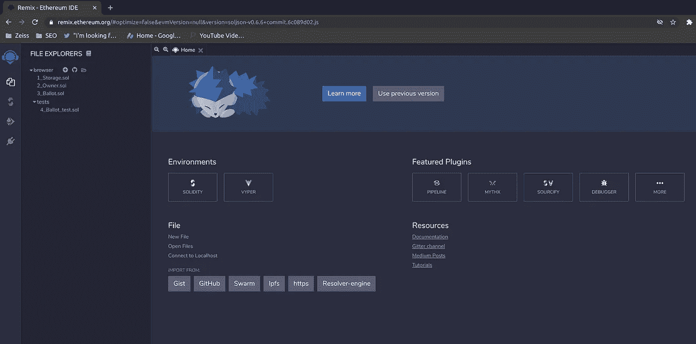
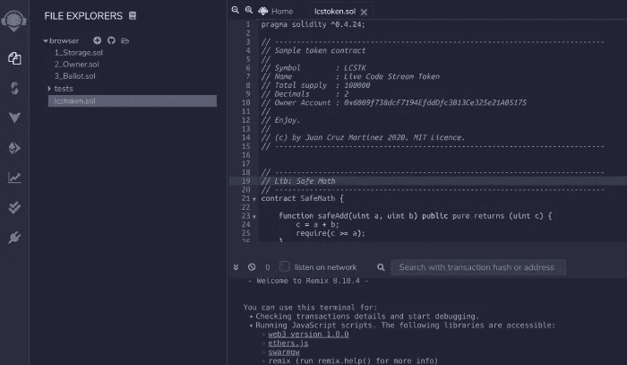
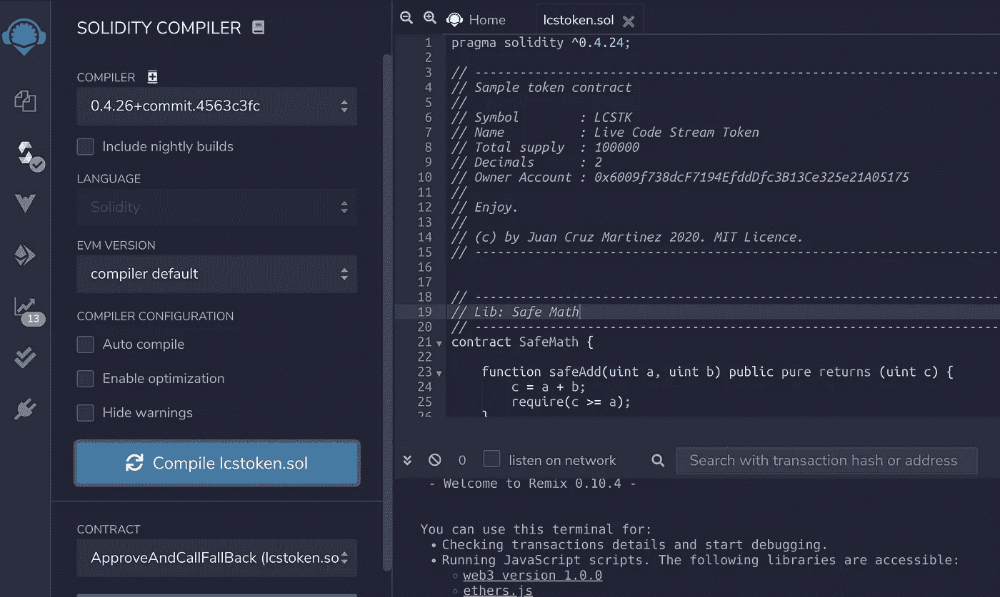
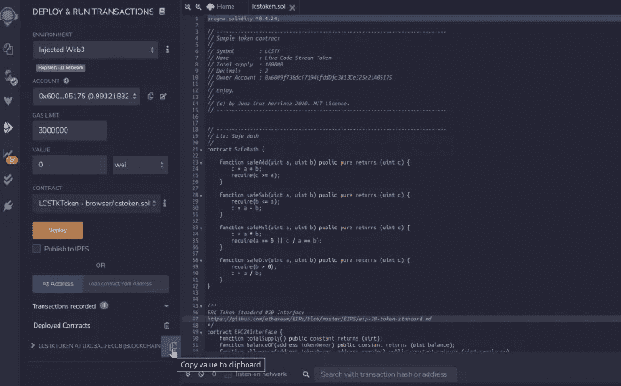
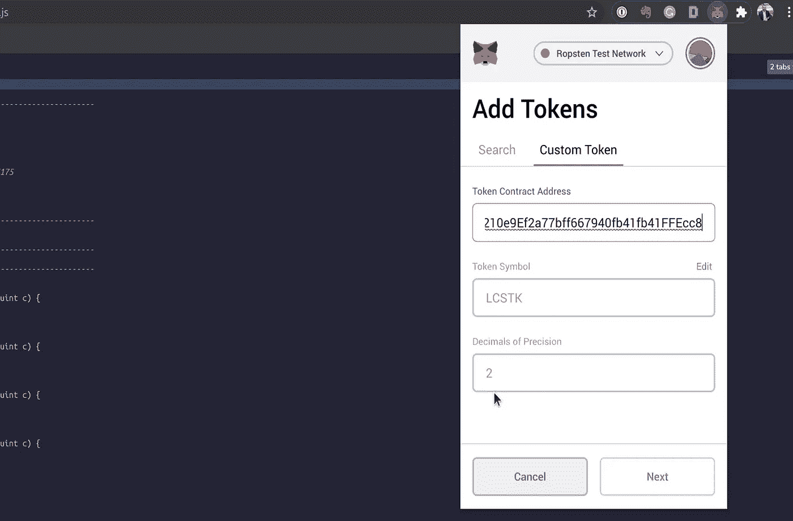

# 在以太网上创建和部署您自己的 ERC-20 令牌

> 原文：<https://betterprogramming.pub/create-and-deploy-your-own-erc-20-token-on-the-ethereum-network-87931fe4db20>

## 在以太坊上创建您自己的实时令牌比您想象的要容易


Viktor Forgacs 在 [Unsplash](https://unsplash.com?utm_source=medium&utm_medium=referral) 上拍摄的照片

*编者按:本文仅供参考和娱乐，并非理财建议。*

你好。我想围绕区块链创建一些项目已经有一段时间了，最近我一直在研究以太坊以及如何使用 Solidity 编程语言开发智能合约。今天，我想与大家分享我的第一个项目，创建和部署 ERC20 令牌。

在本文中，我们将提供一个简单的加密货币的代码，以及让您的令牌在以太坊网络上运行所需的所有步骤。对于那些对更直观的体验感兴趣的人，我录制了一个完整的会话，解释本文的所有内容，并实时进行编程和部署。你可以在这里看风景:

来源:[Youtube 上的直播码流](https://www.youtube.com/watch?v=OFODxxuCoLE&feature=emb_title)。

我们开始吧！

# 要求

在创建令牌之前，我们需要提前做一些准备，如下所述。

## 选择您的以太网

你可能知道以太坊和它的网络，但是，你知道以太坊有多个实例在运行吗？大多数人都熟悉以太坊主网络，所有的交易都在这个网络上运行，所有的交易所都在这个网络上运行(或者至少应该如此)。但是还有更多的东西，比如出于测试的目的，有替代的网络运行与主实例相同的代码。这方面的一个例子是“Ropsten 测试网络”,我们今天将使用它来部署我们的代码。

使用测试网络的好处之一是，我们不仅可以提交任何我们想要的代码并进行测试，而且还可以免费进行测试。每次创建新令牌时，都需要在其运行的以太坊网络上注册一个事务。这项交易将伴随着汽油费，我们需要从网络上用以太坊支付。

如果我们在以太坊的主网络上，我们将不得不使用实际的货币，如欧元或美元，来首先购买以太坊，然后创建我们的令牌。不太方便只是尝试一下。然而，测试网络的美妙之处在于，我们可以使用名为水龙头的应用程序获得免费的以太坊。现在，这只是假的 ETH，所以我们不能把它们卖给任何人或任何东西，但它足够好来部署我们的测试令牌。

## 钱包和账户

既然我们知道了要使用哪个网络来构建和部署我们的令牌，我们需要创建一个钱包和一个进入该网络的帐户。我强烈建议您使用元掩码来完成这项任务。

MetaMask 是一个在您的浏览器上运行的扩展，允许您在多个网络中创建帐户，它与我们今天要使用的部署界面集成，使这项工作比任何其他方法都容易。因此，下载 MetaMask 并在您的浏览器上设置它，在 Ropsten 测试网络上创建一个帐户。这个过程超级简单，有指导，很多细节我就不赘述了。

接下来，你需要在你的账户里放一些假的 ETH。为此，您需要运行一个名为“水龙头”的应用程序你可以使用 [MetaMask 本身](https://faucet.metamask.io/)的水龙头，这非常简单，它会自动连接你的帐户，并给你发送一个 ETH。

或者，你可以简单地用谷歌搜索“以太坊水龙头”,从数百个中选择一个。通常情况下，他们会要求你提供你的账号(公共账号),只有这些信息，他们才会给你转 X 倍的 ETH，通常是 1 倍，这对我们来说已经足够了。

## 令牌信息

接下来，我们需要考虑我们想要创建的加密货币，以及它将具有哪些属性。在我们真正开始之前，您需要以下信息:

*   令牌符号:这是令牌的标识符，例如，比特币的令牌是 BTC。您可以使用三到五个字母数字字符进行选择。
*   令牌名称:如比特币或 LCS 令牌
*   总供给:我们总共想要制造多少代币
*   小数:你可以使用多少个小数来打破一个令牌，例如“0”小数使令牌二进制，要么你有一个令牌，要么你没有。“2”小数允许您对令牌进行小数化，即较小的 0.01；而且最多可以加到“18”位小数。
*   所有者帐户:与创建时将接收令牌的令牌位于同一网络中的帐户。它可以是用来支付汽油费的同一个帐户，就像我们在下面的例子中所做的那样。

## 密码

最后但并非最不重要的是，你将需要编码，这将运行我们自己的加密货币。我已经为您准备了一个示例代码，它将实现 ERC20 规范，并为您提供基本的加密货币功能。

您可以从这里下载代码:

[](https://gist.github.com/bajcmartinez/c1cefbb3b1375d037f07b7b779568e42/) [## 生成 ERC20 令牌的必要代码

### ^0.4.24 实用主义；//示例令牌合同//符号:{ {令牌符号}} //名称:{ {令牌名称}} //总供应…

gist.github.com](https://gist.github.com/bajcmartinez/c1cefbb3b1375d037f07b7b779568e42/) 

# 更新代码

您需要做的第一件事是更新代码，您可以下载我提供的文件，或者将内容复制并粘贴到您喜欢的文本/代码编辑器中。到了那里，您会注意到文件的开头是这样的:

```
pragma solidity ^0.4.24;// ----------------------------------------------------------------------------
// Sample token contract
//
// Symbol        : {{Token Symbol}}
// Name          : {{Token Name}}
// Total supply  : {{Total Supply}}
// Decimals      : {{Decimals}}
// Owner Account : {{Owner Account}}
//
// Enjoy.
//
// (c) by Juan Cruz Martinez 2020\. MIT Licence.
// ----------------------------------------------------------------------------
```

运行任何 solidity 程序只需要第一行代码，但剩下的部分才是有趣的地方。虽然它实际上都是注释代码，这意味着它在执行或编译期间没有相关性，但它确实包含了我们讨论过的在实际部署到网络之前需要的变量。

我所做的是为了方便如何使用代码，这些变量中的每一个都需要赋值，一旦它们都完成了，代码就准备好了，这个注释部分将是对我们的令牌的一个很好的描述。

那么，我们如何着手更新它呢？对于每一个变量，我分配了一个用`{{` `}}`包装的代码。你需要找到并替换所有的事件。这在任何代码编辑器中都很容易做到。

让我们从一个例子开始，为您的令牌符号查找并替换所有出现的`{{Token Symbol}}`,在我的例子中是:LCSTK，这里不需要引号。替换后，它应该看起来像这样:

```
pragma solidity ^0.4.24;// ----------------------------------------------------------------------------
// Sample token contract
//
// Symbol        : LCSTK
// Name          : {{Token Name}}
// Total supply  : {{Total Supply}}
// Decimals      : {{Decimals}}
// Owner Account : {{Owner Account}}
//
// Enjoy.
//
// (c) by Juan Cruz Martinez 2020\. MIT Licence.
// ----------------------------------------------------------------------------
```

请对令牌名称进行同样的操作。

接下来，我们需要指定总供应量和小数位数，这两者相辅相成。你可能想知道为什么。我们假设一个例子来说明。假设我们想要创建一个二进制令牌，要么我有一个令牌，要么我没有，但我不能有 0.5 个令牌，我们还希望总共创建 1000 个令牌。那么我们的变量将被替换如下:

```
Total Supply: 1000
Decimals: 0
```

然而，如果我们想要一些小数，比如说两个，那么我们需要修改总供应量，在所需数字的末尾为每个小数加一个零。这意味着，如果我们希望总供应量为 1，000，我们需要将代码更新为 100，000 (1，000 + 00)，让我们看看现在的情况:

```
// ----------------------------------------------------------------------------
// Sample token contract
//
// Symbol        : LCSTK
// Name          : Live Code Stream Token
// Total supply  : 100000
// Decimals      : 2
// Owner Account : {{Owner Account}}
//
// Enjoy.
//
// (c) by Juan Cruz Martinez 2020\. MIT Licence.
// ----------------------------------------------------------------------------
```

太棒了，我们快到了。我们现在只需要指定将接收所有创建的令牌的帐户。前往元掩码并复制您的帐号，再次找到并替换所有出现的变量。最后，您的代码应该如下所示:

```
// ----------------------------------------------------------------------------
// Sample token contract
//
// Symbol        : LCSTK
// Name          : Live Code Stream Token
// Total supply  : 100000
// Decimals      : 2
// Owner Account : 0x6009f738dcF7194EfddDfc3B13Ce325e21A05175
//
// Enjoy.
//
// (c) by Juan Cruz Martinez 2020\. MIT Licence.
// ----------------------------------------------------------------------------
```

注意:使用“查找并替换所有出现的内容”非常重要，否则在后面的过程中会出现编译错误。我们的文件现在可以部署了，就这么简单！

# 部署

以太坊的优秀人员为我们提供了一个 ide(集成开发环境),它完全能够处理整个过程，从编辑文件、构建和部署，以及许多其他事情。

这个名为“Remix”的 IDE 可以通过浏览器轻松访问[。在那里，您将看到如下屏幕:](https://remix.ethereum.org/)



混音主页

我们在左边看到的第一部分是上下文菜单，在右边部分，我们看到了欢迎屏幕。默认情况下，我们在文件浏览器中，上下文菜单显示所有可用的文件和文件夹。

您需要在这里创建一个新文件，方法是单击左侧面板上“browser”文件夹旁边的“+”按钮。现在已经有一些文件在里面了，但是你可以忽略它们。您可以根据自己的喜好命名文件，这与流程无关。

一旦创建了文件，只需将我们在文本编辑器上编写的代码传递给我们。它应该是这样的:



混音文件浏览器

我们的代码现在可以编译了。为此，请查看角落左侧的图标栏。现在我们在第一个图标“文件浏览器”上，但是我们需要打开第二个标签“可靠性编译器”



混合可靠性编译器

一旦点击“编译”,如果一切正常，您应该会看到一些选项出现在 contract 下拉字段中，其中一个是您的 token contract。(令牌符号+“令牌”)

一切看起来都很好，我们只需要部署代码，现在前往菜单上的第四个选项卡“部署和运行事务”



重新混合部署和运行事务

在我们真正点击“部署”之前，我们需要更改一些内容首先，由于我们使用元掩码，我们需要将“环境”从“JavaScript VM”更改为“注入的 Weg3”

当你这样做的时候，MetaMask 会提示你确认你想把你的 MetaMask 钱包连接到 Remix，点击确认。之后，你的账户会自动在下面的“账户”栏中填入账号和你当前的余额。

最后，我们需要指定我们想要部署，确保您从“contract”下拉字段中选择您的合同。你的代币合约是你的代币符号+"代币。"最后，点击“部署”

部署过程可能需要几分钟到几分钟不等，具体取决于当时的网络状态。通常，我发现 Ropsten 需要两到三分钟，我最长的等待时间是十分钟。该过程完成后，您将在屏幕上收到一条确认消息，其中包含您部署的合同的信息，包括保存代码的地址。

就是这样！您的令牌现已激活。但是怎么看呢？

# 配置元掩码以检索我的令牌

到目前为止，我们的令牌已经存在于以太坊网络中，可以用于交易，但是，如何访问您的令牌呢？事实证明，MetaMask 和其他钱包已经可以使用您的令牌进行操作，因为它遵循一种称为 ERC20 的规范。

但是，钱包还不知道您的令牌的存在，因此您必须手动添加它们。让我们看看 MetaMask 是如何工作的，但在我们离开 Remix 之前，我们还需要做最后一件事。

部署过程完成后，我们看到了这样一个屏幕:



重新混合部署的合同

下面是我们的令牌合同信息。该屏幕上的一个重要数据是代码部署的地址，请使用右侧的复制图标复制该数据，在上图中突出显示。

打开元掩码，点击“添加令牌”这将弹出一个有两个选项卡的屏幕，切换到名为“自定义令牌”的第二个选项卡，并将您复制的地址粘贴到合同地址字段中。这将自动填充令牌符号和小数字段。

之后，点击“下一步”，然后“添加”，你就完成了。您现在可以在 MetaMask 钱包上看到您的代币。

# 结论

今天，我们学习了如何通过遵循 ERC20 接口并利用 Remix 和 MetaMask 来构建和部署您自己的加密货币。这个过程非常简单，我们提供的代码只是一个很小的例子。你们可以在我们今天所做的基础上建设许多伟大的东西，我希望我能听到你们利用区块链的力量建设的所有伟大的项目。

感谢阅读！