# 使用 Vue.js 和 Firebase 在五分钟内创建并启动您的简单网站

> 原文：<https://betterprogramming.pub/create-and-launch-your-simple-website-in-five-minutes-with-vue-js-and-firebase-978cc424ec8e>

## 有了这么多的选择，创建一个简单的网站并不一定要复杂


在过去，对我们来说，管理一个简单的网站是相当具有挑战性的。我们需要寻找一家虚拟主机公司。公司会给我们一台虚拟机，我们需要自己配置。它是如此乏味和费时。

今天，技术发展比以往任何时候都快。事情变得越来越简单快捷。今天要调出一个静态网站，大概只需要五分钟。

在本教程中，我们将创建一个静态网站，并使用 [Vue.js](https://vuejs.org/) 和 [Firebase](https://firebase.google.com/) 快速托管它。

# vue . j


vue . j

Vue.js，或 Vue，是一个非常流行的 JavaScript 框架，在过去的几年里发展迅速。Vue.js 是尤雨溪在谷歌工作时创建的

它从一开始就被设计成可增量采用的。Vue 的主要优势之一是，它从竞争对手(Angular 和 React)那里吸取了许多好的成分，并在其中添加了香料。

# 重火力点


重火力点

Firebase 是谷歌的移动平台，可帮助您快速开发高质量的应用程序并发展您的业务。

Firebase 是一个后端即服务解决方案，其功能远远超过竞争对手。它具有实时数据库、认证系统、存储托管、推送服务器等等。

## **为什么选择 Firebase？**

*   无需管理基础设施即可快速构建应用。
*   以谷歌为后盾，受到顶级应用的信赖。
*   一个平台，产品可以更好地协同工作。

在本教程中，我们将只介绍在 Firebase 中托管的 [Firebase。](https://firebase.google.com/docs/hosting)

Firebase Hosting 是一种完全托管的托管服务，适用于静态和动态内容以及微服务。

该服务由 SSD 存储和全球 CDN(内容交付网络)提供支持。Firebase 托管中内置了零配置 SSL，因此内容总是安全地交付。

最重要的是，这是*免费的*用它:

*   1 GB 存储。
*   每月传输 10 GB。
*   自定义域和 SSL。
*   每个项目多个站点。

# 亲自动手

## 先决条件

*   [node . js](https://nodejs.org/)8.9 以上版本(推荐 8.11.0 以上)
*   Vue CLI
*   谷歌账户
*   Firebase CLI

## 安装 Vue CLI

要安装新的软件包，请使用以下命令之一。

```
npm install -g @vue/cli
# OR
yarn global add @vue/cli
```

您可以使用以下命令检查您的版本是否正确:

```
vue --version
```

更多信息可以参考他们的[官网](https://cli.vuejs.org/guide/installation.html)。

## 安装 Firebase CLI

Firebase CLI 安装，可以参考他们的[官网](https://firebase.google.com/docs/cli#install_the_firebase_cli)。安装 Firebase CLI 后，您可以使用 Google 帐户登录 Firebase。

```
firebase login
```

通过列出您的 Firebase 项目，测试 CLI 是否已正确安装并正在访问您的帐户。

```
firebase projects:list
```

## 在 Firebase 控制台中创建一个项目

转到 [Firebase 控制台](https://console.firebase.google.com/)并添加一个项目。

第一步。填写您的项目名称。

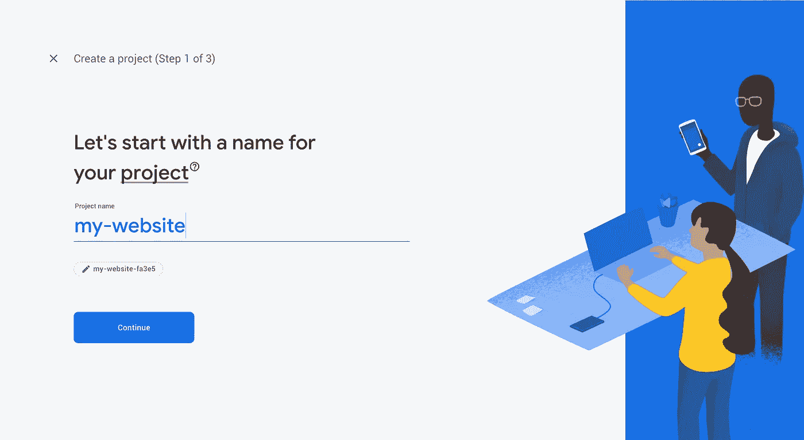

步骤 1 —项目名称

第二步。您可以为您的项目启用谷歌分析(可选)。

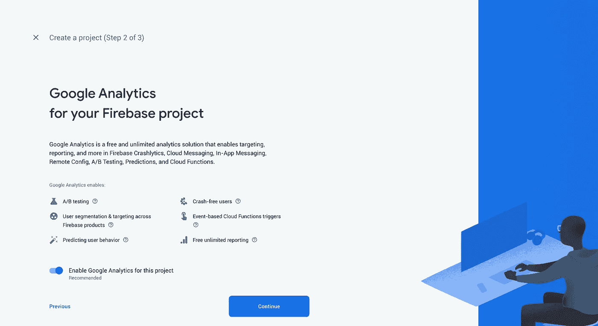

步骤 2——谷歌分析支持

第三步。配置谷歌分析(可选)。

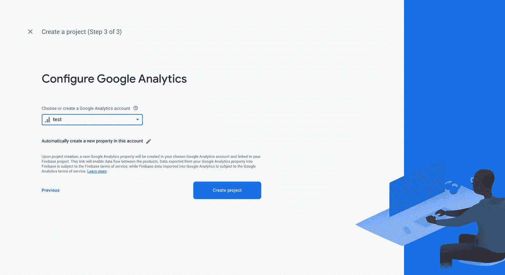

第 3 步——谷歌分析配置

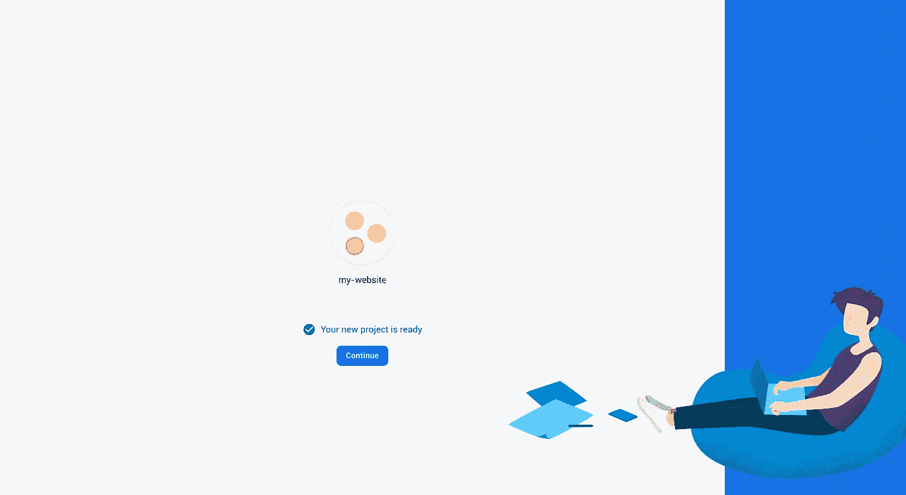

你的新项目准备好了。

## 创建我们的 Vue 项目

在本教程中，我们将创建默认的 Vue 项目，并立即将其托管在 Firebase 上。要创建新项目，请运行:

```
vue create my-website
```

系统会提示您选择一个预设。您可以选择基本 [Babel](https://babeljs.io/) + [ESLint](https://eslint.org/) 设置附带的默认预设，或者选择“手动选择功能”来选择您需要的功能。


Vue CLI —选择一个预设

选取预置后，项目将被创建。

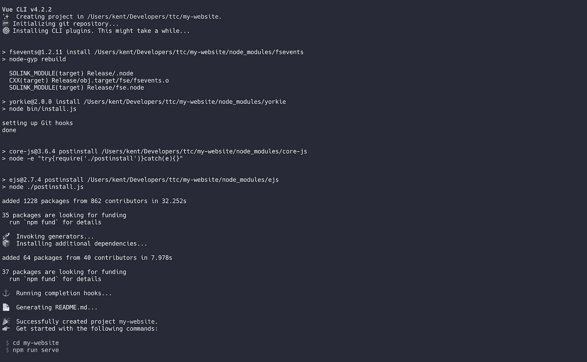

Vue CLI —项目已创建

现在，您可以使用下面的命令在本地机器上测试 Vue 项目:

```
npm run serve
```

该应用程序现在运行在 [http://localhost:8080](http://localhost:8080) 。

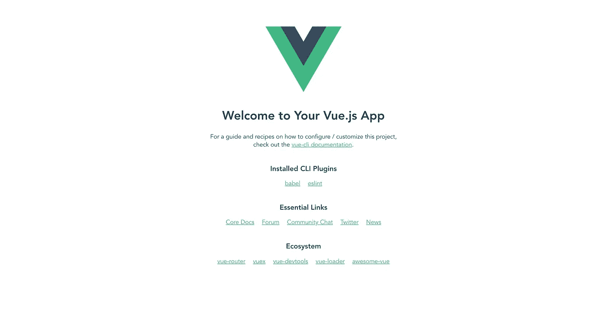

示例 Vue.js 应用程序

## 构建并部署到 Firebase

要构建我们的 Vue.js 项目，请运行以下命令:

```
npm run build
```

构建文件将在您的`dist`目录中准备好。我们现在都准备好部署到 Firebase 了。

首先，我们需要通过运行以下命令将本地项目初始化为 Firebase 项目:

```
firebase init
```

然后，CLI 会提示您选择要为项目设置的功能。使用`spacebar`选择选项，并按下`enter`确认您的选择。

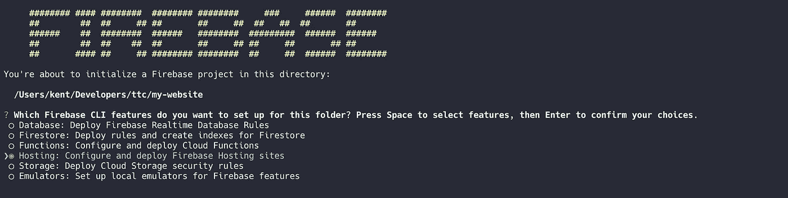

Firebase CLI —选择功能

因为我们已经在 Firebase 控制台中创建了项目，所以您只需选择“使用现有项目”选项。您将看到您的 Firebase 项目在列表中。

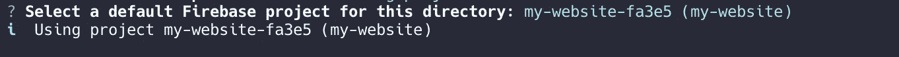

Firebase CLI —选择 Firebase 项目

接下来，输入`dist`作为您的公共目录。然后，输入“y”配置为单页应用程序。最后，输入“N”跳过覆盖你的`index.html`。

您的项目现在可以部署了。通过运行以下命令部署到 Firebase:

```
firebase deploy
```

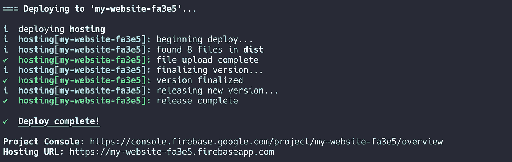

Firebase CLI —部署

## 测试一下

你的网站现在托管在 Firebase 上。去你的主机网址测试一下。

# 额外提示

## 谷歌分析

在 Firebase 项目创建期间，Google Analytics 已经在前面的部分中启用。为了完全集成它，我们需要向我们的 Vue 项目添加一些代码片段。

在这一节中，我们将实现我们的页面浏览量跟踪。

如果在项目创建期间没有启用 Google Analytics，可以在 Firebase 控制台中手动启用它。

单击项目概述旁边的齿轮图标，您将看到项目设置。点击集成并启用谷歌分析。

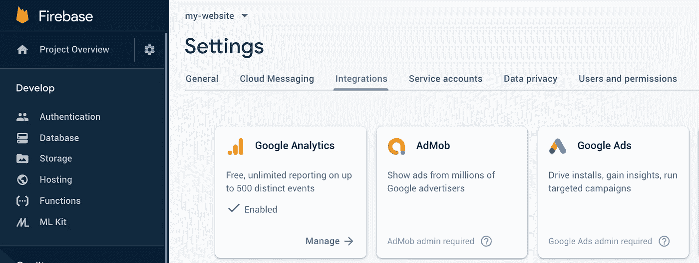

Firebase 控制台—项目设置

在开始之前，我们需要一些配置来连接，例如:

*   API 密钥
*   项目 ID
*   应用 ID
*   测量 ID

去项目设置，你可以得到你的 API 键，项目 ID，和 app ID。

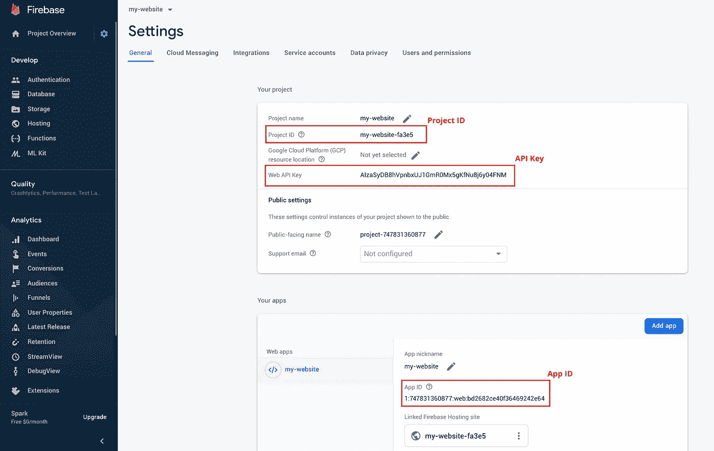

Firebase 控制台—项目设置

如果您没有应用程序 ID，您可以通过单击 HTML 标记图标来创建它，然后注册您的应用程序。

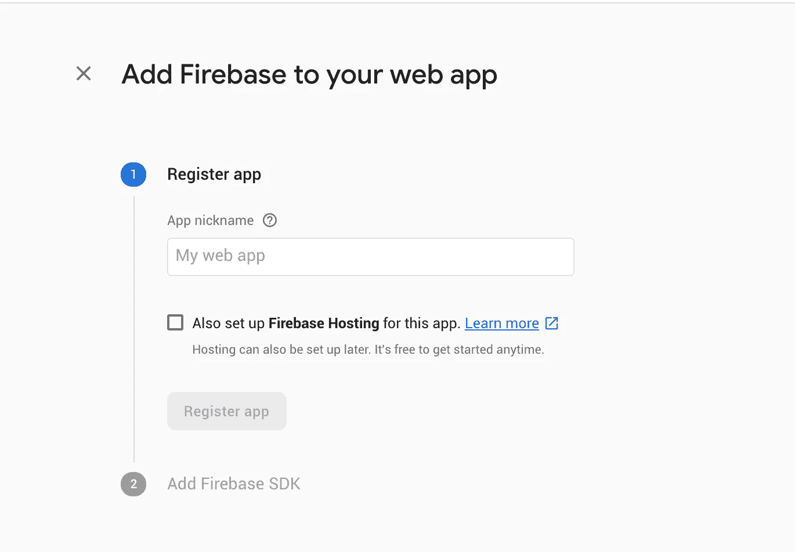

Firebase 控制台—应用程序创建

对于测量 ID，我们必须去我们的谷歌分析帐户。点击管理设置。在*属性*下，创建数据流。

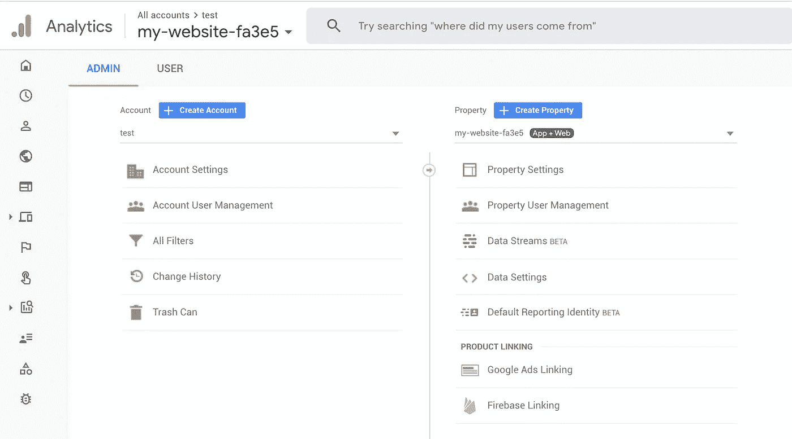

Google 分析控制台—创建属性

填写您的完整 Firebase 应用程序 URL(如`[https://my-website-fa3e5.firebaseapp.com](https://my-website-fa3e5.firebaseapp.com.)`)。测量 ID 在右上角生成。

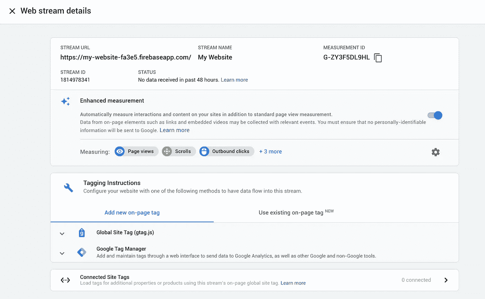

谷歌分析—创建数据流

现在，我们一切都准备好了。页面视图要求不同的页面有不同的文档标题。实现它最简单的方法是使用 [vue-meta](https://vue-meta.nuxtjs.org/) 。

首先，转到项目目录并安装库。

```
npm install firebase vue-meta --save
```

转到`main.js`并用下面的片段替换。

请访问我们的 App.vue 并替换脚本。

转到 HelloWorld.vue 并替换脚本。如果你有任何其他页面要跟踪，将`metaInfo`添加到你所有的页面。

最后，我们构建文件并将它们部署到 Firebase。如果你想测试你是否已经正确配置了它们，你可以在本地运行它并安装 [Google Analytics 调试器](https://chrome.google.com/webstore/detail/google-analytics-debugger/jnkmfdileelhofjcijamephohjechhna)在控制台日志中调试。

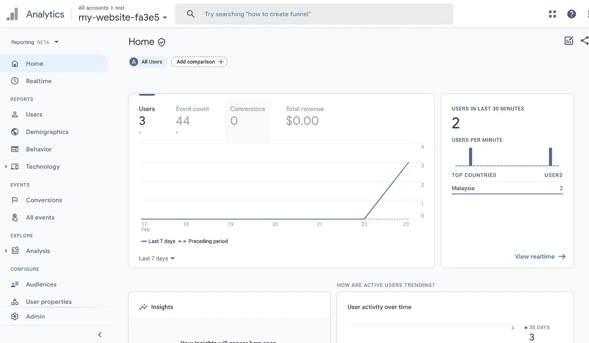

谷歌分析控制台—仪表板

注意:指标可能不会在配置后立即显示。它会在 24 小时内显示。

## 连接到自定义域

你可以为你的 Firebase 托管站点使用一个自定义域(比如`yourdomain.com`或`app.yourdomain.com`)来代替 Firebase 生成的域。

Firebase Hosting 为你的每个域提供一个 SSL 证书，由[签名，让我们加密](https://letsencrypt.org/)，并通过全球 CDN 提供你的内容。

要连接自定义域，请登录 Firebase 控制台。在侧边菜单中，选择开发>托管>添加自定义域。

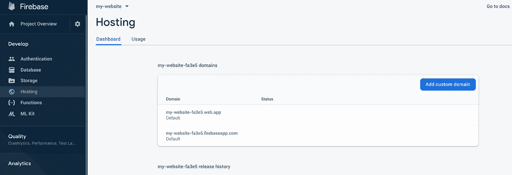

消防基地控制台

输入您的域，然后将 TXT 记录复制到您的 DNS 提供商进行验证。

## PageSpeed 洞察

PageSpeed Insights (PSI)报告页面在移动和桌面设备上的性能，并提供如何改进该页面的建议。

去[https://developers.google.com/speed/pagespeed/insights/](https://developers.google.com/speed/pagespeed/insights/)进入你的网站进行分析。更多关于应用程序性能的信息将被诊断出来，它将告诉你如何改进你的页面。

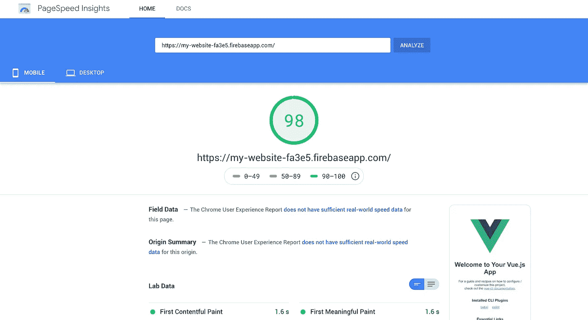

PageSpeed 洞察

# 最后的想法

就是这样！现在你已经使用 Vue.js 和 Firebase 快速构建了你的静态网站。请让我知道你的建议和意见。编码快乐！