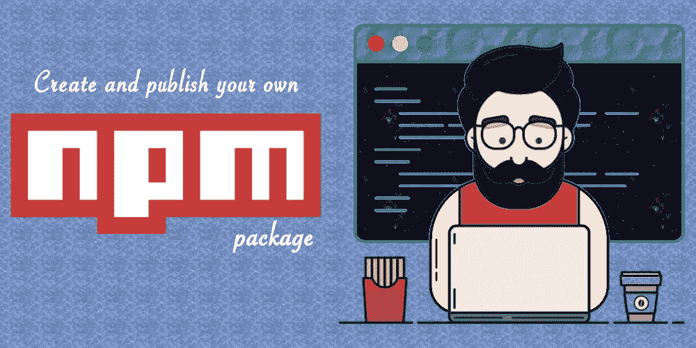
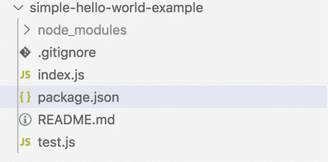
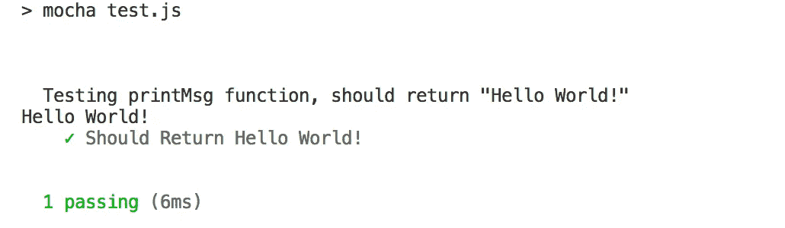
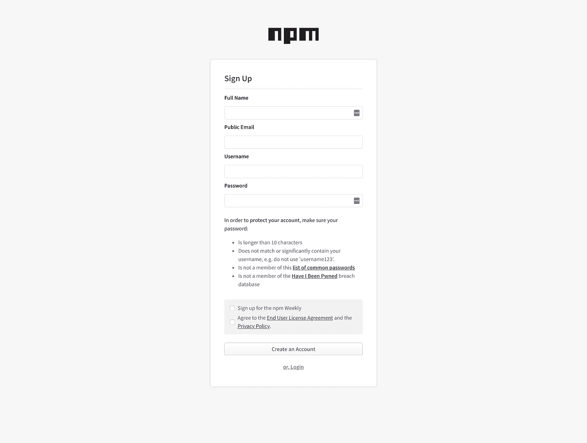
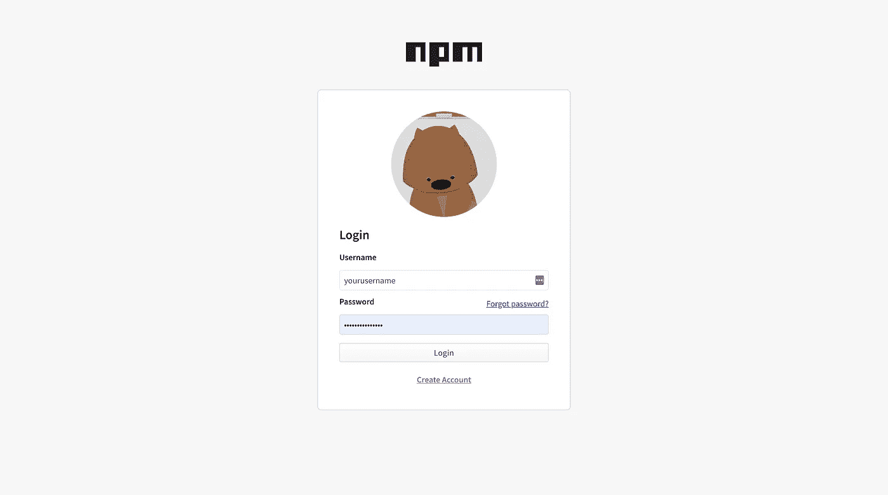
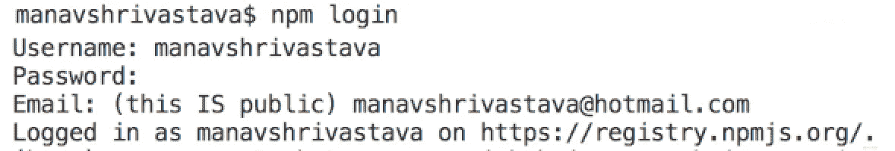
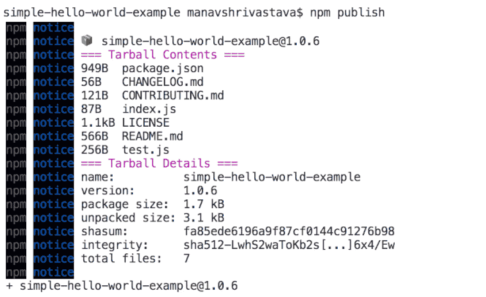
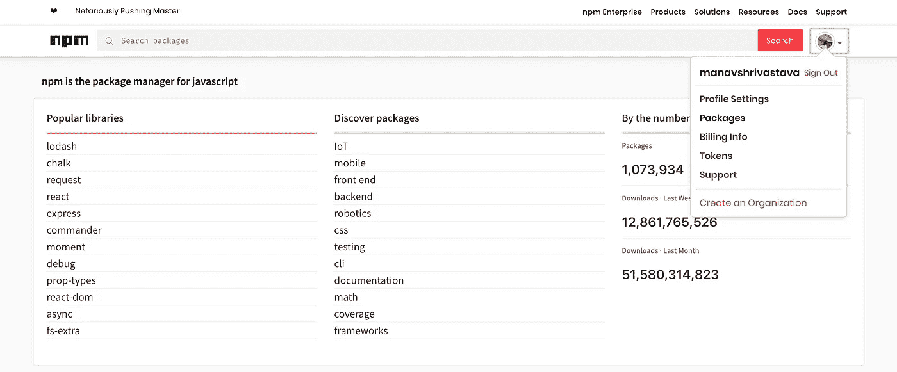
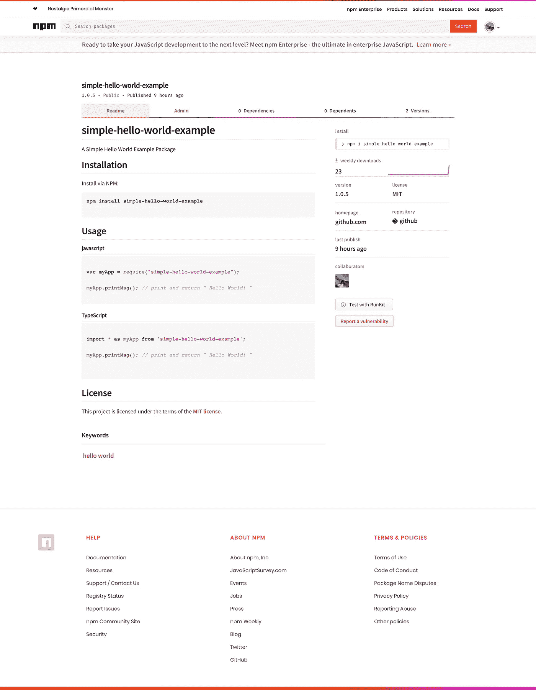

# 只需 10 分钟即可创建和发布您的 npm 程序包节点模块

> 原文：<https://betterprogramming.pub/create-and-publish-your-npm-package-node-module-in-just-10-minutes-4b91e30fe9d7>

## 循序渐进的教程



让我们开始吧，我把这个故事分成两部分:

1.  创建自己的 Node.js 包。
2.  在 [npm](https://www.npmjs.com/package/simple-hello-world-example) 上发布您的包。

# **先决条件**

1.  [Node.js](https://nodejs.org/en/download/)
2.  [国家预防机制](https://nodejs.org/en/download/)

要创建自己的 Node.js 包，在系统中创建一个新目录`simple-hello-world-example`。你可以使用你的包名来代替`simple-hello-world-example` 。

如果您使用的是 macOS，请在终端中键入以下命令。

1.  创建`simple-hello-world-example` 目录。
2.  进入`simple-hello-world-example` 目录。
3.  在你的`simple-hello-world-example` 目录**下创建一个`package.json`文件。**将下面的`package.json`代码复制粘贴到您的`package.json`文件中。你可以使用你的包名来代替`simple-hello-world-example`。
4.  `npm install`命令会在你的`simple-hello-world-example` 目录下创建一个新的`node_modules` 目录。如果你看到`package.json`文件，我们有`“devDependencies”: { “chai”: “4.1.2”, “mocha”: “5.0.5” }`。当我们运行`npm install` 命令时，这些将下载[柴](https://www.chaijs.com/)、[摩卡](https://mochajs.org/)以及你的`node_modules` 目录中的其他依赖包。
5.  `npm test`命令。在运行该命令之前，首先创建一个`test.js`文件。将下面的 `test.js`代码复制粘贴到您的`test.js`文件中。

# **项目结构**



`package.json`

`index.js`

这里，在`index.js`中，我们创建了一个`printMsg()`函数，它将返回字符串“Hello World！”当被召唤时。

`test.js`

在`test.js`中，我们正在使用 node.js、Mocha 和 Chai 测试框架测试我们的`printMsg()`。



`README.md`

下面你可以看到 README 预览，这是它在 npm 网站上的样子。

`.gitignore` 文件:

你可以从 GitHub 下载完整的项目代码。

现在，我们已经创建了我们的包，是时候在 npm 上发布它了。为此，你需要在国家预防机制网站上注册。

[](https://www.npmjs.com/signup) [## npm

### 注册

www . NPM js . com https://www . NPM js . com/sign up](https://www.npmjs.com/signup) 

[在 npm 上创建新账户](https://www.npmjs.com/signup)。



[使用您的用户名和密码](https://www.npmjs.com/login)登录 npm 网站。



不要忘记向 npm 核实你的电子邮件，并检查你的电子邮件是否有 npm 核实邮件。

邮件验证后，打开终端，键入命令`npm login` *。*

*   它会询问你的用户名:写下你的 npm 用户名。
*   密码:写下您的 npm 密码。
*   电子邮件:写下您在 npm 网站注册时提供的 npm 电子邮件。



成功登录后，就可以在 npm 上发布您的包了。

要发布，请在终端中转到您的包目录，并键入命令:

```
npm publish
```



耶！您已经在 npm 上成功发布了自己的 npm 包。

恭喜你！



转到您的 npm 仪表板，单击右侧的*包*和**。**你可以在国家预防机制网站上看到你的包裹。

