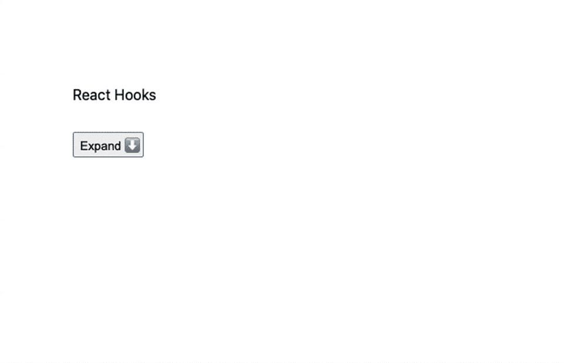
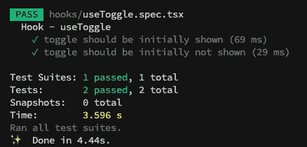

# 创建并测试定制的 React 挂钩

> 原文：<https://betterprogramming.pub/create-and-test-custom-react-hooks-6e0fa4656561>

## 设置 Next.js、TypeScript、Jest 和 React 测试库，以便在 React 中使用和测试我们的定制挂钩


在 [Unsplash](https://unsplash.com?utm_source=medium&utm_medium=referral) 上 [Padraig Treanor](https://unsplash.com/@padraigo?utm_source=medium&utm_medium=referral) 拍摄的照片。

React 挂钩在 2018 年 10 月的 React Conf 上向世界推出，后来在 2019 年 2 月作为 React 版本`16.8.0`的一部分发货。

它们是游戏规则的改变者，因为你不再需要对 ES6 类使用 React。一切都可以通过`React Functional Components`发生。

React 钩子将取代你管理属性更新和状态的方式。这是一种更具声明性且更简单的方法。创建定制挂钩既简单又直观。

# 一点背景知识

在 React 挂钩之前，使用`Render Props`方法或通过`High Order Components`在组件间共享逻辑。

> “术语“[渲染属性](https://cdb.reacttraining.com/use-a-render-prop-50de598f11ce)”指的是一种使用属性值为函数的属性在 React 组件之间共享代码的技术。”— [React 的文档](https://reactjs.org/docs/render-props.html)

这两种方法看起来很粗糙，产生了非常混乱的 JSX 语法。你可能会以“渲染道具回调地狱”或“包装地狱”而告终。

有了 React 钩子，我们可以以更好的方式重用和嵌入组件的逻辑。我们可以紧密耦合相关的逻辑。钩子是可测试和可组合的。

在本文中，我们将讨论:

1.  使用 Next.js + Typescript 创建和配置基本应用程序
2.  重构应用程序，将一些逻辑封装在自定义的渲染挂钩中
3.  使用库来测试新创建的定制钩子

我们有很多要讲的，所以让我们开始吧！

# 创建我们的 Next.js 应用程序

为了运行所有代码，我们将创建一个 Next.js 应用程序。

让我们从运行命令开始:

```
npx create-next-app
```

安装完成后，有三个命令可用:

```
yarn dev
    Starts the development server.yarn build
    Builds the app for production.yarn start
    Runs the built app in production mode.
```

让我们将 TypeScript 添加到项目中。Next.js 通过几个步骤支持开箱即用。您可以查看官方文档[了解更多信息](https://nextjs.org/docs/basic-features/typescript)。

```
touch tsconfig.json
```

让我们安装 TypeScript 依赖项:

```
yarn add --dev typescript [@types/react](http://twitter.com/types/react) [@types/node](http://twitter.com/types/node)
```

完成后，让我们执行:

```
npm run dev
```

该命令将检测到您的项目正在使用 TypeScript，并将为您配置已创建的`tsconfig`。它为您提供了一个简单的配置，您可以根据自己的需要进行定制。一旦完成了 TypeScript，它将在端口 3000 上运行应用程序，并且应该可以在 [https://localhost:3000](https://localhost:3000.) 上访问。

# 示例应用程序

让我们创建一个简单的 React 可扩展组件。这个组件将把一个`summary`和一个`description`作为参数。只有按下`button`才会显示描述。一旦再按，就会隐藏起来。`button`将作为一个开关。

如果文件匹配`[name].module.css`模式，Next.js 支持开箱即用的`css-in-js`。我们的`Expand.module.css`很简单:

```
.container {
  padding: 1rem 0;
}
```

*注意:通常情况下，需要在一个单独的文件中创建* `*Block*` *组件。我在一个地方做所有的事情，这样更容易想象。*

让我们看看我们的组件在运行:



作者截屏。

# React 挂钩复习

让我们快速回顾一下关于挂钩的规则:

*   只调用顶层的钩子。不要在循环、条件或嵌套函数中调用钩子。
*   只有 React 挂钩可以从 React 组件中调用。它们不会在 React 生态系统之外工作。
*   钩子可以嵌套。

为了确保这些规则始终得到遵守，我们可以使用以下 ESLint 规则:

```
yarn add --dev eslint-plugin-react-hooks
```

并使用它:

```
{
  "plugins": [
    // ...
    "react-hooks"
  ],
  "rules": {
    // ...
    "react-hooks/rules-of-hooks": "error", // Checks rules of Hooks
    "react-hooks/exhaustive-deps": "warn" // Checks effect dependencies
  }
}
```

定制钩子需要总是重用基本的 React 逻辑来刷新组件。你可以把这些基础钩子看作钩子原语。这些是:

*   `useReducer`
*   `useMemo`
*   `useCallback`
*   `useState`

我们的定制钩子的输入和输出完全由我们决定。我们没有任何限制——只有惯例。用与 React 挂钩一致的方式创建定制挂钩将使它们使用起来更加直观。

# 自定义挂钩

现在我们已经复习了一遍，我们准备创建一个 React 钩子。在这个例子中，我们将创建一个在`true/false`状态之间切换的钩子。

我们的`Expandable`组件中使用的切换逻辑可以很容易地在应用程序的不同部分重用。

```
const [show, setShow] = useState(false);const toggle = useCallback(() => {
  setShow(!show);
}, [show, setShow]);
```

让我们创建一个定制的钩子来包装这个逻辑。我们需要做的第一件事是给它一个名字。按照惯例，所有的钩子都带有前缀`use`。这种命名约定使得识别它们变得更加容易。因为我们不能有条件地使用它们，所以它们必须易于识别。

我们将把我们的钩子命名为`useToggle.ts`。我们将把它放在自己的`hooks`文件夹中。我们不需要它有一个`tsx`扩展，因为钩子将只保存 JavaScript 逻辑。

提示:注意`return [state, toggle] as const;`中的`as const`。这将告诉 Typescript 该数组是固定大小的，因此 Typescript 可以使用`Tuple`来更好地公开数组项类型。

让我们在我们的`Expandable`组件中使用它:

# 测试我们的定制钩子

现在是时候测试我们的定制钩子了。这确实能确保它像预期的那样工作，并且不会被未来的反应堆破坏。对于测试，我们将使用 React 测试库。

让我们从安装库开始:

```
// installing jest and it's Typescript tools
yarn add --dev jest ts-jest [@types/jest](http://twitter.com/types/jest)// installing React Testing Library
yarn add --dev @testing-library/react// Custom jsdom matchers for React Testing Library
yarn add --dev @testing-library/jest-dom// User event utility for React Testing Library
yarn add --dev @testing-library/user-event
```

那么您需要配置 Jest:

```
npx ts-jest config:init
```

因为 Next.js 应用程序需要在`tsconfig.json`中有`"jsx": “preserve"`设置，而这不能与 React 测试库一起工作，所以你需要一个自定义的`tsconfig.jest.json`。但是不要担心，你不需要重新申报整个事情。您可以使用扩展:

```
module.exports = {
  preset: 'ts-jest',
  globals: {
    "ts-jest": {
      // using a custom tsconfig file
      tsconfig: "tsconfig.jest.json"
    }
  }
};
```

然后您的`tsconfig.jest.json`文件将如下所示:

```
{
  "extends": "./tsconfig.json",
  "compilerOptions": {
    "jsx": "react"
  },
}
```

万岁！我们都是用 Next.js + Typescript + Jest + React 测试库设置的。我们现在可以专注于测试我们的组件。由于 React 测试库方法是基于用户行为的，我们将测试定制挂钩对组件的影响:

注意，我们使用`TargetComponent`来显示/隐藏元素，以匹配定制钩子的输出。如果可能的话，你应该通过钩子的行为来测试它们，而不是它们的实现。`React Testing Library`是围绕测试行为而不是方法构建的。如果用户不关心调用了哪些方法，你为什么要关心呢？

如果不可能，你可以随时回到[react-hooks-testing-library](https://github.com/testing-library/react-hooks-testing-library)。

现在让我们运行`yarn jest`来看看结果:



万岁！一切都在按预期工作！

# 包扎


照片由[达维德·扎维亚](https://unsplash.com/@davealmine?utm_source=medium&utm_medium=referral)在 [Unsplash](https://unsplash.com?utm_source=medium&utm_medium=referral) 上拍摄。

我们已经看到，将现有的 React 挂钩结合起来，创建一个新的定制挂钩来满足您的需求是多么容易。可能性是无穷的，它是传统的“渲染道具”方法的一个很好的替代品。您将有一个更好的工具来跨组件封装和重用一些逻辑。

在测试方面，我们已经看到一旦我们设置好一切，测试钩子是多么容易。这就像测试一个常规组件。由于钩子被大量重复使用，所以应该对它们进行适当的测试。

您可以在本文中找到更多测试见解:

[](https://medium.com/better-programming/react-enzyme-vs-react-testing-library-2cac3ad20c52) [## 反应酶与反应测试库

### 比较用于测试 React 组件的两个对比库

medium.com](https://medium.com/better-programming/react-enzyme-vs-react-testing-library-2cac3ad20c52) 

更多的 React 内容将会出现在你面前。干杯！