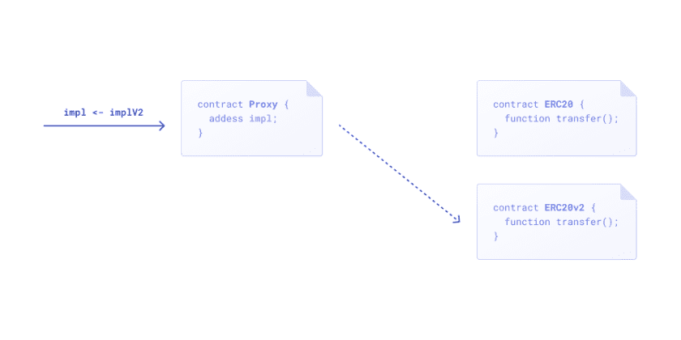
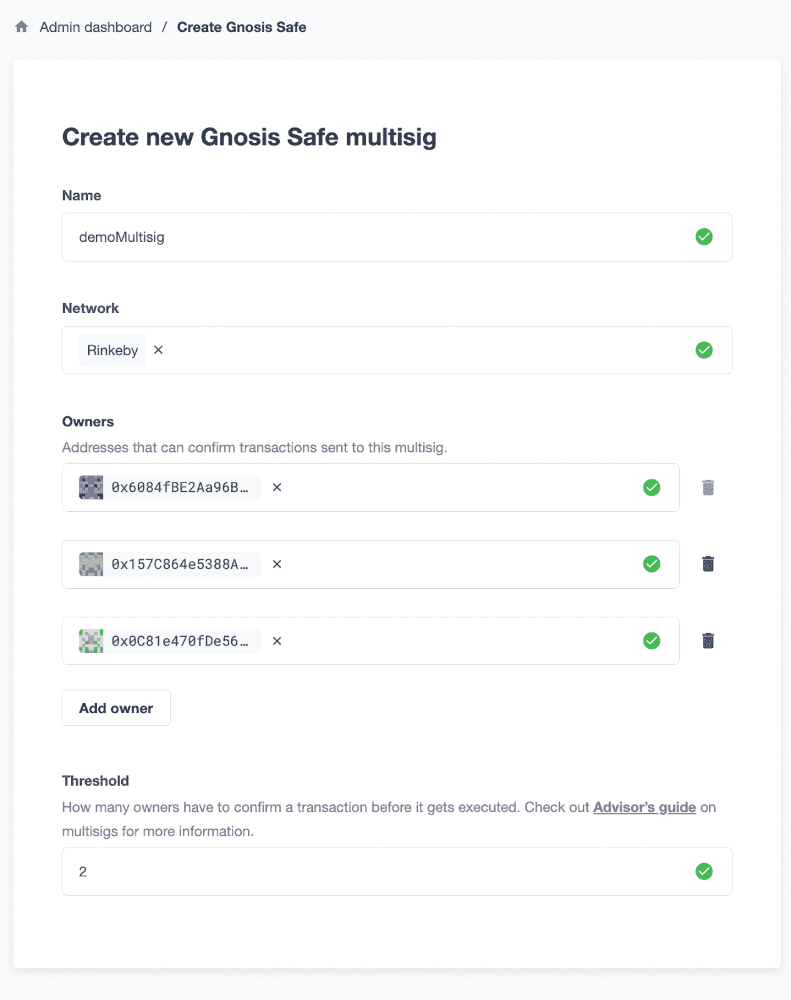
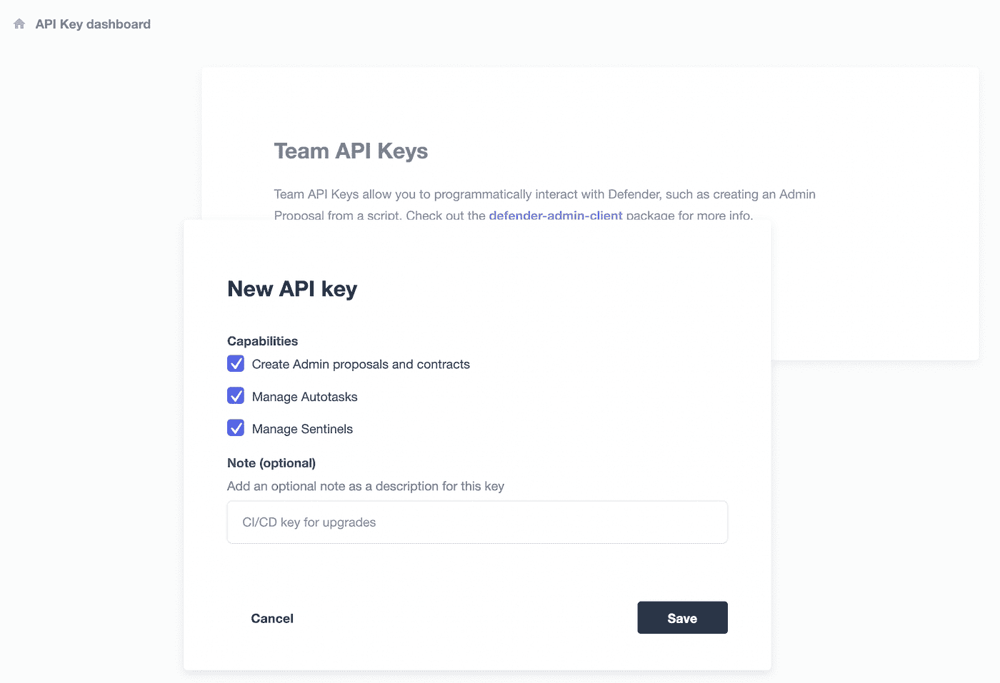
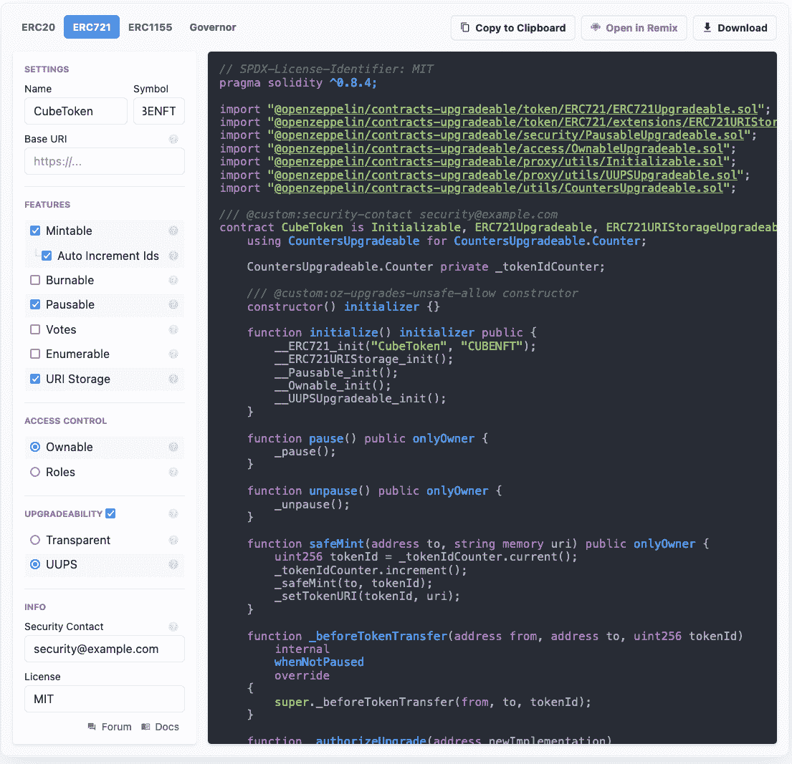
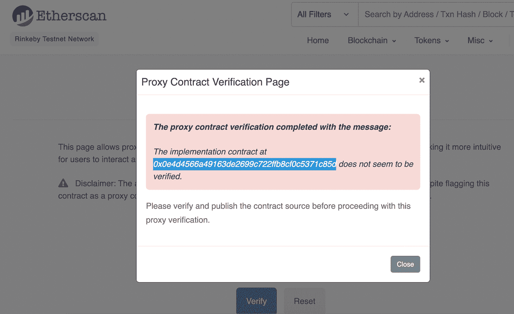
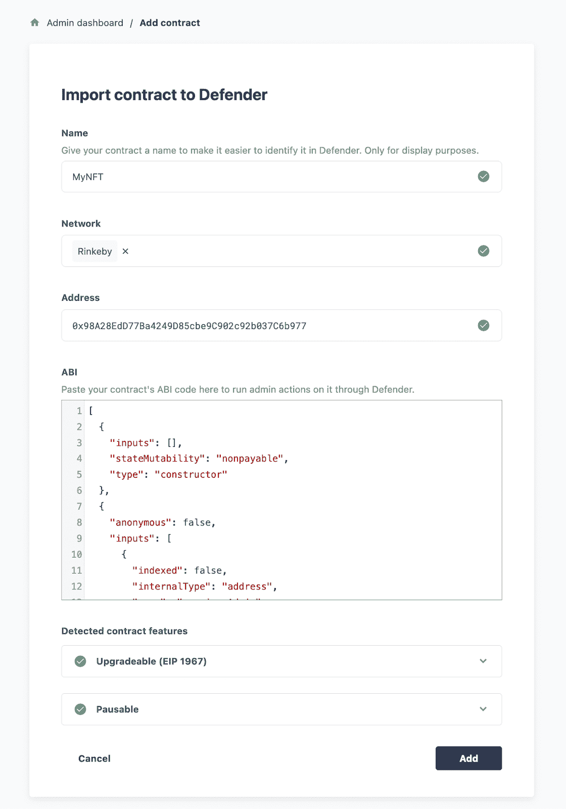
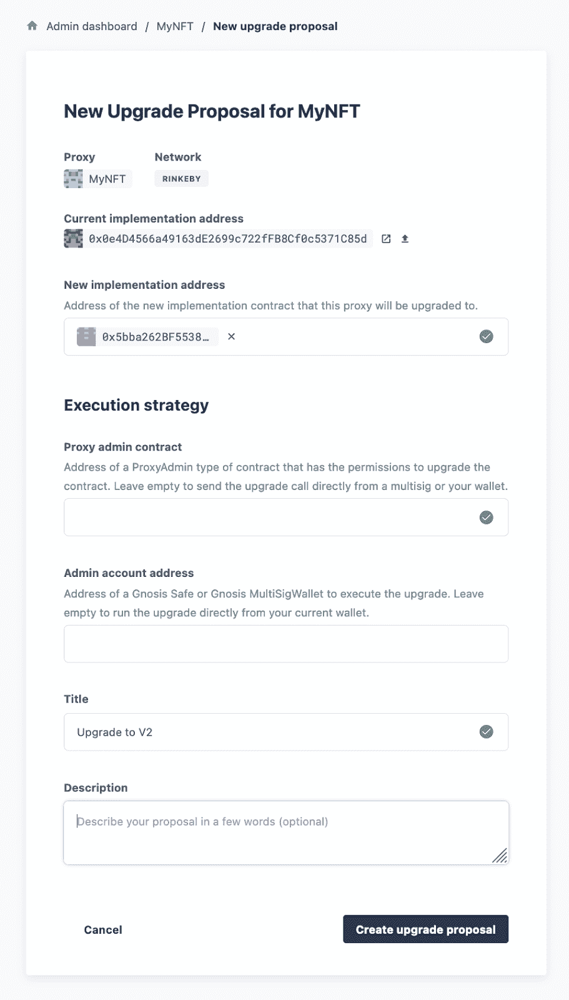
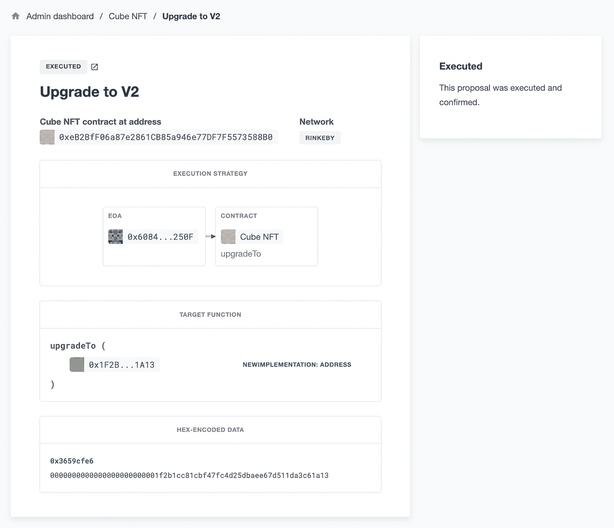
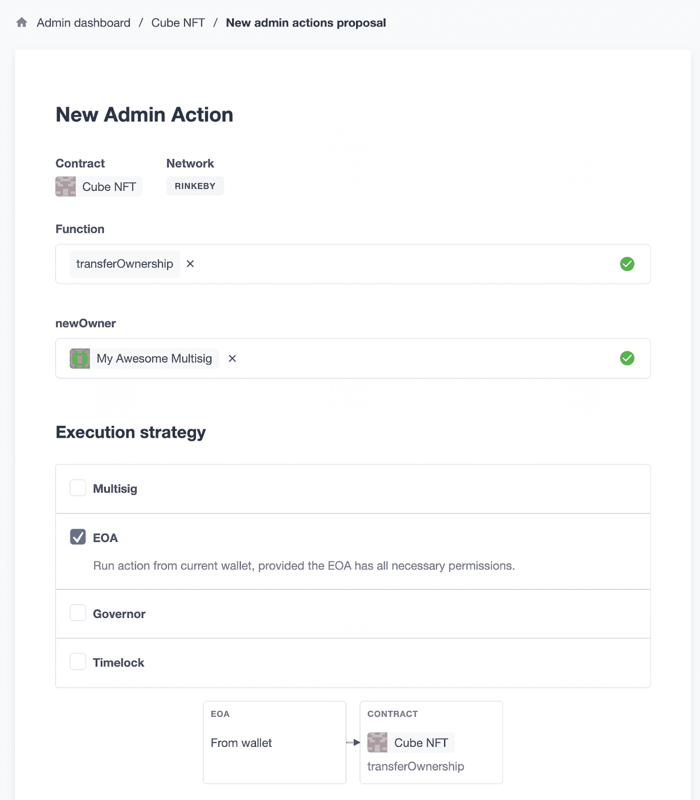
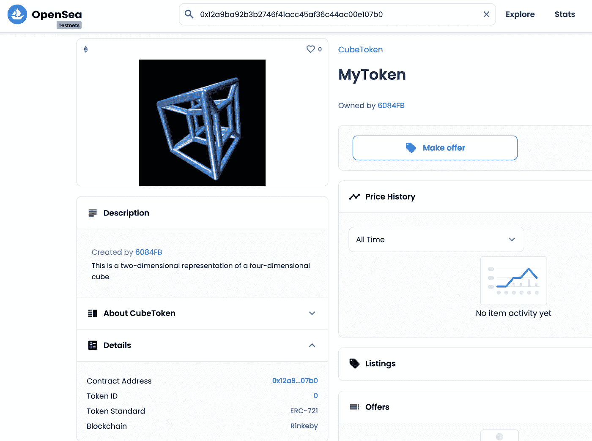

# 使用 OpenZeppelin Defender 和 Hardhat 创建和升级 Multisig 拥有的可升级 UUPS 的 ERC721 NFT 合同

> 原文：<https://betterprogramming.pub/create-and-upgrade-a-multisig-owned-uups-upgradeable-erc721-nft-contract-using-openzeppelin-73a07937a449>

## 端到端实践教程


由[舒巴姆·达奇](https://unsplash.com/@theshubhamdhage?utm_source=medium&utm_medium=referral)在 [Unsplash](https://unsplash.com?utm_source=medium&utm_medium=referral) 拍摄的照片

不变性——不能被更改或删除的特征——是智能合约的关键特征之一。它是 Web3 安全性的主要部分。但是每个开发人员都知道，有时一个协议需要升级或新特性。

当然，在极少数情况下，开发人员可能会犯错误。在这种情况下，能够执行升级会很方便。本教程解释了如何根据[EIP-1967-标准代理存储插槽通用可升级代理标准(UUPS)](https://eips.ethereum.org/EIPS/eip-1967) 创建可升级 NFT 合同。

# 可升级智能合同的类型

智能契约可以通过将给定的智能契约分成两个基本组件来升级:代理和实现。下图象征着从合同 **ERC20** 到合同 **ERC20v2** 的升级。



OpenZeppelin 契约为基于代理的契约升级提供了两种选择:透明代理和通用升级代理。这些将在下面简要讨论。关于智能合同升级能力的深入探讨，请参见 Santiago Palladino 的这篇博客文章。

# 透明的

一种智能合约升级遵循所谓的透明模式。这种模式将状态和升级能力都放在代理契约中。代理指向保存逻辑的给定实现契约。当任何非管理地址调用协定时，调用被委托给实现协定。当管理员调用契约时，代理揭示了`upgradeTo`函数，使管理员能够指向新的实现契约，从而进行升级。

这种代理模式的一个缺点是与它交互会耗费大量的时间，因为这样做需要两次存储访问来检查调用者的地址是否是 admin。

# UUPS

另一方面，UUPS 可升级性模式更有效。该模式将升级功能放在了*实现*契约中。代理合同是最低限度的；它使用`delegatecall`来指导实现契约执行事务。

使用这种代理模式，确保升级功能在每次升级时都正常运行是至关重要的。否则将永远失去升级能力。

本教程将遵循 UUPS 模式。

# 可升级的合同部署

本指南向您展示了如何部署准系统 UUPS 可升级 ERC721 合同，以制造高能效 NFT。所有权将被转移到 Gnosis Safe multisig 账户，合同管理将使用 [OpenZeppelin Defender](https://openzeppelin.com/defender/) 进行管理。

# 开发环境设置

对于本教程，您将使用 [Hardhat](http://hardhat.org) 作为使用[节点](https://docs.npmjs.com/downloading-and-installing-node-js-and-npm)包管理器的本地开发环境。要开始，请运行以下命令:

```
mkdir uupsNFTnpm init -ynpm i dotenvnpm i — save-dev hardhat @nomiclabs/hardhat-etherscannpx hardhat
```

选择**创建一个基本的样本项目**并接受默认参数。

您将需要安装 OpenZeppelin [可升级合同](https://github.com/OpenZeppelin/openzeppelin-contracts-upgradeable)库以及 [Hardhat Defender](https://www.npmjs.com/package/@openzeppelin/hardhat-defender) npm 包，以便与 OpenZeppelin Defender 集成升级。

可升级合同包复制了主 OpenZeppelin 合同的结构，但是为每个文件和合同添加了可升级后缀。

`nft.storage`包允许轻松部署 IPFS 托管的 NFT 元数据。

```
npm i — save-dev @openzeppelin/contracts-upgradeable @openzeppelin/hardhat-defender @openzeppelin/hardhat-upgrades nft.storage
```

示例项目创建了几个可以安全删除的示例文件:

```
rm scripts/sample-script.js test/sample-test.js contracts/Greeter.sol
```

`dotenv`包允许您访问存储在本地文件中的环境变量，但是该文件需要创建:

```
touch .env
```

# 其他设置

您将需要获得一些重要的密钥来存储在您的。环境文件。(仔细检查该文件是否列在您的。gitignore 使您的私钥保持私密。)

在[炼金术](https://www.alchemy.com/)中，在 Rinkeby 上创建一个 app，复制 HTTP key。将其添加到您的`.env`文件中。

在 Metamask 中，点击**账户详情**->-**导出私钥**，复制您将用于部署合同的私钥。

**重要安全提示:**使用完全不同的浏览器和元掩码帐户，而不是您可能用于其他目的的帐户。这样，如果您不小心泄露了您的私钥，您的个人资金安全将不会受到影响。

从`[nft.storage](https://nft.storage/)`获取 API 密钥并将其添加到您的。环境文件。

该合同最初将部署一架 EOA。初次升级后，所有权将转移到 Gnosis Safe multisig。

要在 OpenZeppelin Defender 中创建新的 Gnosis Safe，导航到**管理**，选择**契约** → **创建 Gnosis Safe** 。提供三个所有者的地址，并将 multisig 的阈值设置为 2。



您可以在 Defender 中创建新的 API 密钥和密码，方法是导航到右上角的汉堡菜单，然后选择团队 API 密钥。您可以为每个默认选项选择是，并点击**保存**。



你的。env 看起来会像这样:

```
PRIVATE_KEY=
ALCHEMY_URL=
ETHERSCAN_API=
DEFENDER_KEY=
DEFENDER_SECRET=
NFT_API=
```

用以下内容替换您的 hardhat.config.js:

```
require(“@openzeppelin/hardhat-upgrades”);require(‘@openzeppelin/hardhat-defender’);require(“@nomiclabs/hardhat-etherscan”);require(‘@nomiclabs/hardhat-waffle’);require(‘dotenv’).config();module.exports = {solidity: “0.8.4”,networks: {rinkeby: {url: `${process.env.ALCHEMY_URL}`,accounts: [`0x${process.env.PRIVATE_KEY}`],}},etherscan: {apiKey: process.env.ETHERSCAN_API},defender:{“apiKey”: process.env.DEFENDER_KEY,“apiSecret”: process.env.DEFENDER_SECRET}};
```

# 上传 NFT 元数据

这个 NFT 令牌将由一个图像组成。npm 包为开发人员提供了一种简单的上传。json 元数据以及图像资产。

从基本项目目录中，创建一个文件夹来存储图像资源:

```
mkdir assetstouch scripts/uploadNFTData.mjs
```

在此文件中包含以下代码，根据需要更新代码以使用您的图像资源、名称和描述:

```
import { NFTStorage, File } from “nft.storage”
import fs from ‘fs’import dotenv from ‘dotenv’dotenv.config()async function storeAsset() {const client = new NFTStorage({ token: process.env.NFT_KEY })const metadata = await client.store({name: ‘MyToken’,description: ‘This is a two-dimensional representation of a four-dimensional cube’,image: new File([await fs.promises.readFile(‘assets/cube.gif’)],‘cube.gif’,{ type: ‘image/gif’ }),})console.log(“Metadata stored on Filecoin and IPFS with URL:”, metadata.url)}storeAsset().then(() => process.exit(0)).catch((error) => {console.error(error);process.exit(1);});
```

运行脚本:

```
node scripts/uploadNFTData.mjsMetadata stored on Filecoin and IPFS with URL: ipfs://bafyreidb6v2ilmlhg2sznfb4cxdd5urdmxhks3bu4yqqmvbzdkatopr3nq/metadata.json
```

成功！现在，您的图像和元数据已准备好链接到您的 NFT 合同。

# 创建智能合同

转到[wizard.openzeppelin.com](http://wizard.openzeppelin.com)并选择 ERC721。

给你的令牌任何你喜欢的功能。确保勾选**可升级性**的复选框，并选择 **UUPS** 。



选择**下载** → **为单个文件**。将它保存在项目的/contracts 文件夹中。

请注意合同中的 Solidity 版本，并编辑 hardhat.config.js 以匹配此版本或更新版本。

# 初始部署

创建一个文件并提供以下代码，根据您的合同和令牌名称进行必要的调整:

```
touch scripts/deploy.js
const { ethers, upgrades } = require(“hardhat”);
async function main() {const CubeToken = await ethers.getContractFactory(“CubeToken”);const cubeToken = await upgrades.deployProxy(CubeToken);await cubeToken.deployed();console.log(“Token address:”, cubeToken.address);}main().then(() => process.exit(0)).catch((error) => {console.error(error);process.exit(1);});
```

运行脚本:

```
npx hardhat run scripts/deploy.js — network rinkebyToken address: 0x12a9ba92b3B2746f41AcC45Af36c44ac00E107b0
```

# 薄荷 NFT

既然契约已经部署好了，您可以调用`safeMint`函数，使用之前上传到 IFPS 的数据来铸造 NFT。

创建一个新文件以包含以下命令，替换相关部分中的代理契约地址和元数据 URL。

```
touch scripts/mintToken.mjsconst CONTRACT_ADDRESS = “0x12a9ba92b3B2746f41AcC45Af36c44ac00E107b0”const META_DATA_URL = “ipfs://bafyreidb6v2ilmlhg2sznfb4cxdd5urdmxhks3bu4yqqmvbzdkatopr3nq/metadata.json”async function mintNFT(contractAddress, metaDataURL) {const ExampleNFT = await ethers.getContractFactory(“CubeToken”)const [owner] = await ethers.getSigners()await ExampleNFT.attach(contractAddress).safeMint(owner.address, metaDataURL)console.log(“NFT minted to: “, owner.address)}mintNFT(CONTRACT_ADDRESS, META_DATA_URL).then(() => process.exit(0)).catch((error) => {console.error(error);process.exit(1);});
```

运行脚本:

```
npx hardhat run scripts/mintToken.mjsNFT minted to: 0xf39Fd6e51aad88F6F4ce6aB8827279cffFb92266
```

# 核实合同

到目前为止，我们已经能够在部署的契约上运行功能，因为我们有应用程序二进制接口(ABI)。验证源代码可以公开完整的合同代码和 ABI。这是一个很好的实践，也使得与契约的交互更加容易。

转到以太网扫描中的合同地址，选择**读取为代理**:

[https://rinkeby.etherscan.io/address/{PROXY_ADDRESS](https://rinkeby.etherscan.io/address/%7BPROXY_ADDRESS)

点击**确认。**



复制实现地址。

从命令行使用此地址来验证实现的智能合约。

```
npx hardhat verify — network rinkeby 0xf92d88cbfac9e20ab3cf05f6064d213a3468cf77Nothing to compile
Successfully submitted source code for contract contracts/MyToken.sol:MyToken at 0xf92d88cbfac9e20ab3cf05f6064d213a3468cf77 for verification on the block explorer. Waiting for verification result…Successfully verified contract MyToken on Etherscan.[https://rinkeby.etherscan.io/address/0xf92d88cbfac9e20ab3cf05f6064d213a3468cf77#code](https://rinkeby.etherscan.io/address/0xf92d88cbfac9e20ab3cf05f6064d213a3468cf77#code)
```

# 辩护人合同管理

Defender 的管理功能使管理合同管理和调用合同功能变得容易。为此，需要将合同导入 Defender。导入合同不会以任何方式影响合同所有权，并且对于您没有部署的合同，它可以像对于您已经部署的合同一样容易地完成。举个简单的例子，你可以把艺术块 NFT 合同添加到你的管理仪表板上，轻松地监控合同状态，还可以做一些更有趣的事情，比如每次铸造新的 NFT 时发出一个哨兵通知。

在 Defender 中，导航到**管理** → **添加合同** → **导入合同。**

给它一个名字，选择 **Rinkeby** ，从 Etherscan 粘贴你的合同代理地址。

防守方会发现合同是可升级的和可暂停的。

选择**添加。**



# 使用 Hardhat 部署版本 2

编辑智能合约的代码，在文件的最后添加以下内容:

```
contract MyTokenUpgraded is MyToken {function version() pure public returns(uint){
  return 2; }}
```

因为这个契约继承了以前部署的契约，所以它包含了现有的功能以及刚刚添加的这个功能。

接下来，创建一个脚本来部署新的实现契约:

```
touch scripts/upgrade.js
```

添加以下内容，替换代理地址:

```
const { ethers, upgrades } = require(“hardhat”);async function main() {
const CubeTokenUpg = await ethers.getContractFactory(“CubeTokenUpgraded”);const cubeTokenUpg = await upgrades.prepareUpgrade(“{{YOUR_PROXY_ADDRESS}}”, CubeTokenUpg);console.log(“Upgrade Implementation address:”, cubeTokenUpg);}main().then(() => process.exit(0)).catch((error) => {console.error(error);process.exit(1);});
```

`[prepareUpgrade](https://docs.openzeppelin.com/upgrades-plugins/1.x/api-hardhat-upgrades#prepare-upgrade)`函数验证和部署实现契约。

运行脚本以部署升级的合同:

```
npx hardhat run scripts/upgrade.js — network rinkeby 0xB463054DDa7a0BD059f1Ba59Fa07Ebd7f531E9d7
```

# 通过 Defender 升级代理

已经部署了升级的实现，但是代理当前仍然指向初始版本。

您可以通过选择**新提议** → **升级**来使用 Defender 升级合同。

粘贴您刚刚获得的新实现的地址。由于合同仍然属于您的元掩码帐户，并且该帐户连接到 Defender，因此您将保留管理合同和管理地址为空。

给升级起一个友好的名字和(可选的)描述，然后选择**创建升级建议**。



在下一个屏幕上，查看详细信息并执行升级。

现在，在合同的管理控制面板下，您会看到列出了升级。从控制面板中选择它会将您带回该交易的帐户详细信息。



# 将所有权转让给 Multisig

智能合约的所有者成为 Metamask 中的单一帐户并不十分安全。下一步，将所有权转让给之前创建的 multisig。

在**管理**下，选择**新提案** → **管理动作**。

Ownable 契约的一个功能是`transferOwnership`，它完成了您所期望的功能。要通过 Defender Admin 执行它，只需从**功能**下拉菜单中选择它。该函数接受新所有者地址的参数。为此，选择您之前创建的 Gnosis Safe Multisig 的名称。



对于该功能，**执行策略**仍然是 **EOA** 。为管理操作提议命名，选择**创建管理操作**，然后使用您连接的元掩码帐户执行事务。

完成此步骤后，合同的新所有者是 multisig，因此未来的交易将需要两次批准。

# 使用 Hardhat 提议新的升级

智能合约的可升级性之所以有益，有许多可能的原因。如果你的审计员(或者恶意的黑客或机器人)在你的合同中发现了一个漏洞，该怎么办？一个不可升级的合同将没有一个优雅的解决方案。另一个例子是迭代开发中更常见的——契约可升级性给了契约所有者根据需要添加、修改或删除功能的选项。关于升级合同，还有其他[注意事项](https://docs.openzeppelin.com/upgrades-plugins/1.x/writing-upgradeable#modifying-your-contracts)。现有的存储变量不能更改，您声明的任何新变量都必须添加到现有变量之后。关于功能，你有更多的灵活性。在新的升级中，可以添加、修改或删除功能。要特别注意不要意外妨碍了合同的升级功能，否则合同将永远失去升级能力。

使用 hardhat-defender，你可以[提议升级](https://docs.openzeppelin.com/upgrades-plugins/1.x/api-hardhat-upgrades#defender-propose-upgrade)另一个账户拥有的合同。这将创建一个在 Defender 中进行审查的提案。

您将需要创建一个类似于之前的脚本。

```
touch propose-upgrade.jsconst { defender } = require(“hardhat”);async function main() {const proxyAddress = ‘{{INSERT_YOUR_PROXY_ADDRESS}}’;const CubeTokenV3 = await ethers.getContractFactory(“CubeTokenV3”);console.log(“Preparing proposal…”);const proposal = await defender.proposeUpgrade(proxyAddress, CubeTokenV3, {title: ‘Propose Upgrade to V3’, multisig: ‘{{YOUR MULTISIG ADDRESS}}’ });console.log(“Upgrade proposal created at:”, proposal.url);}main().then(() => process.exit(0)).catch(error => {console.error(error);process.exit(1);})
```

接下来，运行建议:

```
npx hardhat run scripts/propose-upgrade.js — network rinkebyCompiled 1 Solidity file successfully
Preparing proposal…
Upgrade proposal created at: [https://defender.openzeppelin.com/#/admin/contracts/rinkeby-0x98A28EdD77Ba4249D85cbe9C902c92b037C6b977/proposals/2a577119-ab7b-4ab8-837d-b81acccc2684](https://defender.openzeppelin.com/#/admin/contracts/rinkeby-0x98A28EdD77Ba4249D85cbe9C902c92b037C6b977/proposals/2a577119-ab7b-4ab8-837d-b81acccc2684)
```

点击该链接将带您进入 Defender 中的提案审查页面，如果需要，您可以选择**批准并执行**。

# 看看 NFT

你在之前铸造了一枚 NFT 代币。现在，它应该可以在 OpenSea 的浏览器中查看了。进入 [testnets.opensea.io](https://testnets.opensea.io) ，选择下拉菜单，输入代理合同地址。除了按 enter 键之外，还需要单击下拉列表中代理合同地址的链接。



恭喜你！您已经成功使用 OpenZeppelin Defender 和 Hardhat 部署了一个 UUPS 可升级的 ERC721 NFT 合约，将所有权转移给了一个 Gnosis Safe Multisig，并部署了一个升级的实施合约。

# 资源

*   OpenZeppelin [防御者](https://docs.openzeppelin.com/defender/)
*   OpenZeppelin [合同](https://docs.openzeppelin.com/contracts/4.x/)
*   [安全帽升级](https://www.npmjs.com/package/@openzeppelin/hardhat-upgrades) NPM 套装
*   安全帽后卫 NPM 包
*   [nft.storage](https://www.npmjs.com/package/nft.storage) NPM 包