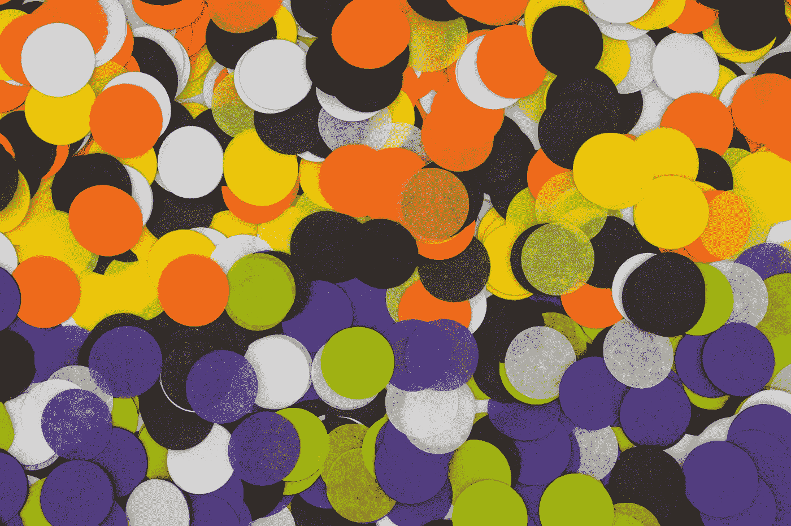
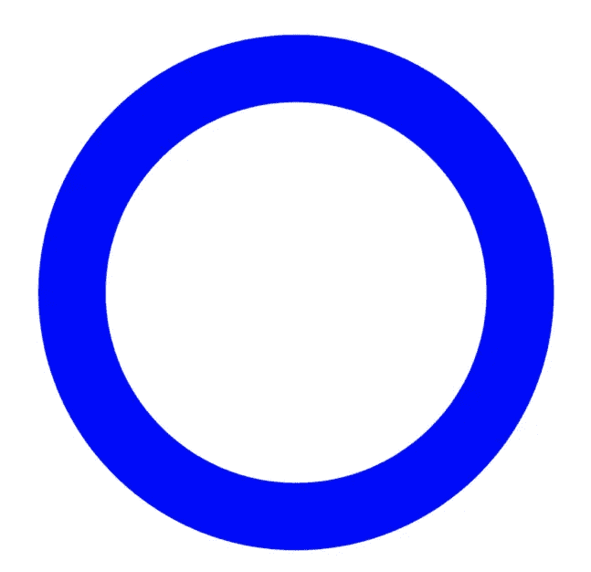
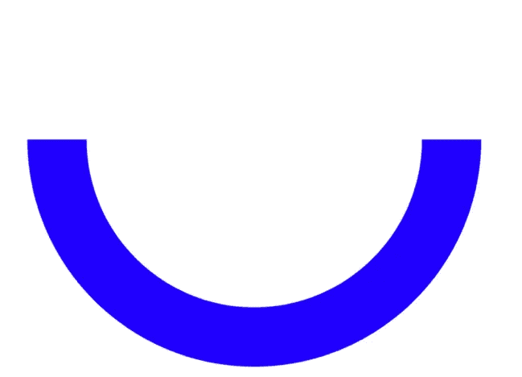
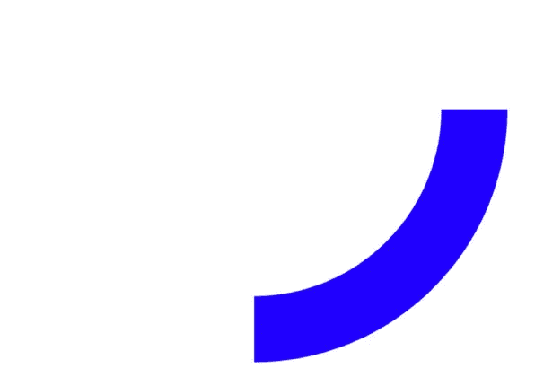
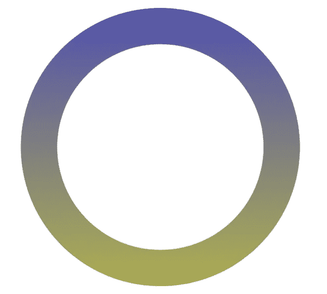

# 在 Swift 中创建、制作和定制圆圈

> 原文：<https://betterprogramming.pub/create-animate-and-customise-circles-in-swift-84419881c597>

## 利用 UIBezierPath 在 iOS 应用程序中绘制令人惊叹的形状



梅尔·普尔在 [Unsplash](https://unsplash.com?utm_source=medium&utm_medium=referral) 上拍摄的照片。

有许多不同的库可以帮助你创建一个完整的圆形，半圆形，甚至是比萨饼切片形状。

但是如果制作过程没有那么困难呢？你还会考虑使用第三方 SDK 吗？自己制作的好处是可以灵活地制作任何你想要的东西。

有时候，第三方 SDK 不能提供你所需要的，你必须继续寻找另一个。如果它不符合您的业务需求，那就是浪费了大量时间。

好吧，我希望这本书能给你所需要的。

# 先决条件

要跟随本教程，您需要:

*   对 Swift 的基本熟悉。
*   至少 Xcode 11。

# 建立你的圈子

你将使用`UIBezierPath`来画出它的形状。你可以用`arcCenter`来调整你想要的形状。您可以根据自己喜欢的尺寸调节`radius`:

这只是一个小小的扩展，将有助于您的旅程:

```
extension CGFloat {
    func toRadians() -> CGFloat {
        return self * CGFloat(Double.pi) / 180.0
    }
}
```

接下来，您将使用`CAShapeLayer`渲染圆:

如果你想要一个完整的圆，就用`0`和`360`分别代表`startAngle`和`endAngle`:

```
createCircle(startAngle: 0, endAngle: 360)
```



半圆怎么样？分别是`0`和`180`:



扇形(又名比萨饼切片形状)怎么样？分别是`0`和`90`:



随意摆弄这些数字，就能得到你需要的形状。让我们给这个实验增加一些乐趣，看看我们还能做些什么。

# 动画你的圈子

为此，您可以考虑使用`CABasicAnimation`。绝对可以根据自己的需要随意调整数值:

使用上面的代码，您只需要在`createCircle`中添加一行代码:

```
addAnimation(to: segmentLayer)
```


# 给你的圆添加渐变

除了动画之外，有时设计师的要求可能会变得非常讨厌各种各样的十六进制颜色。不要烦恼！你的设计师会得到他们想要的。

用下面的代码，你可以在你的圆上有一个渐变。这里使用的渐变是蓝色和黄色，但是可以随意改变颜色:

将下面的代码添加到`createCircle`中。

```
addGradientLayer(to: segmentLayer)
```

如果你还有你的动画，那将是动画和渐变的结合。然而，我想让你看看下图中渐变后的样子:



# 堆叠你的圆圈

你给你的设计师留下了深刻的印象，但似乎他们想要更多。他们给了你一套新的设计。这一次，您需要在整个圆圈周围添加一个外圈，因为当前版本看起来有点过于平淡。

你已经知道如何创造一个圈子了。你可以通过复制相同的代码来堆叠它们:

并且`viewDidLoad`应该包含:

```
createInnerCircle(startAngle: 0, endAngle: 360)
createCircle(startAngle: 0, endAngle: 360)
```

有了这个，你会让你的设计师大吃一惊，正式成为他们最喜欢的工程师:


现在你有一个灵活的圈子，你可以不时调整。