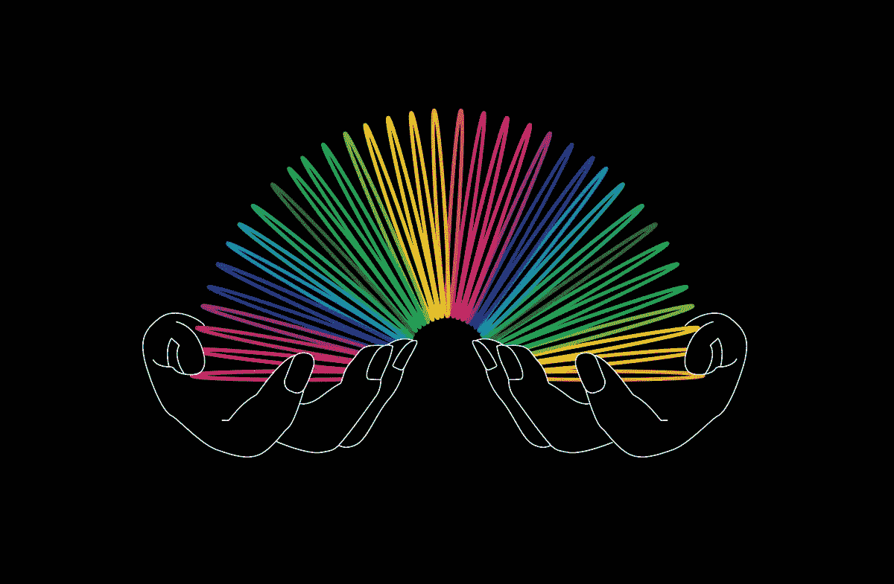

# 使用 React Spring 创建动画应用程序

> 原文：<https://betterprogramming.pub/create-animated-apps-with-react-spring-e3af98ab014f>

[*由*](https://medium.com/@kateshokurova) [*朱丽娅*](https://shakuro.com/blog/author/julia-shikanova) [*，开发商由*](https://medium.com/@kateshokurova) [*三郎*](https://shakuro.com/)

## 通过美丽的动画为您的应用程序注入活力



杰基·埃利奥特的插图。

将动画融入 UI 设计可能是一件棘手的事情。去年，我们发表了一篇文章，描述了用[帧运动](https://medium.com/better-programming/framer-motion-tutorials-make-more-advanced-animations-4344b686ea0a)制作的 React 应用程序中的“黄油平滑”动画。Framer Motion 的问题是缺乏关于如何做一些超越最简单的东西的教程。研究 [React Spring library](https://www.react-spring.io/) 会让人面对相反的问题。虽然它的文档是有序的、详细的、易于使用的，并且有很多令人印象深刻的例子，但是如果你的目标是获得基础知识，那么它们中的大多数都太复杂了。所以我们认为制作一些 React Spring 教程可能会有所帮助。

这篇文章对那些刚开始接触反作用力弹簧的人很有用。我们将会看到不同的方法来组合多个弹簧来制作更复杂的动画，包括例子。请注意，理解本文需要了解[反应](https://reactjs.org/)的基本知识。知道如何使用[样式组件](https://styled-components.com/) / [情感](https://emotion.sh/docs/introduction) /任何其他类似的库也会有所帮助。

# React Spring 库的 5 个钩子

动画为设计和改进应用程序的 UX 增添了活力。React Spring 是一个基于物理学的动画库。它计算所有的幕后机制，以获得漂亮流畅的动画，并允许你为用户部分或完全地配置它。此外，React Spring 比使用纯 CSS 更容易(至少没有极其复杂和难以维护的大量代码)。

目前，React Spring 库包含五个钩子:

1.  `[useSpring](https://codesandbox.io/s/react-spring-usespring-irxxw)` —改变动画状态的单个动画 a = > b
2.  `[useSprings](https://codesandbox.io/s/react-spring-usesprings-rsk8x)` —也改变动画状态的列表的多个弹簧动画 a = > b
3.  `[useTrail](https://codesandbox.io/s/react-spring-usetrail-yh627)` —具有公共数据集的多个弹簧动画，其中每个后续动画落后于前一个动画。
4.  `[useTransition](https://codesandbox.io/s/react-spring-usetransition-iz27j)` —装载/卸载列表时的动画，其中元素被添加、删除和更新。
5.  `[useChain](https://codesandbox.io/s/react-spring-usechain-l07f8)` —用于确定几个先前定义的动画的执行顺序和次序。

所有这些钩子在本质上都是相似的，但是每一个都有自己的特点。让我们更详细地逐个检查它们，以了解如何在 React 中应用它们来制作漂亮的动画。

# 使用弹簧

我们将从最简单的钩子——`[useSpring](https://www.react-spring.io/docs/hooks/use-spring)`开始这个 React Spring 动画教程。它将传递的值转换成动画值。

作为第一个例子，我们将创建一个简单的动画组件，它将在单击时调整`backgroundPosition` 的大小并进行移动。

首先，让我们导入所需的钩子和动画组件:

```
import { animated, useSpring } from “react-spring”;
```

对于外观上的动画，指出以下内容就足够了:

```
const springProps = useSpring({
   from: { opacity: 0, ... },
   to: { opacity: 1, ... }
 })
```

Spring 允许你将从最初的`from`到最后的`to` *的状态变化制作成动画。*

此外，可以省略`to`道具，使其更加简单:

```
const springProps = useSpring({
   opacity: 1,
   from: { opacity: 0 },
 })
```

除了[保留关键字](https://www.react-spring.io/docs/hooks/api)之外，你几乎可以动画任何 CSS 属性或者使用任意名称。

接下来，您需要将`springProps`传递给动画元素。不过，值得一提的是，由于传输的值正在更新，它们不能用于普通的组件或标签。

以下[styled-components](https://styled-components.com/)/[情感](https://emotion.sh/docs/introduction)/等。组件是必需的:

```
const AnimatedBox = styled(animated(ComponentName/TagName))`...`;
```

或者只是添加了“动画”前缀的任何 HTML 标签:`<animated.button>Button</animated.button>`。

`Animated`是一个动画原语，允许你处理传递过来的动画道具。`Animated`扩展原生元素的功能，使它们可以接受动画值。

剩下的工作是将道具传递给所需的组件:

```
<AnimatedBox style={{springProps}} />
```

React Spring 钩子几乎可以接受任何值或颜色、HTML 属性，甚至是字符串模式(例如`borderTop: “6px solid red”`)等。一个非常不幸的限制是不可能在一个道具中为`from`和`to`转移不同的属性。即 *px* 必须换算成 *px，% = > %* ， *number = > number* 等。否则将会出现错误。

从下面的例子可以看出，如果需要的话，动画状态可以被析构。例如，如果您需要使用任意名称一次描述几个组件的动画状态，或者需要描述[插值](https://www.react-spring.io/docs/hooks/api)的动画状态，这是非常有用的(我们稍后会详细说明)。

我们将使用`useState`来改变动画状态。因为我们用三元运算符为动画道具传递真值和假值，所以对于这种特殊情况，我们不必从值中定义初始*，但是安全总比遗憾好，为了防错还是要定义它。否则，在对状态进行更改之前，道具数据将为空，动画可能会中断或导致意外结果。*

我们将析构`size`的值(它将被用于制作`width`和`height`的动画)并传递其他值，在本例中，将`backgroundPosition`传递给`springProps`。

现在我们只需要将动画值传递给我们的组件，当然，在单击时改变它的状态:

```
<AnimatedItem
  style={{ height: size, width: size, ...springProps }}
  onClick={() => setClicked(!clicked)}
/>
```

现在点击后状态会从`false`变为`true`，所以组件的高度和宽度会从 200px 变为 300px，背景元素的`backgroundPosition`也会从 *50% 0%* 变为 *50% 100%* 。

也许值得一提的是这个例子中使用的`ProgressBar`的计数器。让我们用下面一行代码来完成我们的挂钩:

```
counter: clicked ? 100 : 0,
```

重要的是不要忘记析构计数器，因为我们将在传递给`AnimatedItem`组件的`springProps`之外需要它。

为了迭代从 0 到 100 的计数器值，我们将使用一些插值:

```
<AnimatedBox>
  {counter.interpolate(val => Math.floor(val) + "%")}
</AnimatedBox>
```

换句话说，[插值](https://www.react-spring.io/docs/hooks/basics)允许你迭代一个函数值或指定范围的值。请注意，转移到动画基本体的插值工作效率更高，占用的空间更少。

很简单，对吧？

# 使用弹簧

```
import { animated, useSprings } from “react-spring”;
```

`[useSprings](https://www.react-spring.io/docs/hooks/use-springs)`挂钩与之前的挂钩略有不同。它为静态列表创建多个 spring 动画。

在这个 React Spring 示例中，彩色框是我们使用`useSprings`的列表。而较大的块是常规的`useSpring`，它在点击列表元素时接收所需颜色的索引值，并将其索引传入`state`。

```
const [index, setIndex] = useState(null);
```

`useSprings` 获取列表的长度，并确定每个列表元素的动画参数:

```
const springs = useSprings(list.length, list.map(item => ({ 
   ... 
}));
```

这里有一个使用`useSprings`的例子:

背景和颜色值取自`colorScheme`对象数组:

```
const colorScheme = [
  { name: "Red munsell", hex: "#ec0b43", fontColor: "#fff" },
  ...
];
```

第一眼看上去，`springs`参数似乎令人困惑，但实际上，它非常简单。在我们点击一个列表元素之前——也就是说，当`index` = `null`时——所有彩色块的不透明度值= 1。如果列表元素之一已经被点击，那么当前元素的不透明度= 1。所有其他元素的不透明度= 0.6。在高度值的情况下，就更简单了。在我们点击其中一个色块之前，它的值= 120。被点击后，其值= 60。

我们仍然需要将`springs`的值传递给组件列表:

设置索引状态并执行`onItemClick`功能时:

这里，我们使用第二种方法来确定`useSpring`——通过`set`函数，`setSpringProps`。点击时，我们将所选列表项的`index — i`传递给`onItemClick`函数，该函数接收所需项的值(名称、十六进制、`fontColor`)并使用这些值更新`useSpring`。它还设置高度和不透明度。

剩下的就是将`springProps`的值传递给组件:

在这种情况下，十六进制值直接从原始对象数组中获取，因为如果我们从`spring`中获取该值，我们会得到 RGBA 格式的颜色插值，这并不是我们想要的。

# 使用踪迹

```
import { animated, useTrail, interpolate } from “react-spring”;
```

[useTrail](https://www.react-spring.io/docs/hooks/use-trail) 允许你用一个配置创建多个 spring 动画，每个后续的 spring 在前一个 spring 之后执行。它用于交错动画。

对于本例，配置大致如下:

```
const trail = useTrail(list.length, { … });.
```

将踪迹传递到组件中:

在这个例子中你应该注意的是一组值的[插值](https://github.com/react-spring/react-spring/issues/83)，它允许你一次改变几个`transform`函数的`transform`属性。它与单参数插值略有不同:

```
transform: x.interpolate(x => `translateX(${x}px)`)
```

但原理是一样的。

结果，我们得到了一个轨迹动画，它改变了`transform`属性(`scale` *，* `translate`，和`skewX`)的值和外观上的不透明度，并且还在单击列表容器时再次改变了比例。通过点击按钮，不透明度也将在我们已经熟悉的`set`功能的帮助下改变。

# 使用过渡

```
import { animated, useTransition } from “react-spring”;
```

[使用过渡](https://www.react-spring.io/docs/hooks/use-transition)允许你创建一个动画过渡组。它接受列表中的元素、它们的键和生命周期。元素出现和消失时会触发动画。

您可以将`transition`用于阵列，在组件之间切换，或者安装/卸载同一组件。

使用一个已经熟悉的原理，我们将把列表的长度传递给`useTransition`(因为我们正在制作滑块的动画，所以当前幻灯片的索引将作为长度)和列表元素本身(背景图像的 URL)。

`from`、`enter`和`leave`属性描述当前幻灯片在装载时从`from`到`enter`以及在卸载时从`enter` 到`leave`的状态。

让我们将配置传递给组件:

点击箭头控件后，`index`的值和滑动方向(`dir`)会改变:

```
<Arrow onClick={() => slideLeft()}/> 
<Arrow onClick={() => slideRight()}/>
```

其中`slideLeft`和`slideRight`为:

```
const slideLeft = () => setIndex([(index - 1 + slides.length) % slides.length, -1]);
const slideRight = () => setIndex([(index + 1) % slides.length, 1]);
```

`slideLeft`和`slideRight`不仅允许您更改`index` 和`dir`的值，还允许您在到达最后一张幻灯片后将其复位。

结果，我们得到了一个滑块，其中滑块被安装/卸载，当`index`和`dir`被转换时，改变`opacity`和`transform`的值。

控制子弹是用我们已经熟悉的`useSprings`钩子制作的，所以我们不再赘述。

# 使用链

[使用链](https://www.react-spring.io/docs/hooks/use-chain)允许你设置先前定义的动画钩子的执行顺序。为此，您需要使用[引用](https://reactjs.org/docs/hooks-reference.html#useref)，这将随后阻止动画的独立执行。

```
import { animated, useChain } from “react-spring”;
```

让我们用这个钩子来制作汉堡包菜单元素的动画。在我们的例子中，首先执行`MenuBar`的`useSpring`动画，然后是菜单组件列表的`useSprings`动画(`MenuItem`)。

```
const springRef = useRef();
 const { ... , ...springProps } = useSpring({
   ref: springRef,
   ...
 });
```

我们现在要做的就是用`useChain`定义动画的执行顺序:

```
useChain(
   open ? [springRef, springsRef] : [springsRef, springRef],
   open ? [0, 0.25] : [0, 0.75]
 );
```

在这个例子中，如果状态是`open === true`，那么在展开菜单时，`MenuBar`的动画将首先执行，随后是`MenuItems`。如果`open === false`——即关闭菜单时——执行顺序相反。

设置动画顺序后，您还可以指定`timeSteps`——一组介于 0–1(1 = 1000 毫秒)之间的值，用于定义动画的开始和结束。比如 *[0，0.25] 0 * 1000ms = 0，0.25 * 1000ms = 250ms* 。

# 奖金

本教程的一些额外示例使用了我们已经熟悉的 React 弹簧挂钩:

## [手风琴——使用弹簧](https://codesandbox.io/s/react-spring-accordion-ymljk)

## [卡片列表—使用弹簧](https://codesandbox.io/s/react-spring-cards-list-9onoj)

## [图片库—使用链](https://codesandbox.io/s/react-spring-image-gallery-rnt6t)

# [反作用弹簧 v9.0](https://github.com/pmndrs/react-spring/pull/632)

伙计们，我们有非常激动人心的消息要告诉你们: [v9.0 差不多完成了 90%](https://github.com/pmndrs/react-spring/milestone/1)🎉

**免责声明:**尽量不要在生产中使用最新的 [rc (release candidate)](https://www.npmjs.com/package/react-spring/v/9.0.0-rc.3) 版本，或者至少要极其谨慎地使用。在[重大变革页面](https://aleclarson.github.io/react-spring/v9/breaking-changes/)了解更多更新信息。

奇怪的是，许多人最期待的动画功能——[无限循环](https://aleclarson.github.io/react-spring/v9/#The-loop-object)——结果可能是有史以来最简单的东西。然而，以前没有合适的方法来做这件事。

# [使用弹簧+回路](https://codesandbox.io/s/react-spring-usespring-loop-7b65q)

**属性用例:**

1.  loop:true-重复动画
2.  传递一个函数(loop: () => 3> n ++)，该函数将在每次循环迭代后被调用(返回 true 继续循环，返回 false 停止循环)
3.  为循环动画的单独定制定义一个循环对象(loop: {reverse: true})。它可能包含任何 useSpring 属性，但最有趣的一个是 reverse: true，它可以防止循环重复时的抖动。

```
import { animated, useSpring } from “react-spring”;
```

让我们使用全新的闪亮的✨循环属性来配置已经熟悉的 useSpring:

```
const springProps = useSpring({
   loop: { reverse: true },
   from: { y: 0, rotate: 0 },
   to: { y: 100, rotate: 180 },
   config: { duration: 2500 }
 });
```

剩下的工作就是将配置传递给我们的动画组件:

```
<AnimatedItem style={springProps} />
```

就是这样！我们为自己找到了一种无缝且简单的方式来配置循环动画。你现在能想象我们以前做不好吗？

# 外卖食品

## React Spring 库的优势:

*   动画基于[物理学](https://react-spring-visualizer.com/)。没有必要(除非您有意想要)自定持续时间或缓动。结果是平滑、柔和、看起来自然的动画。
*   易于使用且清晰的[文档](https://www.react-spring.io/)。
*   文档中以及 React Spring 创建者 Paul Henschel 的 [CodeSandbox](https://codesandbox.io/u/drcmda/sandboxes/) 页面上有很多有趣而漂亮的演示。
*   如有必要，您可以使用[使用手势](https://use-gesture.netlify.com/)中的一套非常有用的挂钩。
*   [库储存库](https://github.com/react-spring/react-spring)被持续更新和维护。
*   一个小但相当活跃的社区([光谱](https://spectrum.chat/react-spring)，[不和谐](https://discord.com/invite/ZZjjNvJ))已经在图书馆周围形成。
*   保罗·亨舍尔定期在他的推特页面[上分享有趣的见解、演示等。](https://twitter.com/0xca0a)

## React Spring 库的缺点:

*   没有简单有效的方法来循环动画(在当前稳定的 v8 中)。
    文档中的示例建议使用无限循环，这实际上会导致严重的性能问题:

*   正如我们已经提到的，React Spring 的另一个非常不幸的限制是不可能在一个道具中为`from`和`to`传递不同的属性。即 *px* 必须换算成 *px，% = > %* ， *number = > number* 等。否则将会出现错误。
*   此外，该库不允许您将`auto`的值制作成动画。文档建议使用[反应-调整大小-感知](https://github.com/FezVrasta/react-resize-aware)、[反应-测量](https://github.com/souporserious/react-measure)等。为了这些和其他需要元件的精确高度和宽度的目的。

现在，您已经了解了一种新的、相对简单的方式来处理 React 和 React Spring 动画教程中的动画，请尝试制作应用程序各个方面的动画。有很多方法可以充分利用[给你的应用添加一些动画](https://shakuro.com/blog/animation-types-to-juice-up-mobile-ux)，所以试试吧。

我们开始吧！

*本 React Spring 教程最初发布于 2019 年 3 月，2020 年 12 月进行了更新，以使其更加相关和全面。*