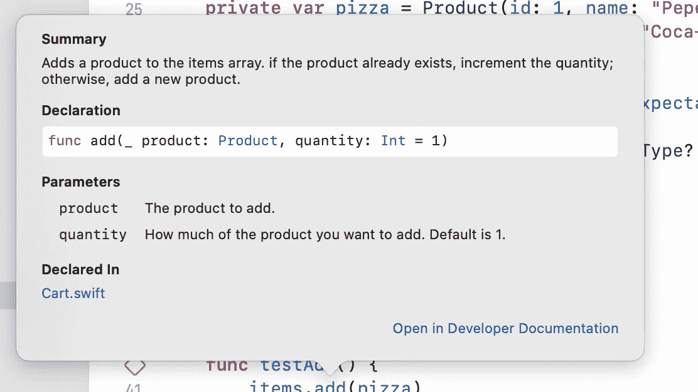
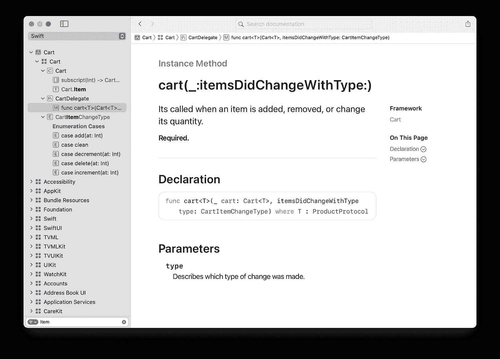
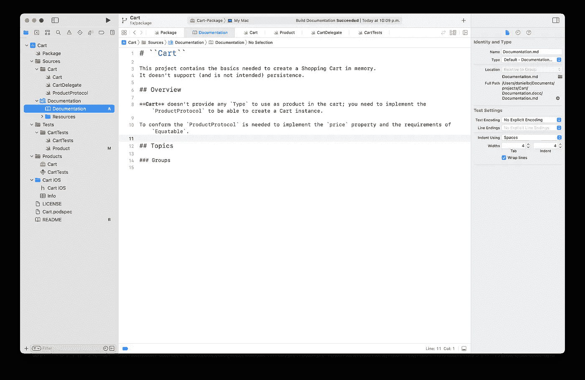

# 根据您在 Swift 中的代码注释创建类似 Apple 的文档

> 原文：<https://betterprogramming.pub/create-apple-like-docs-from-your-code-comments-in-swift-d8334b1ef57f>

## 自述文件或 GitHub 页面的替代和补充

来源:苹果 Swift-DocC

在深入讨论什么是 DocC 之前，我们需要理解什么是 Doc 注释。

> *文档注释*(也称为文档注释)是对作为建议文档的代码的注释。
> 
> 通常，ide 可以识别这些类型的注释，并在快速帮助菜单中显示它们(使用 Xcode 上的**选项-单击**)；此外，一些工具可以读取您的评论并生成文档，如 HTML 或 Markdown 格式的文件。

许多工具允许你这样做。在本文中，我们将探索苹果官方工具， [Swift-DocC](https://developer.apple.com/documentation/docc) 。

# 生成的文档看起来怎么样？

用 DocC 生成的文档看起来和官方的[苹果 Swift 文档](https://developer.apple.com/documentation/swift)非常相似；我们可以猜测，苹果使用相同的工具来创建它。

下面的例子展示了如何利用 Xcode 中的 doc 注释。

以下示例显示了如何在 Xcode 窗口中查看文稿，就像 Apple 文稿一样。

您可以添加文本格式，如粗体、斜体，甚至代码示例。

在 Swift Playgrounds 上，你可以添加图片，但这将是另一篇文章的主题。

# 如何使用 Swift 上的 Doc 注释？

如您所知，您可以在 Swift 上添加常规注释，使用双斜线`//`表示单行注释，使用`/* */`表示多行注释。

Doc 注释使用稍微不同的语法，三斜线`///`用于单行注释，而`/** **/`格式用于多行注释。

最基本的例子是属性声明。

如你所见，Doc 注释应该在声明之前的行中；你可以记录任何你可以声明的东西，比如函数、方法、属性、类、结构、枚举、枚举用例等等。

但是您不需要记录只存在于函数内部的变量，因为它的整个生命周期一目了然。

## 记录功能

这些函数需要更多的工作，因为您可能希望记录参数、返回值和抛出错误。

以上是带有两个参数的函数的文档示例。首先，我们有“功能”的描述，然后是每个参数的文档。这是为参数添加文档的标准方式；有必要遵循标准，让 Xcode 知道您引用的是一个参数。

然而，这不是记录参数的唯一标准方法；当您有许多参数时，还有另一种看起来更简洁的方法。

现在我们来看看`return`和`throw`。

如您所见，这就像在描述后面添加 *—抛出:*或 *—返回:*一样简单；退货通常是你的文档注释的最后一项。

> 💡**专业提示**
> 
> 您不需要记住正确的语法来编写文档注释；使用快捷方式**选项(alt) + cmd + /** ，Xcode 会自动为光标下的任何内容添加一个模板。

您可以使用 Markdown 样式在您的注释中添加格式，如星号之间的文本表示*斜体*，双星号表示**粗体* *，并添加代码块，如 Markdown。

让我们看一个例子:

是的，你可以在文档评论中添加表情符号！

# 如何生成文档？

现在，您已经在源代码中编写了文档注释；你可能想知道如何更好地利用它们。

> 💡**注**
> 
> Swift-DocC 需要 Swift 5.5 和 Xcode 13 或以上版本。

在 Xcode 菜单上，选择`Product > Build Documentation`。

Xcode 将打开一个新窗口，您可以在其中直接查看文稿。

就是这样；你已经有了你的项目文档和苹果文档；您可以随时再次打开文档，而无需通过菜单`Help > Developer Documentation`进行构建。

然而，任何好的文档都需要一个好的主页！

在你的项目中，进入你的主文件夹，点击`File > New File`，搜索“文档目录”，然后点击下一步。

Xcode 将创建一个新的文档目录，您可以从侧边栏访问它，并创建一个模板来编写框架概述。它将是你的文档的主页。

Swift-DocC 可以作为 README 文件或 GitHub 页面的替代和补充；请告诉我们您喜欢哪种类型的源代码文档。

# 常见问题解答

**我是否需要记录所有事情？** 您可以记录任何您想记录的内容，但 Swift-DocC 只会为公共和开放内容生成文档页面。

**Swift-DocC 有哪些替代方案？用于 HTML 文档的** [Jazzy](https://github.com/realm/jazzy) 和支持 HTML 和兼容 GitHub Wiki 的 Markdown 的 [Swift Doc](https://github.com/SwiftDocOrg/swift-doc) 是很好的选择。