# 如何在 Xcode 中从头开始创建音频单元扩展

> 原文：<https://betterprogramming.pub/create-audio-unit-extension-from-scratch-77abee79d12>

## 循序渐进的指南

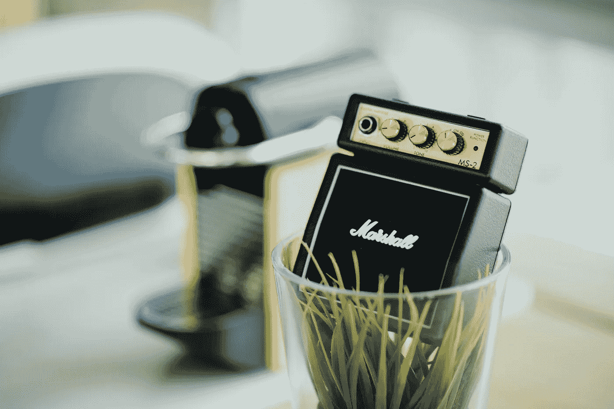

照片由 [chuttersnap](https://unsplash.com/photos/kuUM2M1Mvhg?utm_source=unsplash&utm_medium=referral&utm_content=creditCopyText) 在 [Unsplash](https://unsplash.com/search/photos/speakers?utm_source=unsplash&utm_medium=referral&utm_content=creditCopyText) 上拍摄

关于音频单元扩展的资源并不多。有一个苹果的样本项目，一些信息，WWDC 谈到它:

[https://developer.apple.com/videos/play/wwdc2015/508/](https://developer.apple.com/videos/play/wwdc2015/508/)

关于 Audio Unit V3 的基本思想是，默认情况下，它作为独立的进程(扩展服务进程)运行，并使用 IPC(进程间通信)与主机应用程序通信。这种方法有优点也有缺点(它更安全，但是它增加了开销，每次调用大约 40u 秒，这在处理非常低的延迟时可能会有问题)。

为了更容易开发，并且在 OS X 上 IPC 开销太高的情况下，如果主机和音频单元都指定了该选项，则有一个在进程中运行音频单元的选项。我将使用这种方法，并在后面展示如何去做。

我们的插件只会改变音量(当然，在现实生活中你不需要一个 AU 插件——让我们保持简单！).

我们将拥有**主机应用、扩展和框架**。该框架将包含音频单元代码。有了这个框架，我们就能够将它与扩展和我们的主机应用程序链接起来，以便在开发过程中轻松调试(扩展主二进制文件不能加载到另一个进程中)。

因此，让我们首先创建宿主应用程序。这也将是扩展的包含应用程序。

## 创建一个新的 macOS CocoaApp。叫它 AUHost 吧。

将音频文件拖到项目中。(我使用的是一个名为“z.wav”的文件。)

在`AUHost`组中，创建`AudioPlayer.swift.`

将`ViewController.swift`更新如下:

确保您可以听到正在播放的文件！

## **现在，让我们创建扩展。**

转到文件新建/目标，选择音频单元扩展，更新产品名称(即“VolumePlugin”)、子类型代码(使用“Demo”)。和制造商代码(也使用“演示”)。

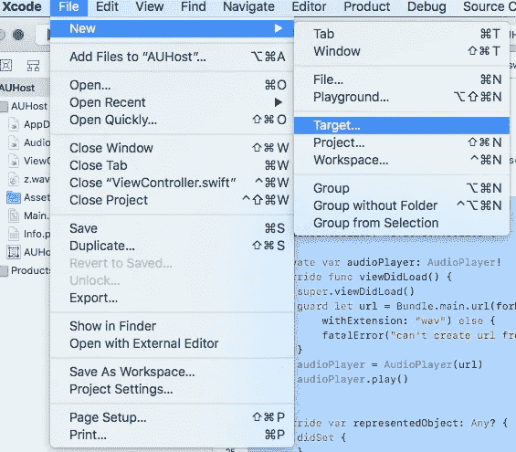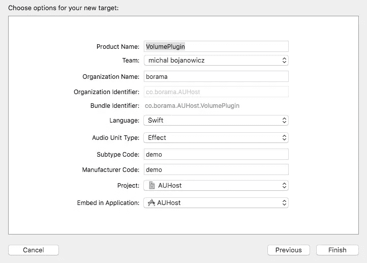

现在创建一个共享框架，我们将音频单元插件文件放在这里。

转到文件/新建/目标…

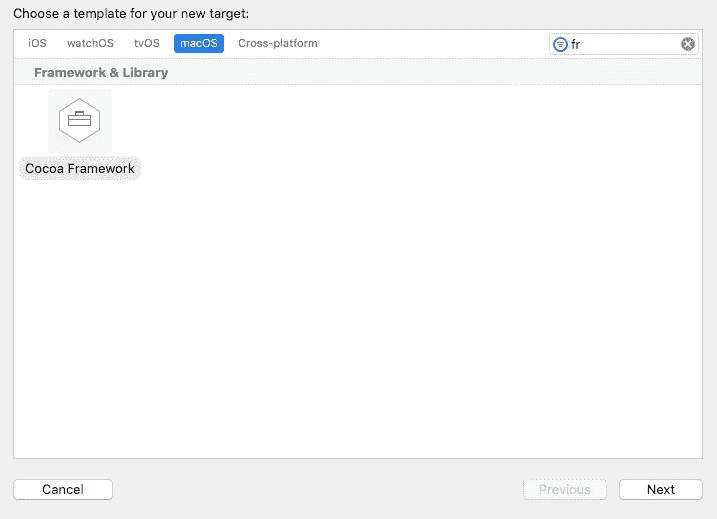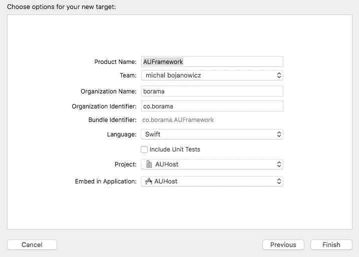

这是我们重构扩展和框架之前的项目结构:

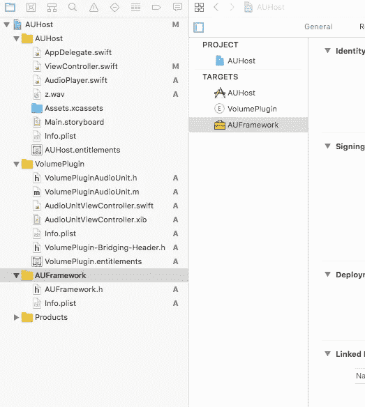

因为我们使用进程内加载，我们需要将所有扩展的代码移动到框架中，并更新扩展的`Info.plist`。

将文件从`VolumePlugin`移动到`AUFramework`中，并根据需要通过更新其目标成员来链接它们。

`AudioUnitViewController.xib`应该像这样把外延和框架都联系起来:

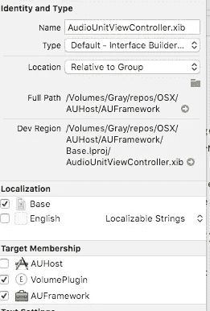

我们需要公开`VolumePluginAudioUnit.h`，以便能够在我们的`AudioViewController.swift`中和框架外使用它。为此，将其目标成员设置为`AUFramework`并将其公开，然后将其导入到`AUFramework.h`中。


更新了“雨伞”公共头，暴露了框架并包括插件头。

移除桥接头，它是在 extension 内部创建的，因为不能在框架内部使用桥接头。

重构后的项目结构如下所示:

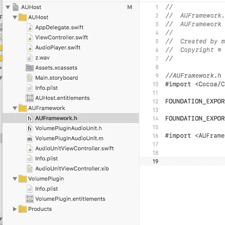

该项目应该像以前一样构建并播放音频文件。

因为我们将在主机内部以进程内方式运行插件，所以我们需要通过添加键`AudioComponentBundle`来更新 audio unit 的`Info.plist`，键的值被设置为`NSExtensionAttributes`字典中的框架包标识符。

在`VolumePlugin`内部，打开内部的`Info.plist`作为源，并添加:

我们已经正式准备好开始开发音频单元插件了:)

## **更新 au host/view controller . swift**

在故事板中添加自定义视图，并使用`auContainer: NSView!`将其与视图控制器连接

首先将音频单元视图控制器添加到主机应用程序视图控制器。

在`AUHost/ViewController.swift`中导入`AUFramework`并添加音频单元视图控制器属性和创建函数，这将加载音频单元视图。更新后的`AUHost/ViewController.`

我们使用的是`VolumePlugin.appex`，这是我们的插件扩展。

运行 app 你应该看到“你的 AudioUnit UI 在这里！”从`AudioUnitViewController.xib`开始。

## **更新 au framework/audiuonitviewcontroller . swift**

现在更新`AUFrameworkViewController`。在`AudioUnitViewController.xib`中创建一个水平滑块，在`AudioUnitViewController.swift`中创建相应的动作。确保将最大值**从 100 改为 1** 。你不会想弄坏你的扬声器的。

将`var audioUnit: AudioUnit?`更改为`var audioUnit: VolumePluginAudioUnit?`并将其公开，这样我们就可以从框架外部(从 AUHost)访问它，并添加类型为`AUParameter.`的可选属性`volumeParam`

打开`AudioUnitViewController.xib`，添加水平滑块；用`AudioUnitViewController.swift`连接。

创建一个函数`connectWithAU()`，在其中我们将从`VolumePluginAudioUnit`连接`volumeParam`到`AUParameter`。我们需要使用参数标识符作为键(为了简单起见，我不改变默认的`param1` 标识符)。

更新后的`AudioUnitViewController.swift`:

## **更新 au framework volumepluginaudiounit . m**

这将比以前的更新需要更多的工作。

我们需要手动将`AVFoundation`添加到我们的`AUFramework`中，否则我们会得到如下链接器错误:

```
ndefined symbols for architecture x86_64: "_OBJC_CLASS_$_AVAudioFormat", referenced from:objc-class-ref in VolumePluginAudioUnit.o "_OBJC_CLASS_$_AVAudioPCMBuffer", referenced from:objc-class-ref in VolumePluginAudioUnit.o
ld: symbol(s) not found for architecture x86_64clang: error: linker command failed with exit code 1 (use -v to see invocation)
```

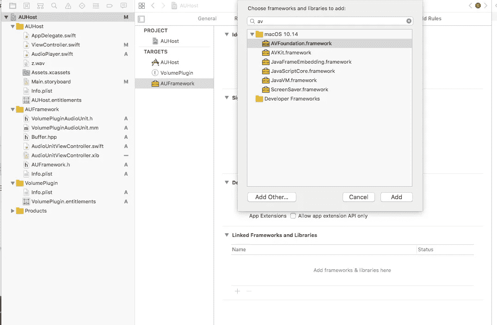

为 AUFramework 目标手动添加 AVFoundation.framework

将`VolumePluginAudioUnit.m`重命名为`VolumePluginAudioUnit.mm`(以便能够使用 C++)。

创建 C++ struct `Buffer`(在`Buffer.hpp`内部)，它将保存音频样本并将其添加为实例`variable_buffer`。

内部`VolumePluginAudioUnit.mm`导入`Buffer`:

```
#import "Buffer.hpp"
```

并为`AUAudioUnitBus`和`AUAudioUnitBusArray`输入输出总线和输入输出总线阵列添加属性。

在`initWithComponentDescription`内部初始化`Buffer`，输入和输出总线。模板有注释和函数，我们基本上需要用我们创建的属性替换它们。例如，已经有了带有块的`_parameterTree.implementValueObserver`，在块中我们得到由音频单元`parameterTree`传递的值(或者从主机视图控制器连接，或者默认从插件的视图控制器连接)。在我们的例子中，它包含滑块值。因此，让我们使用这个值来更新卷:

```
**__block** Buffer *buffer = &_buffer;_parameterTree.implementorValueObserver = ^(AUParameter *param, AUValue value) {buffer->volume = value;};
```

更新了函数 initWithComponentDescription

下一次更新`AUAudioUnit`覆盖，简单地返回输入和输出总线数组。

```
- (AUAudioUnitBusArray *)inputBusses {**return** _inputBusArray;}- (AUAudioUnitBusArray *)outputBusses {**return** _outputBusArray;}
```

在`allocateRenderResourcesAndReturnError`函数中更新我们的`Buffer`结构。

最后更新`internalRenderBlock`功能。这是我们实时处理音频样本的地方。根据缓冲区的大小，我们正在处理大量的数据，所以几乎是实时的。

## **回到 AUHost**

更新`AudioPlayer.swift`通过我们的音频插件处理音频。添加两个属性:`audioUnit: AUAudioUnit?`和`audioUnitNode: AVAudioUnit?`以及函数`selectAudioUnitWithComponentDescription`。

从功能`startPlaying()`中，移除连接的引擎:

```
*engine.connect(playerNode, to: engine.mainMixerNode, format: file.processingFormat)*
```

这将在音频单元连接/断开时完成。

AudioPlayer.swift 的最终更新

最后，更新`AUHost/ViewController.swift`将音频单元插件连接到音频播放器。我们需要将开始时使用的组件子类型和组件制造商转换为 4 字节代码(与`Info.plist`中相同)。我在用[https://codebeautify.org/string-hex-converter](https://codebeautify.org/string-hex-converter)。

在`audioPlayer.play()`之前在`viewDidLoad()`内部调用这个函数。

差不多了！如果我们继续使用沙盒，`AVAudioUnit.instantiate`我们需要禁用`AUHost app AUHost.entitlements.`的沙盒，错误是:

> NSOSStatusErrorDomain 代码=-3000 "invalidComponentID "

关闭沙盒后(对扩展保持“沙盒打开”)，可能需要清理构建文件夹。在我的情况下，我不得不在 Xcode 中重新打开项目。

在 WWDC 谈论 Audio Unit V3 组件时，他们提到需要添加应用程序间音频，但这仅适用于 iOS。如果我们这样做，OS X 应用程序将立即被系统杀死，Xcode 只会告诉我们运行完毕，没有任何错误。在系统控制台内部，该错误是由于使用了受限的授权。

让我们在 GarageBand 中测试我们的插件吧！

**音频单元 V3 与旧的方式不同。组件是为了在你的系统中注册它，你只需运行一次容器应用程序(它包含你的扩展。**(appex)。我不知道为什么，但我注意到，有时在 Xcode 中运行你的项目就足够了，或者从 DerivedData 文件夹中运行它，但有时你需要将你的项目存档- > Distribute - > copy。应用程序并运行应用程序。

让我们这样做，打开 GarageBand 选择我们的插件，它不工作:(

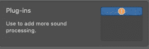

该插件已注册，我们可以验证运行:

```
$ pluginkit -mv | grep bora!    co.borama.AUHost.VolumePlugin(1.0) FBCF4FEC-E388-40BC-8731-91F06A835EAD 2019-09-26 01:37:13 +0000 /Users/michal/Desktop/AUHost 2019-09-26 03-36-24/AUHost.app/Contents/PlugIns/VolumePlugin.appex
```

然而，当我们跑步时:

```
auval -a
```

我们得到**无法打开组件:4099** 错误。

让我们打开我们的容器应用程序并检查我们的扩展:

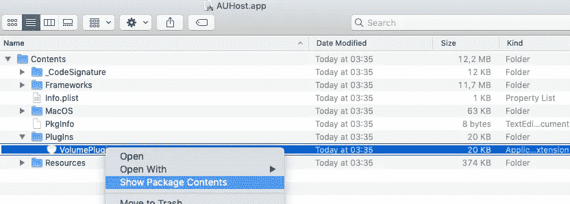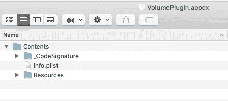

扩展没有二进制…

扩展不包含二进制，我们需要修复它！

**我们需要向我们的扩展目标添加一个伪源文件，因为扩展二进制文件需要被创建、加载并与框架包链接。**

创建一个 objective-c 文件并在其中添加一个函数:

```
**void** dummy() {}
```

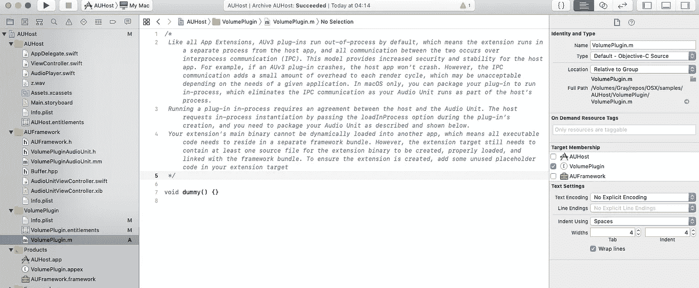

现在扩展将包含二进制文件，所以让我们再次运行 auval -a！

这次我们有**无法打开组件:4097** 错误。

问题出在我们扩展的. plist 上，Xcode 为我们创建扩展的时候，把 NSExtensionPrincipalClass 设置为:

```
$(PRODUCT_MODULE_NAME).AudioUnitViewController
```

但是我们把我们的主体类移到了框架内部。我们需要将属性更改为:

```
AUFramework.AudioUnitViewController
```

这是 AudioUnitViewController 现在所在的位置。

存档、复制和运行容器应用程序。再次运行 auval -a！这次没有抱怨。重启 GarageBand，载入插件。它似乎可以工作，但是当我们点击它的时候，它没有显示我们可爱的用户界面:(

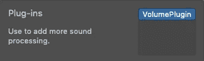

我们需要返回到 AUFramework 中的 AudioUnitViewController.swift，并添加不带参数的初始值设定项:

再次存档-分发-复制 app，运行容器 App。重新打开 GarageBand。加载一些可爱的音频，添加 VolumePlugin，打开就可以了！

消除此警告的最后一次小更新:

```
dyld: warning, LC_RPATH @executable_path/../Frameworks in /Users/...../AUFramework.framework/AUFramework being ignored in restricted program because of @executable_path
```

我们需要在构建设置/链接中将 AUFramework 安装路径从默认的“@executable_path”更改为“@loader_path”


**现在真的是这样了！**

最后一点，最好放很多 NSLogs，给它们添加你的标签，并保持控制台打开，过滤你的标签。

同样为了清理(有时是必要的)auval，您可以运行 auval -v x x x。

在推特上关注我:[https://twitter.com/boramaapps](https://twitter.com/boramaapps)

查看我的 ios / android 应用:[https://borama.co](https://borama.co)

## 资源

*   [完整项目的 GitHub 链接](https://github.com/standinga/AUHost)
*   [苹果公司关于音频单元扩展的 WWDC 讲座](https://developer.apple.com/videos/play/wwdc2015/508/)