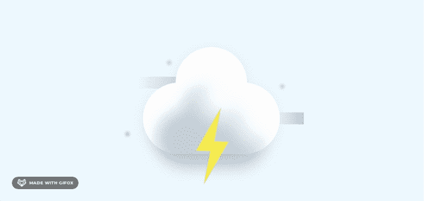
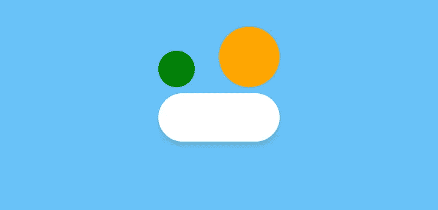
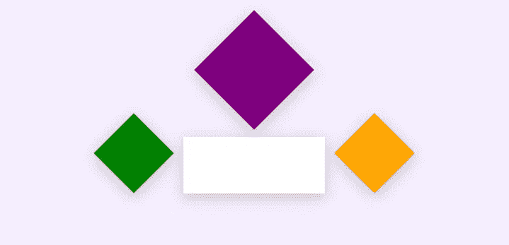
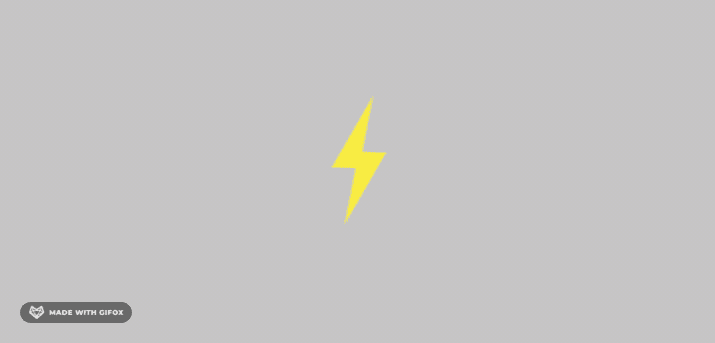
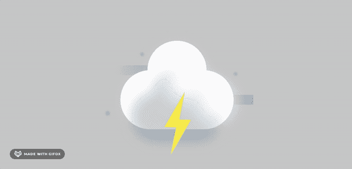

# 在 CSS 中创建漂亮的图片来充实你的作品集

> 原文：<https://betterprogramming.pub/create-beautiful-images-in-css-to-buff-up-your-portfolio-c5a85d046f2a>

## 许多人构建天气应用程序来炫耀他们的新技能。不要让你的无聊

图片来源:作者

如今，如果你的作品没有给别人留下深刻印象，你很难找到第一份工作。每个人都在创建天气应用，但是每个人都有自定义的基于 CSS 的图片吗？让我们创建独特的图像来提升您的投资组合。

我们可以在 CSS 中创建多种形状，那么为什么不创建自定义的 CSS 图像来代替库存照片呢？这些会削减一些不必要的请求，加快你的网站；此外，他们允许你给你的网站带来一些活力。

我不想在这里创建整个应用程序，只是你可以用它来创建一个图像。看起来你花了很大力气来改进这个应用，但是你没有。

# 练习 1。有史以来第一个 CSS 云

让我们从一个简单的云开始。这个云是由一个矩形和两个圆形组成的。你可以使用三个 div，但是我更喜欢尽可能的简化 HTML。这就是为什么我使用一个 div 的矩形和两个伪元素来创建圆形。

这真的很简单。

破碎成碎片的云

现在我们需要改变我们的圆形的背景，将它们移近矩形。

我们的第一个基础云

瞧啊。创造的第一朵云！

# 练习 2。神奇的云

这片云不寻常。它是用一个矩形和三个正方形创建的:一个 div、两个伪元素和一个 span。

矩形云

我们的情况与第一片云中的情况相同。我们需要一起滑动元素，并将背景改为白色。

全方形/矩形云

# 练习 3。天气图像

让我们把手弄脏吧。我们将创建两个图像:一个基本的阳光云和一个暴风雨，邪恶的。不过不用担心，很简单。

所有图片均基于[本文](https://uxdesign.cc/create-a-weather-app-ui-with-3d-like-illustrations-4a6a5686c5ea)。

首先，我们需要创建一些组件。

我们的基色组件的创建方式与第一个相似。

基础云

## 云影

为了创建阴影，我们需要用额外的模糊来复制我们的云，把它涂成蓝色，然后缩小它。

带阴影的基础云

循序渐进:

*   用蓝色复制云彩。
*   添加模糊。
*   缩小它—变换:缩放(0.8)。
*   添加伪元素——两个白色圆圈来遮盖我们的阴影。

## 太阳图像

这很简单:一个有阴影和伪元素背景的圆来照亮我们的太阳。

## 云和太阳

现在，我们必须结合太阳，云和一些额外的太阳闪光。

有太阳的云的完整图像

就是这样！

你可以在 CodePen 上[和阳光云](https://codepen.io/walickialbert/pen/oNzgqKR)一起玩。

如你所见，创建这张图片只花了我们几分钟的时间。此外，基于这个图像创建另一个图像甚至可以更快。所以让我们开始吧！

## 闪电

首先，让我们通过合并两个三角形来创建一个闪电形状。现在使用两个三角形并用 CSS 制作动画。

闪电

## 暴风云

好吧！让我们通过结合我们的基本云(灰色背景)，闪电，和一些风和水滴的 CSS 来完成我们的云。

完整的风暴云

你可以在 CodePen 上玩暴风云。

# 家庭作业

现在你知道如何创建令人敬畏的天气图像，所以创建你自己的！雪？暴雪？可能是雾？

感谢阅读！