# 使用 Jetpack Compose 中的 Perlin Noise 轻松创建漂亮的编程随机绘图

> 原文：<https://betterprogramming.pub/create-beautiful-programmatic-random-drawing-easily-with-perlin-noise-40e1eb1439e>

## 使用柏林噪声在 40 行代码下制作美丽的艺术品


照片由[本杰明·沃罗斯](https://unsplash.com/@vorosbenisop?utm_source=medium&utm_medium=referral)在 [Unsplash](https://unsplash.com?utm_source=medium&utm_medium=referral) 拍摄

随机数对很多事情都有用。然而，有时它们太随意了。我们想画一些光滑的东西，如下图所示:

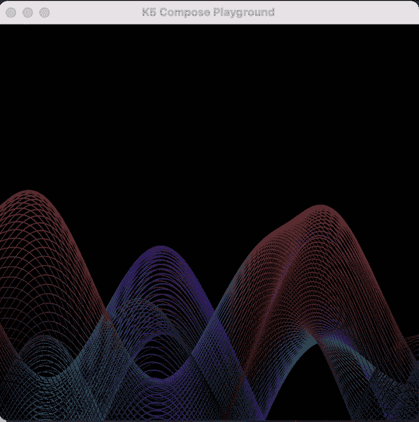

在这里，我将尝试解释什么是 Perlin 噪声，并探索生成上述 wavey 动画的代码。

# 什么是柏林噪声？

随机值的参数为最小值和最大值。如果我们把它画出来，在 0 和高度之间，每个 X 像素 1，它会看起来像下面，到处都是。

```
for (x in 0 *until* width) {
    val drawHeight = height - (0..height)
    drawPoints(
        *listOf*(*Offset*(x, drawHeight)),
        PointMode.Points,
        *Color*.WHITE,
        2f
    )
}
```

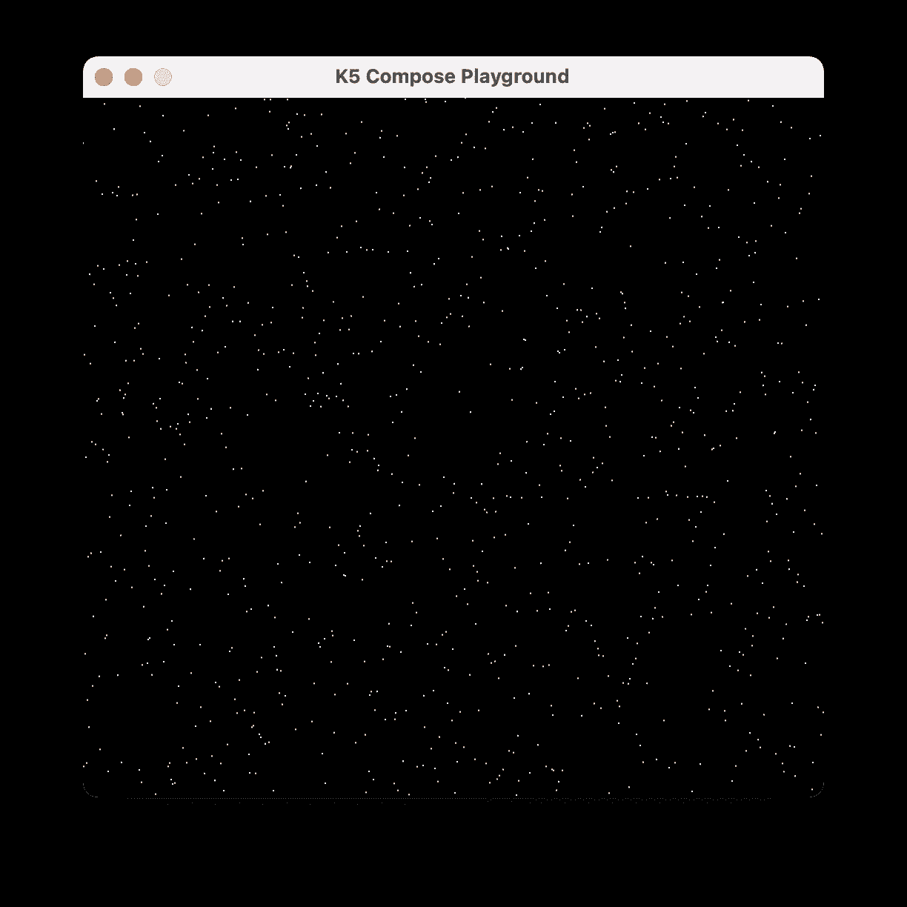

[柏林噪声](https://en.wikipedia.org/wiki/Perlin_noise)是一个具有 1、2 或 3 个参数的函数，取决于我们想要多少个维度。为了简化，我们从一维开始。

```
for (x in 0 *until* width) {
    val drawHeight = height - ***noise1D*(x * 0.002)** * height
    drawPoints(
        *listOf*(*Offset*(x, drawHeight)),
        PointMode.Points,
        *Color*.White,
        2f
    )
}
```

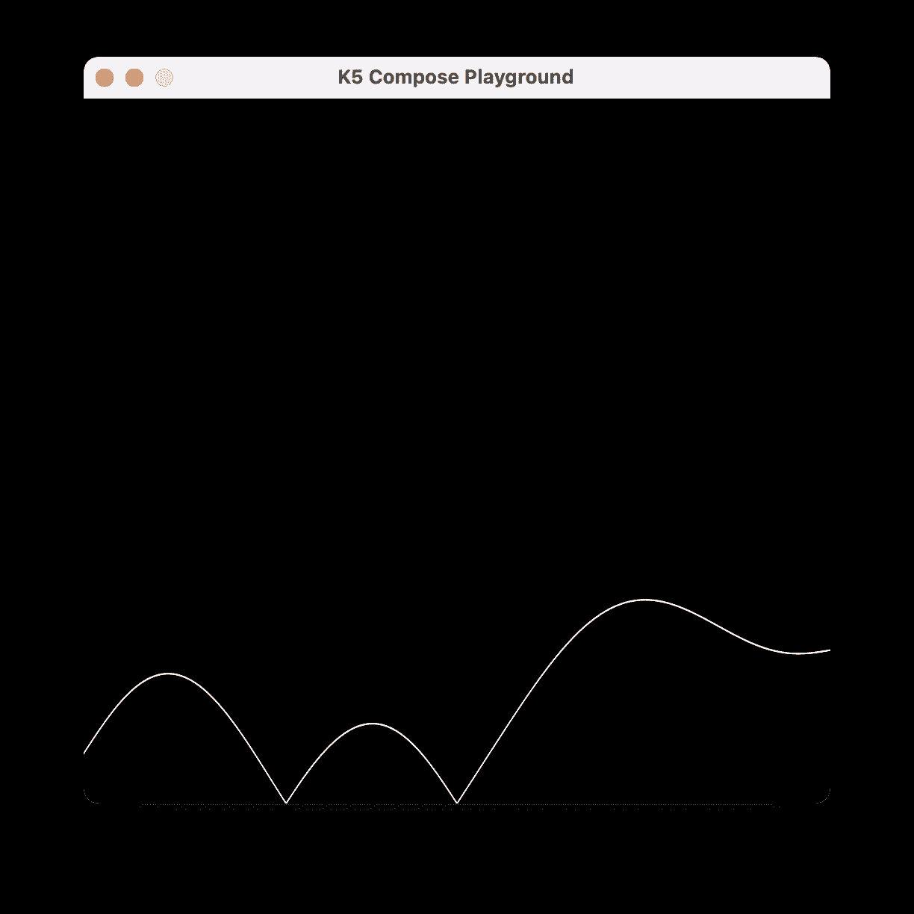

通过 random 的值受它之前和之后的值的影响。我称之为平滑随机性。

# 2D·柏林噪声

那是针对单一维度的。让我们试试 2D 噪声参数。

```
val 2Dcount = 2
for (y in 0 *until* 2Dcount) {
    for (x in 0 *until* width) {
        val drawHeight = 
            height - ***noise2D*(x * 0.002, y * 0.02)** * height
        drawPoints(
            *listOf*(*Offset*(x, drawHeight)),
            PointMode.Points,
            *Color*.White,
            2f
        )
    }
}
```


你会注意到，当我们稍微改变一下第二维度，我们会得到稍微不同的波。

如果我们将`2Dcount`改为 5，我们将生成 5 行，它们的变化彼此略有不同。

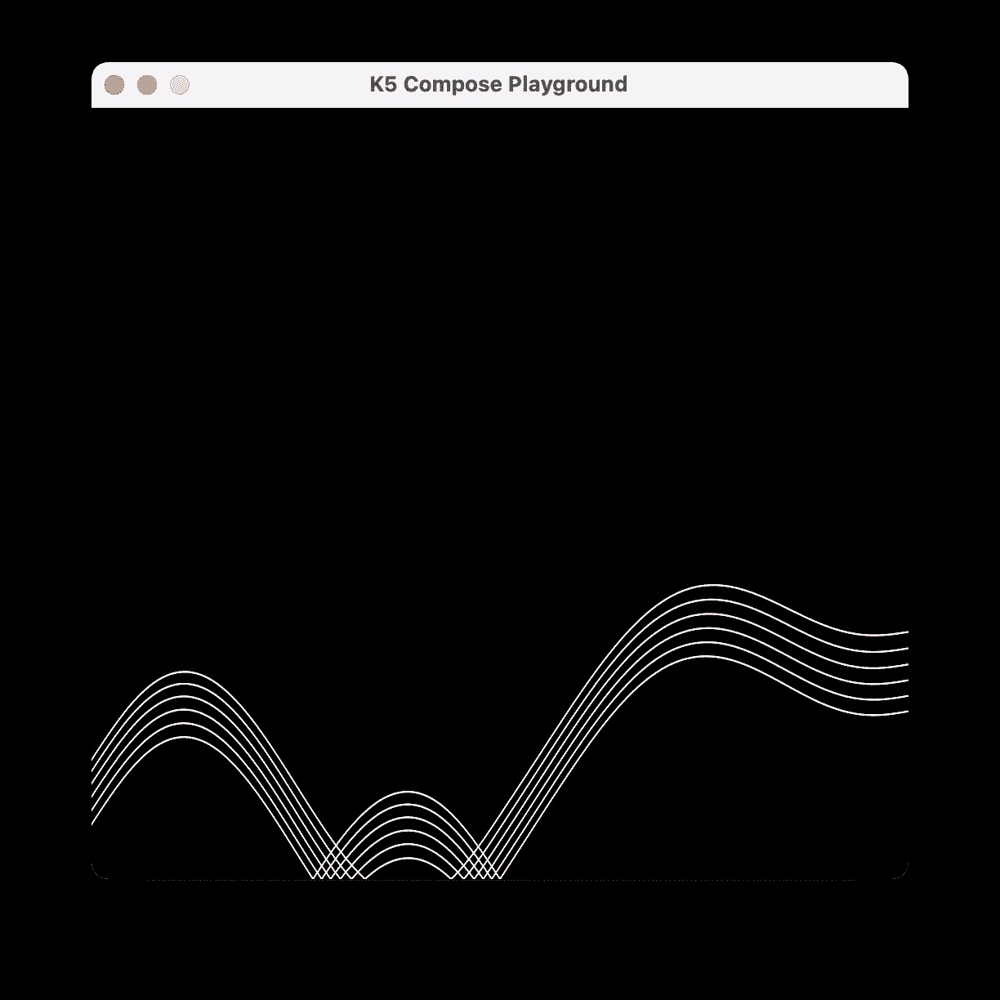

如果我们将`2Dcount`改为更多行，我们会注意到每一行都以相对随机的方式彼此不同。

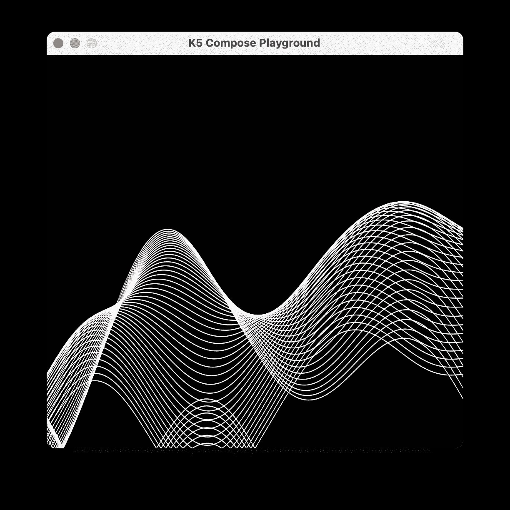

# 3D 柏林噪声

如果我们不使用 2D，而是将值放在 3D 中会怎么样？

```
val 3Dcount = 2
for (z in 0 *until* 3Dcount) {
    for (x in 0 *until* width) {
        val drawHeight = 
            height - ***noise3D*(x * 0.002, 0.0, z * 0.02)** * height
        drawPoints(
            *listOf*(*Offset*(x, drawHeight)),
            PointMode.Points,
            *Color*.White,
            2f
        )
    }
}
```

仅用 2 条线，我们将看到模式也逐渐变化，但随机性略有不同。

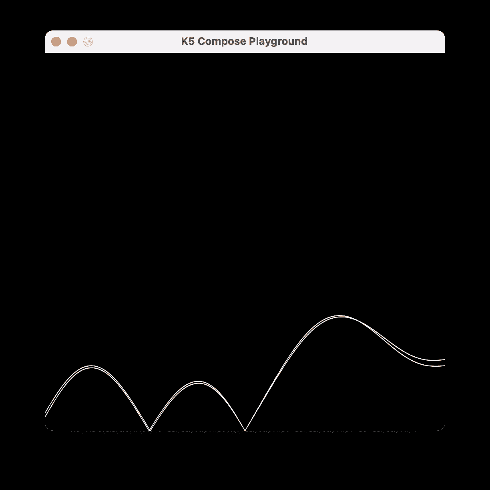

如果我们将`3Dcount`改为 5，我们将生成 5 行，它们的变化彼此略有不同。

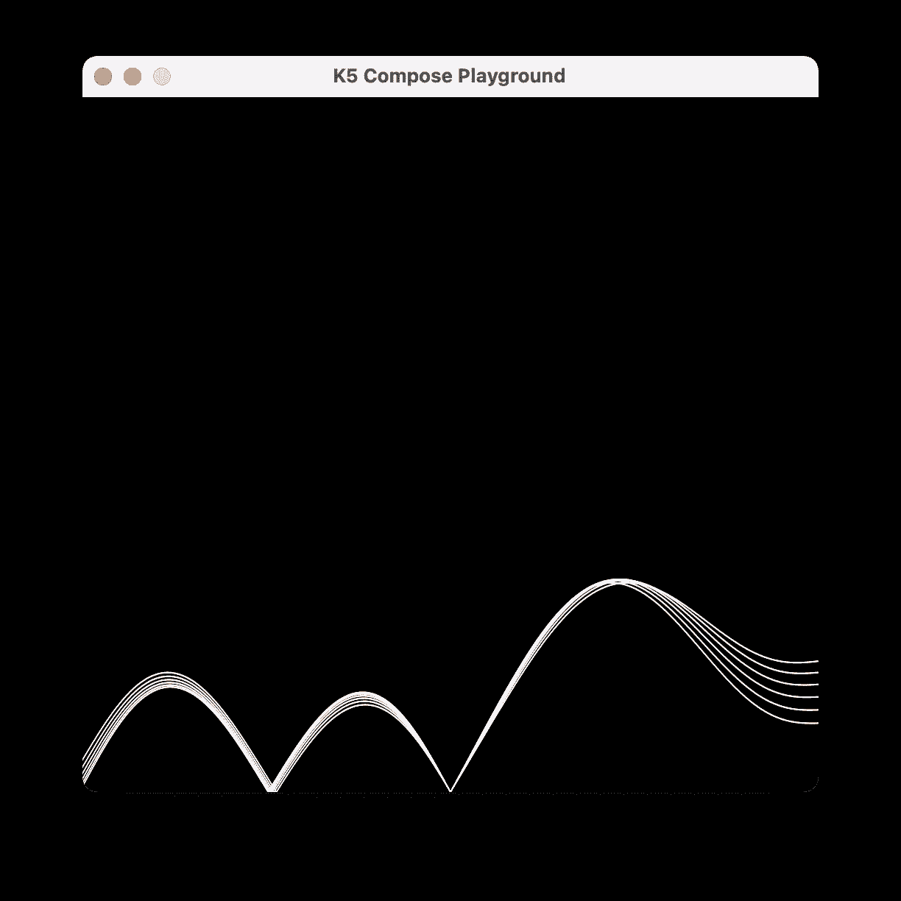

如果我们将`3Dcount`改为 5，我们将生成更多的线条，这些线条的变化彼此略有不同，但是当我们改变 2D 时，这些线条会有很大的不同。

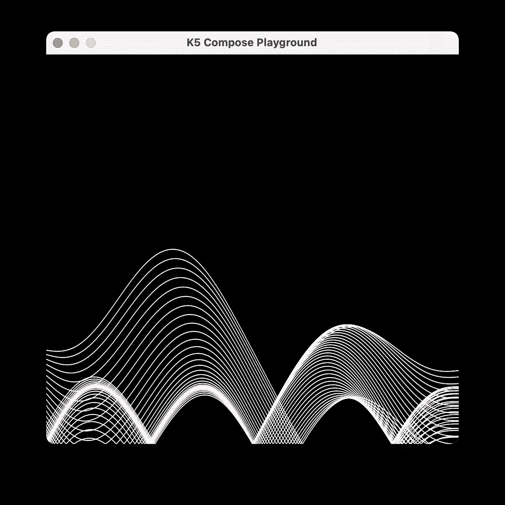

也许不用画每一条线，我们可以考虑通过它们制作动画，其中 3D 噪声值随着鼠标 X 坐标的移动而改变。

```
for (x in 0 *until* width) {
    val drawHeight = 
        height - ***noise3D*(x * 0.002, 0.0, mouse.x * 0.02)** * height
    drawPoints(
        *listOf*(*Offset*(x, drawHeight)),
        PointMode.Points,
        *Color*.White,
        2f
    )
}
```

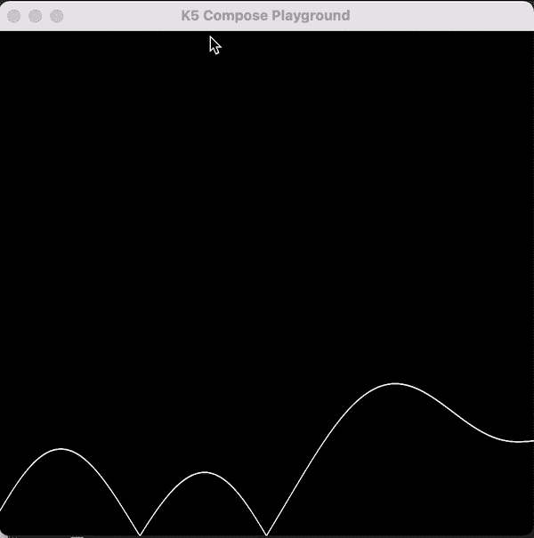

看上面动画的流畅度。一切都是随机逐渐变化的。

如果我们结合 2D 噪声的许多行，并且 3D 值随着我们移动鼠标的 X 坐标而改变，我们将得到如下效果。

```
val 2Dcount = 2
for (y in 0 *until* 2Dcount) {
    for (x in 0 *until* width) {
        val drawHeight = 
            height - ***noise2D*(
                x * 0.002, y * 0.02, mouse.x * 0.02
            )** * height
        drawPoints(
            *listOf*(*Offset*(x, drawHeight)),
            PointMode.Points,
            *Color*.White,
            2f
        )
    }
}
```

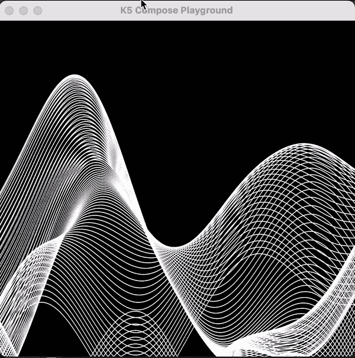

如果我们也用噪声来产生颜色。生成颜色的一种方法如下

> 我还添加了对基于 mouse.y 的行数的控制

```
val 2Dcount = 250
for (y in 0 *until* mouse.y) {
    for (x in 0 *until* width) {
        val drawHeight = 
            height - ***noise2D*(
                x * 0.002, y * 0.02, mouse.x * 0.02
            )** * height **       val red = (*noise1D*(noiseInputX) * 0xFF).toInt()
        val green = (*noise2D*(0.0, noiseInputY) * 0xFF).toInt()
        val blue = (*noise3D*(0.0, 0.0, noiseInputZ) * 0xFF).toInt()** drawPoints(
            *listOf*(*Offset*(x, drawHeight)),
            PointMode.Points,
            *Color*(**red, green, blue**),
            2f
        )
    }
}
```

结果如下:

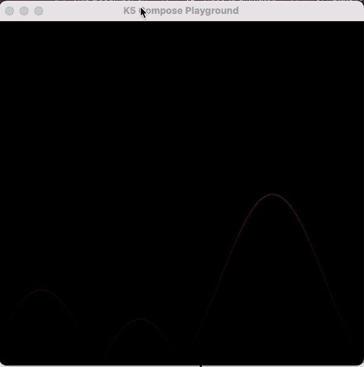

要编译并运行它，你可以在 [Compose K5 游乐场](https://medium.com/mobile-app-development-publication/jetpack-compose-animation-under-50-lines-using-k5-compose-playground-bef35060c471)中运行下面的代码。