# 在 Node.js 之外创建超快的多线程用户界面

> 原文：<https://betterprogramming.pub/create-blazing-fast-multithreading-user-interfaces-outside-of-nodejs-c4199b0023ec>

## 大多数前端开发人员都错过了现代浏览器的下一级功能


由[卢卡·布拉沃](https://unsplash.com/@lucabravo?utm_source=unsplash&utm_medium=referral&utm_content=creditCopyText)在 [Unsplash](https://unsplash.com/s/photos/the-web?utm_source=unsplash&utm_medium=referral&utm_content=creditCopyText) 拍摄的照片

# 内容

1.  [简介](#75de)
2.  网络工作者能帮上什么忙？
3.  [多屏应用](#af83)
4.  [手机上的多屏应用](#e9d5)
5.  [如何将我们的应用程序代码包含在 Worker 中？](#87c0)
6.  [什么是远程方法？](#746c)
7.  [模板有什么问题？](#5d2d)
8.  [将 DOM 平均减少 80%以上](#a31f)
9.  [ES8+代码直接在浏览器里面](#fe97)
10.  [从盒子里取出你的应用文档](#c293)
11.  [好奇了？neo.mjs 是什么？](#e449)
12.  [如何达到速度？](#624d)
13.  接下来会发生什么？

# 1.介绍

网络在飞速发展，但是你呢？

当 Angular 和 React 推出时，浏览器对 ES6+功能的支持很差。结果，整个 UI 开发都转移到了 node.js 中。

浏览器赶上来了，现在可以自己处理 JavaScript 模块和几个 ESnext 特性——所以是时候改变了。

虽然使用像这样的自定义文件可能很方便。vue，你的浏览器看不懂他们。您需要一个构建过程、transpilation 或至少一个热模块替换来将您的代码更改导入浏览器。这需要时间，而且你不能调试你真正的代码。

如今，大多数应用程序仍然使用以下设置:

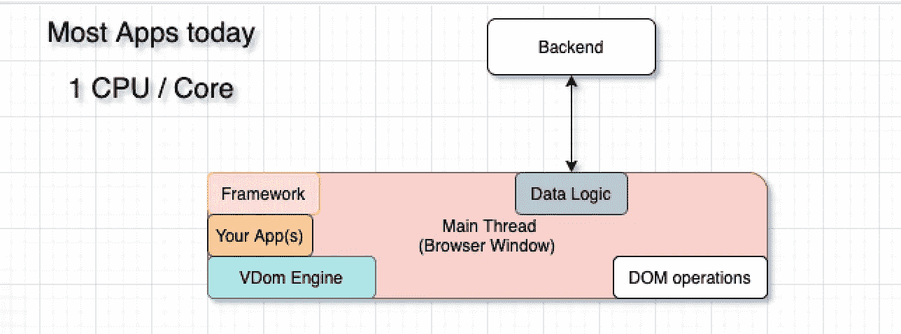

一些公司正在使用`WebWorker`来转移单个昂贵的任务，但这远远不够。主线程负责 DOM 操作——渲染队列。让它尽可能的空闲和轻量必须是主要目标。

# 2.网络工作者能帮上什么忙？

我们想要摆脱这种困境的是以下设置:

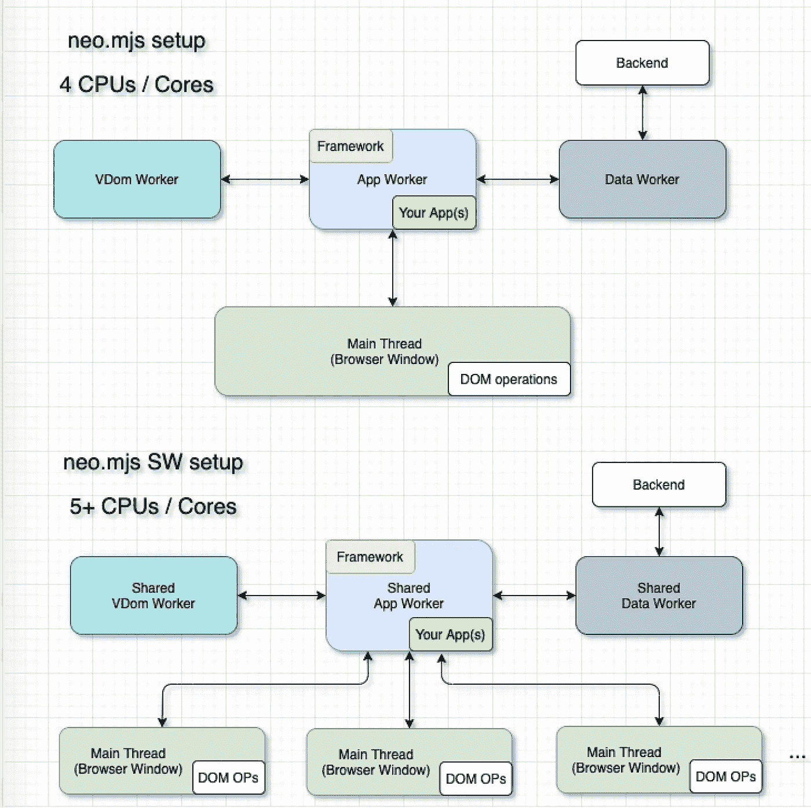

一个框架和你的应用程序逻辑可以并且应该在一个工人内部运行。

通过这种设置，主线程中没有后台任务。没有什么可以减缓甚至冻结你的用户界面转换。

用一个简单的开关来使用`SharedWorker` s 代替普通的 workers，我们甚至可以连接多个主线程。

# 3.多屏应用

虽然这是一个利基用途，但它可以创建一个惊人的 UX，将单页应用程序扩展到多个浏览器窗口。

观看这段 95s 演示视频:

*   所有浏览器窗口共享后端数据。
*   所有窗口都可以直接通信(无需后端连接)。
*   您可以移动整个组件树，甚至保持相同的 JavaScript 实例。

# 4.移动设备上的多屏应用

这将是一件大事。许多移动应用程序使用原生外壳，包含多个`WebView`。`SharedWorker`的设置也可以在这里工作，导致只需加载一次框架和应用程序相关的代码，更重要的是，还可以围绕`WebView`移动组件树。

Webkit 团队(Safari)正在考虑再次提起这个话题。GitHub 增加了门票的重量:

 [## 149850 -恢复对共享工作者的支持

### 错误 149850:恢复对共享工作人员的支持

bugs.webkit.org](https://bugs.webkit.org/show_bug.cgi?id=149850) 

你真的应该这样做！

# 5.我们如何将我们的应用程序代码包含在 Worker 中？

您的`index.html`文件将如下所示(开发模式):

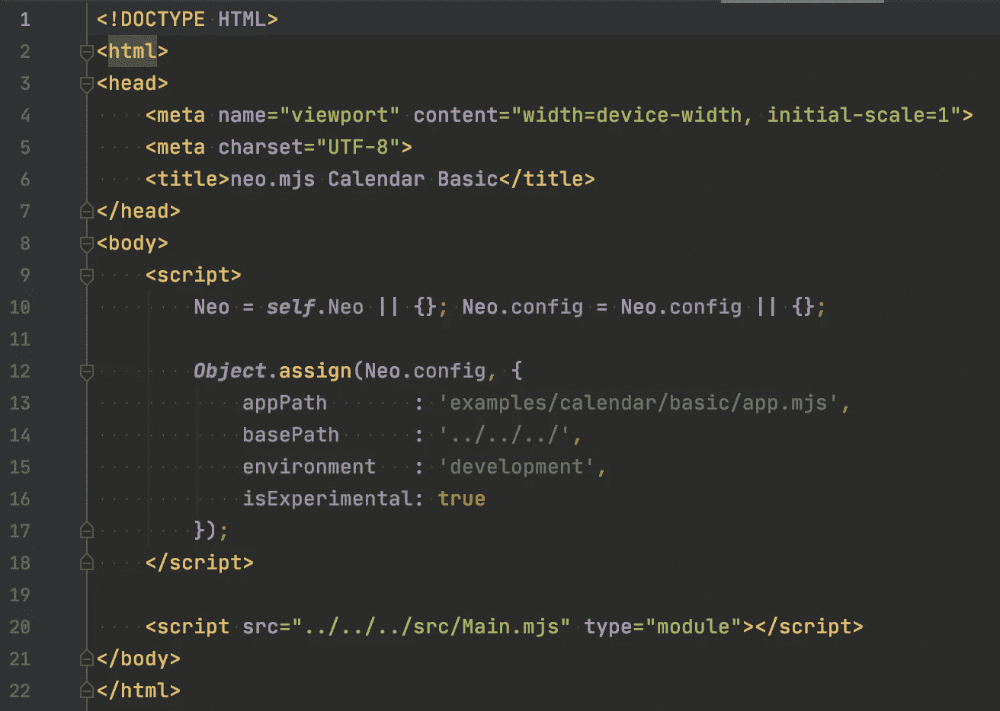

你只需要拉进框架的主线程代码(40KB)。

您不需要手动创建这个文件。你需要做的就是:

```
npx neo-app
```

或者克隆回购并使用 [create-app 程序](https://github.com/neomjs/neo/blob/dev/src/Main.mjs)。这将导入`WorkerManager`并为您生成 `Worker`，注册远程方法并将您的应用程序代码加载到应用程序工作器中。

[https://github . com/neom js/neo/blob/dev/src/worker/manager . mjs](https://github.com/neomjs/neo/blob/dev/src/worker/Manager.mjs)

如果您仔细观察这些文件，您会注意到所有的虚拟 dom 更新都在`requestAnimationFrame`中排队。您可以自己创建一个类似的设置，或者让`neo.mjs`为您处理。

# 6.什么是远程方法？

如果您想在工作线程之间或者与主线程进行通信，您可能需要一个抽象层围绕所需的`postMessages`。

这可能是一项繁重的工作，尤其是在您还希望可选地支持`SharedWorker`的情况下。

如果您在一个`Worker`(在 app worker 的`neo.mjs`上下文中)中运行自己的代码，您会注意到:

*   `window`未定义
*   `window.document`未定义

您根本无法访问真正的 DOM。这使得必须使用虚拟 DOM。

尽管如此，仍有一些边缘用例需要直接访问 DOM。滚动是一个好方法:

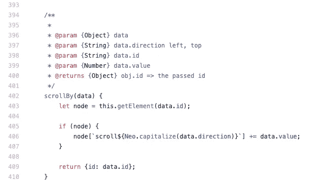

[https://github . com/neom js/neo/blob/dev/src/main/domain access . mjs # L402](https://github.com/neomjs/neo/blob/dev/src/main/DomAccess.mjs#L402)

顾名思义，`Neo.main.DomAccess`只在主线程内部可用。它不会导入到 app worker 中。

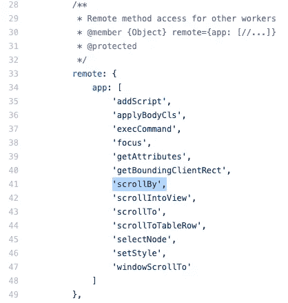

你所需要做的就是添加你想要向不同的工作者或者主线程公开的方法。

现在，在您的范围内(应用程序工作人员)，您可以调用这些远程方法作为承诺。它们将被映射到开箱即用的 Neo 名称空间。

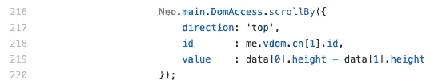

[https://github . com/neom js/neo/blob/dev/src/calendar/view/month component . mjs # L216](https://github.com/neomjs/neo/blob/dev/src/calendar/view/MonthComponent.mjs#L216)

就这么简单。

# 7.模板有什么问题？

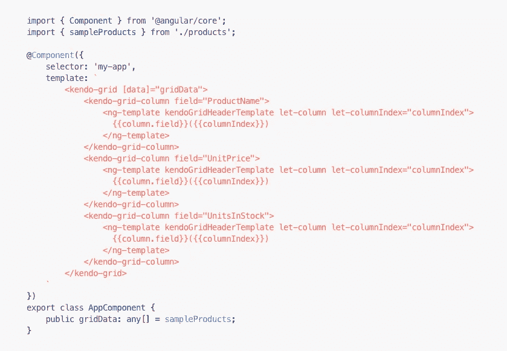

Angular、React 和 Vue 都使用基于伪 XML 字符串的模板。这些模板必须被解析，这是昂贵的。您可以在构建时这样做(例如，Svelte)，但是之后您就不能在构建时轻易修改它们了。这是可能的(如手动操作 JSX 输出)，但在这一点上不再一致使用。

模板混合了 dom 标记、循环、if 语句和变量。它们会降低你的工作效率(例如，限定范围)并限制你。

虽然这个话题肯定有争议，但 neo.mjs 摆脱了模板。相反，类似 JSON 的持久结构已经就位:

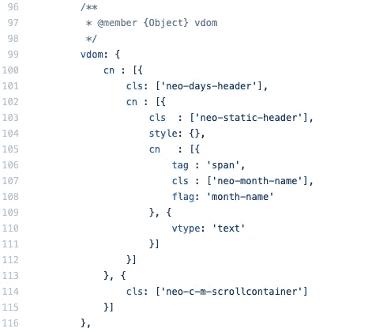

[https://github . com/neom js/neo/blob/dev/src/calendar/view/month component . mjs # L99](https://github.com/neomjs/neo/blob/dev/src/calendar/view/MonthComponent.mjs#L99)

类似 JSON 的意思是:嵌套的 JS 对象和数组，在整个组件生命周期中，您可以随意更改它们。它们不包含变量、if 语句或循环。

您可能同意 JavaScript 非常适合处理这些结构。

您永远不需要解析它们:

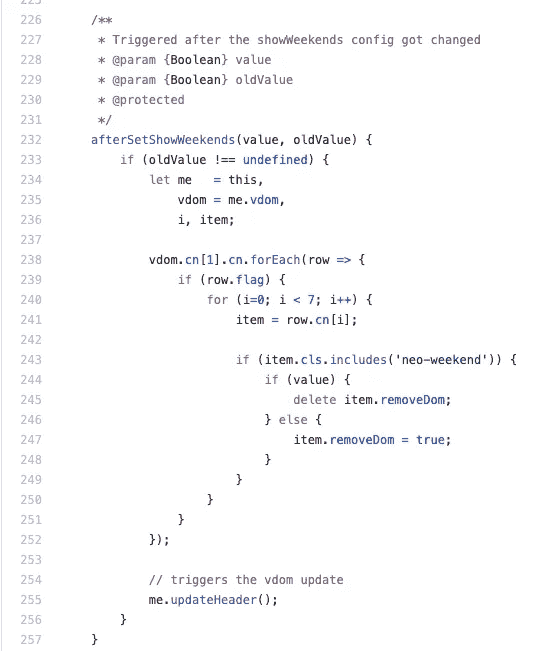

[https://github . com/neom js/neo/blob/dev/src/calendar/view/month component . mjs # L232](https://github.com/neomjs/neo/blob/dev/src/calendar/view/MonthComponent.mjs#L232)

将配置更改映射到`vdom`相当简单。您可以将标志添加到特定的节点，并使用`VdomUtil`来获取它们。

您可以向任何节点添加 removeDom 标志，这将从实际的 Dom 中删除节点(或树),同时保持您的`vdom`结构不变。

# 8.平均减少 80%以上的 DOM

我们刚刚提到的这个`removeDom`属性非常强大。我只是用它来增强卡片布局，默认情况下从 DOM 中移除所有不活动的卡片。

如果你愿意的话，你也可以通过配置来改变它。

虽然样式为`display:’none’`的节点将被排除在浏览器布局计算之外，但它们仍然存在。

移除它们会减少 DOM，从而大大减少主线程的内存占用。

这是进一步提高性能的简单方法。

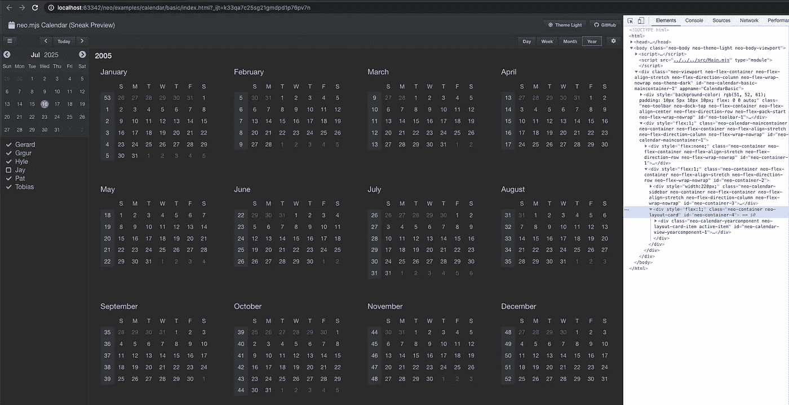

如您所见，日历有 4 个主要视图(日、周、月、年)，但只有一个在 DOM 中。

`SideBar`折叠后会被移除。

`SettingsContainer`折叠后将被移除。

设置包含一个有五个选项卡的`TabPanel`。在任何时候，DOM 中只有一个选项卡体。

所有视图的 JavaScript 实例仍然存在。您仍然可以将更改映射到虚拟 DOM，并在任何给定时间将其放回——如果您愿意，可以放在应用程序的不同位置。

您的状态将保持不变，这意味着，在这种情况下，我们可以更改视图的设置，视图不再位于 DOM 中。

# 9.直接在浏览器中编写 ES8+代码

看一下下面的截图:

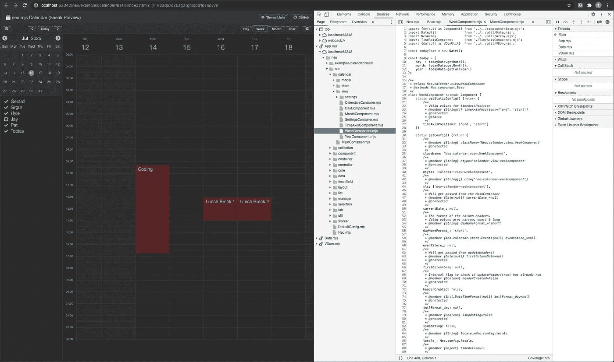

这里需要注意的重要事项是:

*   您可以看到线程(Main、App、Data、Vdom)。
*   WeekComponent.mjs 文件位于 App Worker 内部。
*   可以看到**真实的**代码(这不是源图)。
*   您可以看到定制类系统的增强:一个成熟的配置系统。

这带来了无与伦比的调试体验:

*   修改你的代码，重新加载浏览器，这就是了。
*   不需要构建或传输。
*   虽然 JavaScript 模块在所有主流浏览器中都得到完全支持，但在 Firefox 和 Safari 的 worker 范围内仍然不受支持。开发团队正在努力。
*   对于 neo.mjs，有基于 Webpack 的 dist 版本，在 Firefox 和 Safari 中运行良好。

重要的是，Chrome 完全支持它，所以你可以在那里使用 dev 模式，一旦它没有错误，在其他浏览器中测试 dist/development 版本。

# 10.获得开箱即用的应用程序文档

虽然许多库或框架都提供了 Docs 应用程序，但这个程序只提供框架文件的文档视图。

使用 neo.mjs，您还将获得您自己的应用程序相关代码的文档视图。您所需要做的就是向您的配置、方法和事件添加文档注释。

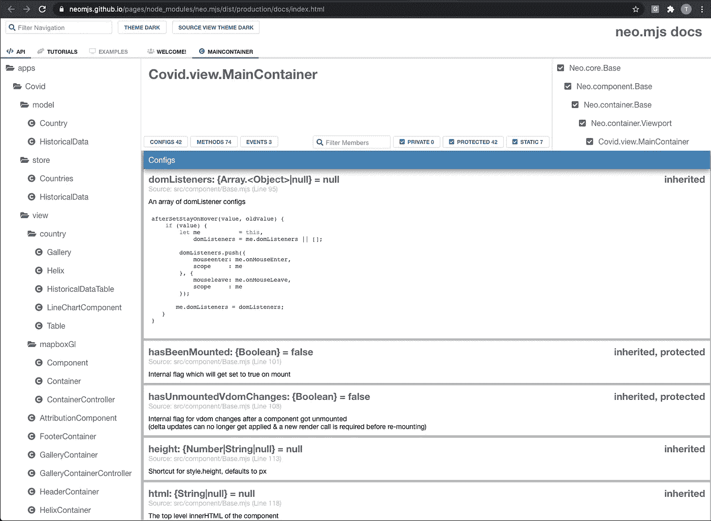

# 11.neo.mjs 是什么？

neo.mjs 是一个开源项目(整个代码库，以及所有示例和演示应用程序，都使用 MIT 许可证)。

网站应用程序:

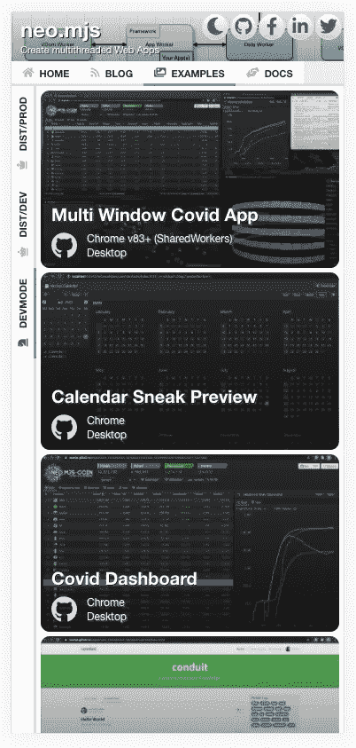 [## neo.mjs -网站

### 编辑描述

neomjs.github.io](https://neomjs.github.io/pages/node_modules/neo.mjs/dist/production/apps/website/index.html#mainview=home&childview=developers) 

存储库:

[](https://github.com/neomjs/neo) [## 近地天体

### neo.mjs 使您能够使用一个以上的 CPU 创建可扩展的高性能应用程序，而无需使用…

github.com](https://github.com/neomjs/neo) 

这意味着你可以免费使用它，它会一直这样。然而，这个项目需要更多的贡献者和赞助者。

路线图上还有更多项目和想法。

如果你想为一个了不起的开源项目做贡献，你会受到赞赏。

如果该项目对贵公司有或将会有商业价值，注册成为赞助商将允许我投入更多时间，从而加快新事物的交付时间。

# 12.如何达到速度？

学习 neo.mjs 最简单的方法可能是按照前两个教程从头开始创建 Covid Dashboard 应用程序。

[](https://medium.com/swlh/how-to-create-a-webworkers-driven-multithreading-app-part-1-fa0cc78a4237) [## 如何创建 webworkers 驱动的多线程应用程序—第 1 部分

### 内容

medium.com](https://medium.com/swlh/how-to-create-a-webworkers-driven-multithreading-app-part-1-fa0cc78a4237) [](https://medium.com/swlh/how-to-create-a-webworkers-driven-multithreading-app-part-2-3c5b3c2d1adb) [## 如何创建 webworkers 驱动的多线程应用程序—第 2 部分

### 内容

medium.com](https://medium.com/swlh/how-to-create-a-webworkers-driven-multithreading-app-part-2-3c5b3c2d1adb) 

# 12.接下来是什么？

现在，我正专注于 1.4 版本的新日历组件。目标是在 GMail 或原生 MacOS 日历之前，创建一个优秀的 UX。

你可以在这里看看目前的进展:

 [## neo.mjs 日历基础

### 编辑描述

neomjs.github.io](https://neomjs.github.io/pages/node_modules/neo.mjs/dist/production/examples/calendar/basic/index.html) 

作为下一步，我将进一步润色事件，然后从拖放实现开始。

一旦拖放到位，下一个项目是应用内对话框。我们必须能够抓住它们的头部来移动它们或者调整它们的大小。一个在不同浏览器窗口间移动对话框的演示是可能的，并且应该是惊人的。

一旦完成，我将进一步增强网格/表格的实现——更容易地访问列过滤、移动列、隐藏列等。

你绝对可以影响路线图！

请随意使用[问题跟踪器](https://github.com/neomjs/neo/issues)。感谢所有反馈！

最诚挚的问候和快乐的编码！