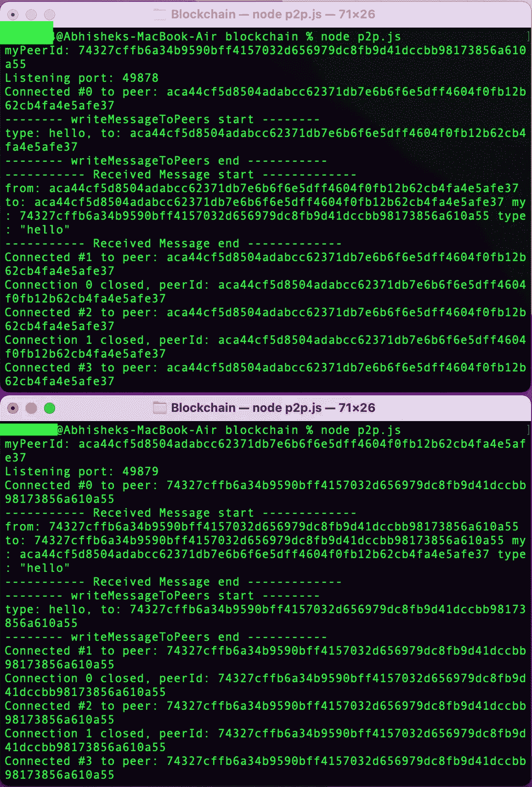
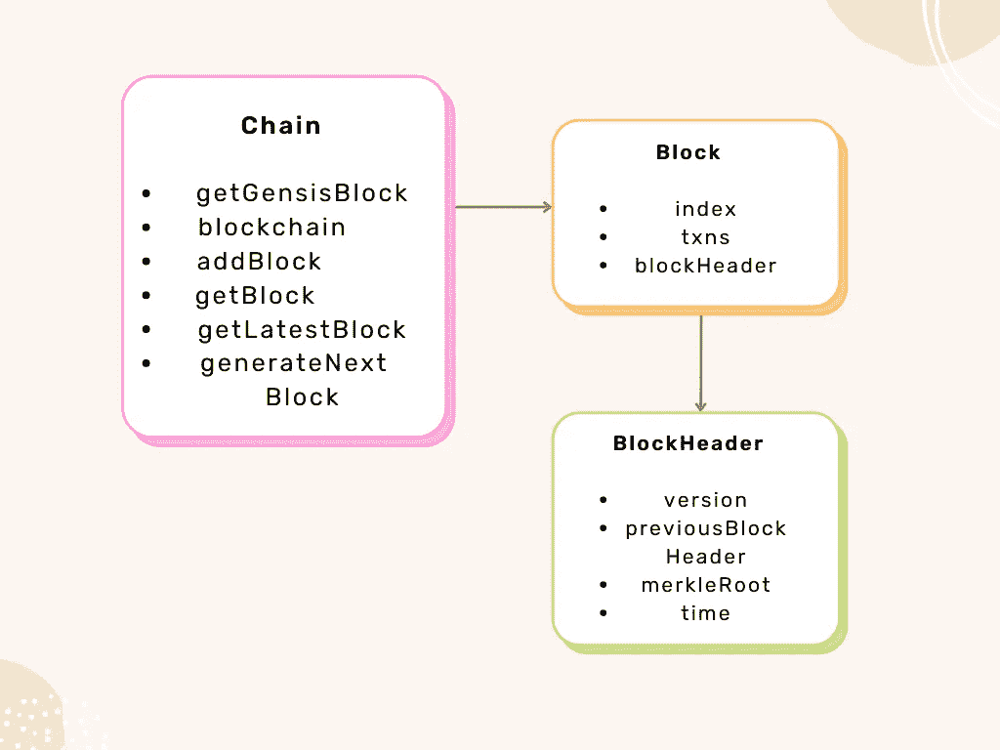
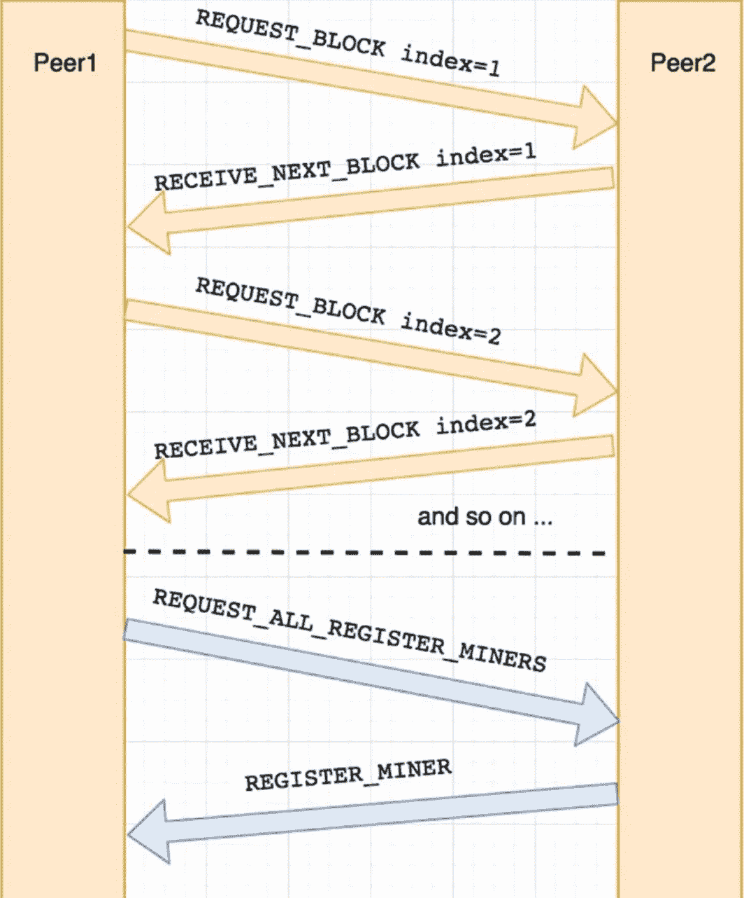
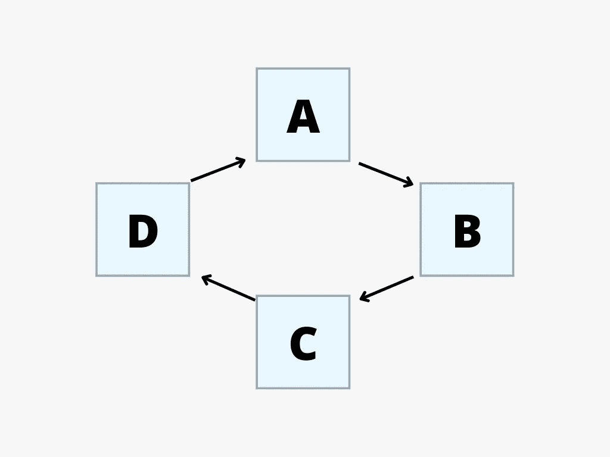
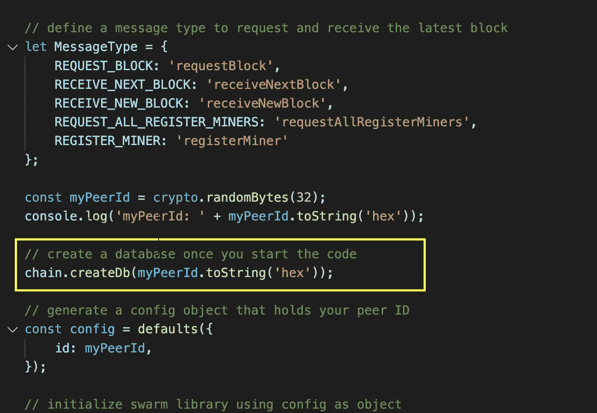
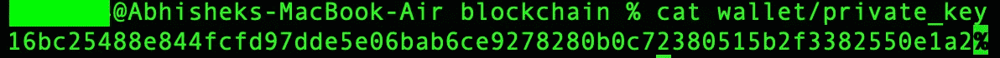
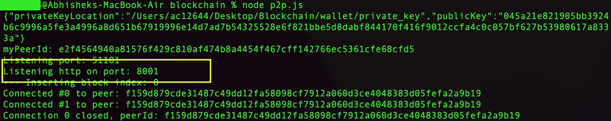
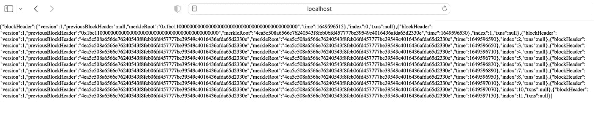
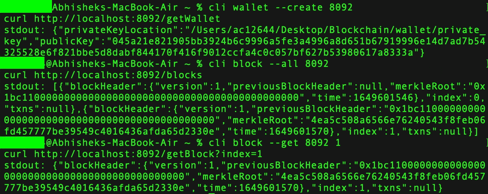

# 如何使用 Node.js 创建区块链:分步指南

> 原文：<https://betterprogramming.pub/create-blockchain-with-node-js-e65dfc40479e>

## 了解如何使用 Node.js 创建区块链对等网络。该分步指南涵盖了从创建基本 P2P 网络到设置名称-值数据库和创建 API 的所有内容。


图片来自 Unsplash

在本实用指南中，我们将探索使用 Node.js 创建全功能区块链原型背后的代码。我们的示例旨在让想要了解区块链技术的人易于理解。到本文结束时，您将对如何创建 P2P 网络、发送和接收块以及建立名称-值数据库有更好的理解。无论你是初学者还是有经验的开发者，本指南将帮助你掌握区块链技术的基础。

# 涵盖的主题

1.  创建一个基本的 P2P 网络
2.  发送和接收块
3.  注册矿工和创建新区块
4.  设置名称-值数据库，LevelDB
5.  创建公私钱包
6.  创建 API
7.  创建命令行界面

# 创建一个基本的 P2P 网络

对等网络是一种使用分布式体系结构的计算机网络。在这样的网络中，每个对等体或节点分担工作负载，并且与其他对等体平等，没有任何特权对等体。

让我们创建一个文件夹，命名为`Blockchain`。

您的代码需要找到并连接对等点，部署用于发现其他对等点的服务器，并获得可用的 TCP 端口。这是通过利用以下三个库来实现的:

*   `discovery-swarm`:用于使用发现信道连接到网络中的对等体
*   `dat-swarm-defaults`:部署帮助识别其他潜在对等体的服务器
*   `get-port`:检索可用的 TCP 端口

要安装这些库，请运行以下命令:

```
npm install crypto discovery-swarm dat-swarm-defaults get-port@5.1.1 --save
```

现在库已经安装好了，你需要创建一个文件并命名为`p2p.js`。在这个文件中，您需要编写以下代码。如果你愿意，你可以复制下面的代码。

p2p.js

打开两个终端窗口，并导航到资料库的位置。在两个终端窗口中，键入以下命令:

```
node p2p.js
```



输出 p2p

从上面的代码中可以看出，当您的机器发现网络上的其他对等机时，它会生成一个随机的对等机 ID 并选择一个随机的端口。这样，你就和其他用户连接到了一个 P2P 网络。发送和接收块

## 创建起源块和共享块

块对象在不同的区块链模型中有所不同；出于本教程的目的，您将使用一个类似于比特币网络中使用的 Block 对象。



阻塞流

块对象具有以下属性:

*   `index`:链中的第一个块称为 GenesisBlock，其索引为 0。
*   `txns`:这是块内的交易数据。你可以把它想象成你想要存储的任何类型的数据。

Block 对象包含 BlockHeader 对象，具有以下属性:

*   版本:block 有四个版本，genesis block 是 2009 年的版本 1。版本 2 是 2012 年的比特币核心 0.7.0 的软叉，而版本 3 块是 2015 年的比特币核心 0.10.0 的软叉。版本 4 块，是 2015 年比特币核心 0.11.2 中的 BIP65，是最新的。
*   前一个块头哈希:这是前一个块头的 SHA-256(安全哈希算法)哈希函数。它确保了前一个块不会被修改，因为这个块需要修改。
*   Merkle root hash:它是 Merkle 树中所有键值对的散列。对树进行哈希处理，使得每个键值对都是唯一的，并且使用整个哈希来标识树。
*   时间:这是矿工开始散列头部的 Unix 纪元时间。

如你所知，比特币有一个“困难”属性，矿工需要每 2016 块重新计算一次。记住这一点，您就不需要对 PoW 使用 nBits 和 nounce 参数。

*   nounce:它是矿工用来调整一个块的散列值，使它小于或等于当前目标值的数字。这个数字是 32 位或 4 个字节。
*   nBits:这是目标，是一个 256 位的数字，和难度成反比。每隔 2016 个块重新计算一次。

P2P 通信包括每个对等体从网络上的对等体请求最新的块，然后接收块请求。



P2P 通信请求最新块和接收最新块的流程图

现在您已经了解了 P2P 网络的工作原理，您已经准备好开始发送和请求块了。

## P2P 网络发送块

**设置块类和链库**

区块链需要两个文件:`block.js`和`chain.js`。`block.js`包含块类的代码，`chain.js`有与块交互的方法。至于 Block 对象，您将希望创建类似于比特币核心中的属性。如果你不确定 Block 和 BlockHeader 对象应该是什么样子，看看`block.js`。

block.js

如您所见，`chain.js`包含第一个块，它被称为 genesis 块。此外，该方法可用于接收整个区块链对象、添加新块或检索特定块。值得一提的是，为了节省 Unix 时间格式的时间，您需要安装`moment`库。这可以通过使用 npm 来实现。

```
npm install moment --save
```

现在创建`chain.js`:

链家网

现在我们有了一个包含在`chain.js`中的 block 对象，我们的库可以创建一个 genesis block 并向您的区块链对象添加一个 block。此外，我们将能够发送和请求块。要使用`p2p.js`中的`chain.js`，只需遵循以下步骤:

p2p.js

# 注册矿工和创建新区块

截至目前，我们有一个工作的 P2P 网络，我们可以连接网络内的对等点，创建一个 genesis 块，并交换块。

下一步是启用新块的生成。我们将采用利益证明(PoS)方法，通过这种方法，我们相信每个采矿者都会生成区块。每个对等体将注册为一个矿工，轮流开采区块。



您的区块链使用简单的 PoS 机制处理采矿

要每隔 X 分钟自动生成一个块，可以使用 Node.js cron 库。这个库类似于自动化任务的 Linux 库。要安装 cron 开源库，请运行以下命令:

```
npm install cron --save
```

在您的 p2p.js 文件中，您将创建两个变量:一个跟踪注册的矿工，另一个跟踪谁开采了最后一个区块。这将允许您将下一个块分配给下一个矿工。

```
let registeredMiners = [];
let lastBlockMinedBy = null;
```

您还将添加两种消息类型。

*   `REQUEST_ALL_REGISTER_MINERS`
*   `REGISTER_MINER`

```
let MessageType = { 
    REQUEST_BLOCK: ‘requestBlock’, 
    RECEIVE_NEXT_BLOCK: ‘receiveNextBlock’, 
    RECEIVE_NEW_BLOCK: ‘receiveNewBlock’,                        REQUEST_ALL_REGISTER_MINERS: ‘requestAllRegisterMiners’,
    REGISTER_MINER: ‘registerMiner’ 
};
```

在您将自己的同事注册为矿工之前，您需要请求网络中所有现有注册矿工的列表。这可以通过运行定时器每五秒更新一次你的矿工名单来实现。一旦有了所有现有矿工的列表，就可以在`*registeredMiners*`对象中添加自己的同伴作为矿工。

```
setTimeout(function(){ 
  writeMessageToPeers(MessageType.REQUEST_ALL_REGISTER_MINERS, null); 
}, 5000);
```

现在，它有了一个自动超时命令，可以指向一个处理程序来更新注册矿工的列表，你也可以自动执行一个命令来将你的同伴注册为矿工；

```
setTimeout(function(){ 
  registeredMiners.push(myPeerId.toString(‘hex’));
  console.log(‘ — — — — — Register my miner — — — — — — — ‘); 
  console.log(registeredMiners); 
  writeMessageToPeers(MessageType.REGISTER_MINER, registeredMiners); 
  console.log(‘ — — — — — Register my miner — — — — — — — ‘); 
}, 7000);
```

在 switch 命令中，修改代码，以便能够为关于矿工注册的传入消息设置处理程序。我们希望跟踪已注册的矿工，并在开采新的区块时处理消息。

```
case MessageType.REQUEST_ALL_REGISTER_MINERS: 
  console.log(‘ — — — — — -REQUEST_ALL_REGISTER_ MINERS — — — — — — — ‘ + message.to); 
  writeMessageToPeers(MessageType.REGISTER_MINER, registeredMiners);    
  registeredMiners = JSON.parse(JSON.stringify(message. data)); 
  console.log(‘ — — — — — -REQUEST_ALL_REGISTER_ MINERS — — — — — — — ‘ + message.to); 
break;
```

```
case MessageType.REGISTER_MINER: 
  console.log(‘ — — — — — -REGISTER_MINER — — — — — — — ‘ + message.to); 
  let miners = JSON.stringify(message.data); 
  registeredMiners = JSON.parse(miners);
  console.log(registeredMiners);  
  console.log('----------- REGISTER_MINER------------- ' + message.to);  
break;
```

一旦与 miner 的连接关闭或丢失，您还需要注销 miner。

```
console.log(`Connection ${seq} closed, peerId: ${peerId}`);
```

```
if (peers[peerId].seq === seq) { 
  delete peers[peerId]; 
  console.log('— — registeredMiners before: ' + JSON.stringify(registeredMiners)); 
    let index = registeredMiners.indexOf(peerId); 
    if (index > -1) 
        registeredMiners.splice(index, 1); 
        console.log('— — registeredMiners end: '+ 
        JSON.stringify(registeredMiners));
 } 
});
```

**矿山新区块**

与比特币每 10 分钟生成一个区块相反，你的区块链将得到改善，每 30 秒生成一个区块。为了实现这一点，您已经为 Node.js 安装了开源 cron 库。您可以利用 **cron** 库来设置再次调用相同代码的频率，这将用于每 30 秒调用您的矿工。

为此，首先在代码的 import 语句中把这个库包含在`p2p.js`文件的顶部。接下来，您设置一个每 30 秒运行一次的 cronjob，`job.start();`将启动该作业，

添加完以上所有功能后，你的`p2p.js`文件将会是这样的:

p2p.js

# 设置名称-值数据库，LevelDB

LevelDB 数据库以向上和向下的方式存储名称-值对。这是区块链网络的理想选择。事实上，比特币使用 LevelDB 不仅存储块信息，还存储交易信息。要使用它，请安装带有 npm 的`level`。

```
npm install level --save
```

接下来，创建一个保存数据库的目录。

```
mkdir db
```

现在可以实现数据库了。在`chain.js`中，添加一些代码来保存 LevelDB 数据库中的块。

链家网

最后，在您的`p2p.js`文件中，您需要做的就是在启动代码后创建一个数据库。

```
chain.createDb(myPeerId.toString(‘hex’));
```



在 p2p.js 中添加 createDb

# 创建公私钱包

在加密货币中，为了奖励矿工生成区块，以及创建和发送交易，钱包是必要的。在本节中，您将通过生成公钥和私钥的组合来创建一个钱包。这不仅可以验证用户，还允许您存储和检索用户拥有的数据。

您将使用一个椭圆曲线加密库实现来生成私钥-公钥组合。注意，椭圆曲线库使用 secp256k1 作为 ECDSA 曲线算法。要安装它，请运行以下命令:

```
npm i elliptic --save
```

创建一个新文件`wallet.js`并复制下面的代码，

接下来，创建一个 wallet 目录来存储私钥并运行脚本。该代码将初始化脚本并创建您的公钥。

```
mkdir wallet
node wallet.js
cat wallet/private_key
```



输出私钥

> 记住注释掉`wallet.js`的最后 32 到 34 行，因为在下一步中，您将创建一个 API 来通过浏览器创建您的密钥。

# 创建 API

下一步是创建一个应用程序接口(API ),以便能够访问您编写的代码。这是区块链的重要组成部分，因为它允许您使用 HTTP 服务访问您的区块和钱包或任何其他 P2P 网络操作。

您需要安装 express 和 body-parser。这些库将允许您创建服务器并在浏览器中显示页面。

```
npm install express body-parser — save
```

现在打开你的`p2p.js`文件并跟着做，

要调用您的服务，运行 P2P 网络，

```
node p2p.js
```



p2p.js 输出

现在，打开浏览器并调用 API，

```
[http://localhost:8001/b](http://localhost:8001/getWallet)locks
[http://localhost:8001/getB](http://localhost:8001/getWallet)lock
[http://localhost:8001/getD](http://localhost:8001/getWallet)BBlock
[http://localhost:8001/getWallet](http://localhost:8001/getWallet)
```



在浏览器中调用/阻止 API

# 创建命令行界面

对于本文的最后一步，您将创建一个命令行界面(CLI)。需要 CLI 来轻松访问您创建的服务。

接下来，安装您将用来运行 promises、运行 async 函数、向控制台添加颜色和存储 cookies 的库。

```
npm i babel-polyfill async update-notifier handlebars colors nopt --save
```

为命令创建一个新目录`cli`和另一个目录`cmds`

```
mkdir cli
cd cli
mkdir cmds
touch block.js help.js version.js wallet.js
```

在`block.js`中，您将设置两个命令:get 和 all，

block.js cli

如您所见，`wallet.js`将包含 get 和 all 方法，指向一个 curl 命令来运行 HTTP 服务调用，

wallet.js cli

同样，我们将为其他人做请遵循这个[链接](https://github.com/ac12644/Blockchain/tree/main/cli)。从给定的链接中复制代码。

现在，创建一个目录`bin`并添加`cli.js`，

既然已经设置了命令，就可以将 CLI 作为别名添加到 bash_profile 中，以便能够从任何路径位置运行 CLI。

```
nano .bash_profilealias cli='node /<location>/Blockchain/bin/cli.js'
```

按`ctrl+o`保存，按`ctrl+X`退出，然后运行 bash_profile，

```
. ~/.bash_profile
```

万岁！！我们的命令行界面准备好了😃，我们来测试一下，

```
node p2p.js
```

打开另一个终端并运行，

```
cli block --get [port] 1 
cli block –all [port] 
cli wallet --create [port]
```



cli 界面输出

## 祝贺👏我们创造了自己的区块链🔥🔥🔥🔥

# 摘要

在这篇文章中，我们介绍了如何创建自己的基本 P2P 区块链网络；您可以发送和接收消息，并在这些消息中包含块；您能够注册和注销矿工，并实现一个简单的 PoS 共识机制；您创建了新的块并在对等体之间发送它们；您还设置了一个名称-值 LevelDB 数据库来存储块；您继续创建了一个由私钥-公钥对组成的钱包。最后，您创建了通过 API 服务和 CLI 与 P2P 网络通信的方法。

```
**Want to Connect?**For the full code visit and if you like it, follow me on GitHub:
[https://github.com/ac12644/Blockchain](https://github.com/ac12644/Blockchain)
```

*感谢阅读！*

*同样检查:*

[](/implementing-smart-contracts-using-vyper-a-python-approach-95f9299e64d8) [## 使用 Vyper 实现智能合约——Python 方法

### 探索如何使用 Vyper 编程语言而不是 Solidity 编写智能合同

better 编程. pub](/implementing-smart-contracts-using-vyper-a-python-approach-95f9299e64d8)