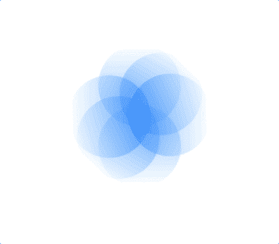
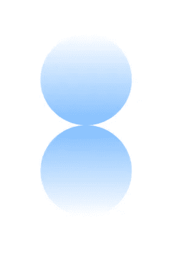
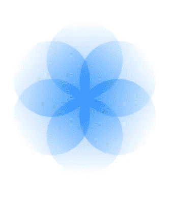

# 使用 SwiftUI 创建类似 Breathe 应用程序的动画

> 原文：<https://betterprogramming.pub/create-breathe-apps-animation-in-swift-6c0a10cb928a>

## 使用`offset`变化、`rotationEffect`和`scaleEffect`创建一个类似于呼吸应用的动画



Breathe App 的动画(转换成 GIF dint 很顺利，这就是为什么它是像素化的🥲)

# 实施分解

*   创建一组两个圆，一个具有+ve 偏移，一个具有-ve 偏移。*注意:偏置值必须等于圆的半径。* 添加一个状态变量来切换`Offset`、`rotationEffect`和`scaleEffect`
*   用相同的偏移值再次创建另外两组 2 个圆，并添加一个度数为 60 的增量乘数`rotationEffect`
*   给每个圆形集合添加一个`scaleEffect`修改器
*   切换自动反转动画块中的状态变量

# 创建圆集

我们将从主视图 ZStack 开始，在这个 ZStack 中，我们将创建两个圆，一个有+ve 偏移，一个有-ve 偏移。我们还将添加一个状态变量`stateAnimation`，用于切换`Offset`、`rotationEffect`和`scaleEffect`。

我们将用蓝色和白色混合的线性渐变填充这个圆。相同的`startPoint`和`endPoint`依次为`.top`、`.bottom`，第一圈和第二圈依次为`.bottom`、`.top`。

为了更好的外观和感觉，我们还将子 ZStack 的不透明度更改为 0.5。

此时，代码将如下所示



进展 1

# 更多位于不同角度的圆组

我们将添加 2 个额外的圆，使交叉点看起来像一朵有 6 个花瓣的花。为此，我们将使用一个 ForEach 并迭代 2 次，给它一个`rotationEffect`，它是每次迭代的乘数 60。
我们还将使用我们的状态变量将`rotationEffect`从当前角度切换回其重置的 0 度角度，使其看起来如下所示。



进展 2

此时，代码将如下所示

从上面的代码中，您可以看到我们将迭代值乘以 60 度。所以在第一次迭代中，角度将是`0 * 60 = 0`，第二个`1*60 = 60`，第三个`2*60 = 120`

# 添加缩放效果

为了让这个应用看起来更生动，我们将缩小它，然后用动画放大。为此，我们将简单地使用`scaleEffect`一个修饰符，它的值将再次在状态变量的帮助下切换。我们将从尺寸 0.2 缩放到尺寸 1(初始帧尺寸)。

```
.scaleEffect(startAnimation ? 1 : 0.2)
```

我们将使用上面的代码将`scaleEffect`修饰符添加到我们的圆形集合堆栈中。

# 设置动画

我们将在`onAppear`修改器中制作整体动画。我们将添加`onAppear`修改器，并在`onAppear`修改器中添加带有属性的`withAnimation`块

```
animationtype = easeInOut 
repeat forever 
autoreverse = true 
speed = 0.1
```

一旦设置了`withAnimation`块，我们将添加代码来切换我们已经创建的状态变量，如下行代码所示。

```
startAnimation.toggle()
```

现在，每一秒钟，我们都会触发`startAnimation`。并且随着`startAnimation`值的改变，其他修改器的值也将改变。

您可以在下面找到最终代码:

最终的动画将如下所示:


最终动画

我希望你明白我们如何使用`rotationEffect, offset and scaleEffect`来创建一个类似于 Breathe App 的动画。

感谢阅读。