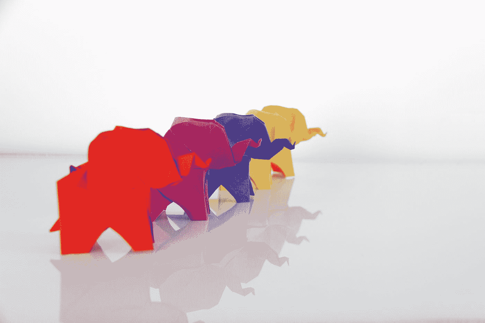
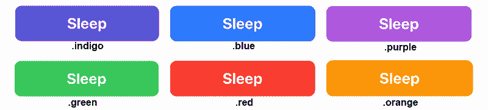
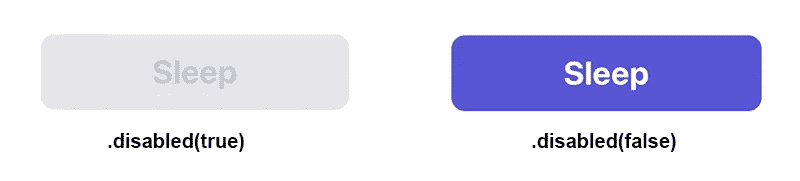

# 在 SwiftUI 中创建自定义按钮样式

> 原文：<https://betterprogramming.pub/create-custom-button-styles-in-swiftui-f3778f695266>

## 通过定制、压制和加载。

由 [Katrin Hauf](https://unsplash.com/@trine?utm_source=medium&utm_medium=referral) 在 [Unsplash](https://unsplash.com?utm_source=medium&utm_medium=referral) 上拍摄的照片

# **1。简单按钮样式**

为您的按钮样式创建一个新的 Swift 文件。以`{style-name}ButtonStyle.swift`结尾来命名文件是一个很好的习惯。

在这种情况下，我们将其命名为`BigButtonStyle.swift`。

添加一个符合`ButtonStyle`协议的结构。此协议只要求您在结构中包含以下方法。

`func makeBody(configuration: Configuration) -> some View`

这是代码。

简单 BigButtonStyle

我喜欢看到我正在做的东西，所以如果你也这样做，我强烈建议在你的文件底部添加这个预览代码并打开画布。

# 2.自定义按钮样式

完美，我们现在有了一个好看的按钮，但是，它非常单调和不灵活——我们不能改变颜色和字体。我们唯一能改变的是它的内容。让我们解决这个问题。

在我们的`BigButtonStyle`的开头添加一个`color`属性，并用`.background(color)`替换`.background(Color.indigo)`修饰符。

带有自定义的 BigButtonStyle

现在，您可以通过用所需的按钮颜色初始化样式来为您的`BigButtonStyle`使用自定义颜色。

`.buttonStyle(BigButtonStyle(color: .green)`

# 3.按下按钮样式

好的，太好了！你现在有了一个自定义的按钮样式和自定义的颜色，但是有点糟糕。如果你运行预览，你很快就会注意到，当你按下它时，它不会给你任何反馈。它只是一个静态按钮。

当使用苹果的原生按钮风格时，当按下按钮时，你会得到一个淡淡的覆盖，告诉你这一点；按钮被按下了。所以让我们为我们的客户`BigButtonStyle`编写代码。

在底部添加`.overlay`修改器，如果按钮被按下，它会覆盖一个白色透明的彩色视图。

带按的 BigButtonStyle

# 4.禁用按钮样式

现在，经常希望通过使用`.disable(true)`修改器来禁用按钮。现在，不可能区分启用和禁用的按钮，因为它们看起来一样。

我们现在将使用`isEnabled`环境变量来获取该信息。

在颜色属性后添加`@Environment(\.isEnabled) private var isEnabled: Bool`。这个环境变量让我们知道按钮是启用还是禁用。

现在，我们将尝试复制苹果的默认禁用按钮设计。为此，我们将只改变按钮被禁用时的`foregroundColor`和`background`修饰符来“灰显”。

在每个属性中，添加三元运算符以获得相应的颜色。更新代码以包括

`.foregroundColor(isEnabled ? .white : Color(UIColor.systemGray3))`

和

`.background(isEnabled ? color : Color(UIColor.systemGray5))`

下面是完整的例子:

禁用 BigButtonStyle

感谢阅读；我希望这篇文章是有用的。