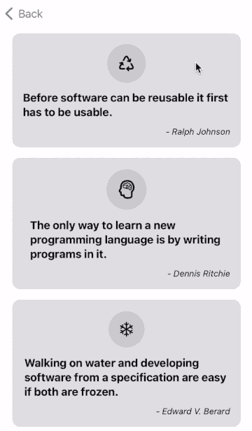
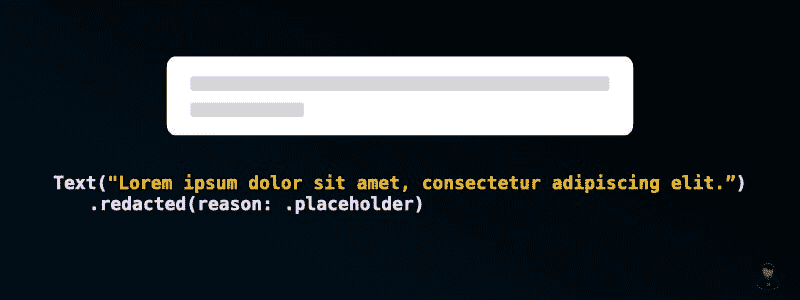
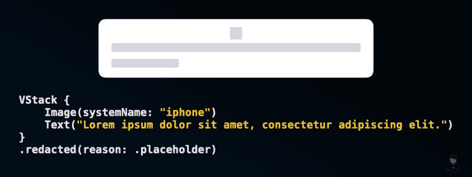

# 使用 UIHostingConfiguration 创建带有占位符 UI 的自定义单元格

> 原文：<https://betterprogramming.pub/create-custom-cell-with-placeholder-ui-using-uihostingconfiguration-18080a13da06>

## 这比你想象的要容易

在 iOS 16 之前，拥有一个在等待数据加载时显示占位符单元格的集合视图或表格视图，实现起来有些麻烦。我们必须定义 2 个独立的自定义单元格(占位符单元格和实际单元格)，并根据应用程序的加载状态手动处理 UI 逻辑。

随着 iOS 16 中`UIHostingConfiguration`的引入，事情变得简单多了。不再需要创建两个单独的定制单元，并且由于 SwiftUI 中的一个视图修改器，实现变得更加简单。

有兴趣了解更多信息吗？请继续阅读！

# 示例应用程序

下面是我们将在本文中创建的示例应用程序。这是一个显示鼓舞人心的编程报价列表的应用程序:

示例应用程序

如您所见，在等待加载完成时，应用程序将使用占位符单元格填充集合视图。

如前所述，实现这种行为不再需要 2 个单独的自定义单元格。我们现在可以利用 SwiftUI 中的`redacted(reason:)`修饰符来帮助我们生成自定义单元格的占位符 UI。

让我告诉你怎么做。

# 使用“修订(原因:)”修饰符

`redacted(reason:)`修饰符是一个 SwiftUI 视图修饰符，它允许我们基于给定的原因对视图应用修订。例如，如果我们将密文应用于文本视图，我们将得到以下输出:

具有密文效果的文本视图

请注意，密文效果是基于视图的内容生成的。如果文本视图显示空字符串，则看不到任何密文效果。

最重要的是，对父视图应用编校将影响整个视图层次结构。这意味着如果我们在`VStack`或`HStack`上使用`redacted(reason:)`修饰符，所有的子视图将获得相同的编校效果。

具有密文效果的 VStack

就个人而言，我更希望有一个视图修改器，允许我使用布尔值来打开/关闭单元格的占位符 UI。因此，让我们继续创建它。

这样，我们现在可以启用单元格的占位符 UI，如下所示:

# 用占位符 UI 实现自定义单元格

通过使用我们刚刚创建的视图修改器，我们可以为示例应用程序实现一个自定义单元格，如下所示:

上面的代码没有什么花哨的地方。这只是一个基本的 SwiftUI 视图。view `isLoading`属性负责单元格的 UI 状态。当`isLoading`为`true`时，单元格将显示其占位符 UI。

# 显示单元格的占位符用户界面

定制单元格就位后，我们现在可以继续在集合视图上显示单元格。为此，我们需要一个数组来控制集合视图的内容，还需要一个布尔值来指示视图控制器的当前加载状态。

我们将在单元格注册期间将视图控制器的`isLoading`属性传递给`QuoteCell`,这样我们就可以控制何时显示单元格的占位符 UI。

当用户触发拉刷新动作时，我们将用一组硬编码的伪数据填充`collectionViewData`，并将`isLoading`设置为`true`。因此，视图控制器将用占位符单元格填充集合视图。然后，我们将开始从数据提供者获取数据。一旦收到实际数据，我们将用实际数据替换虚拟数据，并将它们显示在屏幕上。

这里使用的`DataProvider`只是一个结构，作为一个假的远程服务器，用于演示目的。它看起来是这样的:

至此，我们已经成功地实现了一个支持占位符 UI 的定制单元格。你可以在这里获得完整的示例代码[。](https://github.com/LeeKahSeng/SwiftSenpai-UICollectionView-SwiftUI)

我希望这篇文章对你有所帮助。如果您喜欢这篇文章，并希望在新文章发布时得到通知，请随时关注我的 [Twitter](https://twitter.com/Lee_Kah_Seng) 。

感谢阅读。