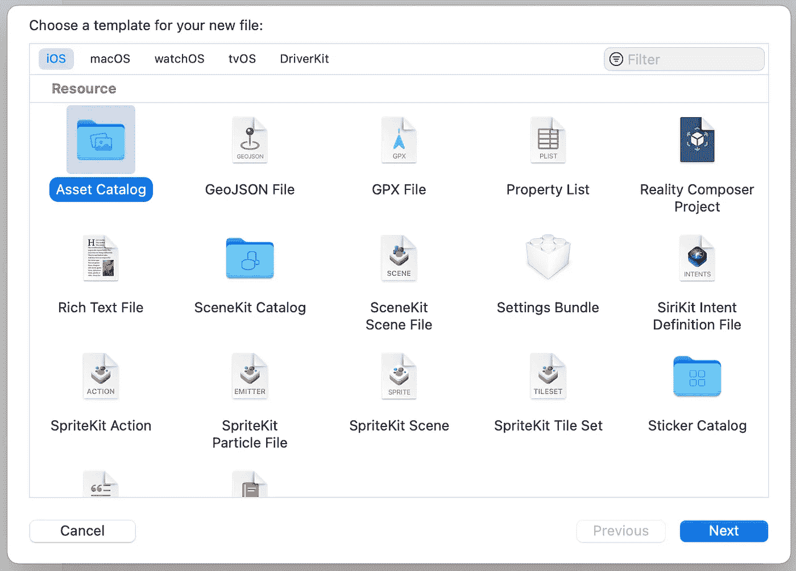
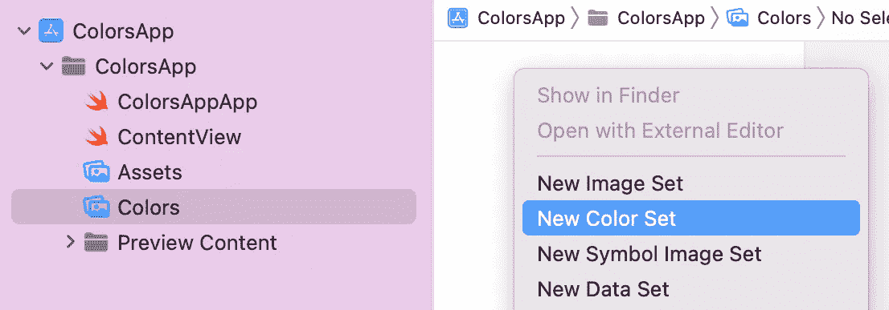
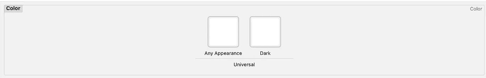
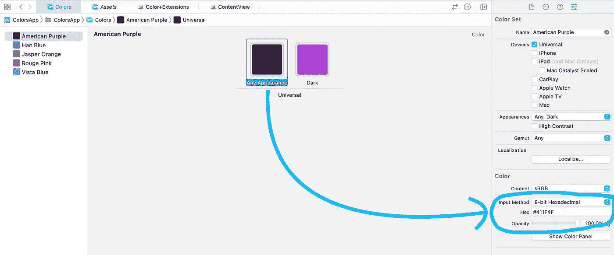
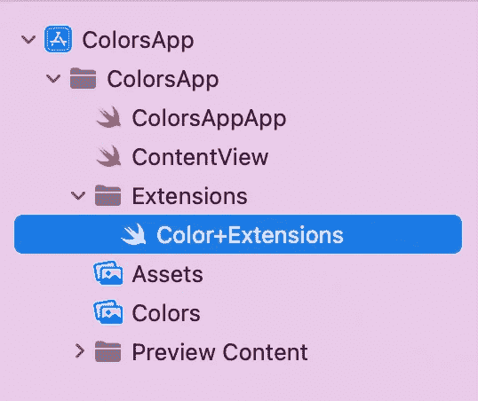
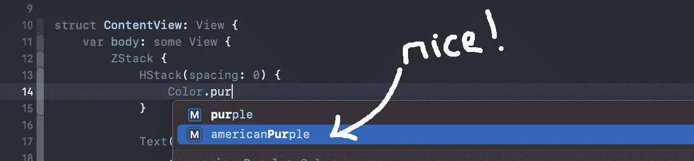
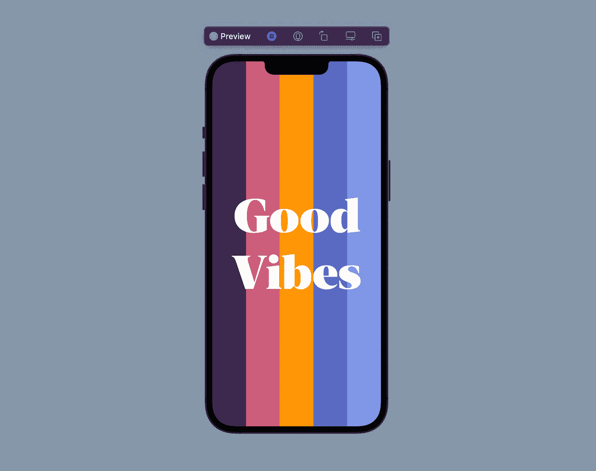

# 在 SwiftUI 中创建自定义调色板

> 原文：<https://betterprogramming.pub/create-custom-color-palettes-in-swiftui-f6f0abe7c828>

## 构建令人愉快的用户界面

Sharon McCutcheon 在 [Unsplash](https://unsplash.com?utm_source=medium&utm_medium=referral) 上拍摄的照片

SwiftUI 中的颜色管理很简单。在这个简短的教程中，我们将介绍一些在项目中使用自定义调色板的方法。

# 创建您的调色板

创建新项目时，您会注意到已经有一个现有的`Asset Catalog`，它包含一个空的强调颜色和应用程序图标。

*注意:如果你不想使用苹果的系统蓝作为应用程序的默认色调，请随意添加自定义强调颜色。*

我尽可能保持我的项目的整洁，因为这个原因，我喜欢将我的资产目录分成不同的类别；在这种情况下，我们将为我们的颜色创建一个新的`Asset Catalog`。

创建一个`Asset Catalog`类型的新文件，你可以随意命名。我选“颜色”这个精致的名字。

在你的颜色`Assets Catalog`中添加一个新的`Color Set`。对于`Color Set`命名约定，我喜欢使用大写的描述，因为这样更容易从 de `Assets Catalog`中读出。

*举例:*“卡其色”、“深红色”、“淡黄色”等。

你会注意到有两个空白方块代表`Color Set`；**任何外表**和**阴暗**。

为**任意外观**正方形设置一种颜色。这是你的应用程序将默认使用的实际颜色。如果您喜欢使用十六进制颜色，您可以在检查器中更改输入法。

或者，如果您想在应用程序处于黑暗模式时使用自定义颜色，您可以为**深色**空白方块设置颜色。

## 添加颜色扩展

在名为`Color+Extensions.swift`的新 Swift 文件中创建一个名为 Extensions 的新文件夹。当您想要添加类扩展时，遵循这个项目结构是一个很好的实践。

在文件内部，我们将为我们在`Assets Catalog`中创建的所有颜色创建静态常量，作为对`Color`类的扩展。

用每种颜色的`Color Set`名初始化颜色类。

可选地，如果你不想使用`Assets Catalog`来管理你的颜色，你可以使用编程的方法。我推荐使用 [uicolor.io](https://www.uicolor.io/) 将你的十六进制颜色转换成 uicolor，或者值为 1 的颜色。

颜色的可选编程方法

通过创建这些静态常量，我们可以利用**自动完成**和**自定义颜色**。

# 最终视图

我创建了这个最终视图来展示我们现在完成的自定义调色板！

前一个视图的代码

这个简短的教程到此结束。希望你能在以后的项目中用到所学。