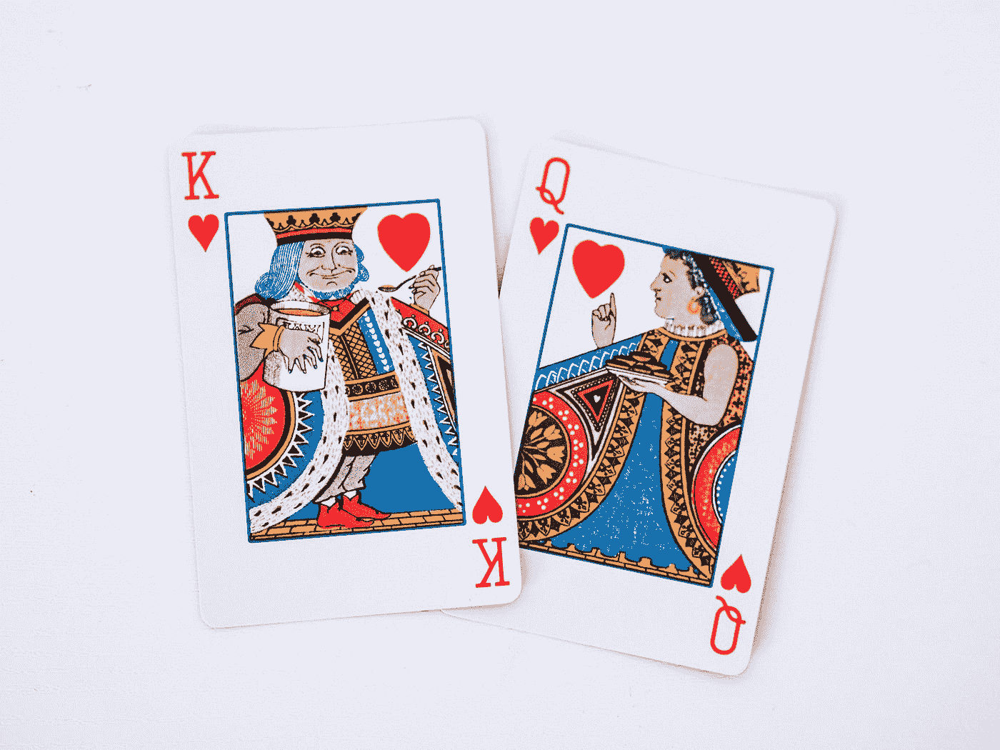
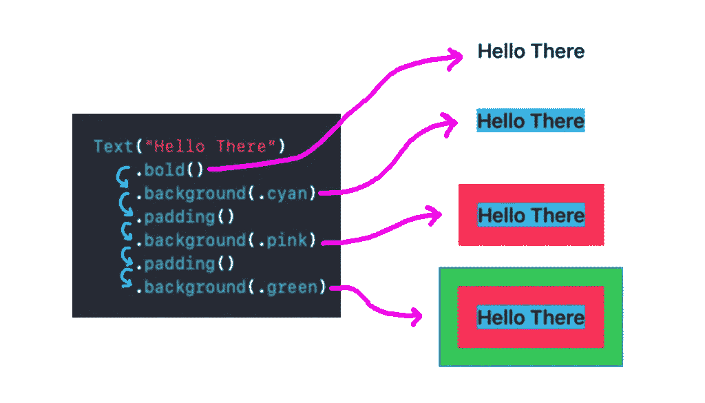
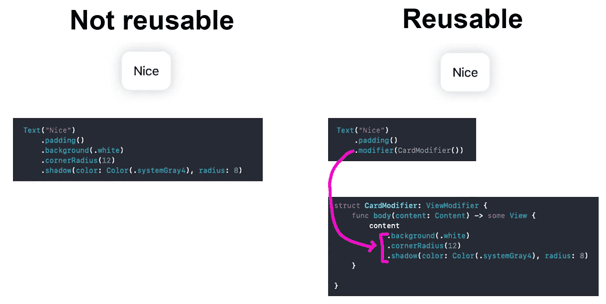
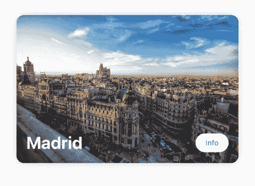
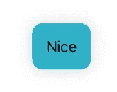

# 在 SwiftUI 中创建自定义视图修改器

> 原文：<https://betterprogramming.pub/create-custom-view-modifiers-in-swiftui-79d73d1691b>

## 带参数和扩展名

照片由[丽莎·普尔](https://unsplash.com/@pooorliza?utm_source=medium&utm_medium=referral)在 [Unsplash](https://unsplash.com?utm_source=medium&utm_medium=referral) 上拍摄

# 什么是视图修改器？

可以应用于一个`View`或另一个`ViewModifier`的修改器。

视图修改器实质上产生了原始视图的另一个版本(每次应用修改器时都会返回一个新版本的视图)。

这使得向单个视图添加多种填充和背景颜色成为可能。

视图修改器链示例

让我们创造自己的习俗`ViewModifier`。

# 创建卡片视图修改器

我们将创建一个自定义的`ViewModifier`，通过添加 3 个现有的修改器(背景、圆角半径和阴影)来制作一个类似`View`的卡片。

我们定制 CardModifier 的最终产品

创建一组`Modifiers`并添加一个名为`CardModifier.swift`的新 Swift 文件:

您可以在这里包含所有的修改器

我们需要创建一个符合`ViewModifier`协议的`struct`。这个协议确保`struct`包含一个函数`body()`，这个函数允许我们使用`struct`作为视图的修饰符。

`body()`函数接收`Content`(被修改的视图)然后我们修改它(添加圆角半径、阴影等)。)并归还。

以下是`CardModifier`的代码:

要使用我们新创建的`CardModifier`，添加`.modifier()`修饰符(很抱歉冗余)并初始化内部结构。

简单视图示例

`.modifier()`所做的是应用在`CardModifier`中定义的所有修改器并返回新视图。这就好像我们在这里添加了它们，但是每次都不需要输入代码！

> 如果要在不同的视图中使用同一组修改器，请使用自定义视图修改器。

我们拥有世界上所有的灵活性。我们可以构建更复杂的视图，并同样应用`CardModifier`。

复杂视图示例

# 添加参数

我们可以通过添加参数使我们的自定义视图修改器更加灵活。

向我们现有的`CardModifier`添加一个`backgroundColor`属性。默认为白色(如果没有指定背景色)。

带有自定义背景色的 CardModifier

我们现在可以选择为我们的`CardModifier`设置一个自定义的背景颜色。

# 简化访问

为您的自定义视图修饰符使用自动完成不是很好吗？

就这么办吧。

为`Extensions`创建一个组，并添加一个名为`View+Extensions.swift`的新 Swift 文件

我们将创建一个修改器`.card()`，使用*可选的*背景色作为参数。

添加以下代码:

我们现在可以使用`.card()`来使用我们的`CardModifier`。

我们都完了！现在，您知道了如何创建自定义视图修改器。自定义视图修改器允许我们在整个应用程序中重用一组其他修改器。

希望你学到了一些东西。请继续关注更多像这样的小教程！