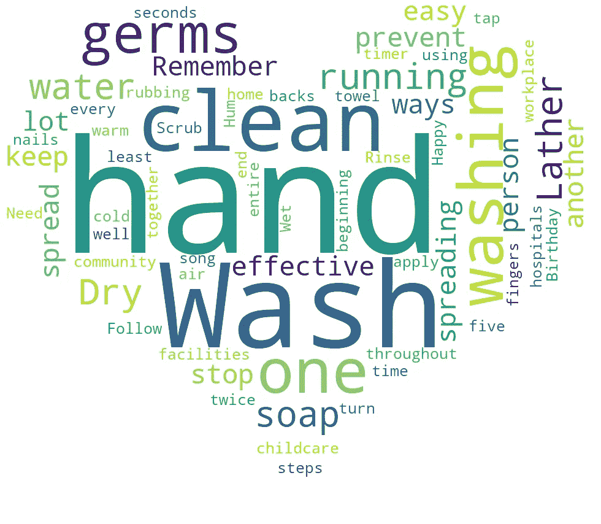
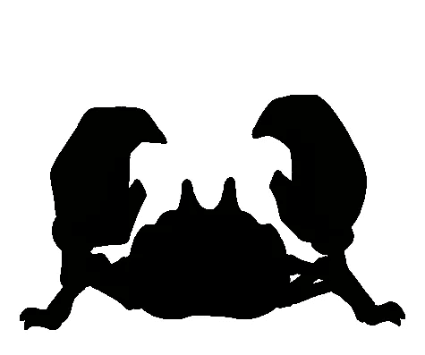
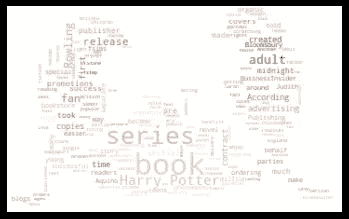
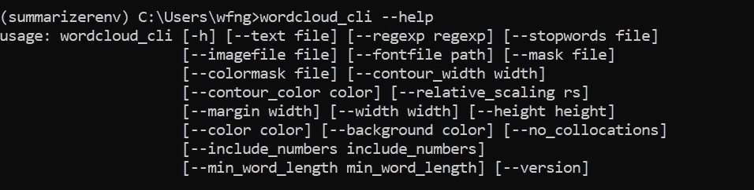

# 在 Python 中创建自定义单词云

> 原文：<https://betterprogramming.pub/create-custom-word-clouds-in-python-841563933e73>

一种创造性的方式来可视化您的数据并向每个人发送正确的信息



通过阅读本文，您将学会用 Python 创建自己的单词云。我们将使用一个叫做`wordcloud`的简单易用的模块。根据官方文档，该模块具有以下优点:

*   填满所有可用空间
*   能够使用任意的遮罩
*   具有简单而有效的算法，可以容易地修改
*   使用 Python

这篇文章分为五个部分:

1.  设置
2.  基本用法
3.  例子
4.  命令行
5.  结论

让我们开始吧。

# 1.设置

您可以通过`pip install`轻松安装模块。强烈建议您在运行安装之前创建一个虚拟环境。

```
pip install wordcloud
```

对于 Anaconda 用户，你可以直接从`conda-forge`安装。

```
conda install -c conda-forge wordcloud
```

您还需要以下依赖项。请检查您是否安装了它们。

*   NumPy
*   枕头
*   Matplotlib

让我们进入下一部分，启动您的项目。

# 2.基本用法

首先，让我们导入必要的模块。

```
from wordcloud import WordCloud, ImageColorGenerator
import matplotlib.pyplot as plt
from PIL import Image
import numpy as np
```

*   `WordCloud` —生成单词云图像的基类
*   `ImageColorGenerator` —对单词云图像中的单词重新着色的基类

我们需要几个句子的文本作为单词 cloud 的输入。在本教程中，我将使用下面的文本作为示例输入，但是您可以随意使用您喜欢的任何文本。

```
The Harry Potter series, written by J.K. Rowling, is perhaps the most popular set of novels of the modern era. With seven books and many blockbuster films to its name, the series has amassed about 15 billion dollars in sales. How did this phenomenon become what it is? For those scratching their heads, the reason can be broken down into several areas: Rowling garnered a generous initial contract for her book, separate book covers were created for both teens and adults, midnight releases/promotions/pre-orders made the public more fanatic about the series, and fan blogs were rampant. In fact, these are just a few of the main reasons why the Harry Potter took off the way it did.\n\nThe first book in the series, “Harry Potter and the Philosopher’s Stone,” was rejected 12 times before it was picked up by Bloomsbury—a small publisher in England. At the time, Rowling was living on benefits as a single mother, so receiving this contract was her first step to success. However, getting a book contract does not ensure the success of a book. The story was adored by children and adults alike, and this had much to do with the popularity of the initial book and the series as a whole (Rappaport, Sarah).\n\nIn light of this, her publisher made separate covers for young readers and adults. According to BusinessInsider.com, “Adults love reading the Harry Potter books, but few want to be seen toting around a child’s book. To make it easier for adults, Bloomsbury Publishing, the British publishing house that first bought the rights to Rowling’s books, published a second version of the books with “adult” (i.e., less colorful and more boring) book covers” (Aquino, Judith). This made it easier for a full range of ages to enjoy the series. This is not an easy feat for young adult fiction.\n\nAnother factor that worked like a charm was that when the Harry Potter series became an obvious success, the publisher, and Rowling herself through her own website for the books, conducted midnight releases, special promotions, and pre-ordering to engage readers even more. According to BusinessInsider.com, “Starting with the fourth book, Harry Potter and the Goblet of Fire, crowds of people wearing black robes, ties and round-frame glasses began showing up at bookstores for midnight release parties in 2000\. Customers who feared their local bookstore would run out of copies responded by pre-ordering over 700,000 copies prior to the July 8, 2000 release date, according to Gunelius. The seventh and final book in the Harry Potter series became the fastest-selling book in history, reports The New York Times, with more than 11 million copies sold during the first 24 hours in three markets alone” (Aquino, Judith). The fandom around the books created more lucrative opportunities for the series.\n\nAlso, based on fans, blogs were created that were dedicated to the story, details, plot, characters, and much more about the series. In the beginning, Rowling did not have too much in the way of advertising, and the fans did a lot of work for her. According to HubSpot, “The fans took over and created many viral campaigns on her behalf talking about the excitement they had over upcoming releases. Harry Potter is often a trending topic on Twitter, Facebook events and page are abundant and thousands of bloggers create posts on their behalf. These promotions are more genuine because they come from the source, the fans, instead of the person who makes a profit” (Leist, Rachel). This organic advertising propelled the Harry Potter novel series into being the most successful one ever.\n\nNow that Rowling has sold millions of copies of her Harry Potter books and has seen each one adapted into films, merchandise, fan art, and more, we can safely say that this series is a global phenomenon. Through an initial contract, advertising for both teens and adults, special releases and parties, and organic advertising from fans via the internet, Harry Potter and his universe took over as the most successful bestselling book of all time. \n
```

将其保存在文本文件中。在这种情况下，我将其命名为`example.txt`。编写下面的代码来读取文本并将其存储到一个变量中。

```
text = ""
with open('example.txt', encoding='utf-8') as f:
    text = ''.join(f.readlines())
```

接下来，我们将创建并初始化一个`WordCloud`对象

```
wc = WordCloud()
```

它接受相当多的参数，但最常用的如下:

*   `font_path` —将要使用的字体的字体路径(OTF 或 TTF)。默认为 Linux 机器上的`DroidSansMono`路径。如果你在另一个操作系统上或者没有这个字体，你需要调整这个路径。
*   `width` —画布的宽度。默认值为`400`。
*   `height` —画布的高度。默认值为`200`。
*   `max_words` —允许的最大字数。默认为`200`。
*   `background_color` —文字云图像的背景色。默认为`black`。
*   `mask` —输入要用作蒙版的图像

一旦创建了一个`WordCloud`对象，就可以调用内置的`generate`函数来生成单词云。我们将传入文本变量作为函数的输入。

```
wc.generate(text)
```

您可以选择将其保存在图像文件中。

```
wc.to_file('output.png')
```

也可以通过 Matplotlib 中的函数在 Jupyter Notebook 中显示。

```
plt.imshow(wc, interpolation='bilinear')
plt.axis("off")
plt.show()
```

您应该会看到下图:


作者图片

让我们将`max_font_size`设置为不同的值。

```
wc = WordCloud(max_font_size=40).generate(text)plt.imshow(wc, interpolation='bilinear')
plt.axis("off")
plt.show()
```

结果如下:


作者图片

**注意:**文本的排列不是固定的，每次运行时会略有不同。这就是你需要编写代码来创建自己的自定义单词云的全部内容。请继续下一部分，查看一些使用案例示例。

# 3.例子

在这一部分，我们将深入探索可用的功能和其他用例。

## 掩蔽词云

您可以将带有白色背景的黑色矢量图像作为蒙版传递给`WordCloud`对象。它将用于屏蔽和限制黑色边界内的文本。我将使用下面的图片。



作者图片

使用 Pillow 模块打开图像并将其转换为 NumPy 数组。记得将背景颜色设置为白色，这样可以更好地可视化。

```
custom_mask = np.array(Image.open("krabby.png"))
wc = WordCloud(background_color="white", mask=custom_mask)
wc.generate(text)plt.imshow(wc, interpolation='bilinear')
plt.axis("off")
plt.show()
```

以下结果将输出到控制台。


作者图片

您可以添加轮廓作为单词云的笔画或边框。修改第二行以包含以下参数:

```
wc = WordCloud(background_color="white", mask=custom_mask, contour_width=3, contour_color='steelblue')
```

*   `contour_width` —如果`mask`不是`None`且`contour_width` >为 0，则绘制掩膜轮廓
*   `contour_color` — `mask`轮廓颜色

运行代码后，您应该会看到下面的输出。


作者图片

## 图像彩色单词云

如果您想使用蒙版图像的颜色来突出显示文本，您可以通过重新着色功能来实现。让我们用下图来测试一下。


图片取自[链接](https://pokemondb.net/pokedex/krabby)

可以重用前面的代码，再添加两行代码。

```
custom_mask = np.array(Image.open("colored_krabby.png"))
wc = WordCloud(background_color="white", mask=custom_mask)
wc.generate(text)image_colors = ImageColorGenerator(custom_mask)
wc.recolor(color_func=image_colors)plt.imshow(wc, interpolation='bilinear')
plt.axis("off")
plt.show()
```

最终结果如下。



作者图片

## 基于频率的词云

如果数据集是字典的形式，而不是一大块文本，建议调用`generate_from_frequencies`函数。

然而，与最初的`generate`函数不同，停止词不会从最终结果中消除。因此，在将字典作为输入参数传递之前，您应该自己手动删除它们。

最初的教程基于一个`multidict`模块，但是我将只使用现成的`Counter`模块来创建频率字典。

导入以下模块:

```
import re
from collections import Counter
```

让我们再次阅读文本，并将结果转换为一个`Counter`对象。

```
words = re.findall(r'\w+', open('example.txt', encoding='utf-8').read().lower())
words_counter = Counter(words)
```

创建一个`WordCloud`对象，并调用 g `enerate_from_frequencies`函数。

```
wc = WordCloud(background_color="white", mask=custom_mask)
wc.generate_from_frequencies(words_counter)plt.imshow(wc, interpolation="bilinear")
plt.axis("off")
plt.show()
```

您应该会看到以下输出。


作者图片

# 4.命令行

该模块还附带了命令行选项，您可以执行这些选项来创建自己的单词云。只需在命令行中调用`wordcloud_cli`。用法非常简单。以下示例从`example.txt`读取文本，并将结果输出到`output.png`。

```
wordcloud_cli --text example.txt --imagefile output.png
```

您可以通过下面的代码查看完整的列表和解释:

```
wordcloud_cli --help 
```

控制台将显示以下输出:



作者图片

# 5.结论

让我们回顾一下今天所学的内容。我们从通过`pip install`简单安装`wordcloud`模块开始。

然后，我们继续学习创建我们自己的单词云所需的基本代码。我们编写了读取文本文件的代码，创建了一个`WordCloud`对象，并使用 Matplotlib 显示结果。

之后，我们进一步探索了一些不同的用例及例子。这包括创建屏蔽词云、彩色图像词云以及基于频率的词云。

最后，我们检查了该模块的附加特性，即命令行选项。这允许我们通过命令行运行单词云生成。

感谢阅读，我希望你喜欢这篇文章。下篇再见！

# 参考

1.  [WordCloud 的文档](https://amueller.github.io/word_cloud/)
2.  [WordCloud 的 GitHub](https://github.com/amueller/word_cloud)
3.  [Neptune AI —自然语言处理的探索性数据分析](https://neptune.ai/blog/exploratory-data-analysis-natural-language-processing-tools)
4.  [示例文本](https://academichelp.net/samples/academics/essays/cause-effect/harry-potter-series-became-popular.html)
5.  [心形矢量遮罩](http://www.onlinewebfonts.com)