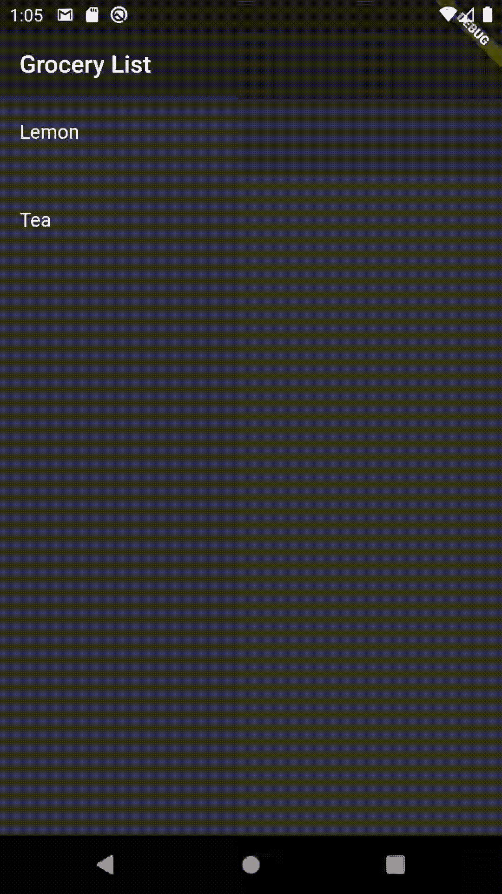
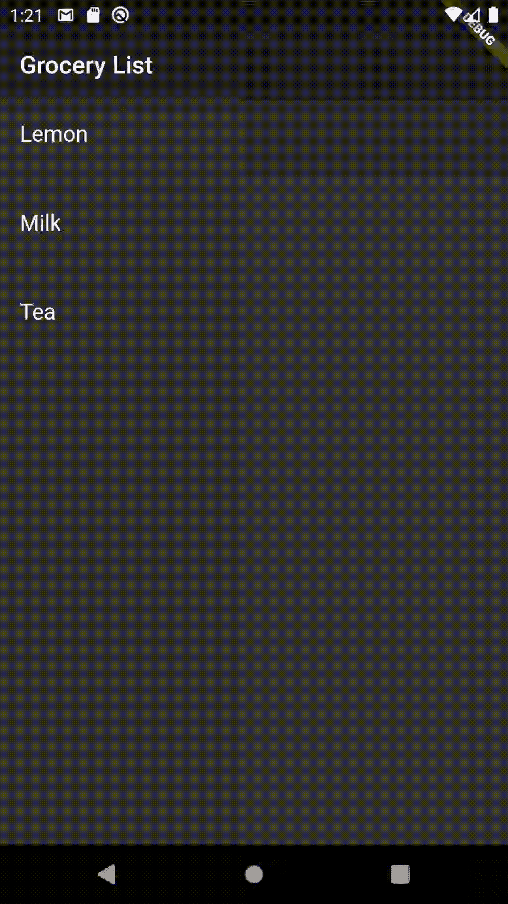

# 在 Flutter 中创建可忽略列表

> 原文：<https://betterprogramming.pub/create-dismissible-list-in-flutter-fb90f6b8ee32>

## 发现颤动——第 19 周

## 构建一个可以忽略的 Flutter 小部件

照片由[阿齐兹·阿查基](https://unsplash.com/@acharki95?utm_source=unsplash&utm_medium=referral&utm_content=creditCopyText)在 [Unsplash](https://unsplash.com/?utm_source=unsplash&utm_medium=referral&utm_content=creditCopyText) 上拍摄。

在现代应用程序中，向左或向右滑动列表项来消除它们是一种非常常见的 UI 模式。

为我们提供这个功能的 Flutter 小部件叫做`Dismissible`。为了让这个小部件按预期工作，有必要向它传递三个强制参数:

*   `child` —我们想要驳回的。
*   `background`——滑动时的背景是什么，所以小部件堆叠在孩子后面。
*   `key` —它必须是唯一的，因为它控制一个小部件如何替换树中的另一个小部件。

# 在行动中被驳回

为了更好地理解，我们将浏览一个可以忽略的购物清单示例
。

## 1.创建一个杂货类

我们的`Grocery`类将有两个属性:`name`和`isBought`。

## 2.创建一个购物清单

在有状态小部件中，创建一个`_groceryList`属性:

## 3.使用 ListView 构建器，创建一个可忽略的小部件列表

在我的例子中，我将使用`ListView.separated`选项，因为这可以获得更好的用户体验(在列表上的每个杂货项目后都有一个分隔线)。

对于这个构建器，我们将返回`Dismissible`小部件。

*关于* `*key*` *属性的注意事项:确保您传递的值是唯一的。不要使用项目的索引，因为从数组中移除项目后，数组会移动项目的位置，并且* `*Dismissible*` *小工具不会识别项目的移除。*

## 4.使用 secondaryBackground 属性

因为我们想要不同的动作，取决于项目是向左滑动还是向右滑动，我们将使用`secondaryBackground`向用户更详细地解释该动作。

*注意* `*background*` *属性:如果* `*secondaryBackground*` *也被指定，那么这个小部件只在孩子被向下或向右拖动时出现。*

现在，可忽略的背景更紧密地为用户确定在哪个滑动方向上发生了什么。

## 5.根据滑动方向，从列表中删除或划掉该项目

为此，我们将使用`Dismissible`小部件的`onDismissed`回调。当小部件完成大小调整后被关闭时，将调用该属性。

*注意:这个回调给你一个* `*DismissDirection*` *类型的值，表示它已经在给定的* `*direction*` *中被解除。*

现在，我们可以删除一件商品，或者划掉已经购买的商品:

# 结论

如果你是涵盖各种 Flutter 主题的简短有趣文章的粉丝，并且你想养成在接下来的十周内和我一起学习 Flutter 的习惯，你可以每周二阅读我的文章。

如果你对这篇文章有任何问题或评论，请在评论区告诉我。

对于那些想加入我们的颤振之旅的人，可以在下面找到前几周的链接:

*   [第 16 周](https://jelenajjovanoski.medium.com/asynchronous-dart-isolates-event-loops-c912104f4e9e) —“异步 Dart:隔离和事件循环”
*   [第 17 周](https://jelenajjovanoski.medium.com/create-layout-for-the-settings-screen-in-a-flash-in-flutter-9a57cf2c9c3b)——“在颤动中瞬间创建设置屏幕的布局”
*   [第 18 周](https://jelenajjovanoski.medium.com/combine-multiple-styles-per-line-with-richtext-in-flutter-c6bca0b2acd0) —“在 Flutter 中将多种样式与 RichText 结合起来”

为新的一年干杯，下周见。不要打破记录！