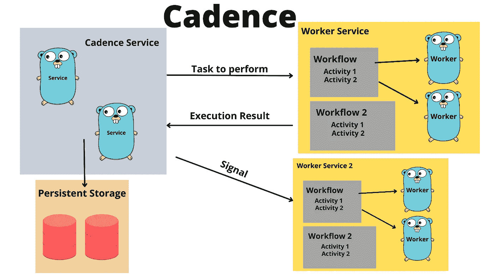
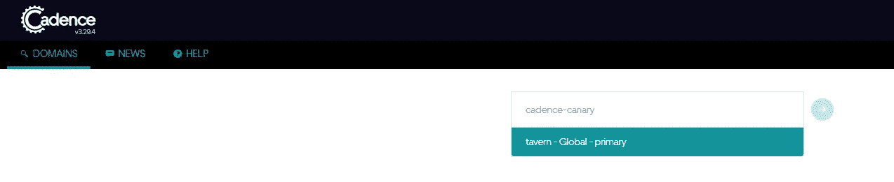
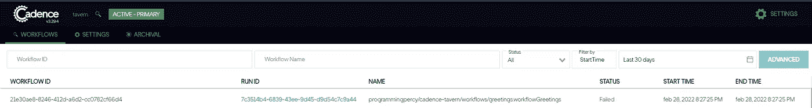
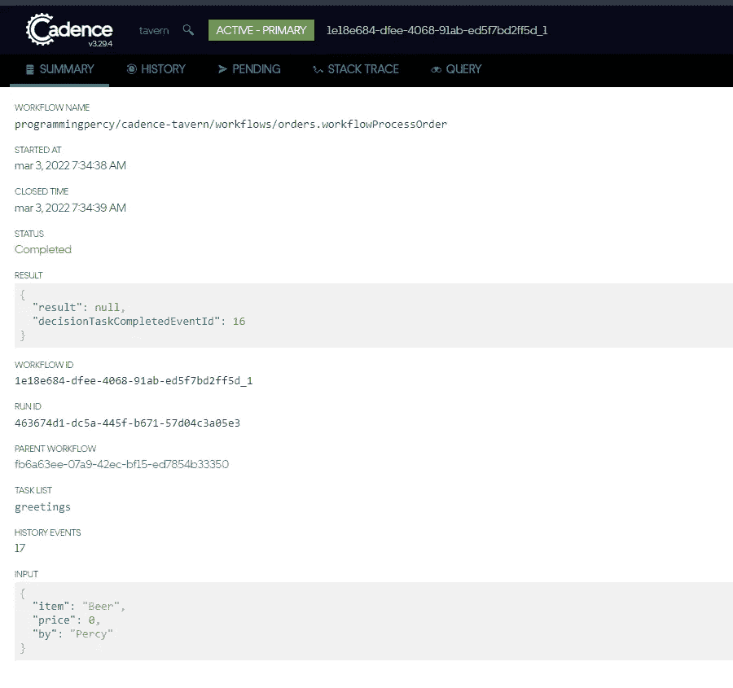
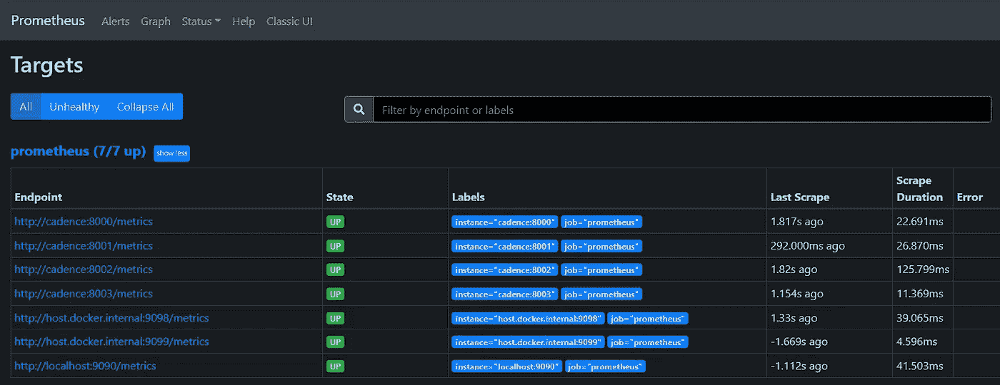
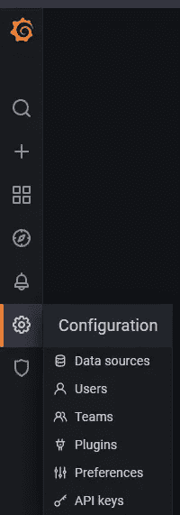
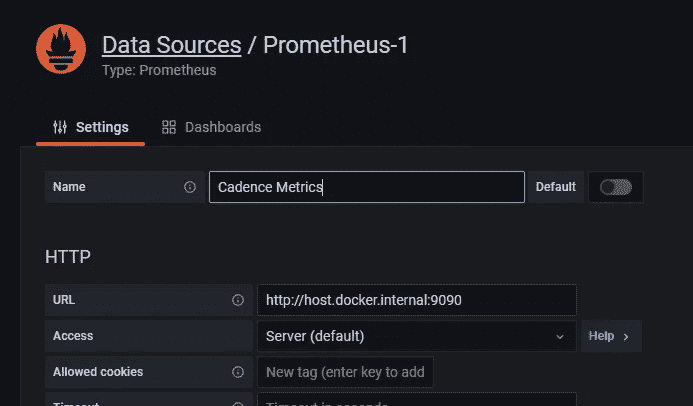
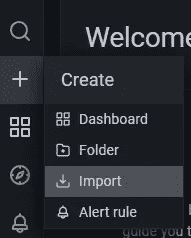
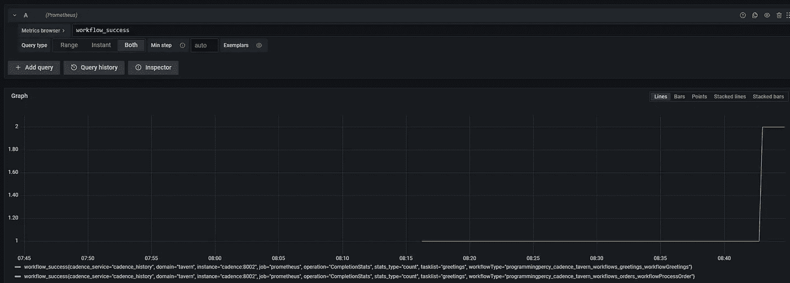

# 使用 Cadence 创建分布式、可扩展、持久且高度可用的软件

> 原文：<https://betterprogramming.pub/create-distributed-scalable-durable-and-highly-available-software-with-cadence-9f4fa6b1376b>

## 管理微服务或分布式系统有许多挑战，优步有许多问题的解决方案。



图片由珀西·博尔梅尔提供。Gopher 由拓也·上田提供，原始 Go Gopher 由勒内·弗伦奇提供(CC BY 3.0)

[优步](https://eng.uber.com/)是一家小型创业公司，你*可能*以前听说过他们。他们提供了许多由他们的工程团队构建的开源工具。让我告诉你，他们不是开玩笑的人，他们看起来是一群非常有能力的开发人员。

> Cadence 是一个分布式的、可扩展的、持久的、高度可用的编排引擎——优步 GitHub 库

你以前试过 Cadence 吗？如果没有，我可以保证，你是在治疗。Cadence 是一个开发分布式系统的框架。

我知道框架这个词吓到了很多 Go 社区的人。构建一个可伸缩的、容错的系统是非常困难的，而且不是你一个人就能轻松完成的。Cadence 有助于掩盖大规模分布式系统所需的大量繁重工作。

如果您想要开发一个分布式系统，该系统必须基于来自其他服务的事件来触发某些操作，并且您希望这些事件是防失败的，实现重试逻辑，那么您就来对地方了。

如果你想知道 cadence 如何解决这个问题的详细结构，你可以阅读他们的部署[拓扑](https://cadenceworkflow.io/docs/concepts/topology/#overview)。

Cadence 允许我们开发运行工作流的服务，工作流是基于来自其他服务的事件和信号，按照一定顺序运行的一组功能。

> 在此之前，我想为这篇冗长的文章说声抱歉，请务必带上咖啡

让我们开始学习如何使用这个神奇的工具。我们将要构建的完整代码可以在 [GitHub](https://github.com/percybolmer/cadence-demo) 上找到。

## 通过 Docker-Compose 设置 Cadence 服务器

我们需要做的第一件事是运行 Cadence 服务器。最简单的方法是使用 Docker-Compose。Cadence [Github](https://github.com/uber/cadence/tree/master/docker) 中有几个 docker-compose 文件的例子，不同的文件使用不同的持久存储解决方案。在我的情况下，我将使用 MySQL。

我在我的开发环境中使用 WSL 2，所以我必须对 Compose 进行修改才能使它工作。看起来构建挂载文件有问题，你可以在这里查看 git 问题。

我们还希望选择持久存储来跨重启存储数据，这是通过向组合添加一个 mount 来实现的，在本例中，我使用 MySQL。我们将为 Mysql 和 Prometheus 添加一个挂载，这样我们就可以持久保存数据。

这是我使用的作曲，对默认作曲做了一些修改。

## 设置 Cadence CLI —使用终端进行管理

要管理 cadence 服务器，您将使用 cadence [CLI](https://github.com/uber/cadence) 。您可以使用 Docker 或构建二进制文件来运行 cadence CLI。我认为使用 docker 是超级容易和快速的，如果你只是想尝试一下，但我仍然建议构建 CLI 二进制文件。

很简单，检出或克隆 [Cadence GitHub repo](https://github.com/uber/cadence#use-cadence-cli) 。在存储库中有一个我们将运行的`make`文件，但是在此之前，可能需要解决一些依赖关系。

您必须安装 [Go](https://go.dev/) 。如果没有，请点击此[链接](https://go.dev/dl/)下载。

项目中有几个二进制文件，它们各自控制系统中自己的部分。我们现在只对 CLI 感兴趣。

```
git clone [https://github.com/uber/cadence.git](https://github.com/uber/cadence.git)
cd cadence && make bins
#Verify it works
./cadence --help 
```

这将输出几个二进制文件，我们可以用它们来管理您正在工作的文件夹中的 Cadence。我建议将这些二进制文件移动到一个`bin`文件夹中，并将其添加到您的路径中。

## 设置项目

我们将建立一个应用程序，连接到 Cadence，并开始添加东西。我建议我们将想要运行的`docker-compose`复制到一个新的项目文件夹中。在我的例子中，我将使用`Mysql`作为后端持久性存储。Cadence 支持其他几个，默认为`Cassandra`。

我们还需要`Prometheus`配置。我将创建一个名为`Tavern`的项目，因为我们正在构建一个项目。复制想要的作曲和普罗米修斯文件夹。

这是您的项目结构现在应该看起来的样子。

到目前为止的项目结构

## 运行 Cadence 服务器

在我们开始使用 Cadence 之前，我们需要确保服务器正在运行。在项目内部，导航到`docker-compose.yml`的位置并运行它。

```
docker-compose up
```

让服务器运行起来后的第一步是添加一个**域**。域是任务和工作流的名称空间，用于将不同的任务相互隔离。

Cadence 支持集群，因此您可以在许多机器上运行系统。这通常用于确保生产正常运行时间，以防一台服务器出现故障，下一台服务器可以接替。如果您打算在生产环境中发布 cadence，请记住一个域只能作为集群上的一个单体运行。

如果我们开始使用一个域，可能会更容易理解。

我们将使用 CLI 创建一个名为`tavern`的域。在命令中，我们将使用`--do`来指定域名。我们将告诉 CLI 的`domain register`让它运行一个域名注册。

```
cadence --do tavern domain register
```

希望你会收到一个`Domain tavern successfully registered`。

我们现在有一个`Domain`开始工作。

让我们探索一下 Cadence 的一个美妙之处，它为您提供了一个管理域和查看工作流的 UI。

访问 [http://localhost:8088/](http://localhost:8088/domains) ,如果您正在运行 compose，应该会看到一个 UI。尝试搜索`Tavern`，你会看到一个你可以访问的域名。



搜索时显示酒馆域名的 Cadence 用户界面

进入该域不会太令人兴奋，我们有 0 个工作流正在运行。但这将我们引向下一个要学习的组件，[工作流](https://cadenceworkflow.io/docs/concepts/workflows/)。

工作流是 Cadence 发展的主要组成部分之一。工作流是一组按一定顺序运行的任务(活动)。该工作流将帮助您管理将要运行的处理器的状态。工作流有许多很棒的内置帮助功能，如失败事件的重试。我们将通过实现一个来了解更多关于工作流的知识。

在运行工作流之前，我们需要一些东西来管理工作流。这是由连接到先前启动的 cadence 服务器的客户端应用程序完成的。客户端将连接并轮询任何必须执行的任务，该客户端被称为`Worker Service`。

## 工人服务 Scrum 大师

我们需要运行的第二件事是`worker service`，一个工人服务就像一个 scrum master。它将确保工作被接受到工作流中，并将其分配给一个工人，然后将响应推回服务器。worker 服务还将确保任何被推送的作业只被执行一次。即使您有多个服务工作者监听相同的作业。

worker 服务是作为客户机运行的处理器，它轮询作业并负责托管要执行的实际工作流。你可以在这里阅读更多关于它的[。](https://cadenceworkflow.io/docs/go-client/workers/)

在我们使用 docker-compose 启动 Cadence 服务器之前，worker 服务将负责连接到服务器，并确保在工作流中处理任务(我们应该应用的一组活动)。

希望实现后会变得更容易理解。我们要构建的第一个东西是一个`worker service`，我们将使用它来注册一个`workflow`来迎接新客户。一旦新顾客进入酒馆，工作流就会按照我们定义的顺序运行一组功能。

我知道，对新客户说“欢迎”可能看起来很像“你好世界”。然而，让我们明确一点，Cadence 是一个很大的工具，要理解它，我认为我们应该从简单开始。让我们建立一个 hello world，了解每件事的意义，然后从那里进入 kick-arse 酒馆。

首先确保你在 Go 中安装了 Cadence SDK，并且我们已经设置了`go module`。你给你的模块起的名字很重要，当我们触发工作流的时候会用到它。

```
mkdir app && cd app
go mod init programmingpercy/cadence-tavern
go get go.uber.org/cadence
```

我们将保持一个简单的和基本的项目设置，更先进的和可扩展的方法将在我们理解 Cadence 工具后讨论。

在`app`文件夹中创建一个`main.go`文件。这是我当前的文件夹布局。

当前项目布局，添加我们的工人服务

现在我们将创建一个非常简单的 Cadence 客户端。这将是我们将要运行的`worker service`。要创建一个工人服务，我们需要通过 docker-compose 连接到 cadence 服务器。

与服务器的连接是通过 [Yarpc](https://pkg.go.dev/go.uber.org/yarpc) 完成的，这是一种优步创建的通信协议。非常好用，不用怕。

为了创建工人服务，uber 提供了`go.uber.org/cadence/worker` SDK。我们将使用一个函数来创建一个名为`New`的新 worker，但是它需要一些配置才能工作。

go.uber.org/cadence/worker.新函数定义。

*   **服务**= Yarpc 到服务器的连接，我们将使用 SDK 轻松创建。
*   **域** =要在其中操作的域名称空间，我们之前创建了将要使用的`tavern`域
*   **tasklist** =用于标识客户端工作器的字符串，也用于标识工作器服务运行的工作流和活动。将任务列表想象成一个命名队列。
*   **options** =用于配置正在运行的服务的结构，这可以用于配置日志记录、指标等。我们将首先使用最基本的设置。

main.go —这是将帮助我们分发和管理工作流的工作服务。

就是这样，注意这是目前最基本的工人服务。我们可以在以后添加更多有趣的选项。

您现在可以通过执行主文件来尝试运行 worker-service。

```
go run main.go
```

运行工作服务的 Cadance

您应该会看到日志显示该工作进程已经启动，但是没有注册任何工作流或活动。这给我们带来了有趣的部分，实际的处理！

## 工作流—一组按顺序执行的活动

如前所述，一个[工作流](https://cadenceworkflow.io/docs/concepts/workflows/)是一组按照一定顺序运行的[活动](https://cadenceworkflow.io/docs/concepts/activities/#timeouts)。活动是一个函数或结构方法调用，因此这是您可以开始执行实际工作的地方。经验法则是，数据库连接等不应该在工作流中完成，而应该在活动中完成。

Cadence 的伟大之处在于，工作流为创建一个可靠而稳定的环境提供了如此多的有用工具。我不会涵盖他们所有人，检查他们的文件。

在我们正在建造的酒馆中，我们想要迎接新的顾客，并且还将顾客存储在数据库中以跟踪他们。这将是两个独立的活动，一个用于问候，一个用于存储。

我们将记录顾客的到访次数以及顾客最后一次光顾酒馆的时间。为了使文章更短，我将使用内存数据库解决方案。`Customer`代码可能会在 Tavern 中的许多工作流和活动中共享，所以我们将它存储在 app 文件夹中名为`Customer`的包中。

app/customer/repository.go —我们用来演示 Cadence 活动的客户存储库

我们还创建了一个新文件夹，在那里我们可以存储名为`worksflows`的不同工作流。在其中，我们还将创建`greetings`文件夹，我们将在其中存储与问候新客户相关的所有代码。

这是我在这一点上的项目布局。

第一个问候语工作流的项目布局

让我们从构建工作流开始。工作流处理输入数据并触发一组活动运行。工作流是由一个简单的函数[定义的](https://cadenceworkflow.io/docs/go-client/create-workflows/#declaration)，我们稍后会注册这个函数。

唯一需要记住的是，工作流函数应该接受一个`workflow.Context`作为第一个参数。然后，它可以接受任何其他输入参数，只要它们是可序列化的！在我们的例子中，我们将接受`workflow.Context`和一个`Customer`结构。

工作流的输出应该是一个`error`和任何其他可序列化的输出。

以下要点显示了可能的工作流功能的几个示例。

有效工作流签名的几个示例。

在工作流中，我们可以添加关于正在运行的流程的配置，例如超时、重试策略、心跳配置。这是通过使用`workflow.ActivityOptions`添加的。

为了确保日志被输出，你必须使用`workflow.Logger`或`activity.Logger`，以便在 Cadence 框架中使用它们。工作流和活动包都用一个`GetLogger`函数公开了日志记录器。

在我们现在创建的工作流中，我们将通过`Greeting`打招呼，然后将用户信息存储在一个`Update`函数中。为了执行这些函数，我们让工作流用`ExecuteActivity`触发它们，这将期望工作流上下文作为第一个输入参数。

第二个参数是要运行的`Activity`。之后的任何参数必须与`Activity`输入参数对齐。我们的两个活动都需要一个`Customer`作为输入，所以我们将它传递给`ExecuteActivity`。

活动是异步运行的，所以`ExecuteActivity`将返回一个`Promise`而不是实际的结果。如果您想等待并同步运行活动，我们可以在承诺上使用`Get`来等待结果。

workflows/greetings/greetings . go—我们创建的第一个工作流

这是我们工作流的完整解决方案，这是一个非常基本的工作流，只有 2 个活动同步运行。希望你能明白。

## 活动—业务逻辑功能

活动是我们应用实际业务逻辑的地方，到目前为止，我们只是实现了运行工作流的框架。

活动的工作方式与工作流相同。它们是简单的函数，期望一个`context.Context`作为第一个参数，后跟任意数量的`serializable`参数。并且可以输出任意数量的输出，只要它们是可序列化的。作为输出参数也应该有一个错误。

关于活动没有更多要说的了，直到您为长时间运行的活动实现心跳。

workflows/greetings/greetings . go—我们创建的第一个活动

## 注册工作流和活动

每个工作流和活动负责`Registering`向 Cadence 服务器表明它们的存在。这是通过使用`workflow`和`activity`包中各自的`Register`功能完成的。

这通常在工作流和活动包中的`init`函数中完成。

记住注册工作流和活动

Init 函数是一导入包就运行的函数。我们希望`Register`函数在我们的工人服务启动时发生。

为了实现这一点，我们将在`main.go`中添加导入，在本例中它是我们的 worker。

app/main . go-更新了导入语句，使 Init 函数注册工作流和活动

## 执行工作流和活动

我们终于准备好开始运行活动，并熟悉整个 Cadence 框架。

供参考，这是我现在的`workflows/greetings/greetings.go`的样子。

workflows/greetings/greetings . go-第一个运行的完整工作流

确保 Cadence docker-compose 仍在运行。

导航到`/app`文件夹并执行工作者服务。

运行工作者服务应该显示工作流工作者和活动已经启动

现在，为什么没有打印问候？让我们确保对我们正在做的事情有所了解。

首先，我们运行了 docker-compose。这启动了 Cadence 服务器，它管理所有要执行的作业的状态。

其次，我们运行了 worker 服务，它注册了一个存在的工作流和一些属于它的活动。它还处理对服务器的轮询，以查找要执行的任何作业。

所以我们有一个 Scrum 大师和一个开发人员，但是没有实际问题需要解决！

这就是 cadence CLI 的神奇之处，我们可以使用 CLI 推送新的作业。我们去酒馆吧。

我不会涵盖 CLI 工具中的所有命令，其中一些您现在应该已经知道了(域、任务列表)。在`cadence`命令中，您会看到`--tl`标志，它是 tasklist 的缩写。这应该与您在 worker 服务的配置中编写的任务列表相匹配。

`--wt`是工作流类型的选项。这是一个由工作流的完整路径组成的字符串，所以 Go 模块+声明工作流的文件和函数。在我这里，我的模块是`programmingpercy/cadence-tavern`。工作流存储在`workflows/greetings`文件夹中，功能名为`workflowGreetings`。这就形成了完整的路径`programmingpercy/cadence-tavern/workflows/greetings.workflowGreetings`。

`--et`是以秒为单位的执行超时，这是在触发超时失败之前我们允许执行运行的最长时间。

节奏—执行的中断命令

在新终端中运行该命令，您应该会看到类似于我的要点的日志消息。

Cadence CLI 无法运行命令

日志向您显示了一些进展的迹象，这用于显示发生的事件，您可以看到 Cadence 服务器已经获得了作业，并成功地决定了要执行的工作流。但是，执行失败。

让我们查看更多关于这个执行的数据，您可以通过访问 [http://localhost:8088/](http://localhost:8088/) 打开 Cadence UI。

它将询问您域，输入`tavern`，您将看到在该域上执行的所有执行。

您可以使用它来跟踪执行及其状态，并输入更多信息。



我知道这是一个小图片，但是它显示了我们刚刚触发的工作流执行的失败。

尝试单击并导航到作品中，以查看显示的更多信息。

还记得工作流声明吗？

```
func workflowGreetings(ctx workflow.Context, visitor customer.Customer) (customer.Customer, error) {
```

我们指定输入应该是一个`Customer`，所以我们应该输入确认客户结构声明的 JSON 数据。

我们可以通过在 JSON 后面使用`--i`标志来做到这一点。

使用客户输入的 Cadence CLI

您应该会从工作流中看到一个结果，说明我们已经访问的次数和最后一次访问的时间，尝试多次执行该命令并对其进行调整。此外，尝试在 UI 中查看结果。

工作流的执行结果

不要忘记查看 worker-service 中的日志，看看发生了什么。

此时，您可以试用 Cadence 的一个编排工具。关闭正在运行的 worker-service，这样就不会有进程获取推送到 cadence 服务器的作业。然后使用相同的 cadence CLI 推送作业。

在推送一个作业之后，启动 worker 服务，看看它是如何成功地从队列中找到并执行该作业的。

## 信号——一种持久的异步数据提供方式

到目前为止，我们已经运行了工作流中相互依赖的同步活动。

但是让我们想象一下，我们在酒馆里接待了一位顾客，我们会期望他下订单。我们不知道是什么时候，也不知道是什么，所以我们还不能处理这个。

[信号](https://cadenceworkflow.io/docs/go-client/signals/#signalwithstart)允许我们在稍后的阶段提供这些数据，但是它为工作流的剩余部分维护历史中的事件和有效负载。

让我们通过创建第二个工作流来尝试一下,`workflowOrder`接受来自客户的订单，并处理订单，例如服务和接受付款。

我不会在这里讨论工作流的东西，基本上，我们将重做我们为`workflowGreetings`所做的，而是有一个长期运行的工作流。

我将在`workflows`文件夹中创建一个名为`orders`的新文件夹。此文件夹将保存与订单相关的任何工作流和活动。

要开始听`Signals`，我们需要一个`Selector`。选择器是负责运行工作流的组件，在 cadence 源代码中，他们将其解释为常规`select`语句的替代。

信号通过`workflow.Channel`发送，我们可以通过`workflow.GetSignalChannel(ctx, TOPICNAME)`订阅一个主题。

我们必须告诉选择器如何处理信号通道上的有效载荷，这是通过添加`receivers`来完成的，它是在每个到达的信号上运行的处理函数。

您可以通过运行接受一个`workflow.Channel`和一个处理函数的`selector.AddRecieve`来添加接收者。

最后，您可以通过运行`selector.Select(ctx)`使`Selector`开始接收信号。

这听起来可能很多，但是看看我们需要的代码有多少。

app/workflows/orders/order.go —简单的长时间运行的工作流

在您尝试之前，不要忘记在新工作流的`main.go`中添加导入，否则它不会被注册。

```
import (
_ "programmingpercy/cadence-tavern/workflows/orders"
......
)
```

导入完成后，重启 worker 服务(main.go)。

```
go run main.go
```

下一部分是新的，所以请仔细阅读！为了发送信号，我们需要提供一个`workflow-id`。您可以在使用 cadence CLI 启动 worker 时找到这个 ID。当我们触发`greetingsWorkflow`时，您可以使用与之前相同的命令，但是交换 workflow_type，并删除输入。记住服务将在`--et`时间过去后关闭，我们将很快对此进行更多的讨论。

Cadence 启动工作流等待信号

在输出的顶部，获取工作流 ID。

我们的服务现在已经开始运行并等待订单，让我们发送一个信号，我们想要订购啤酒。我们可以再次使用 Cadence CLI。

我们像以前一样进入域，使用`workflow`命令和`signal`子命令。我们使用`-w`标志设置`workflow-ID`，使用`-n`设置信号名称。请记住，您必须重复使用代码中相同的信号名称。

`-i`标志的用法和以前一样，上面有我们想买的商品和买家的名字。

Cadence CLI 向我们的工人发送信号

您应该会看到打印有`Signal workflow Succeeded`的状态消息。这意味着信号被发送到工作流，您可以通过打开运行工作服务的终端或访问 UI 来查看工作流日志。

我建议探索一下 UI，如果你把`--et`定时器设置得足够高，让工作流不会超时，发送几个信号，然后在 UI 中查看`history`选项卡。这对于查看发生在员工身上的所有事件非常有用。

用户界面可以为您绘制工作流程历史、收到的信号等，并向您显示许多关于正在运行的流程等非常有用的信息。

## 工作流永远运行，没有超时

我们必须设置`--et`标志来使工作流运行一段时间是没有任何意义的。在一个真实的系统中，你会用两种方法来解决这个问题。

让我们稍微讨论一下这个问题。您希望工作流永远运行并随时准备就绪，但是工作流保存历史和状态。这将导致内存“泄漏”，或增长。工作流程会越来越长，这是我们不能容忍的。

要解决这个问题，我推荐两个解决方案。第一个在我看来是最好的，但是很难实现。场景是我们只希望`workflowOrder`在开放时间运行。如果酒馆关门了，经营它就没有意义了。实现这一点的方法是在酒馆开门时推送一个触发订单工作流的事件/信号。

第二个解决方案是让它永远运行下去，但要有点变化。优步的伙计们不是开玩笑的人，当然，他们已经想到了这一点并解决了它。

工作流可以自己重新触发，清除所有历史和状态。这是通过`workflow.NewContinueAsNewError`完成的。当返回此错误时，Cadence 将有效地等待所有当前工作完成，并使用相同的 ID 重新启动工作流。它还会重置所有超时计时器！

知道何时返回该错误的一种方法是计数接收到的信号数量，或者通过比`--et`定时器更短的定时器。

我推荐 Signal counter，你不希望工作流历史变得太大，这也是 Cadence 自己的 git 中有例子的方式。

让我们添加一个信号计数器和一个最大数量的信号，如果我们处理了足够多的信号，让我们返回`NewContinueAsNewError`。

你必须使用选择器的`AddDefault`,而不是仅仅将重启布尔值设置为真。这是因为选择器实现了很多逻辑来持久安全地完成。

orders.go 工作流程将在 3 个信号后重新启动

一旦你有了改变，重启它，试着发送 3 个以上的信号，看看一切是如何顺利进行的。

太好了，我们现在可以欢迎新客户并接受订单了。在一个真实的应用程序中，我希望有顾客离开的事件，在工作流中验证顾客在点菜前是否在酒馆里，等等。

我们要做的一件事是重构`order`工作流，以了解更多关于`child workflows`的信息。顾名思义，工作流可以产生子工作流。当您的工作流变得庞大和复杂，和/或有许多异步活动时，这非常有用。

我喜欢这样组织，父工作流负责信号等，子工作流负责在特定信号上运行的活动。请记住，单个工作流可以监听许多信号。

## 子工作流

让我们像孩子一样，开始简单的工作流程来处理订单。

触发子工作流的方式与我们触发活动的方式相同。工作流包提供了一个`ExecuteChildWorkflow`函数。

您需要为子工作流创建一个配置，在其中，您可以设置关于重试的规则、在超时之前可以运行多长时间等等。由于这是一个子工作流，我们使用工作流包中的`ChildWorkflowOptions`配置对象。

然后，我们需要创建一个子上下文并执行子工作流。这非常简单，所以我不会详细讨论代码。

要点显示了`workflowOrder`的一小部分，在这里我们执行处理订单的子工作流，之后我们将创建实际的工作流。

执行子工作流的 Cadence 示例

我将创建`workflowProcessOrder`，它将运行两个活动，第一个活动将查找给定名称的客户，第二个活动将验证客户是否已经到了可以订购的年龄。这里没有什么新的东西要学，它和我们之前做的活动和工作流一样，没有变化。

这里是我的`orders.go`的完整代码。

Cadence 子工作流的完整示例。

为了尝试这一点，我们现在需要做 4 件事。

*   重新启动工作服务

```
go run main.go
```

*   触发订单工作流

```
cadence --domain tavern workflow run --tl greetings --wt programmingpercy/cadence-tavern/workflows/orders.workflowOrder --et 1000
```

*   和用户一起去酒馆

```
cadence --domain tavern workflow run --tl greetings --wt programmingpercy/cadence-tavern/workflows/greetings.workflowGreetings --et 20 -i '{"name": "Percy", "age": 22"}'
```

*   用信号下订单

```
cadence --domain tavern workflow signal -w YOUR-WORKFLOW-ID -n order -i '{"item": "Beer", "by": "Percy"}'
```

这样做应该会向您显示关于正在处理的订单的日志，并且您可以访问 UI 来查看关于正在执行的工作流的信息。



Cadence 子工作流显示有关父工作流等的执行信息。

令人惊讶的是，我们有一个酒馆有两个工作流程在运行。请记住，提升工人服务可以让您非常轻松地扩展这一点。添加功能非常简单，不会中断其他工作流程。所有正在传输的事件也尽可能以重试的方式处理，如果一个工人倒下，它不会丢失等。

## API—用户没有 CLI

太好了，我们可以将工作发布到服务器上，让员工接受它们。这一切都很棒，但老实说，我们不会让应用程序的用户使用 CLI。

CLI 帮助我们在开发过程中测试这些东西，它们还允许您管理生产环境。

通常，您会希望 Cadence 工人和工作流运行，但有一些方法可以插入工作。这通常是由一个为我们触发信号的常规 Rest API 来完成的。

我们将设置一个简单的 HTTP 端点，它允许我们包装现有的两个工作流。

我将在`app`文件夹中创建一个名为`api`的文件夹。

app/API/main . go——充当 cadence 网关的简单 HTTP 服务器

现在让我们添加一个 cadence 客户端，它可以用来与 Cadence 服务器对话，并取代我们使用 CLI 所做的工作。

为此，我们需要启动一个到服务器的`yarpc`连接，然后创建一个`workflowserviceclient`，它是一个用于控制工作流的 SDK。这个`workflowserviceclient`必须输入到一个`cadence.Client`中，我们将使用它来执行工作流。

所有与 cadence 客户端相关的代码都将被放入一个名为`client.go`的文件中。对于这个演示，我们将有硬编码的值，但是在一个真实的应用程序中，您可以使它可配置。

我们还将对工作流类型名称进行硬编码。这些可以使用 cadence 客户端获取，但是您可以自己尝试。

app/API/client . go—cadence 客户端相关代码

接下来，我们将更改`GreetUser`处理程序，使其成为附加到`CadenceClient`的方法。我们将添加一些执行选项和`ExecuteWorkflow`。

`ExecuteWorkflow`是一种触发工作流并等待它完成的方式，这种方式主要用于根据 Cadence them selfs 进行开发。它适合同步调用，例如`greetings`工作流。

还记得工作流期望一个`customer.Customer`作为输入吗？所以我们必须在这里的执行中使用它。

api/client.go —执行 cadence 工作流的 HTTP 处理程序

在我们开始尝试之前，我们还需要更改`Order`处理程序。该处理程序不会执行工作流，而只是发送一个应该触发事件的信号。

为此，我们必须指定工作流 ID、运行 ID 和信号名称。到目前为止，您应该知道这是如何工作的，但是它们也传递一个`Order` struct 作为输入，因为工作流期望它作为输入。

请记住，这个处理程序将简单地发送信号，我们将讨论如何在这个处理程序之后启动工作流。

api/orders.go —触发信号的 HTTP 处理程序

我们使用`StartWorkflow`来启动一个工作流，start 和 Execute 的区别在于 Start 会发送启动命令并立即返回。Execute 将启动工作流，并等待它完成。

所以当我们想以编程方式而不是 CLI 启动长期运行的工作流时，`StartWorkflow`是完美的。

我们需要提供一些运行时选项，比如超时，记住将`ExecutionStartToCloseTimeout`设置得足够高，这样如果您想要一个永远运行的工作流，您就可以确保在`ContinueAsNew`被触发之前不会超时。

`StartWorkflow`将返回关于执行的信息，比如`WorkflowID`和 RunID，这两项是我们需要为要发送的`Signal`存储的。

api/main.go —简单的 HTTP 服务器，在启动时启动 orderWorkflow

是时候测试 API 了！确保您的工作服务正在运行，然后启动 API。我用 CURL 逛酒馆，然后下单。

curl——测试 API

访问 Cadence 日志或用户界面，确保您可以看到订单已经完成。

## 度量——普罗米修斯&格拉夫纳公司

也许你们有些人以前注意到了，但是 docker-compose 包含了普罗米修斯和格拉夫纳。我不会在这篇文章中讨论它们是什么，因为它已经非常冗长了，但是简单地说，它们是用于度量的。

关于 Cadence 的一个很棒的事情是它有普罗米修斯对度量的支持，现在我们一直使用空计数。我们可以轻松地更新代码，开始向 Prometheus 输出一些指标。

我将在`app`中创建一个名为`prometheus`的新文件夹，在其中，我们将有一个助手功能来创建一个新的普罗米修斯记者。Prometheus reporter 是公开度量数据的一种方式。

我们还将有助手函数来创建两个计数范围，一个用于工人，一个用于工人服务。

普罗米修斯代码和助手函数用于 tally，强烈受到 [Cadence 示例](https://github.com/uber-common/cadence-samples/tree/master/cmd/samples/common)的启发

如果你不熟悉 Tally，它是优步创建的度量软件包。我们将只发布默认的节奏指标，但您可以轻松添加您的指标。我不会在这里讨论这个，但是你可以在他们的 GitHub 上阅读。

为了开始发布指标，我们需要在 API `main.go`和 worker 服务中更改计数范围。

worker 服务将看起来像下面的要点，我们所改变的是我们在 localhost:9098 上创建一个 reporter，它将托管一个 Prometheus metrics 网站。

app/main . go-已更新以使用指标范围。

API 也是如此。这里我们使用`localhost:9099`来代替，以避免端口冲突。

app/API/client . go-已更新以使用普罗米修斯指标

现在，服务正在这些 URL 上发布指标，您可以访问它们来查看数据。

我们需要告诉 Prometheus 抓取这些 URL，这是在 docker-compose 使用的`prometheus.yml`文件中完成的。

我们将添加`localhost:9090`以及来自工人的两个 URL，我们需要使用`host.docker.internal`来完成这项工作。

增加了普罗米修斯的擦伤目标

重启 docker-compose，然后启动 API 和 Worker 服务。

我们将从访问普罗米修斯开始，以确保刮擦目标是连接的。

访问[http://localhost:9090/targets](http://localhost:9090/targets)，您应该会看到所有的刮擦目标及其状态(如果它们不正常)。请确保您输入了正确的端口，并且所有服务都在运行。



普罗米修斯刮目标和他们的地位

Grafana 是我们可以用来可视化指标的服务。Cadence 有两个预制的仪表盘，我们可以利用，你可以从[这里](https://github.com/uber/cadence-docs/tree/master/src/grafana/prometheus)下载。

如果你没有改变 docker-compose，Grafana 应该可以在 localhost:3000 上找到。

在左侧菜单中，我们需要选择“数据源”,这样我们就可以将 Prometheus 服务器作为数据提供者添加到 Grafana 中。



菜单中的 Grafana 数据源

您将看到一个有许多选项的屏幕，对于这个简单的例子，您只需要提供 URL。网址应该是`[http://host.docker.internal:9090](http://host.docker.internal:9090.)` [。](http://host.docker.internal:9090.)

在底部，你会发现一个写着`Save & Test`的按钮。



格拉夫纳把普罗米修斯号作为数据源

一旦我们有了数据源，我们需要添加 JSON 仪表板。



Grafana 导入仪表板

导入两个仪表板，我们就可以开始了。您现在在 Grafana 中有了指标。

尝试发送几个请求，在这里你可以看到我如何查看成功的工作流执行的数量，等等。



成功的工作流执行

当然，只有关于执行、延迟、失败等的默认指标。您可以通过提供您的指标记录来添加更多内容。

# 结论

开始使用 Cadence 需要一点工作，但这是值得花的时间。Cadence 开销小，我们出的代码不多，它给了你什么？容错、可重试、事件管理的任务。自己实现这一点需要大量的代码。

Cadence 提供了很多东西，优步的员工已经证明了他们的技能。

使用 Cadence 启动项目的开销是存在的，但它很小，只需要在项目开始时进行。一旦启动，添加功能、活动和工作流是如此简单。

设置它的额外时间可以从许多其他方面获得。

我对它的启动和运行的简单性以及它的可扩展性印象深刻。这些框架中有许多一开始可能会令人困惑，但我觉得 Cadence 的布局使它变得非常简单。我们有工人服务轮询服务器上的作业，我们有工作流，它是由工人服务运行的一组函数，工作流由活动(函数)组成。

这个框架也很容易集成到常规的 go 代码中。

在生产代码库中，您应该创建包装器/util 包来创建 Cadence 客户端。我们现在在工人服务和 API 中有重复的连接代码。这些实用程序包甚至会进一步减少开销。

此外，你应该让一切都是可配置的，API 应该尝试列出工作流，以确保它们还没有运行，等等。

对于生产，请确保您查看了在他们的文档中找到的[生产操作](https://cadenceworkflow.io/docs/operation-guide/)。

感谢你阅读这篇可能太长的文章，但很难保持简短。完整的代码可以在 [GitHub](https://github.com/percybolmer/cadence-demo) 上找到。