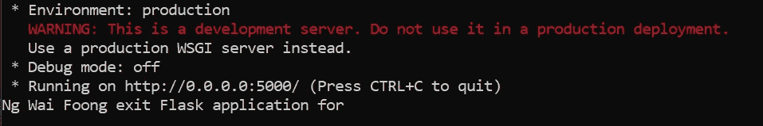
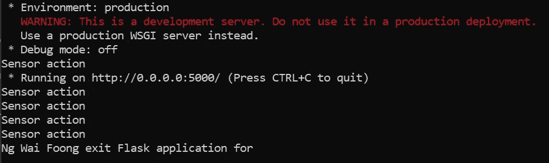

# 如何为 Python 应用程序创建退出处理程序

> 原文：<https://betterprogramming.pub/create-exit-handlers-for-your-python-appl-bc279e796b6b>

## 利用 atexit，一个 Python 模块来注册程序正常关闭时要调用的函数


[达斯汀·特拉梅尔](https://unsplash.com/@dustintramel?utm_source=medium&utm_medium=referral)在 [Unsplash](https://unsplash.com?utm_source=medium&utm_medium=referral) 上拍摄的照片。

通过阅读这篇文章，您将学习如何定义自己的退出处理程序，当您退出 Python 应用程序时将执行这些程序。基于[官方文件](https://docs.python.org/3/library/atexit.html):

> “`atexit`模块定义了注册和取消注册清理函数的函数。如此注册的功能在正常的解释器终止时自动执行。`atexit`以与注册顺序相反的顺序*运行这些功能；如果您注册了`A`、`B`和`C`，在解释器终止时，它们将按`C`、`B`、`A`的顺序运行*

如果您正在寻找一种方法来清理资源并在退出应用程序时优雅地关闭不必要的连接，那么这个模块非常有用。但是，请记住，在下列情况下不会调用注册的函数:

*   当程序被非 Python 处理的信号杀死时。
*   当检测到 Python 致命内部错误时。
*   当`os._exit()`被调用时。

让我们进入下一节，开始编写一些 Python 代码。

# 履行

`atexit`模块是 Python 内置模块的一部分，不需要任何进一步的安装。如果您使用的是 Python 版或更高版本，那么当与 C-API 子解释器一起使用时，注册的函数对于注册它们的解释器来说是本地的。

## 简单的例子

在 Python 文件中添加以下导入声明:

```
import atexit
```

定义您自己的函数，当应用程序退出时将调用该函数。我将使用一个简单的`print`语句作为演示。这将是您输入代码来清理资源并关闭到数据库的任何现有连接的部分:

```
def OnExitApp():
    print("Exit Python application")
```

下一步是注册您的函数:

```
atexit.register(OnExitApp)
```

运行您的 Python 文件，当您的应用程序退出时，该函数将被执行。如果你注册了同一个函数两次，它将被执行两次。

可以通过以下代码取消注册已注册的功能:

```
atexit.unregister(OnExitApp)
```

如果该函数尚未注册，它将什么也不做。`unregister`将删除同名的所有注册功能，即使您之前已经注册过多次。

对于将参数作为输入的函数，可以通过以下方法注册它们:

```
def OnExitApp(user):
    print(user, " exit Python application")atexit.register(OnExitApp, 'Ng Wai Foong') #method 1
atexit.register(OnExitApp, user='Ng Wai Foong') #method 2
```

完整的代码如下:

## 烧瓶示例

让我们尝试另一个在 Flask 应用程序上运行的例子。添加以下进口申报:

```
from flask import Flask
import atexit
```

定义自定义函数并注册到`atexit`模块:

```
def OnExitApp(user):
    print(user, " exit Flask application")atexit.register(OnExitApp, user='Ng Wai Foong')
```

设置 Flask 应用程序并在启动时运行它:

```
app = Flask(__name__)if __name__ == "__main__":
    app.run('0.0.0.0',port=5000)
```

当您退出 Flask 应用程序时，应该能够看到以下输出:



作者图片

查看以下要点以获得完整的代码:

## 烧瓶+日程表示例

在这个例子中，我们将了解如何在 Flask 中启动一个调度程序，并在退出 Flask 应用程序时关闭它。您可以使用此示例作为基本参考来清理项目中的资源并关闭到数据库的连接。我将使用一个叫做`[apscheduler](https://apscheduler.readthedocs.io/en/stable/)`的 Python 模块。我以前写过一个关于这个模块的[教程。请随意查看。](https://medium.com/better-programming/introduction-to-apscheduler-86337f3bb4a6)

通过以下命令安装模块:

```
pip install apscheduler
```

添加以下进口申报:

```
from flask import Flask
from apscheduler.schedulers.background import BackgroundScheduler
import atexit
```

创建将由调度程序运行的自定义函数:

```
def sensor():
    print('Sensor action')
```

创建一个`BackgroundScheduler`，并将其设置为每秒运行一次。默认情况下，它会将`deamon`设置为`True`。因此，您需要在退出时适当地清理它:

```
sched = BackgroundScheduler()
sched.add_job(sensor,'cron',second='*')
sched.start()
```

定义退出时要执行的自定义功能，并将其注册到`atexit`模块。我们将调用调度程序的`shutdown`函数来清理资源:

```
def OnExitApp(user):
    sched.shutdown()
    print(user, " exit Flask application for")atexit.register(OnExitApp, user='Ng Wai Foong')
```

创建 Flask 应用程序并在启动时运行它:

```
app = Flask(__name__)if __name__ == "__main__":
    app.run('0.0.0.0',port=5000)
```

当您退出 Flask 应用程序时，您应该在控制台中看到以下输出:



作者图片

您可以在以下要点中找到完整的代码:

# 结论

让我们回顾一下今天所学的内容。

我们首先简要介绍了 atexit 模块。

然后，我们探讨了该模块提供的功能。我们创建了一个简单的例子，它在退出应用程序时执行一个函数。

我们还在烧瓶应用程序上测试了它。此外，我们在 Flask 应用程序中使用了`apscheduler`模块，并成功执行了在退出时正确关闭它的功能。

感谢你阅读这篇文章。希望在下一篇文章中再见到你！