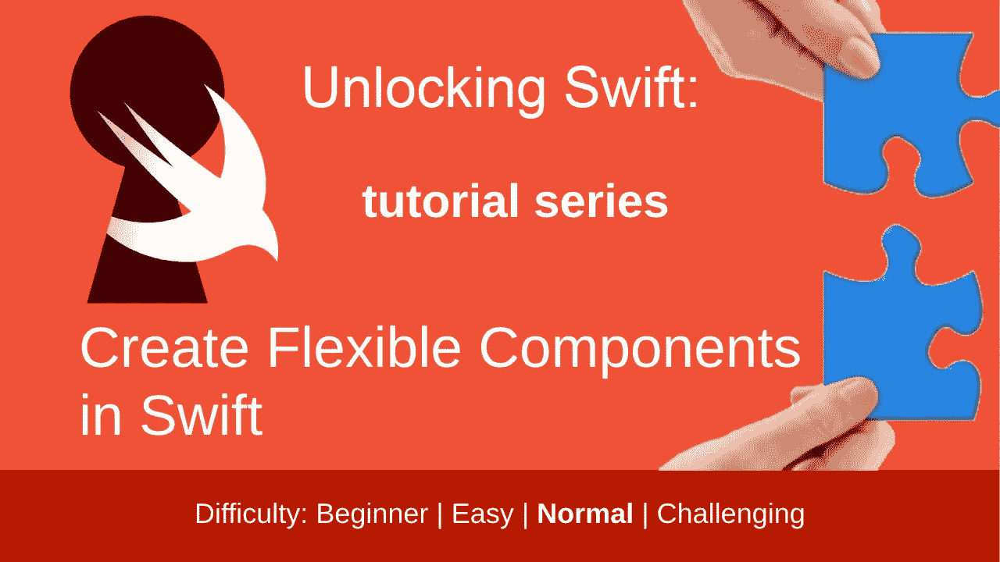

# 在 Swift 中创建灵活的组件

> 原文：<https://betterprogramming.pub/create-flexible-components-in-swift-dc50a1742bb3>

## 这些可以用视图模型更新

作者图片

你知道吗，我想创建可重用的组件。你知道，在你的生产应用程序中，无论你在哪里使用它们，你都将使用一个有几个状态的可靠的`UIButton`子类。

但是，在深入研究一个特定的实现之前，我该如何构建组件呢？

如果我创建一个`UILabel`作为一个很好的例子会怎么样？

你在看那个调查的结果！

如果你想看这个的视频版本，那就来吧！

难度:初级|简单| **普通** |挑战

本文是使用 Xcode 12.5 和 Swift 5.4 开发的

## 先决条件:

*   您应该知道如何在 Swift 中制作一个[单视图应用程序](https://medium.com/swlh/your-first-ios-application-using-xcode-9983cf6efb71)。
*   需要熟悉以下概念:[类型别名](https://medium.com/macoclock/type-alias-for-readability-in-swift-b5d60de4aee1)，一些[组合](https://stevenpcurtis.medium.com/core-concepts-of-combine-71d6b13d43e2)，[扩展](https://stevenpcurtis.medium.com/extensions-in-swift-68cfb635688e)，`[intrinsicContentSize](https://stevenpcurtis.medium.com/what-is-intrinsiccontentsize-anyway-c77f2bcd30d7)`，[获取器和设置器](https://stevenpcurtis.medium.com/public-getters-and-private-setters-in-swift-4f90d90bb05f)，[可点击链接](https://medium.com/swlh/clickable-link-on-a-swift-label-or-textview-98bbb067451d)，当然还有 [MVVM](https://stevenpcurtis.medium.com/mvvm-in-swift-19ba3f87ed45)

## 关键词和术语

模型:存储数据和操作数据的逻辑的地方。也许模型对象或网络代码存储在这里。把这看作是应用程序的本质。

# 整体观点

## **标准**

*   创建一个简单的`UILabel`子类，它也可以处理链接
*   在视图模型中初始化组件视图模型
*   将 ViewModel 传递回视图，以便更新它

## **描述**

我将为我的`Label`创建一个模型，它将提供我的`Label`用来显示文本的信息。与应用程序中的模型对象非常相似，它提供了视图显示所需的数据。

视图本身将出现在 viewController 中(这很幸运，因为 viewController 应该控制视图)。

因此，我们将标签和标签模型都呈现到视图控制器中(实际上在视图控制器的`viewDidLoad`函数中)，这样我们就可以使用以前的视图模型来更新它，而不必在视图控制器中保留`viewmodel`——这很好！

我们能做到这一点吗？好吧，让我们意识到，如果我不知道这已经开始工作了，我是不会发表这篇文章的！

# 实施

这个模型将会浮出水面，和我们的视图控制器中的视图一起。

此处复制了该模型，以下是帮助您解决问题的完整内容:

标签本身是`UILabel`的子类，也许最重要的部分是我们有一个用模型更新`Label`的函数:

现在这里有一些细节和一个[可点击的链接](https://medium.com/swlh/clickable-link-on-a-swift-label-or-textview-98bbb067451d)，你可以跳过(反正都是在一个扩展中)，仍然可以完全理解这段代码。然而，我也覆盖了`intrinsicContentSize`来设置接收视图的自然大小。

实际上，我们正在将大小传递给超类，如果没有文本，我们将返回一个零边界框。

我们应该什么时候初始化这个`viewmodel`，在哪里初始化？我们应该在我们的视图模型中这样做，并在视图控制器点击了`viewDidLoad()`之后，当`viewcontroller`准备好了的时候初始化我们的`labelModel`。

因此，我需要知道`UIViewController`的生命周期。我可以把这个作为`UIViewController`的扩展来写。

我们将需要监听标签中的变化，我们可以使用 Combine 的`[@Published](https://stevenpcurtis.medium.com/core-concepts-of-combine-71d6b13d43e2)`来做到这一点，然后将它添加到视图模型中，如下所示:

# 所以…

唷。那是相当多的东西。让我们看完整的代码！

# 代码

## 标签

## 标签模型

## 发布者扩展

## UIViewController 上的生命周期状态扩展

# 回购

我很乐意让你看一看回购协议的全文。

# 结论

这是您可能希望考虑在项目中创建组件的一种方式。这是唯一的方法吗？它不是，但它肯定是这样做的一种方法，我很乐意听到你对此的想法，最好是在 [Twitter](https://twitter.com/stevenpcurtis) 上，因为你可以保证我会在那里看到它。