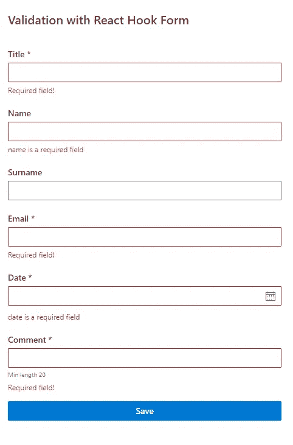

# 在没有压力的情况下创建表单

> 原文：<https://betterprogramming.pub/create-forms-in-react-without-stress-115e02053185>

## 管理验证、错误、修改字段列表等的简单方法

泰勒·尼克斯在 [Unsplash](https://unsplash.com?utm_source=medium&utm_medium=referral) 拍摄的照片

老实说，有很多方法可以管理表单的状态。如今我们有很多选择。 [Formik](https://formik.org/) 、 [React 钩子形态](https://react-hook-form.com/)、 [React 最终形态](https://final-form.org/react)最受欢迎。

哦，你可以做你自己的钩子。这里最具挑战性的部分是为你的项目选择正确的选项。

# 我的故事

几年前，我在 React 中研究管理表单，寻找对我来说最好的解决方案。我想找到一种简单而漂亮的方法来管理验证和错误，保存已访问字段的列表，等等。

那么它做了什么？我创建了我的自定义挂钩！

是的，我喜欢编码，我喜欢创造我的解决方案。这是一个简单的钩子，使用下面的`[userReducer](https://reactjs.org/docs/hooks-reference.html)`来管理表单的状态。表单中的每次击键都会更新更改(我们都知道反应行为是正常的)。

我在那里没有任何花哨的验证，数据只在提交时检查，一切都很好，但是…

# 问题

性能！开始的时候我没有感觉到。我以多种形式使用我的钩子，一切都很棒，但我的形式在增长；我有很大的嵌套对象，所以我不得不用`[useMemo](https://reactjs.org/docs/hooks-reference.html#usememo)`、`[useCalback](https://reactjs.org/docs/hooks-reference.html#usecallback)`和正确的构图做些手脚，这很有帮助，但是…

我意识到我的解决方案太简单了。我需要更多。我想快速检测表单中是否有任何更改，哪些字段发生了更改，等等。我也许可以改进我的钩子，让它更“聪明”，但这将花费我更多的努力和时间。如果没有现成的解决方案，那很好，但事实并非如此。

不要误解我。我说的不是基本形式，也就是有一两个输入框和一个按钮的形式。没有任何图书馆你也能轻松生活。

我明白我不想浪费时间去解决这些问题；我只是想找到一个能做所有这些事情的库，并且不应该在表单的每一个变化上引起重新渲染。

我开始学习现有的解决方案。

# 寻找答案

那一刻，最受欢迎的是福米克。如果我们现在看官方文档，可以看到它仍然是推荐的方式之一。

> 如果您正在寻找一个完整的解决方案，包括验证、跟踪访问过的字段以及处理表单提交，Formik 是一个受欢迎的选择。然而，它是建立在受控组件和管理状态的相同原则上的——所以不要忘记学习它们。

但是正如我之前提到的，我不想每次修改时都重新提交表单。在阅读文档和实验之后，我选择了 React 钩子形式。

# 为什么反应钩子形态？

1.  使用 useRef 可以提高性能。你可以在[官方文件](https://react-hook-form.com/)中读到。
2.  您可以使用 Yup 进行验证。
3.  有很多例子的优秀文档。
4.  您可以从 react-hook-form 注册不受控制的组件或使用 Controller controlled，这允许您使用来自像 [MatetialUi](https://mui.com/) 、 [AntTd](https://ant.design/components/table/) 、 [FluentUI](https://developer.microsoft.com/en-us/fluentui) 等库的组件。
5.  库使用了`[useContext](https://reactjs.org/docs/hooks-reference.html#usecontext)`钩子，所以你可以将方法传递给嵌套很深的子对象。
6.  如果你对钩子感到舒服，RHF 语法会看起来非常熟悉和容易理解。

当我开始使用这个库并使用 [React Profiler](https://reactjs.org/blog/2018/09/10/introducing-the-react-profiler.html) 看到它时，我感觉到了不同。了解组件重新呈现的频率和原因会很有帮助。有时它可以帮助解决性能问题。

# 使用 Yup

我之前提到过我需要管理验证，所以我使用了 Yup。这是一种验证数据的奇妙方式，因为您可以独立使用它，也可以与其他库一起使用它来管理状态。

使用 yup 定义验证很容易；你有许多不同的类型，你可以描述依赖关系和你的验证规则。在我的例子中，我填写了“姓氏”，当字段的标题值为“测试”时，这是必需的。看看这个例子，你会发现使用 Yup 是多么简单:

# 使用 React 挂钩形式

使用库(如 FluentUI、MaterialUI 或其他库)中的组件有助于选择使用受控组件。是的，我不想使用它们，但是 React Hook Form 允许我使用受控组件，最大限度地减少渲染。不幸的是，我不能不受控制地使用一些 FluentUI 组件，所以 RHF 帮助优化性能真是太棒了。

好的，但是如何使用这个库呢？

首先，我们需要安装两个包: `npm install react-hook-form yup`。我们可以传递默认值，并说明我们希望多长时间验证一次表单。

然后我们需要决定我们将使用什么类型的组件。我们有两个选择:

1.  记录不受控制的组件
2.  对受控组件使用名为`Controller`的包装器

对于第二个选项，您需要用来自 RHF 的`Controller`来包装您的组件。这是我在 FluentUI 库中使用`TextField`的例子。

最好的是，如果我们需要的话，我们可以将两种选择结合起来，在一种形式中使用这两种方式。以下是我的受控组件示例:

这是最终的结果——快速而简单。

这就是用 React Hook Form 和 Yep 管理表单状态的全部内容。我希望这些库也能帮助你。