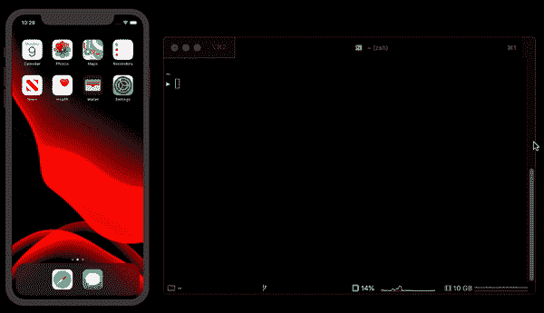
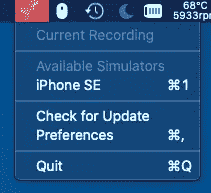

# 使用带有 Mimiq 的 Xcode 模拟器创建 gif

> 原文：<https://betterprogramming.pub/create-gifs-using-your-xcode-simulator-with-mimiq-581607a6a776>

## 与你的团队分享模拟器 gif 的简单、开源的方法


Mimiq 标志

并不是所有的公司都有从开发到生产交付产品的流程，但大多数公司都有一种方法来展示他们做了什么，并在进入生产之前一起回顾。大多数公司将使用拉式请求或合并请求作为一种方式来做到这一点。这就是所谓的代码审查。

代码审查对大多数团队来说是至关重要的。他们帮助团队协调和简化整个团队的代码质量。

让代码评审体验更好的一件事是邀请同行评审的拉请求，帮助他们更好地理解拉请求的上下文。要实现的一件事是使用 gif 作为上下文。作为一名 iOS 开发者，GIF 将围绕我们正在开发的功能以及它在新版本中的表现。

根据上面的描述，这就是我创建 [mimiq](https://github.com/wendyliga/mimiq) 的原因。Mimiq 是一个帮助你将 Xcode 模拟器录制成 GIF 格式的应用程序。这很简单。只需选择你想记录的模拟器，记录，并停止它。



行动中的 mimiq

[](https://github.com/wendyliga/mimiq) [## 温迪利加/米米克

### mimiq 是一个简单的可执行文件，用来记录你的 Xcode 模拟器，并将其转换成 GIF 格式。

github.com](https://github.com/wendyliga/mimiq) 

# 如何安装

我用家酿送来了 mimiq。请确保你已经安装了家酿软件——点击了解更多[。](https://brew.sh)

```
brew install wendyliga/core/mimiq
```

# 如何使用

您可以通过执行以下命令开始记录:

```
mimiq
```

然后按回车键停止。你可以在你的桌面上得到 GIF 结果。

您可以添加几个选项，比如为多模拟器设置指定模拟器。您可以通过执行以下命令来检查要记录的可用模拟器:

```
mimiq list
```

然后选择模拟器 UDID，并开始记录:

```
mimiq --udid 6ABC274C-76BB-483B-8DD6-8A9F8E486E0F
```

要了解更多细节，请查看 [mimiq 库](https://github.com/wendyliga/mimiq)。

# GUI 版本

[](https://github.com/wendyliga/mimiq-gui) [## wendyliga/mimiq-gui

### 用于 mimiq 的 Mac 应用程序(一个简单的 Xcode 模拟器 GIF Recoder)

github.com](https://github.com/wendyliga/mimiq-gui) 

如果你不是 CLI 的人，我可以帮你搞定。mimiq 有一个 GUI 版本。这是一个简单的状态栏应用程序——只需点击，点击并记录你的 GIF。



mimiq-gui

你可以在这里下载最新版本的。

# 就是这样！

谢谢你阅读它。希望 mimiq 可以帮助你向团队交付任务。愿你的同事喜欢审阅你漂亮的拉动式请求。