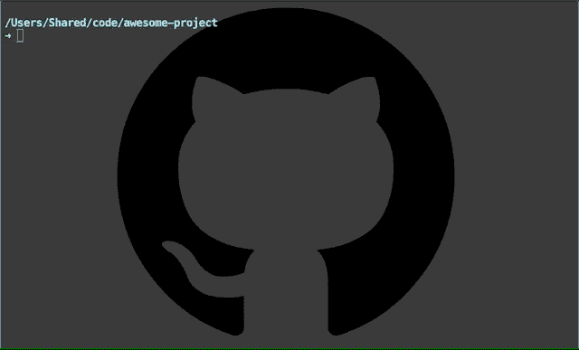
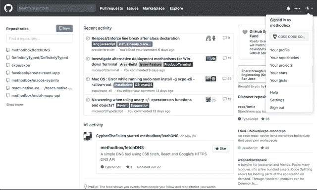
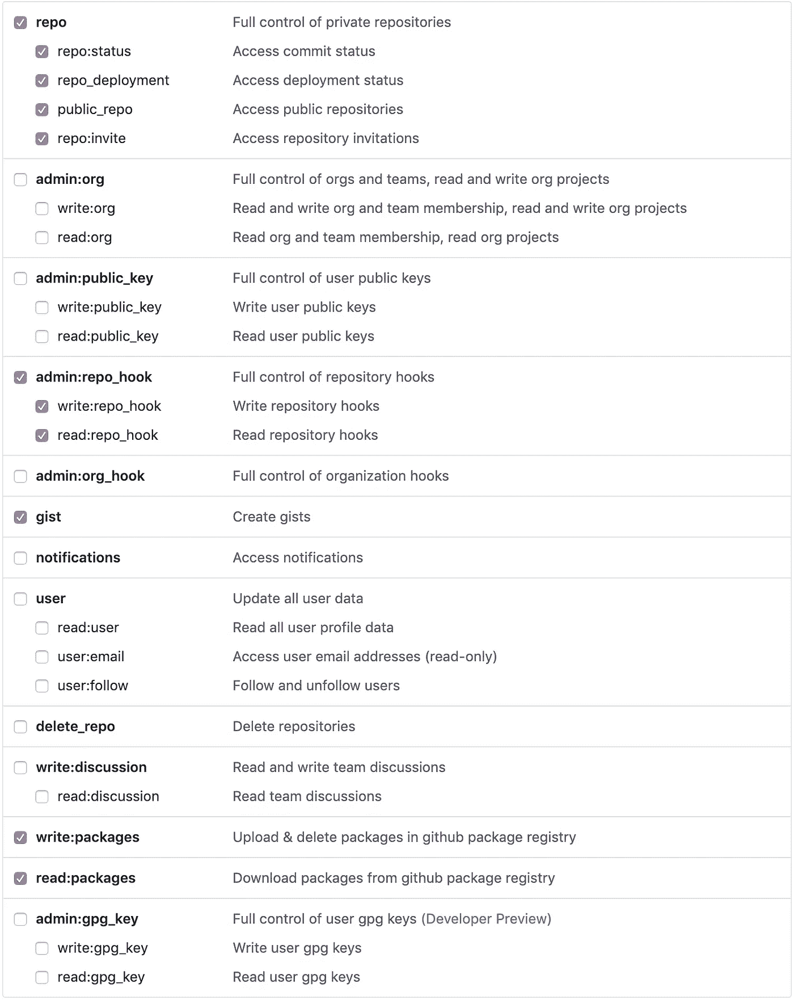
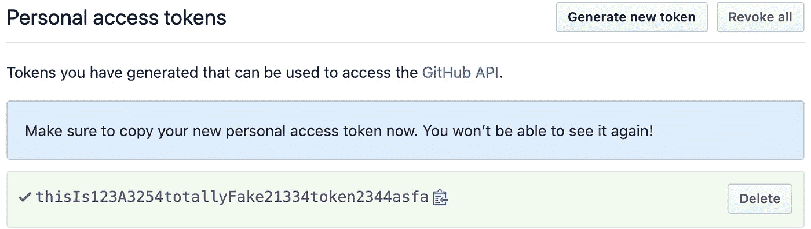

# 远程创建 GitHub Repos

> 原文：<https://betterprogramming.pub/create-github-repos-remotely-25153a6e6890>

## 只需一个命令，使用 Bash 脚本



我一直在寻找简化我的编码环境的方法。直到最近，[我还在托管自己的 Git 服务器](https://medium.com/@ChristopherShaffer/host-your-own-git-server-with-gitea-on-ubuntu-16-04-1a4c255ed4d5),用于私人回购和无法提交给 GitHub 的客户项目。一旦 GitHub 开始为*免费提供无限制的私人回购，这就不再有必要了。*

*然而，我缺少的一点是用 Bash 脚本自动创建 repos 的能力，这是我用我的私人 Git 服务器配置的，它是使用 [Gitea](https://gitea.io/en-us/) 托管的。Gitea 为此提供了一个 API，事实证明，GitHub 也是如此！*

*如果你想看 GitHub API 文档，可以在这里找到。*

*我将介绍如何使用 GitHub 的 repository API 创建一个简单的 Bash 脚本，并向您展示如何在您的编程环境中实现这一点。*

# *开始之前*

*本教程假设您使用的是 Mac，但是，这些相同的步骤在任何 Linux 机器上都可以很好地工作。它还假设您已经安装了 Git 或 Xcode 命令行工具，其中包括 Git。*

# *生成个人访问令牌*

*为了访问 GitHub 的 API，我们需要一个个人访问令牌。这个令牌被用作 GitHub and 的授权，只对*你的账户*发出请求，所以**保证它的安全非常重要——不要把令牌交给 GitHub，也不要和任何人分享。***

*首先登录你的 GitHub 账户，选择右上角的用户菜单，然后选择设置。从“设置”菜单中，选择左下角的“开发人员设置”。在那里，点击右上角的`Generate new token`按钮。迷路的话看看下面的 GIF。*

**

*导航 GitHub 菜单以生成个人访问令牌。*

*在“注释”字段中，为您的令牌提供一个易于识别其用途的名称或短语。我用了“回购管理”。*

*请注意，我们使用的 API**也可以用来以重要的方式修改您的 GitHub 帐户，**所以您可能希望限制令牌这样做。我的设置被配置为允许使用令牌在存储库上执行 [CRUD](https://en.wikipedia.org/wiki/Create,_read,_update_and_delete) 操作，但不进行任何帐户更改。*

*在下面的复选框字段中，在“选择范围”下，您可以确定此令牌允许的各种访问级别。我在下面附上了我的令牌设置的截图。*

**

*选择令牌权限可以控制令牌可以用于哪些 API 函数。明智地选择。*

*选择您的令牌权限后，滚动到底部并单击`Generate token`按钮确认您的设置。您将看到要复制的令牌—您可以单击蓝色剪贴板图标以简单的方式完成此操作。**务必现在复制令牌*，因为在此之后*你将永远*没有机会再这样做。****

**

*创建令牌后复制它。现在就做，否则你得重新开始！*

***请特别注意记下令牌，并安全存放，**因为一旦丢失就无法找回，但您可以*生成另一个。对于我们正在创建的脚本来说，这可能不是一个大问题，但如果您想要创建使用令牌的其他脚本或应用程序，您会希望将它放在手边。或者，您可以为每个用例生成一个单独的令牌。**

# *创建 Bash 脚本*

*我们有自己的 API 访问令牌，所以让我们创建 bash 脚本来远程创建 GitHub repos。这将允许我们在终端的任何地方使用一个命令在 GitHub 上创建一个新的 repo。它还将为我们的项目初始化 git。*

*使用您最喜欢的文本编辑器，在您的主目录中创建新文件。您可以随意命名它，但是我将我的命名为`setup-repo`——这也将是用于运行脚本的命令。注意，您不需要像普通的 bash 脚本一样在末尾包含`.sh`。我对像二进制文件一样使用的脚本这样做(它们提供了像二进制文件一样的命令)，但是如果您愿意，也可以使用文件扩展名。*

*一定要用自己的 GitHub 令牌替换`GH_API_TOKEN`的值。确保保留单引号。对`GH_USER`做同样的事情，并提供你的 GitHub 用户名。*

*您需要确保 `**curl**` **语句中的所有内容都显示为一行**，没有回车；在培养基上可能会有不同的表现。*

*我会在要点下面解释脚本在做什么。*

*帮助在 GitHub 上自动远程创建 repos 的脚本。*

*我们到底在这里做什么？我将在这里概述脚本中的每个步骤:*

1.  *我们定义了一个名为`GH_API_TOKEN`的 Bash 变量来存储我们的 API 令牌。如果令牌发生变化，编辑起来会更容易一些，而不是用 API 调用硬编码。*
2.  *`GH_USER`当然是你的 GitHub 用户名。*
3.  *`NEW_REPO_NAME`是一个 Bash 变量，它将存储脚本的第一个命令行参数；`$1`永远是第一个参数。我们将用它来命名我们的回购协议，就像`setup-repo new-repo-name`。在这个上下文中，`new-repo-name`将被存储在`$1`中。*
4.  *`CURRENT_DIR`正在使用`pwd`命令存储当前工作目录的值，或者我们现在所在的目录*。**
5.  *`PROJECT_DIR`将我们的项目目录的默认值定义为`CURRENT_DIR`，或者允许我们可选地为这个值提供一个参数。这将在我们运行`git init`时使用，它也默认为当前工作目录，或者为此接受一个可选值。*
6.  *`curl`命令正在调用 GitHub repos API 的“创建”端点，这里详述[的](https://developer.github.com/v3/repos/#create)。它插入了我们的令牌和回购名称变量，这样我们就可以在每次使用新的回购名称运行脚本时动态调用它。*
7.  *`git init`命令正在我们的项目目录中初始化 Git。我们传入`PROJECT_DIR`值，或者将它作为当前工作目录，或者将我们的项目目录参数值传递给它。当我们实际运行脚本时，我将在下面对此进行更多的解释。*
8.  *最后，使用`git remote add origin`,我们将远程添加到项目目录中的 Git 配置中。*

# *配置我们的提示*

*太好了，我们已经创建了我们的脚本，现在我们明白了它是如何工作的，但是我们如何使用它来创建一个新的回购呢？首先，我们需要让命令在提示符下可用。我使用的是 Zsh，但这也适用于 Bash，我将在下面介绍这一点。*

*我们需要使脚本可执行，然后以某种方式将其添加到我们的路径中。让我们打开终端来做这件事。进入终端后，运行以下命令以确保您在主目录中，并编辑脚本的权限。如果您没有用自己的文件名替换这个命令，我假设您使用了名称`setup-repo`。*

```
*cd ~
chmod 0500 setup-repo*
```

*命令`chmod`允许我们修改文件的权限。请注意，将权限设置为`0500`将允许您的用户读取和执行它，同时限制所有其他权限，包括您的用户将写入文件的能力。这是故意的；我们只想对我们的任何文件拥有绝对必要的最高级别的权限。如果出于某种原因你需要再次编辑它，你可以使用`chmod 0700`将文件设置为可写，但是当你完成后一定要将其切换回来。*

*我们现在可以执行这个脚本，但是我们希望能够在任何地方运行它*;*我们不希望必须在我们的主目录中才能工作。要做到这一点，最简单的解决方案就是在您的概要文件中添加一个别名。*

*如果您使用 Bash，这将是文件`~/.bashrc`，如果您使用 Zsh，编辑您的`~/.zshrc`文件并添加以下行。请注意，您可以将别名命名为任何名称，而不考虑脚本的文件名。*

```
*alias setup-repo=~/setup-repo*
```

*保存文件后，您可以使用命令`source ~/.bashrc`或`source ~/.zshrc`在当前终端会话中使这一更改生效。*

# *使用新命令*

*现在我们已经准备好了脚本并配置了提示设置，我们可以使用如下所示的脚本了。你可以**在 Mac 上的终端中的任何目录下执行这个操作**它就会工作。*

```
*setup-repo [repo name] [path to project]# Example - when already in the project directory, there is no 
# need to provide [path to project]setup-repo awesome-repo# Example - when not in the project directory, you can specify
# the exact path. In this example, my project is in the ***code*** folder 
# in my home directory.setup-repo awesome-repo ~/code/awesome-repo*
```

*当我们回顾我们的脚本之前在做什么时，我们创建了一个名为`PROJECT_DIR`的变量。当我们在第二个参数中调用上面的命令`~/code/awesome-repo`时，我们将提供该值，但这是可选的。正如代码注释所指出的，在没有这个选项的情况下运行命令将在当前工作目录中初始化 repo。*

# *结论*

*这只是自动化您的工作流程并减少每天完成编码任务所需的认知开销的一部分，但每一点都有帮助。希望这能为您节省一些时间，并简化您的 Git 管理。*

*请在评论中留下反馈和问题，我会尽快回复。*

*感谢阅读！*