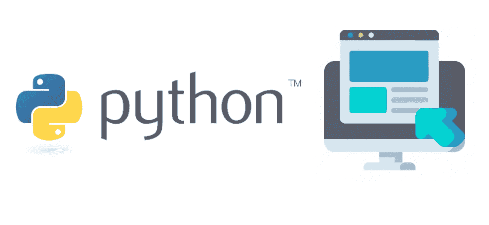

# 使用 Tkinter 用 Python 创建 GUI

> 原文：<https://betterprogramming.pub/create-guis-with-python-using-tkinter-aa8c4781ca4b>

## 循序渐进的指南



作者照片。

# Tkinter 是什么？

[Tkinter](https://docs.python.org/3/library/tkinter.html) 是一个内置的 Python GUI 框架，它是轻量级的，易于上手。它也是跨平台的，这意味着相同的 Python 代码可以在 Windows、macOS 和 Linux 上工作。然而，应用程序的样式有些局限，它肯定不是最漂亮的 GUI 框架。

无论如何，对于构建功能胜过美观的简单项目来说，这是一个很好的选择。

# 使用 Tkinter 创建 GUI

## 导入 Tkinter

要使用 Tkinter 库，只需运行一行代码:

```
from tkinter import *
```

## 创建我们的主类

我们定义了一个名为`Application`的新类，它继承了 Tkinter 库中的`Tk`类。接下来，我们用我们选择的布局管理器为我们的类初始化一个构造函数。这里，我们使用网格布局:

## 添加小部件

就这样，我们准备在我们的应用程序中添加一些小部件！为了给我们的应用程序添加一个新的小部件，我们可以调用`grid()`方法。它接受几个可选参数:

*   `column`:放置 widget 的列；默认值为 0(最左边的列)。
*   `columnspan`:小工具占多少列；默认为 1。
*   `ipadx`、`ipady`:在小工具边框内水平和垂直填充多少像素。
*   `padx`，`pady`:在`v`的边框之外，水平和垂直填充小部件的像素数量。
*   `row`:放置小工具的行；默认仍为空的第一行。
*   `rowspan`:widget 占多少行；默认为 1。
*   `sticky`:单元格比小工具大怎么办。默认情况下，使用`sticky=’’`，小部件在其单元格中居中。`Sticky`可能是 N、E、S、W、NE、NW、SE 和 SW 中的零个或多个的字符串串联——指示微件所附着的单元的边和角的罗盘方向。

现在我们知道了如何在网格布局中添加小部件，让我们来创建它们吧！

# 基本框架

*   显示为一个简单的矩形。
*   主要用作受布局管理器控制的其他小部件的容器，例如网格。

为了创建一个新的`Frame`小部件，我们指定了高度和宽度。然后我们可以将它添加到我们的布局中:

```
frame = Frame(height=20, width=640)
frame.grid(row=0, column=0)
```

除了高度和宽度之外，我们还可以传递一些其他常见的额外参数来设置这个小部件的样式:

*   `padding`
*   `relief` ( `FLAT`、`RAISED`、`SUNKEN`、`GROOVE`或`RIDGE`)
*   `borderwidth`

# 标签

*   显示文本或图像。
*   用于识别控件或用户界面的其他部分，提供文本反馈或结果等。

示例 1:创建一个带有白色`Hello World!`文本和蓝色背景的`Label`小部件:

```
label = Label(text='Hello World!', fg='white', bg='blue')
```

示例 2:创建一个显示图像的`Label`小部件:

```
my_image = PhotoImage(file='myimage.png')
label = Label(image=my_image)
label.image = my_image
```

*注意:这个不支持。jpg 文件。*

其他常见的可选参数:

*   `justify`:文本对齐:左对齐、居中对齐或右对齐
*   `textvariable`:作为文本的替代，从变量中获取字符串，当变量改变时更新。
*   `wraplength`:用于多行标签。让 Tk 计算换行符，而不是在文本字符串中显式嵌入换行符。

# 纽扣

示例:

```
button = Button(text="Click me!", command=self.on_click)
```

`on_click`是在我们的类中定义的函数的名字，这个函数在按钮被点击时被执行。

其他常见的可选参数:

*   `padx`
*   `pady`
*   `relief` ( `FLAT`、`RAISED`、`SUNKEN`、`GROOVE`或`RIDGE`)
*   `borderwidth`

# 尺度索结扣

以下是创建两个带有文本标签`male`和`female`的复选按钮的示例，其中每当任一复选按钮上的值发生变化时，都会调用`on_check`函数。

示例:

# 单选按钮

以下是创建三个带有文本标签`home`、`office`和`mobile`的单选按钮的示例，其中每当任何单选按钮上的值发生变化时，都会调用`on_select`函数。

示例:

# 进入

*   向用户显示单个输入文本字段。

示例:

```
text = StringVar(self, 'placeholder text')
entry = Entry(textvariable=text)
```

# 组合框

示例:

# 包扎

现在，我们需要实例化我们的`Application`类并运行它。

## 事件驱动编程的事件循环

*   当你有一个图形用户界面时，为了让程序注册事件(例如鼠标悬停事件)，它必须连续循环运行。
*   这个循环将一直运行，直到程序终止。

```
if __name__ == "__main__":
    app = Application()
    app.title('My First TKinter App')  # window title
    # this loop allows for event-driven programming
    app.mainloop()
```

就是这样！只需运行这个程序，你就会拥有一个用 Python 制作的可工作的 GUI。感谢阅读！