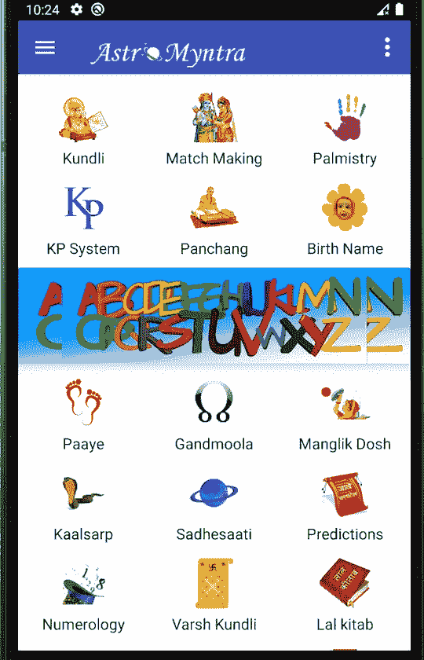

# 在 RecyclerView Android 中创建不同的视图类型

> 原文：<https://betterprogramming.pub/create-heterogeneous-views-using-recyclerview-in-android-e2ad626686f6>

## 了解如何使用两种不同的布局通过 RecyclerView 创建不同的视图


照片由[宝拉·拉瓦莱](https://unsplash.com/@paulathevalley?utm_source=unsplash&utm_medium=referral&utm_content=creditCopyText)在 [Unsplash](https://unsplash.com/s/photos/android?utm_source=unsplash&utm_medium=referral&utm_content=creditCopyText) 拍摄

`RecyclerView`是 v7 支持库中添加到 Android 的一个`ViewGroup`。使用`RecyclerView`，您可以借助 XML 将任何复杂的布局设计成列表。

`RecyclerView`是`ListView`和`GridView`的继承者，是`ListView`和`GridView`的改进。它让我们可以自由地创建任何类型的视图，当列表中的项目非常大时，它的表现令人惊讶。

# **第一步**

我们将创建以下屏幕，该屏幕将使用`RecyclerView`在`GridView`中显示一个作为横幅嵌入器的图像。



首先，我们将创建两个布局文件，`image_with_title.xml`和`banner_image.xml` *。*

`image_with_title.xml`文件将在图像下方显示标题。

`banner_image.xml` 只会显示一张占据屏幕全宽的图片，如上图截图所示。

# **第二步**

现在我已经创建了一个模型类，它有三个实例变量、两个静态变量和一个初始化实例变量的构造函数。

两个静态和最终变量`TYPE_BANNER`和`TYPE_IMAGE_WITH_TEXT`将用于检查哪个布局需要膨胀。

# **第三步**

在这一步，我们将创建我们的适配器类，它将扩展`RecyclerView.ViewHolder`类，并将覆盖它的必要方法。

```
**public class** MultiViewTypeAdapter **extends** RecyclerView.Adapter {

    **private** ArrayList<MultiViewModel> **dataSet**;
    Context **mContext**;
    **int total_types**;
}
```

我创建了两个静态类，它们都扩展了`Recyclerview.ViewHolder`类。

```
**public static class** BannerTypeViewHolder **extends** RecyclerView.ViewHolder {

    ImageView **bannerImg**;

    **public** BannerTypeViewHolder(View itemView) {
        **super**(itemView);
        **this**.**bannerImg** = itemView.findViewById(R.id.***imgBanner***);
    }
}

**public static class** ImageTypeViewHolder **extends** RecyclerView.ViewHolder {

    TextView **txtType**;
    ImageView **image**;

    **public** ImageTypeViewHolder(View itemView) {
        **super**(itemView);

        **this**.**txtType** = (TextView) itemView.findViewById(R.id.***txtTitle***);
        **this**.**image** = (ImageView) itemView.findViewById(R.id.***imageView***);
    }
}
```

已经创建了`BannerTypeViewHolder`类来从`banner_image.xml`文件中访问横幅图像，类似地，`ImageTypeViewHolder` 类从`image_with_title.xml` *中获取标题和图像的 id。*

现在，创建`MultiViewTypeAdapter`类的构造函数并初始化`MultiViewModel`类型的数组列表。

```
**public** MultiViewTypeAdapter(ArrayList<MultiViewModel> data, Context context) {
    **this**.**dataSet** = data;
    **this**.**mContext** = context;
    **total_types** = **dataSet**.size();
}
```

是时候实现在`TYPE` *基础上膨胀布局文件的`onCreateViewHolder`方法了。*

下面几行代码用于填充屏幕的整个宽度，以便我们的横幅图像能够适合。

```
**final** ViewGroup.LayoutParams lp = view.getLayoutParams();
**if** (lp **instanceof** StaggeredGridLayoutManager.LayoutParams)
{
    StaggeredGridLayoutManager.LayoutParams sglp = (StaggeredGridLayoutManager.LayoutParams)lp;
    sglp.setFullSpan(**true**);
}
```

现在，全面实施`onCreateViewHolder`。

```
@Override
**public** RecyclerView.ViewHolder onCreateViewHolder(ViewGroup parent, **int** viewType) {

    View view;
    **switch** (viewType) {
        **case** MultiViewModel.***TYPE_BANNER***:
            view = LayoutInflater.*from*(parent.getContext()).inflate(R.layout.***banner_ad_layout***, parent, **false**);
            **final** ViewGroup.LayoutParams lp = view.getLayoutParams();
            **if** (lp **instanceof** StaggeredGridLayoutManager.LayoutParams) {
                StaggeredGridLayoutManager.LayoutParams sglp =
                        (StaggeredGridLayoutManager.LayoutParams) lp;
                sglp.setFullSpan(**true**);
            }

            **return new** BannerTypeViewHolder(view);
        **case** MultiViewModel.***TYPE_IMAGE_WITH_TEXT***:
            view = LayoutInflater.*from*(parent.getContext()).inflate(R.layout.***gridview_with_text_image***, parent, **false**);
            **return new** ImageTypeViewHolder(view);

    }

    **return null**;
}
```

当`0`被传入`MultiViewModel`构造函数时，横幅图像将被显示。否则，将显示标题图像。

`getItemViewType()`方法告诉`onBindViewHolder`方法它必须显示哪个视图。

```
@Override
**public int** getItemViewType(**int** position) {

    **switch** (**dataSet**.get(position).**type**) {
        **case** 0:
            **return** MultiViewModel.***TYPE_BANNER***;
        **case** 1:
            **return** MultiViewModel.***TYPE_IMAGE_WITH_TEXT***;

    }
    **return** 0;
}
```

`onBindViewHolder()`方法:

```
@Override
**public void** onBindViewHolder(**final** RecyclerView.ViewHolder holder, **final int** listPosition) {

    MultiViewModel object = **dataSet**.get(listPosition);

    **if** (object != **null**) {
        **switch** (object.**type**) {
            **case** MultiViewModel.***TYPE_BANNER***:
                ((BannerTypeViewHolder) holder).**bannerImg**.setBackgroundResource(R.drawable.***banner***);;

                **break**;
            **case** MultiViewModel.***TYPE_IMAGE_WITH_TEXT***:
                ((ImageTypeViewHolder) holder).**txtType**.setText(object.**text**);
                ((ImageTypeViewHolder) holder).**image**.setImageResource(object.**data**);
                **break**;
        }
    }
}
```

现在，我们适配器的最终代码是:

# **第四步**

这是最后一步，我们将简单地创建将数据传递到适配器的活动和一个包含`RecyclerView`的 XML 文件。

在您的`onCreate()`方法中，粘贴以下代码:

```
**gridViewModelArrayList** = **new** ArrayList();

prepareData();

 MultiViewTypeAdapter adapter = **new** MultiViewTypeAdapter(**gridViewModelArrayList**,**this**);
 *// LinearLayoutManager linearLayoutManager = new LinearLayoutManager(this, RecyclerView.VERTICAL, false);* **mRecyclerView** = findViewById(R.id.***recyclerView***);
 StaggeredGridLayoutManager lm =
         **new** StaggeredGridLayoutManager(3, StaggeredGridLayoutManager.***VERTICAL***);
 **mRecyclerView**.setLayoutManager(lm);
 **mRecyclerView**.setItemAnimator(**new** DefaultItemAnimator());
 **mRecyclerView**.setAdapter(adapter);
```

`prepareData()`方法准备要在`RecyclerView`适配器中设置的数据。

注意:`i==6`表示我们希望在第六个项目后显示横幅。

```
**void** prepareData()
{
    MultiViewModel gridViewModel=**null**;
    **for** (**int** i=0;i<**activity_names**.**length**;i++)
    {
        **if** (i==6)
        {
            gridViewModel = **new** MultiViewModel(MultiViewModel.***TYPE_BANNER***,**""**,R.drawable.***banner***);
            **gridViewModelArrayList**.add(gridViewModel);
             gridViewModel = **new** MultiViewModel(MultiViewModel.***TYPE_IMAGE_WITH_TEXT***, **activity_names**[i], **icons**[i]);
            **gridViewModelArrayList**.add(gridViewModel);
        }
        **else** {
            gridViewModel = **new** MultiViewModel(MultiViewModel.***TYPE_IMAGE_WITH_TEXT***, **activity_names**[i], **icons**[i]);
            **gridViewModelArrayList**.add(gridViewModel);
        }
    }
}
```

`activity.xml`

# **总结**

*   我们已经讨论了什么是`RecyclerView`以及何时使用它。
*   我们已经创建了两个 XML 文件，在`RecyclerView`中将我们的视图显示为一个列表。
*   创建了一个模型类来保存我们的数据。
*   创建了一个适配器来创建和绑定视图。
*   最后，我们准备好数据，并将其传递给适配器类。

我希望你喜欢读这篇文章，你也可以访问我的 [**网站**](http://thehimanshuverma.com/) ，在那里我会定期发布文章。

[**订阅**](https://mailchi.mp/b08da935e5d9/himanshuverma) 我的邮件列表，直接在您的收件箱中提前获得我的文章，或者关注我自己在媒体上发表的文章 [**【代码怪兽】**](https://medium.com/the-code-monster) 来完善您的技术知识。

# 了解你的作者

希曼舒·维尔马毕业于印度勒克瑙的 APJ 阿卜杜勒·卡拉姆大学博士。他是 Android & IOS 开发人员、机器学习和数据科学学习者、金融顾问和博客作者。