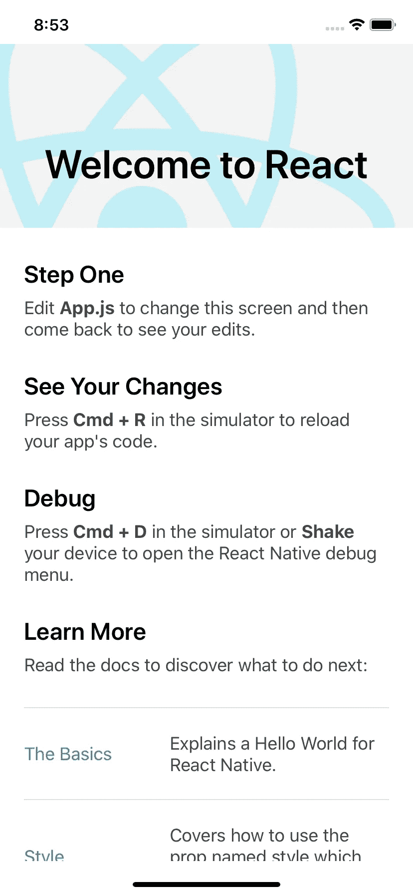
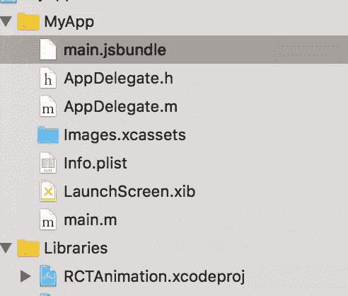
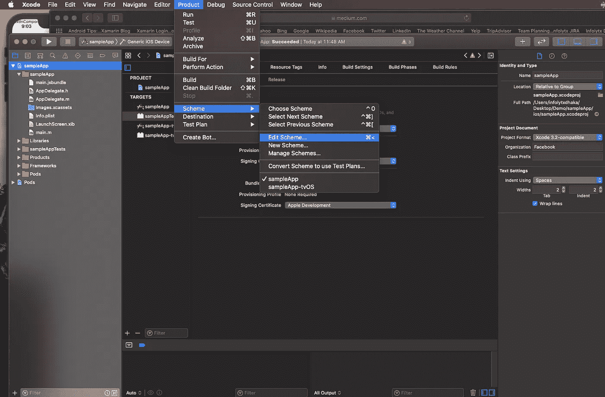
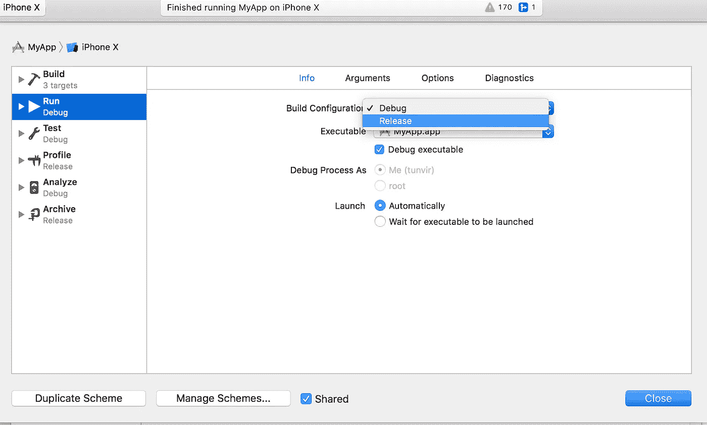

# 从 React 本地项目创建一个 IPA 和 APK

> 原文：<https://betterprogramming.pub/create-ipa-and-apk-from-react-native-72fe53c6a8db>

## 简单的分步指南


照片由[里卡多·罗查](https://unsplash.com/@rcrazy?utm_source=unsplash&utm_medium=referral&utm_content=creditCopyText)在 [Unsplash](https://unsplash.com/s/photos/creative?utm_source=unsplash&utm_medium=referral&utm_content=creditCopyText) 上拍摄

本教程将指导您如何从 React 本地项目创建 IPA 和 APK。让我们开始吧。

首先，使用这个 CLI 创建一个 React 本机应用程序。

```
react-native init MyApp --package=com.MyApp.MyApp// or in newer version of CLInpx react-native init MyApp 
```

现在创建的应用程序非常简单——就像这样。



现在，让我们构建 myApp 项目的 IPA 和 APK。

先查 iOS 吧。

# ios

## 第一步

从根文件夹中使用下面的简单命令打开带有 Xcode 的 iOS 项目。

```
xed ./ios
```

## **第二步**

现在将以下命令粘贴到终端中

```
react-native bundle --entry-file index.js --platform ios --dev false --bundle-output ios/main.jsbundle --assets-dest ios
```



main.jsbundle

## **第三步**

从 Xcode 编辑方案，如下所示:



产品->方案->编辑方案



编辑要发布的方案

现在您有了一个独立的 Xcode 项目，并准备像原生 Xcode 项目一样进行构建/发布。

现在是安卓的时候了。

# 机器人

## 第一步

转到 react-native 项目的`android/`目录

用下面这一行创建一个名为`local.properties`的文件:

```
sdk.dir = /Users/USERNAME/Library/Android/sdk
```

## 第二步

现在用下面的命令创建一个离线 JS 包。

注意:您可能需要在`~/ourApp/android/app/src/main/assets`下创建一个资产文件夹。

```
react-native bundle --platform android --dev false --entry-file index.js --bundle-output android/app/src/main/assets/index.android.bundle --assets-dest android/app/src/main/res/
```

## 第三步

现在运行这个命令来创建离线资源文件和其他文件。

```
cd android && ./gradlew assembleRelease
```

使用 Android Studio 打开`~/android`文件夹，你就有了你的独立 Android 应用。

您可以使用 Android Studio 构建未签名/已签名的 APK。

厌倦了看一些严肃的东西。让我们从这里开始重新思考一下。

## [32+搞笑代码评论人家居然写的](https://medium.com/javascript-in-plain-english/30-funny-code-comments-that-will-make-you-laugh-1c1b54d4ab00)。

# 感谢阅读。干杯🥂