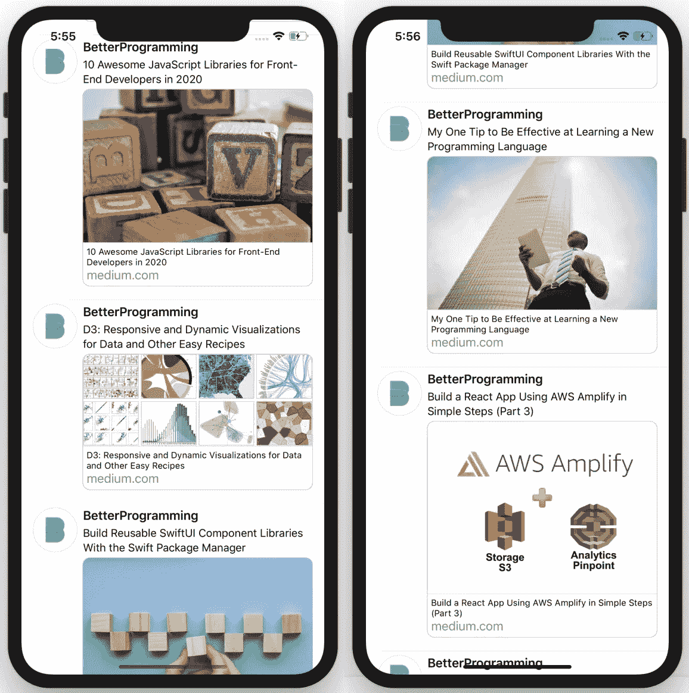

# 使用 SwiftUI 在您的 iOS 应用程序中创建类似 Twitter 的链接预览

> 原文：<https://betterprogramming.pub/create-link-preview-without-linkpresentation-4af049966854>

## 了解一种不使用 LinkPresentation 框架创建链接预览的简单方法，该框架仅在 iOS 13+上可用


图片由 [Gerd Altmann](https://pixabay.com/users/geralt-9301/) 从 [Pixabay](https://pixabay.com/) 拍摄

更多的应用程序在帖子或消息中实现了链接预览，这是一种显示链接指向的网站的更多信息的便捷方式，如标题和预览图像。

在 2019 年 WWDC 大会上，苹果发布了 LinkPresentation 框架，旨在获取、提供和展示 iOS 应用程序中的丰富链接。

然而，这个框架只能在 iOS 13+的设备上工作，这意味着运行 iOS 12 或更低版本的 iPhone 设备无法利用该功能。

在本文中，我将向您展示一种使用开发良好的开源库 [SwiftLinkPreview](https://github.com/LeonardoCardoso/SwiftLinkPreview) 创建链接预览的简单方法，该库支持 iOS 8+,因此，它将使 99.9%的 iPhone 设备都可以使用链接预览。

本质上，你不需要担心设备的兼容性。

# 项目概述

如下所示，当前教程旨在构建一个 tweets 列表，每个 tweets 都显示一篇发表在 Medium 上的 Better Programming 出版物上的文章的链接预览。

总的来说，用户界面试图模仿最新的 iOS Twitter 应用程序，并且只保留与当前教程最相关的基本元素。

具体地，链接预览包括文章的图像、标题和到媒体网站的链接，以指示这是链接预览。

每篇文章的元数据都是通过使用上面提到的 SwiftLinkPreview 库来获取和处理的，本文末尾提供了对该库的引用。

该项目使用 Swift v5.1.3 完成，SwiftUI 用于用户界面编程。



要制造的产品

# 第一步。项目设置

## 创建项目

在 Xcode 中，创建单视图 app 项目(*文件*->-*新建*->-*项目*)。将项目命名为`LinkPreviewSwiftUI`(或任何您想要的名称)。

指定我们希望使用 Swift 作为编程语言，SwiftUI 用于用户界面配置。

## 使用 CocoaPods 集成 SwiftLinkPreview

我们将使用 [CocoaPods](https://cocoapods.org/) 将 SwiftLinkPreview 集成到我们的项目中。为此，请遵循以下步骤。

*   关闭我们刚刚创建的项目。
*   打开终端，使用`$ cd`切换到您的项目目录。
*   使用`$ pod init`创建一个 Podfile。注意，如果你的电脑上没有安装 CocoaPods，请参考[官网](https://guides.cocoapods.org/using/getting-started.html)获取安装说明。
*   打开您的 Podfile 并更新它，如下所示。

```
platform :ios, '9.0'
// update the target name below if your project has a different nametarget 'LinkPreviewSwiftUI' do
    use_frameworks!
    pod 'SwiftLinkPreview', '~> 3.1.0'
end
```

*   保存并关闭您的 Podfile。
*   在终端中，通过运行`$ pod install`完成框架安装。
*   打开刚刚创建的`LinkPreviewSwiftUI`工作区。

## 导入框架

打开`ContentView.swift`文件，导入文件顶部的`SwiftLinkPreview`框架。

# 第二步。数据和资源

在我们构建用户界面之前，让我们收集必要的数据和将在这个应用程序中使用的其他资源。

## 获取缩略图

首先，从[这个网站](https://pbs.twimg.com/profile_images/1124437426485776384/OM3m0rVR_400x400.png)下载更好编程的 Twitter 账户的缩略图。然后，您可以将此图像拖放到您的项目中，这会将图像复制到您的项目文件夹中。改名为`BP_Thumbnail.png`。

## 数据模型

其次，为项目创建数据模型。这是一个符合`Identifiable`协议的数据类。

这个`Article`类有五个实例属性:`id`、`title`、`link`、`imageLink`和`imageData`。

它们中的每一个都应该通过它的名字不言自明。如果你现在还不清楚，不要担心，因为列表中会用到这些实例，你很容易就能明白什么是什么。

此外，我准备了一个最新的更好的编程文章的链接列表，这些文章将在当前的项目中使用。

数据模型

## 远程数据提取器

链接预览的全部目的是为一个网站的链接提供一些信息，这意味着这些信息将被远程获取。为此，我们可以创建如下所示的数据提取器。

用于远程数据提取的商品提取器

具体来说，这个`ArticleFetcher`类符合`ObservableObject`协议，因此可以观察到它的值。

属性`article`为`Article`类型，标记为`@Published`，以便在发生变化时通知相关观察者。

要使用`SwiftLinkPreview`，您可以简单地在初始化方法中创建一个没有任何参数的实例，尽管它允许您通过指定额外的参数，如`URLSession`和`DispatchQueue`，来提供关于链接预览如何工作的定制配置选项。

但是，对于当前的教程，我们不需要担心设置这些参数。

如您所见，`SwiftLinkPreview`实例将调用`preview()`方法。当请求成功完成时，异步返回一个`struct`类型的`response`实例。

响应有几个与链接信息表示相关的重要属性。

对于当前教程，我们将访问它的`title`、`canonicalURL`和`image`属性，这些属性将被映射到一个`Article`实例的`title`、`link`和`imageLink`属性。

当`image`属性不是`nil`时，我们可以简单地获取图像数据并保存到`Article`实例的`imageData`属性中。

如果您想了解更多关于`response`数据结构的信息，可以参考本文末尾提供的参考资料。

# 第三步。用户界面

接下来，我们准备构建应用程序的用户界面。为了本教程的简单性，应用程序将只显示推文列表，不会设置任何用户交互(例如，点击手势)。

## 名单

正如你在下面看到的，这个应用程序的主要组件是一个`List`，每行显示一篇文章。

具体来说，对于每一行，我们将创建一个`ArticleRow`，它将相应的`article`作为初始化参数。

用户界面

## 这一排

当一个`ArticleRow`实例被创建时，我们将创建一个`ArticleFetcher`实例，它将负责从互联网获取数据。

因为`ArticleRow`将观察`articleFetcher`，当`article`在获取相关数据后被更新时，该行的用户界面将相应地更新。

`ArticleRow`的配置基本上是使用 SwiftUI 中的一些常用视图，包括`Text`和`Image`。我不打算详细解释它们，因为这不是当前教程的重点。

## 圆形拐角形状

但是，如果您运行代码，您会发现它不起作用，因为第 35 行中使用的形状`RoundedCorners`无法被识别。要解决这个问题，您可以简单地注释掉这一行。

但是，运行项目时，您会看到图像的角将超出预览的边界视图，这可能有点烦人。因此，您可以将自定义形状`RoundedCorners`添加到您的项目中，而不是注释掉上面的行。

基本上，它是一个符合`Shape`协议的结构。通过实现`path(in: Rect) -> Path`函数，它创建了一个带有圆角的形状，使用时可以为它的四个角指定圆角。

圆形拐角形状

构建并运行项目，您应该能够看到类似于本文开头的截图。如果你有任何问题就让我知道。我非常乐意帮助你。

# 结论

这就是我对本教程的全部内容。总之，我们学习了如何使用`SwiftLinkPreview`框架获取数据，为链接准备预览。

我们还简要介绍了 SwiftUI 的`List`的一些基本实现，其中涉及异步数据获取。

# 参考

*   [swift link preview 框架](https://github.com/LeonardoCardoso/SwiftLinkPreview)
*   [椰子安装](https://guides.cocoapods.org/using/getting-started.html)
*   [堆栈溢出上的圆角形状](https://stackoverflow.com/questions/56760335/round-specific-corners-swiftui)