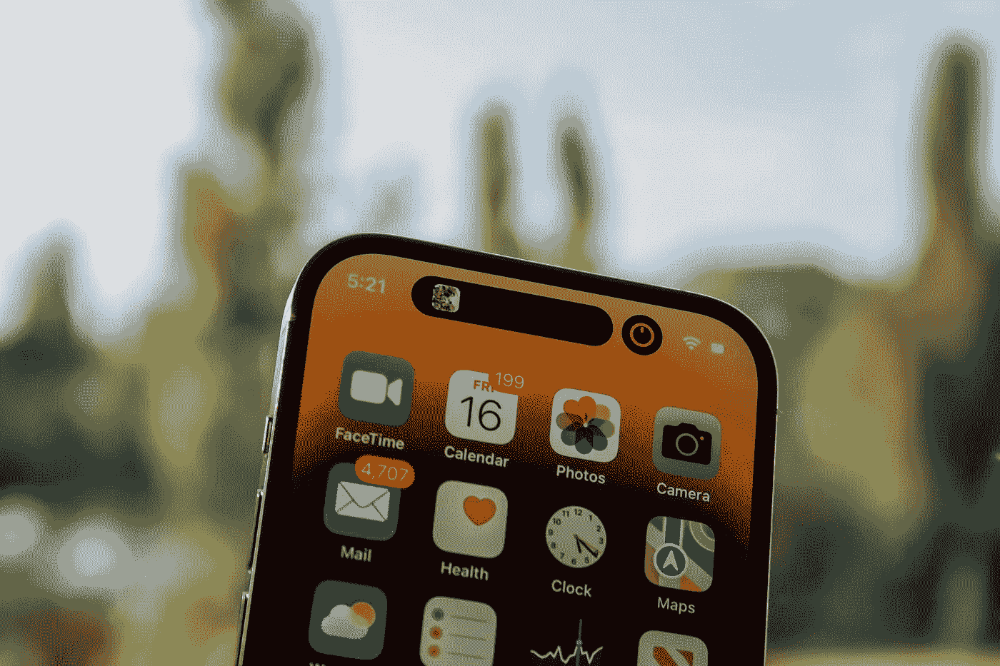
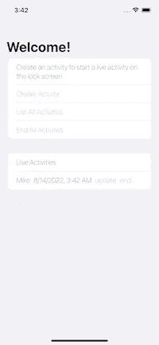
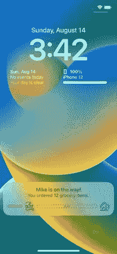
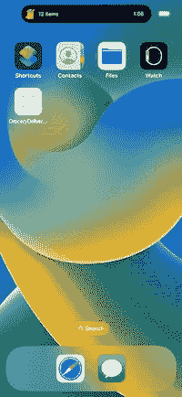
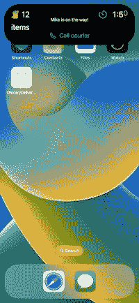

# 在 iOS 16 上使用 ActivityKit 创建实时活动和动态岛

> 原文：<https://betterprogramming.pub/create-live-activities-with-activitykit-on-ios-16-beta-4766a347035b>

## 在你的锁屏和动态岛中获得实时更新


```
API support iOS 16.1+ Beta iPadOS 16.1+ Beta Mac Catalyst 16.1+ BetaThe final code has been updated for the iPhone 14 series that supports Dynamic Island.
```

如果你是一个一直关注苹果创新的严格开发者，你一定听说过最近的“在锁屏和有直播活动的动态岛中显示直播数据”。

苹果在几周前宣布了它，然后我听到了关于它的消息。

苹果为它提供了一个新的框架，名为 ActivityKit。使用 ActivityKit，您可以在 iPhone 锁屏和动态岛中以实时活动的形式分享应用程序的实时更新。

实时活动在锁定屏幕上使用 [WidgetKit](https://developer.apple.com/documentation/WidgetKit) 功能和 [SwiftUI](https://developer.apple.com/documentation/SwiftUI) 作为其用户界面。

> ActivityKit 的角色是处理每个实时活动的生命周期:您使用它的 API 来请求、更新和结束一个实时活动。—苹果公司

让我们想象一个运动 app。这个应用程序用户可能想要跟踪足球比赛的目标和其他统计数据:传球，射门等。，在 iPhone 锁定屏幕上。

另一个例子可能是送餐应用程序。你知道比萨饼消费者可能是不耐烦的用户。无需打开应用程序，应用程序用户就可以在 iPhone 锁屏上关注披萨快递员。另一个可能是杂货应用。

对于示例来说，这就足够了。好了，让我们开始现场活动编码。

# 如何编写实时活动应用程序



照片由[詹姆斯·亚雷马](https://unsplash.com/@jamesyarema?utm_source=unsplash&utm_medium=referral&utm_content=creditCopyText)在 [Unsplash](https://unsplash.com/?utm_source=unsplash&utm_medium=referral&utm_content=creditCopyText) 上拍摄

我们必须创建一个小部件来配置 ActivityKit。它类似于小部件扩展。

我们将使用 [SwiftUI](https://developer.apple.com/documentation/SwiftUI) 和 [WidgetKit](https://developer.apple.com/documentation/WidgetKit) 来创建实时活动的用户界面。Live Activities 的工作方式类似于 Widget Extension，支持 Widget 和 Live Activities 之间的代码共享。

然而，与小部件相比，实时活动使用不同的机制来接收更新。

> 实时活动通过 ActivityKit 或接收远程推送通知从您的应用程序接收更新的数据，而不是使用时间轴机制。—苹果公司

# **重要提示**

现场活动仅在 iPhone 上可用。

Live Activities 和 ActivityKit 不会包含在 iOS 16 的初始公开发布版本中，但会在今年晚些时候的更新中公开提供(计划在 iOS 16.1 中提供)。一旦公开发布，您就可以将包含实时活动的应用程序提交到 App Store。

我将创建一个杂货交付应用程序。然后，我将为交付进度的实时活动创建一个 ActivityKit 小部件。

如果您已经在应用程序中提供了微件，您可以将实时活动的用户界面代码添加到现有的微件扩展中，并且可以在微件和实时活动之间重用代码。

不要忘记，尽管实时活动利用了 widgets 的功能，但它们不是小部件。实时活动不使用时间轴机制来提供用户界面。

# 创建应用程序


由 [Yura Fresh](https://unsplash.com/@mr_fresh?utm_source=medium&utm_medium=referral) 在 [Unsplash](https://unsplash.com?utm_source=medium&utm_medium=referral) 上拍摄的照片

我将允许用户通过在锁屏和动态岛中跟踪交付进度的按钮开始实时活动。

*   按照导航用 SwiftUI 创建一个单独的 app，然后命名为`GroceryDeliveryApp`。

*Xcode - >文件- >新建- >项目- > App*

*   将以下键添加到应用程序的`info.plist`中，并设置为是。

`NSSupportsLiveActivities`

此键将支持应用程序进行实时活动。

*   配置应用程序后，我们必须创建一个小部件扩展。

按照导航创建一个小部件扩展，然后将其命名为`DeliveryTrackWidget`。

*项目导航器- >选择项目- >从目标列表中添加目标- > Widget 扩展*

*   将下面的键添加到扩展`info.plist`中，并将其设置为 YES。

`NSSupportsLiveActivities`

该键将支持实时活动的扩展。

一旦创建了应用程序和微件扩展，您就可以随心所欲地进行设计了。



首先我们需要创建一个`ActivityAttributes`。

我们使用`ActivityAttributes`来标识一个实时活动。然后，我们使用`ContentState`来指定动态内容。我用下面的代码创建了一个`ActivityAttributes`结构:

```
import SwiftUI
import ActivityKit

struct GroceryDeliveryAppAttributes: ActivityAttributes {
    public typealias LiveDeliveryData = ContentState

    public struct ContentState: Codable, Hashable {
        var courierName: String
        var deliveryTime: Date
    }
    var numberOfGroceyItems: Int
}
```

然后，我们需要用`Activity`类创建一个实时活动请求。`Activity`类接受`ActivityAttributes`结构的通用类型。
注意，如果要更新或结束这个活动，必须在这里传递`pushType`值。

`pushType`令牌值代表通过苹果推送服务(APS)系统更新你在特定 iOS 设备上的活动。您的应用程序将在活动请求之后接收一个 push 令牌来设置 APS 协议，然后您将能够通过 APS 发送活动更新有效负载。

请注意，ActivityKit 更新和远程推送通知更新的动态数据大小不能超过 4KB。

我用下面的代码创建了一个`ActivityAttributes`结构:

```
let attributes = GroceryDeliveryAppAttributes(numberOfGroceyItems: 12)
let contentState = GroceryDeliveryAppAttributes.LiveDeliveryData(courierName: "Mike", deliveryTime: .now + 120)
do {
    let _ = try Activity<GroceryDeliveryAppAttributes>.request(
        attributes: attributes,
        contentState: contentState,
        pushType: nil)
} catch (let error) {
    print(error.localizedDescription)
}
```

确保有现场活动。不要忘记，用户可以在 iPhone 上的设置应用程序中选择停用应用程序的实时活动。

如果您想检测实时活动是否可用，以及用户是否允许您的应用程序使用实时活动，您可以使用`areActivitiesEnabled`和`activityEnablementUpdates`来完成。

此外，要观察正在进行的实时活动的状态，您可以使用`activityStateUpdates`。

一旦您创建了一个实时活动，您可以通过`ContentState`更新或结束它。

我用以下代码更新并结束了一个现场活动:

```
let updatedStatus = GroceryDeliveryAppAttributes.LiveDeliveryData(courierName: "Adam",
                                                                              deliveryTime: .now + 150)
await activity.update(using: updatedStatus)
```

```
await activity.end(dismissalPolicy: .immediate)
```

稍后可以用`.after(_ date: Date)`代替`.immediate`结束直播活动。

每个活动都有一个 [pushTokenUpdates](https://developer.apple.com/documentation/activitykit/activity/pushtokenupdates-swift.property) 通过远程推送通知来更新其内容。您可以使用`pushToken`数据更新实时活动的内容。在这种情况下，您的应用程序必须注册到 APNS 才能获得远程推送通知。如果您不熟悉远程推送通知，请阅读[用户通知](https://developer.apple.com/documentation/usernotifications)框架的文档。

远程推送通知有效负载应该与您的动态数据属性部分相匹配。一个示例推送通知负载应该类似于下面的 JSON:

```
 {
    "aps": {
        "timestamp": 1660435557,
        "event": "update",
        "content-state": {
            "courierName": "Adam",
            "deliveryTime": 1660435557
        }
    }
}
```

# 实时活动要求和限制

除非您的应用程序或用户终止活动，否则实时活动最多可持续八小时。超过此限制后，系统会自动终止它。当实时活动结束时，系统会立即将其从动态岛中移除。但是，实时活动会保留在锁定屏幕上，直到用户删除它，或者在系统删除它之前最多再保留四个小时。

因此，实时活动在锁定屏幕上最多保留 12 个小时。

直播活动适合锁屏和动态岛。锁定屏幕视图出现在所有升级到 iOS 16.1 及以上版本的设备上。

```
Devices that support the Dynamic Island display Live Activities using the following views: A compact leading view,
A compact trailing view, 
A minimal view, 
An expanded view
```

当一个人触摸并保持动态岛中的紧凑或最小视图时，以及当实时活动更新时，扩展视图出现。在不支持动态岛的未锁定设备上，扩展视图显示为实时活动更新的横幅。
为了确保系统能够显示您在每个位置的实时活动，您必须支持所有视图。

当我们更新一个实时活动时，`ActivityConfiguration`返回`ActivityAttributes`来更新小部件用户界面。`ActivityConfiguration`提供了访问`ActivityAttributes`的动态数据(`ContentState`)和静态数据的上下文。

我用下面的代码创建了实时活动的用户界面:

```
//
//  DeliveryTrackWidget.swift
//  DeliveryTrackWidget
//
//  Created by Batikan Sosun on 13.08.2022.
//

import ActivityKit
import WidgetKit
import SwiftUI

@main
struct Widgets: WidgetBundle {
    var body: some Widget {
        if #available(iOS 16.1, *) {
            GroceryDeliveryApp()
        }
    }
}

@available(iOSApplicationExtension 16.1, *)
struct GroceryDeliveryApp: Widget {

    var body: some WidgetConfiguration {
        ActivityConfiguration(for: GroceryDeliveryAppAttributes.self) { context in
            LockScreenView(context: context)
        } dynamicIsland: { context in
            DynamicIsland {
                DynamicIslandExpandedRegion(.leading) {
                    dynamicIslandExpandedLeadingView(context: context)
                 }

                 DynamicIslandExpandedRegion(.trailing) {
                     dynamicIslandExpandedTrailingView(context: context)
                 }

                 DynamicIslandExpandedRegion(.center) {
                     dynamicIslandExpandedCenterView(context: context)
                 }

                DynamicIslandExpandedRegion(.bottom) {
                    dynamicIslandExpandedBottomView(context: context)
                }

              } compactLeading: {
                  compactLeadingView(context: context)
              } compactTrailing: {
                  compactTrailingView(context: context)
              } minimal: {
                  minimalView(context: context)
              }
              .keylineTint(.cyan)
        }
    }

    //MARK: Expanded Views
    func dynamicIslandExpandedLeadingView(context: ActivityViewContext<GroceryDeliveryAppAttributes>) -> some View {
        VStack {
            Label {
                Text("\(context.attributes.numberOfGroceyItems)")
                    .font(.title2)
            } icon: {
                Image("grocery")
                    .foregroundColor(.green)
            }
            Text("items")
                .font(.title2)
        }
    }

    func dynamicIslandExpandedTrailingView(context: ActivityViewContext<GroceryDeliveryAppAttributes>) -> some View {
        Label {
            Text(context.state.deliveryTime, style: .timer)
                .multilineTextAlignment(.trailing)
                .frame(width: 50)
                .monospacedDigit()
        } icon: {
            Image(systemName: "timer")
                .foregroundColor(.green)
        }
        .font(.title2)
    }

    func dynamicIslandExpandedBottomView(context: ActivityViewContext<GroceryDeliveryAppAttributes>) -> some View {
        let url = URL(string: "LiveActivities://?CourierNumber=87987")
        return Link(destination: url!) {
            Label("Call courier", systemImage: "phone")
        }.foregroundColor(.green)
    }

    func dynamicIslandExpandedCenterView(context: ActivityViewContext<GroceryDeliveryAppAttributes>) -> some View {
        Text("\(context.state.courierName) is on the way!")
            .lineLimit(1)
            .font(.caption)
    }

    //MARK: Compact Views
    func compactLeadingView(context: ActivityViewContext<GroceryDeliveryAppAttributes>) -> some View {
        VStack {
            Label {
                Text("\(context.attributes.numberOfGroceyItems) items")
            } icon: {
                Image("grocery")
                    .foregroundColor(.green)
            }
            .font(.caption2)
        }
    }

    func compactTrailingView(context: ActivityViewContext<GroceryDeliveryAppAttributes>) -> some View {
        Text(context.state.deliveryTime, style: .timer)
            .multilineTextAlignment(.center)
            .frame(width: 40)
            .font(.caption2)
    }

    func minimalView(context: ActivityViewContext<GroceryDeliveryAppAttributes>) -> some View {
        VStack(alignment: .center) {
            Image(systemName: "timer")
            Text(context.state.deliveryTime, style: .timer)
                .multilineTextAlignment(.center)
                .monospacedDigit()
                .font(.caption2)
        }
    }
}

@available(iOSApplicationExtension 16.1, *)
struct LockScreenView: View {
    var context: ActivityViewContext<GroceryDeliveryAppAttributes>
    var body: some View {
        VStack(alignment: .leading) {
            HStack {
                VStack(alignment: .center) {
                    Text(context.state.courierName + " is on the way!").font(.headline)
                    Text("You ordered \(context.attributes.numberOfGroceyItems) grocery items.")
                        .font(.subheadline)
                    BottomLineView(time: context.state.deliveryTime)
                }
            }
        }.padding(15)
    }
}

struct BottomLineView: View {
    var time: Date
    var body: some View {
        HStack {
            Divider().frame(width: 50,
                            height: 10)
            .overlay(.gray).cornerRadius(5)
            Image("delivery")
            VStack {
                RoundedRectangle(cornerRadius: 5)
                    .stroke(style: StrokeStyle(lineWidth: 1,
                                               dash: [4]))
                    .frame(height: 10)
                    .overlay(Text(time, style: .timer).font(.system(size: 8)).multilineTextAlignment(.center))
            }
            Image("home-address")
        }
    }
}
```

参考:[苹果文档](https://developer.apple.com/documentation/activitykit/displaying-live-data-on-the-lock-screen-with-live-activities)

请注意，如果实时活动的高度超过 160 点，系统可能会将其截断。

以下是 Github[上的完整代码链接。](https://github.com/batikansosun/iOSLiveActivitiesLockScreen)

感谢阅读。

```
**Want to Connect?**Let’s connect on Twitter [@batikansosun](http://twitter.com/batikansosun).
```