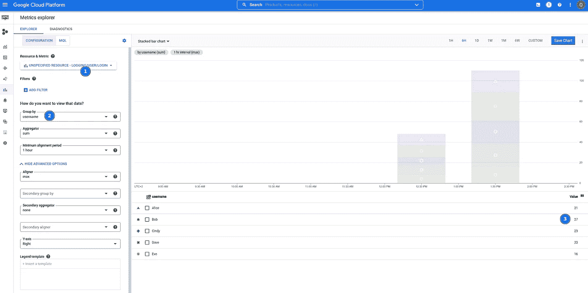

# 在 Google Cloud 中创建基于日志的指标，并获得有价值的见解

> 原文：<https://betterprogramming.pub/create-log-based-metrics-in-google-cloud-and-gain-valuable-insights-61f09a58e277>

## 使用 Terraform 创建您的指标并加深对您系统的理解


图为[梅尔·巴兰德](https://unsplash.com/@mael_balland?utm_source=unsplash&utm_medium=referral&utm_content=creditCopyText)在 [Unsplash](https://unsplash.com/s/photos/control-center?utm_source=unsplash&utm_medium=referral&utm_content=creditCopyText)

你必须知道你系统的当前状态。错误是否有不寻常的增加？负载是否正常，或者您是否遇到流量高峰？潜伏期有多长？如果你错过了这些知识，你可能会忽略即将出现的问题。例如，401 或 403 错误的突然增加可能意味着有人试图闯入您的系统。

在谷歌云平台上，你可以获得许多现成的东西。有数百个预定义的指标。然而，即使是谷歌也不可能预见到你需要的每一个指标。因此，您可以创建自己的指标。

# 基于日志的指标

基于日志的度量从日志消息中提取信息。它可以接收各种日志，甚至是你不拥有的服务。这允许您创建各种自定义指标。

有两种类型的[基于日志的指标](https://cloud.google.com/logging/docs/logs-based-metrics?hl=en):

*   计数器只是对日志消息的出现次数进行计数。它们计算系统中某件事情发生的频率，例如，您的服务发布消息的频率。
*   分发将每个日志消息与一个值相关联。例如，他们搜索一条日志消息，该消息说明一个进程运行了多长时间。您可以使用它来找出平均运行时间、异常值等等。

基于日志的指标仅使用在我们创建指标后记录的日志消息。

我们将使用 Terraform 来创建这两种类型。假设我们有一个打印日志消息的应用程序，如下所示:

```
Bob logged in.
Eve logged in.
Alice logged in.Init took 5 seconds.
Init took 3 seconds.
CleanUp took 5 seconds.
CleanUp took 13 seconds.
```

我们将使用前一个日志创建一个计数器，后一个日志创建一个分布。

# 基于日志的计数器

我们想统计用户登录的频率。让我们看看日志消息。

```
Bob logged in.
Eve logged in.
Alice logged in.
```

如上所述，`Counter`可能只计算日志消息出现的次数。显然，为每个用户创建一个计数器没有任何意义。

解决这个问题的通常方法是创建一个指标，并在其上添加`labels`。`labels`帮助查看哪个数据点属于哪个用户登录。您可以对基于日志的指标做同样的事情。考虑到这一点，我们想要计数的消息看起来更像这样:

```
$username logged in.
```

以下 Terraform 资源将此指标添加到您的项目中:

它是如何工作的？

*   在第 4 行，我们定义了要考虑哪些日志消息。我们只想要由 CloudRun 记录的包含字符串“log in”的消息。
*   第 6 行和第 7 行告诉 Google Cloud 我们想要创建一个`counte` r。
*   第 9 行和第 10 行定义了我前面提到的`username`标签。它属于字符串类型。其他值为`INT64`和`BOOL`。有趣的是，浮点值是不可能的。
*   第 15 行定义了如何提取标签`username`的值。该度量根据每个日志消息评估正则表达式。小心！日志消息可能在另一个字段中，例如`jsonPayload.message`。这取决于您的应用程序如何编写日志消息。捕获组的值成为标签的值。因此，您只能定义一个捕获组。

`counter`到此为止！我们使用[度量浏览器](https://console.cloud.google.com/monitoring/metrics-explorer)来查看它。度量的名称是`logging/user/login`。



自定义登录指标。

我们选择了我们的指标(1)，并按照标签`username` (2)对其进行分组。现在我们知道 Bob 在过去的一个小时内登录了 27 次(3)。

# 基于日志的分布

计数器在许多情况下都很有用。然而，它们是有限的。如果您想获得诸如以秒为单位的作业运行时间之类的信息，它们不会有太大的帮助。您可以添加一个标签来捕获作业运行时间，但是您不能计算百分比或平均值之类的东西。

发行版非常适合这种任务。

记住什么是应用程序日志:

```
Init took 5 seconds.
Init took 3 seconds.
CleanUp took 5 seconds.
CleanUp took 13 seconds.
```

这一次，我们要寻找这种模式:

```
$operation took $value seconds.
```

让我们来看看这一指标的 Terraform 资源:

它比柜台更复杂，但我们也看到了相似之处。

*   第 4 行再次包含过滤器。这一次，我们希望我们的消息包含单词“take”和“seconds”
*   第 6 行到第 8 行告诉 Google Cloud 创建一个以秒为单位的分布度量。
*   第 9 到 12 行定义了操作名的标签，就像用户名一样。第 15 到 17 行包含相应的提取器。
*   第 14 行有一个有趣的部分。它看起来像下面的`label_extractor`，工作原理类似。`value_extractor`从日志消息中获取值(以秒为单位的运行时间)。
*   第 18 到 23 行定义了如何对日志条目进行分组。我们定义十个桶。第一个存储桶包含作业耗时约 0 到 1 秒的所有日志条目；第五个存储桶包含作业花费 4 到 5 秒的所有内容。如果需要，您可以使用更复杂的方法，如指数桶。

打开[度量浏览器](https://console.cloud.google.com/monitoring/metrics-explorer)查看操作`CleanUp`的热图。


清理行动的热图。

我们选择了我们的度量标准(1)。添加一个过滤器以查看一个操作的热图(2)。现在我们可以在(3)中看到，大约 19%的调用操作花费了 10 到 11 秒。

# 一锤定音

设置基于日志的指标非常容易。如果您需要监控一些您无法直接控制的东西，它们会特别有用。但是，请小心使用它们(以及其他类型的指标)。如果你测量得太多，你就无法从噪音中分离出信号。

# 链接

*   terra form:[https://terra form . io](https://terraform.io)
*   Terraform 的`google_cloud_metric`资源:[https://registry . terra form . io/providers/hashi corp/Google/latest/docs/resources/logging _ metric](https://registry.terraform.io/providers/hashicorp/google/latest/docs/resources/logging_metric)
*   Google Cloud Metric explorer:[https://console . Cloud . Google . com/monitoring/metrics-explorer](https://console.cloud.google.com/monitoring/metrics-explorer)
*   基于日志的指标文档:[https://cloud.google.com/logging/docs/logs-based-metrics?hl=en](https://cloud.google.com/logging/docs/logs-based-metrics?hl=en)