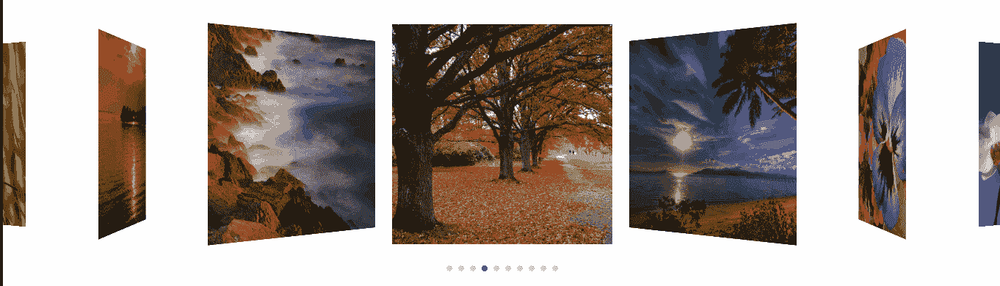
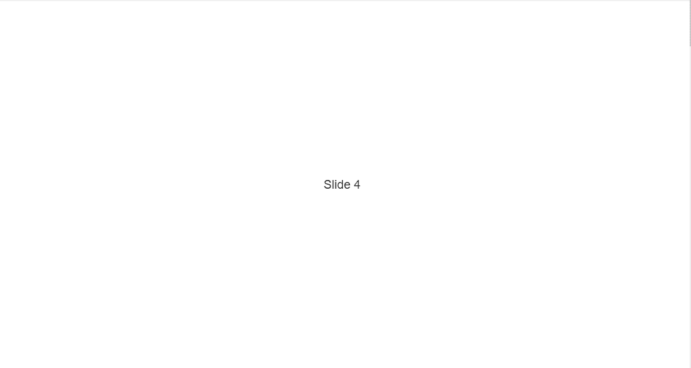
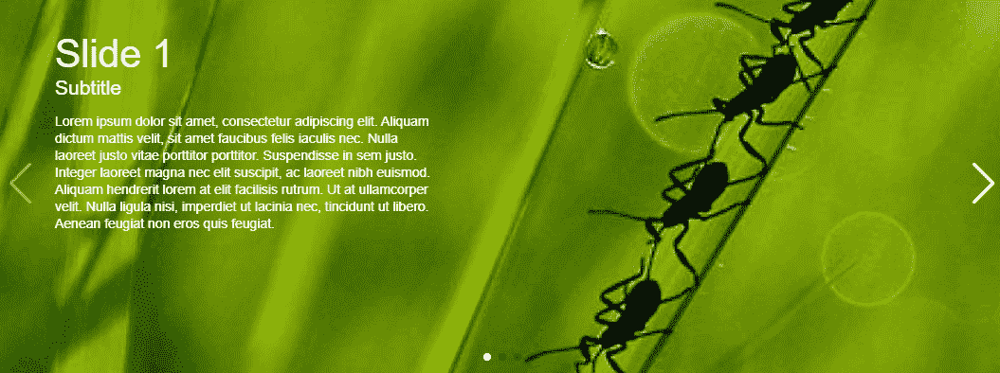

# 创建移动友好的触摸滑块

> 原文：<https://betterprogramming.pub/create-mobile-friendly-touch-sliders-7e78e55984f1>

## 使用 SwiperJS 和普通 JavaScript



3D 覆盖流效果

仅使用 JavaScript 从头开始构建触摸滑块可能是一项艰巨的任务。这就是为什么我们要使用 Swiper 来构建一个快速、响应迅速、移动优先的触摸滑块。

Swiper 是 Ionic 框架中的[默认滑块组件。Swiper 使用硬件加速过渡，其性能与原生应用相当。除此之外，它还被一些大公司使用，比如 Adobe 和 Cisco。](https://swiperjs.com/#carbonads:~:text=default%20slider%20component%20in%20the%20Ionic%20Framework.)

Swiper 提供了几个吸引人的特性，比如延迟加载图像、视差效果等等。此外，你可以在 Swiper 旁边使用类似于 [jQuery](https://jquery.com/) 和 [Zepto](https://zeptojs.com/) 的库，也可以用你自己的 CSS 定制 Swiper。

让我们开始吧。

# 装置

您可以使用三种方法安装 Swiper:

1.  [下载 Swiper](https://unpkg.com/browse/swiper@6.3.2/) 并保存在本地。
2.  通过在您的`index.html`文件的 head 标签之间添加以下两行，使用 CDN 来使用 Swiper:

```
<link *rel*="stylesheet" *href*="https://unpkg.com/swiper/swiper-bundle.css">
<script *src*="https://unpkg.com/swiper/swiper-bundle.js"></script>
```

3.您还可以使用`npm install swiper`命令通过 npm 下载 Swiper。确保您的计算机上安装了 [npm](https://www.npmjs.com/get-npm) 。

我将使用第二个选项来演示下面 Swiper 的一些特性。

# 入门指南

因为我使用第二种方法来安装和设置 Swiper，所以我需要将 Swiper 添加到我的主 HTML 文件中。

如您所见，我有自己的定制`styles.css`文件和 JavaScript 文件。目前，`styles.css`和`main.js`文件都是空的。

## 将 Swiper 添加到 HTML

要将 Swiper 添加到我们的 HTML 文件中，我们需要将以下代码放入我们的 HTML 主体中。

div 类是包含所有与 Swiper 相关的 HTML 代码的容器。`swiper-wrapper`类包含您想要显示的幻灯片。您可以用自己的 HTML 组件替换虚拟文本(如“幻灯片 1”)。`swiper-pagination`类提供分页点，显示幻灯片的索引。

值得注意的是，`swiper-container`是主包装类。因此，你可以操纵它来给你的触摸滑块边距，填充，颜色，宽度等。，根据您的需要。

`swiper-button-next`和`swiper-button-prev` div 类支持上一个和下一个箭头按钮，以方便分页。然而，如果您不想要箭头，您可以简单地省略这段代码。最后一个 div 类`swiper-scrollbar`，在滑块的底部提供了一个滚动条。

您可以在 CSS 文件中根据自己的需要给 Swiper 定制高度和宽度。

我给出了以下值:

完成 Swiper 设置的最后一步是用 JavaScript 初始化。你可以在同一个 HTML 文件中这样做，或者使用你定制的 JS 文件，并像我一样用 HTML 链接它。

无论哪种方式，初始化 Swiper 的脚本应该是相同的，如下所示:

作者的基本 Swiper 代码要点

如您所见，Swiper 有两个参数。第一个是主容器类，它包含 Swiper 需要的所有元素，第二个是包含我们的滑块的属性和配置的对象。我们例子中的容器是`swiper-container`，我们已经将它作为 Swiper 函数的第一个参数输入。

我们可以很容易地设置滚动方向和其他属性，比如滚动条、循环、分页、自动播放等等。



这是我们的代码现在的样子

这是垂直的。要获得带分页的水平滑块，请查看下面的要点。

在 Swiper 函数中添加 direction 属性，并将其设置为“水平”我也编辑了 CSS，使幻灯片的内容居中。


带分页的水平滑块

你也可以创造一些很酷的过渡效果。查看 [**官方网站**](https://swiperjs.com/demos/) **获取完整名单。**

我将在下面展示一些我最喜欢的效果。

# 视差效应



视差效应

既然我们已经设置好了所有的东西，我们只需要改变一些属性来实现这个视差效果。

我们需要在脚本中添加导航、速度和视差。添加这些内容后，脚本应该如下所示:

您还需要在`swiper-container` 类下添加背景图像属性，如下所示:

```
<div class="parallax-bg" style="background-image:url(./images/nature-1.jpg)" data-swiper-parallax="-23%"></div>
```

# 3D 覆盖流效果


3D 覆盖流效果

您可以使用 Swiper 轻松创建这一令人惊叹的 3D 效果。我们只需要稍微修改一下我们的文件。

另外，向我们的`swiper-wrapper`类添加图像，如下所示:

你可以在[我的 Github repo](https://github.com/anuragk15/Swiper-JS-Demo) 中找到所有显示的文件。我使用了单独的 CSS 和 JavaScript 文件，以及一些示例图片进行实验。

# 结论

Swiper 可以为您的网站、移动 web 应用程序和移动本机/混合应用程序提供一个现代的、移动友好的触摸滑块。它可以很容易地与 React、Vue.js 和[svelet](https://svelte.dev/)集成。

它可以很容易地和普通的 JS 以及 CDN 一起使用。Swiper 还附带了一个非常丰富的 API，允许您创建自定义组件，如您自己的分页和视差效果。