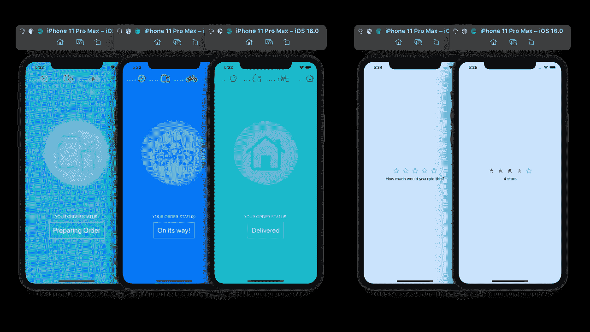
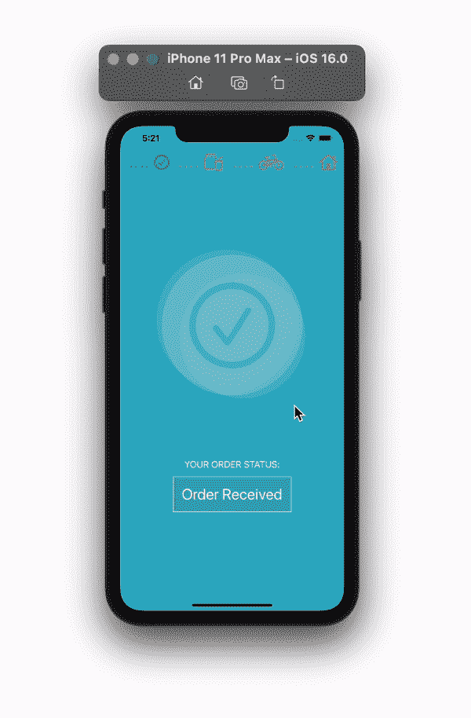
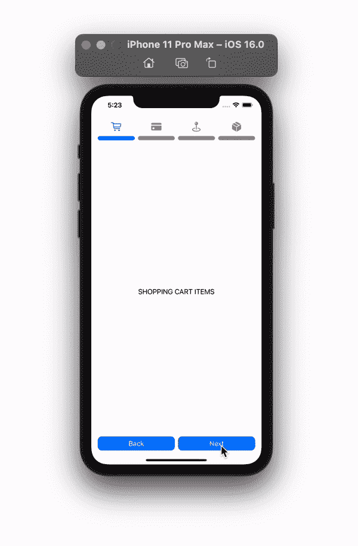
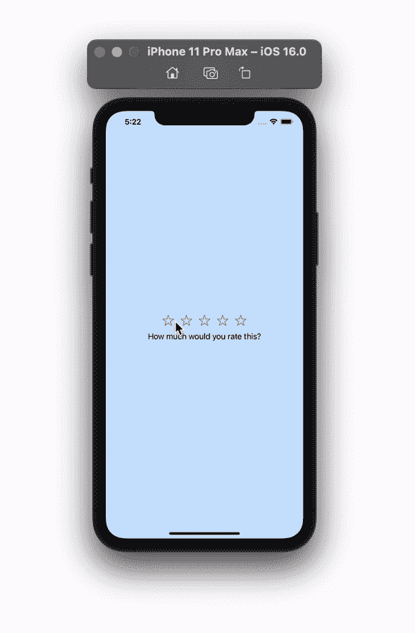

# 在 SwiftUI 中创建多步骤视图

> 原文：<https://betterprogramming.pub/create-multi-steps-view-in-swiftui-fe5bf6923661>

## 利用 iOS 16 构建可定制的多用途步骤视图。onPush 转换

作者提供的所有图片和示例

在本文中，我们将介绍如何创建一个可定制的多步骤视图，该视图可用于您项目中的不同位置，以便通过多个屏幕进行 SwiftUI 导航。可以多才多艺。你可以用它向用户展示注册账户、订购包裹、送货过程的步骤，甚至可以用它来建立一个评级系统，就像我在下面的例子部分所做的那样。

这篇文章将取决于有步骤作为枚举。在展示如何构建多步骤视图之前，我们将讨论构建多步骤视图所需的内容。

# 案例可扩展

我们将需要在我们的枚举中获得下一个和上一个案例，以基于当前视图改变我们的视图。我们可以通过使用 all-cases 数组来实现。接下来，我们可以创建一个数组来存储所有案例的所有原始值。`rawValues`将是我们添加到视图中的额外内容。在例子中，我尝试了图标和标题作为额外的内容。

# 额外内容

为额外内容准备一个视图。正如我上面提到的，在下面的例子中，附加的内容要么是图标，要么是文本；因此，我们正在发送字符串并检查它们是否可以是图像。如果不是，那么将它们显示为文本。你可以使用不同的`Image`初始化器。对于本教程，我将只使用系统符号。因此，我在系统名称中使用了`init`。

# 额外内容位置

为额外内容位置选项创建枚举。我有以下三个选项，但你可以添加额外的，因为你觉得合适。

# 多步视图

最后，我们正在创建我们的多步骤视图。我们需要这个视图来接受任何代表我们项目中一些步骤的枚举。我们可以通过使我们所有的枚举符合`CaseIterable`协议，然后将它们传递给我们的多步骤视图来实现这一点。

我们也在传递一些视图作为内容。可以传递的内容的一个例子是代表步骤的矩形或圆形。在视图体中，我们将遍历这些步骤，并给它们传递相同的内容。

接下来，您可以添加额外的内容。为此，我们可以传递一个附加内容的位置(`above`、`inline`或`onTop`)，然后添加一个 if 或 switch 语句来调整额外视图的位置。如下所示，if 语句的行数将会更少

如果您希望每一步都有一个点击动作，您可以向视图传递一个函数，如下所示。将点击步骤的索引传递给操作函数，以执行基于步骤的操作。

# 例子

## 食品配送

下面是 `CaseIterable`枚举我们的所有步骤:

所有步骤的简单总体详细视图如下所示:

## 多步骤视图父视图

## 购买步骤

## `CaseIterable`枚举

## 多步骤视图父视图

## 星级评定

## CaseIterable 枚举

## 多步骤视图父视图

感谢阅读。我希望你喜欢这篇文章。