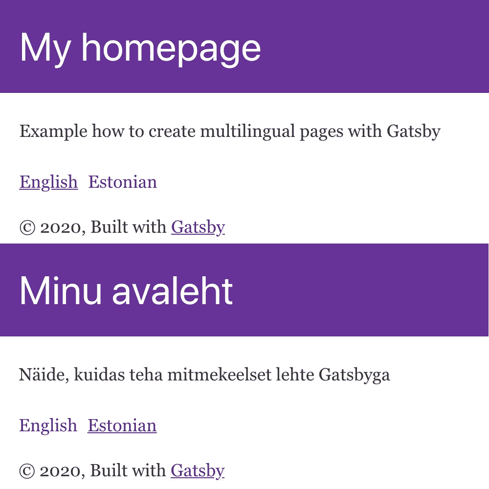
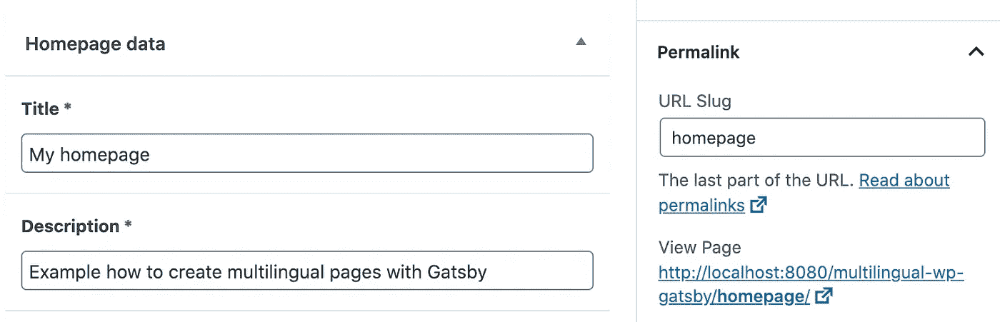

# 用 Gatsby、WordPress、WPML 和 ACF 创建多语言网页

> 原文：<https://betterprogramming.pub/create-multilingual-pages-with-gatsby-wordpress-wpml-and-acf-ebf34288dcf>

## 将你的网站推向世界



带有 WordPress 的英语和爱沙尼亚语内容的 Gatsby 页面

Gatsby 是今天使用的一个很好的静态站点生成器。它的生态系统真的很大，你可以从盒子里得到很多东西。得到灯塔最高分几乎是盖茨比的默认。任何使用 WordPress 的人，如果想把 CMS 和网站本身分开，至少应该试着用 Gatsby 创造一些东西。它非常容易使用，文档也非常简单。

Gatsby 使用 GraphQL 从本地文件或外部端点获取数据。如果你想和 WordPress 一起使用它来获取页面，文章，媒体，ACF 字段等等。，就不用手动算了。有一个库可以创建从 WordPress REST API 到 GraphQL 的模式，它由 Gatsby 提供支持。它是 [WPGraphQL](https://github.com/wp-graphql/wp-graphql) ，还有一个 Gatsby 插件，[Gatsby-source-wordpress](https://www.gatsbyjs.org/packages/gatsby-source-wordpress/)，用来连接你的 WordPress 站点。它使用底层的连接器库。

这篇文章希望你已经设置了 WPML 和 ACF 插件。它还期望您在`gatsby-config.js`中设置了 gatsby-source-wordpress 插件。在[示例存储库](https://github.com/gglukmann/multilingual-wp-gatsby)中，你可以看到我是如何从 Gatsby 连接到 WordPress 的。

# 问题:改变 GraphQL 的语言

只有一个问题。假设您正在创建一个只有一个视图的页面，这个视图位于根 URL `//your-site.domain/`上。现在，你需要用不同的语言在`//your-site.domain/et`网址中创建相同的页面——就像使用标准 WordPress 一样。你是如何在 Wordpress 使用 WPML 和用 Gatsby 创建页面的？

WordPress REST API 端点获取默认语言的内容。示例:`//your-site.domain/wp-json/wp/v2/pages`是您的 WPML 默认语言。您可以通过添加`?lang=et`参数来切换语言，但是使用 GraphQL 您不能添加这样的参数。您必须将它作为过滤器添加到查询中。Gatsby 中的 GraphQL 模式没有针对 WMPL 的过滤器。还得自己加。

# 在盖茨比中创建页面

我用 slug `homepage`和 ACF 字段`title`和`description`在 WordPress 中创建了一个页面。



WordPress 中的 ACF 字段

确保不同语言的每个页面都有相同的 slug，因为 WordPress 会为不同的语言创建新的 slug。当我用爱沙尼亚语创建一个新页面时，WordPress 创建了 slug `homepage-2`。当然，您也可以使用它的 ID 来查询它，但是使用已知的 slug 来查询该页面的数据会更容易。稍后你会看到我们将在哪里使用它。

在 Gatsby 中创建页面通常是通过将新的 JavaScript 文件添加到名为路径的`src/pages`文件夹中来完成的。就像`about.js`文件会把`/about`作为它的 URL。当你从 WordPress 创建页面时，你必须在构建时创建它们。你需要打开`gatsby-node.js`并使用盖茨比提供的`[createPages](https://www.gatsbyjs.org/docs/node-apis/#createPages)`功能。

对于我们的例子，我们需要为所有语言创建一个单独的页面。我们的索引页面将有英语的 URL`/`和爱沙尼亚语的 URL`/et`。

```
const path = require(`path`)const languages = [
  {
    path: "/",
    code: "en_US", *<- taken from WPML language codes*
  },
  {
    path: "/et",
    code: "et",
  },
]exports.createPages = async ({ actions: { createPage } }) => {
  const HomepageTemplate = path.resolve("./src/templates/Homepage.js") languages.forEach(lang => {
    createPage({
      path: lang.path,
      component: HomepageTemplate,
      context: {
        lang: lang.code,
      },
    })
  })
}
```

我们已经创建了一个数组，其中的语言与我们的 WordPress WPML 设置相匹配。这将是循环的，并且将为每种语言创建一个具有给定路径的页面。

你可以看到有一个来自`./src/templates/Homepage.js`的模板文件。这将是包含索引页面组件的模板——就像在`src/pages`文件夹中添加新页面一样。

接下来，正如您所想的，我们必须创建模板文件。在`./src`中创建文件夹`templates`，并在其中创建一个名为`Homepage.js`的文件。

```
import React from "react"
import { Link } from "gatsby"import Layout from "../components/layout"const HomepageTemplate = () => {
  return (
    <Layout title="Title">
      <p>Description</p> <Link *to*="/">English</Link>
      <Link *to*="/et">Estonian</Link>
    </Layout>
  )
}export default HomepageTemplate
```

稍后，硬编码文本`Title`和`Description`将被 WordPress 的文本所替换。

如果您运行`gatsby develop`，那么您可以在这两个视图之间切换。但是现在，内容完全一样。

# 从 WordPress 获取数据

在您的`Homepage.js` 文件中，在`export default HomepageTemplate`之前添加以下 GraphQL 查询。确保添加从`gatsby`导入的`graphql`作为命名导入。

```
import { **graphql**, Link } from "gatsby"...export const query = graphql`
  query {
    wordpressPage(
      slug: { eq: "homepage" }
    ) {
      acf {
        title
        description
      }
    }
  }
`export default HomepageTemplate
```

在这里你可以看到我们正在用等于`"homepage"`的 slug 和我们在 WordPress 中设置的两个 ACF 字段`title`和`description`查询一个 WordPress 页面。查询结果作为道具`data`被添加到您的`HomepageTemplate`组件中。

```
const HomepageTemplate = ({
  data: {
    wordpressPage: {
      acf: { title, description },
    },
  },
}) => {...
```

有了对象析构，我们就可以在 React 组件中使用`title`和`description`。我们可以改变我们的 HTML。

```
<Layout *title*={title}>
<p>{description}</p>
```

现在，如果你在浏览器中运行它，它会以默认语言显示文本，在这些页面之间切换仍然不会改变任何东西。我们现在就来谈这个。

# 向 WordPress REST API 添加其他语言的内容，这样 GraphQL 就可以创建模式

切换页面不会改变语言，因为 WordPress REST API 只提供一种语言的数据，我们必须改变这一点。

首先，看一下 WordPress REST API `//your-site.domain/wp-json/wp/v2/pages`，在那里你只能看到一个带有默认语言内容的对象。但是我们需要在不同的对象中有两种语言。

为此，您需要打开当前活动的主题代码，位于`./wp-content/themes/example-theme/`。打开文件`functions.php`，在其中添加以下几行。

```
add_action('rest_api_init', function () {
  if (defined('REST_REQUEST') && REST_REQUEST) {
    *// Add all WPML language translations to rest api when type is page* add_action('parse_query', function ($q) {
      if ($q->query_vars['post_type'] == 'page') {
        $q->query_vars['suppress_filters'] = true;
      }
    });
  }
});
```

此招摘自[wmpl.org 论坛](https://wpml.org/forums/topic/how-can-i-get-all-pages-original-and-translated-in-the-api-response/#post-3072937)。现在如果你看看 WordPress REST API，`//your-site.domain/wp-json/wp/v2/pages`，你可以看到有两个不同语言的对象。

这意味着 GraphQL 现在可以为两种语言创建模式。

在我们开始在 React 组件中使用它之前，我们还需要能够获得当前的语言代码。如果仔细观察 REST API 响应，您会发现`title`和`description`在不同的对象中使用不同的语言，但是没有办法获得语言代码。

为此，你需要在 WordPress 内部激活 [WPML REST API](https://github.com/shawnhooper/wpml-rest-api) 插件。对我们来说，它将`wpml_current_locale`添加到 REST API 响应中。这样我们就可以知道从 GraphQL 中查询哪种语言。

# 从 GraphQL 获取正确语言的文本

如果你看一下`gatsby-node.js`文件，你可以看到在我们的语言数组中，我们为每种语言定义了`code`。这个`code`和`wpml_current_locale`一模一样。如果你看看我们在哪里使用了`createPage`函数，你会看到我们把`context`作为属性赋予了那个`code`。

```
createPage({
  path: lang.path,
  component: HomepageTemplate,
  context: {
    **lang: lang.code,** *<- sending language code to GraphQL query*
  },
})
```

我们将在`Homepage.js`中得到一个 GraphQL 变量，我们将在这里进行查询。

用下面的代码更新`Homepage.js` GraphQL 查询。

```
export const query = graphql`
  query(**$lang: String**) {
    wordpressPage(
      slug: { eq: "homepage" }
      **wpml_current_locale: { eq: $lang }**
    ) {
      acf {
        title
        description
      }
    }
  }
`
```

`$lang`是我们用来自`createPage`函数的上下文发送的语言代码。我们传递它来查询等于`wpml_current_local`的过滤器。

我们做到了！

现在，如果你在浏览器中运行它，它会显示英文文本，当它切换到不同的语言时，`title`和`description`会发生变化。

# 结论

这个解决方案对于用 Gatsby 创建页面和从 WordPress 获取数据来说是非常标准的，但是 Wordpress 主题中的一个小技巧对于获取所有可用的 WPML 语言的数据是非常重要的。

谢了。

这里有一个到[范例库](https://github.com/gglukmann/multilingual-wp-gatsby)的链接。