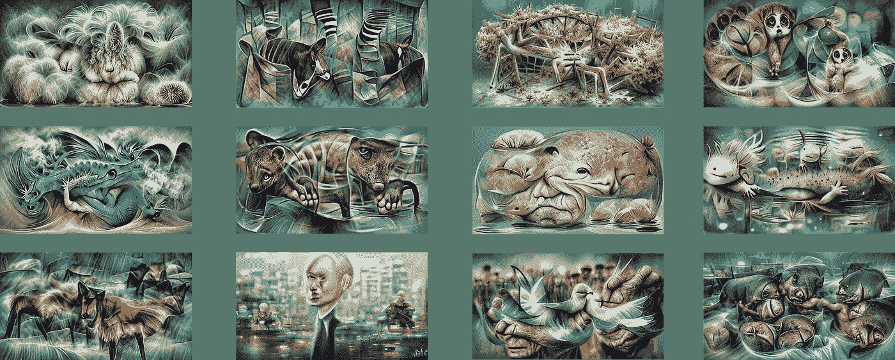
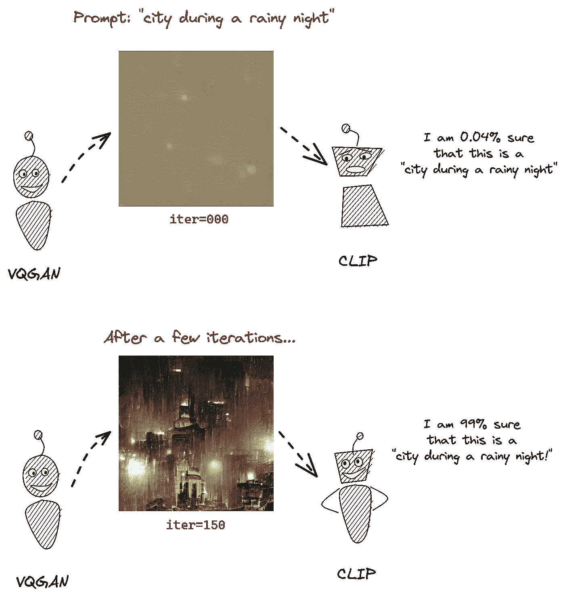
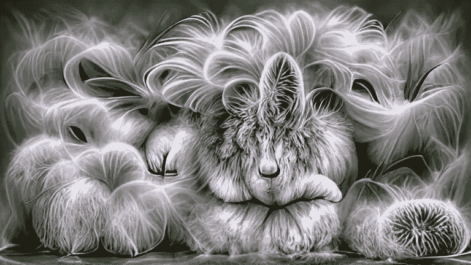
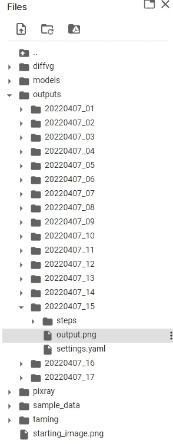
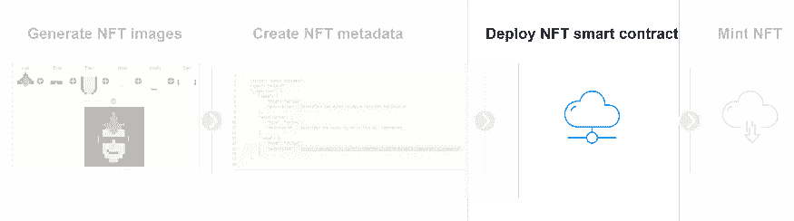

# 使用 Python 创建具有人工智能的 NFT 艺术

> 原文：<https://betterprogramming.pub/create-nft-art-with-artificial-intelligence-using-python-6e181e930f95>

## 使用人工智能为您的 NFT 系列设计美丽的艺术

NFT 收藏:世界上最酷的动物|人工智能生成

在本文中，您将使用人工智能(AI)根据您输入的文本生成图像。

这可以让你在不使用 Photoshop 或类似工具的情况下，为你的 NFT 作品集创作出美丽的艺术作品。

# 方法学

[Pixray](https://github.com/pixray/pixray) 是最近发布的一个 Python 包。

它结合使用了两种人工智能模型:

*   [VQGAN](https://ljvmiranda921.github.io/notebook/2021/08/08/clip-vqgan/) :接收文本并输出图片
*   [剪辑](https://openai.com/blog/clip/):验证图片是否精确到文字

在每次迭代之后，VQGAN 图片被优化以被剪辑模型最好地识别。

当剪辑模型 99%确定生成的图片与给出的描述完全匹配时，模型停止迭代。

*VQGAN 模型生成图像，而 CLIP 指导该过程。这是通过多次迭代完成的，直到生成器学会产生更“精确”的图像。【来源:* [*【插图 VQGAN】作者:LJ Miranda*](https://ljvmiranda921.github.io/notebook/2021/08/08/clip-vqgan/)

# *导入包*

*这篇文章的代码可以在 [google colab](https://colab.research.google.com/drive/1k6rBwadsdsFxEHjP2U3GRm0XobSsavh7?usp=sharing) 上找到。*

*运行人工智能模型可能相当足智多谋，所以建议使用谷歌 colab(及其免费的 GPU)。*

*您需要导入以下包:*

*   *[Torch](https://pytorch.org/) :开源机器学习框架*
*   *[剪辑](https://www.google.com/search?q=clip+github&rlz=1C1GCEV_enBE983BE983&oq=clip+github&aqs=chrome.0.0i512j0i22i30l4j69i60l3.3158j0j4&sourceid=chrome&ie=UTF-8):open ai 发布的图像识别框架*
*   *驯服变换:卷积 VGAN*
*   *[pixray](https://github.com/pixray/pixray) :图像生成引擎*

# *生成 NFT 集合*

**

*NFT #7:人工智能生成的安哥拉兔*

*您将创建一个由地球上最酷的十种动物组成的 NFT 集合:*

**日本蜘蛛蟹，霍加皮，福萨，鬃狼，蓝龙，慢洛里斯，安哥拉兔，帕库鱼，美西螈&布洛费什*。*

*代码的过程如下:*

1.  *用这些动物的名字创建一个列表，并将它们分配给`input_list`。*
2.  *编写一个 for 循环，遍历每个动物，并将其输入到 AI 模型中*
3.  *用相关的[参数](https://dazhizhong.gitbook.io/pixray-docs/docs/primary-settings)调整你的人工智能模型*

*   *动物:人工智能模型生成图像的文本。*
*   **质量:草稿、普通、较好&最好。质量越高，模型花费的时间/迭代次数就越多。**
*   **自定义 _ 损失:审美效果**
*   **Display_clear:如果为 true，则每当生成新图像时清除图像。**

*生成的图像存储在您的工作目录/输出中，您可以在那里下载它们。*

**

*下一步是弄清楚如何在区块链部署这些。请随意使用我的 [NFT 创造者系列](/how-to-deploy-nft-smart-contracts-9271ce5e91c0)作为指南。*

**

*快乐编码。*