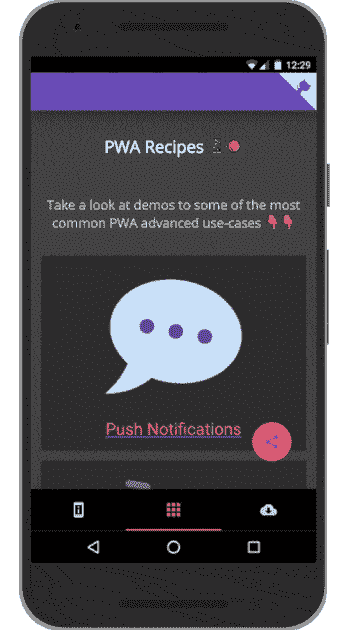

# 在 PWAs 中创建并列出脱机可用的页面

> 原文：<https://betterprogramming.pub/create-offline-available-pages-in-pwas-5136edea7de1>

## 关于如何使用服务工作者和缓存 API 查询缓存和列出离线页面的分步指南

由[展开的插图](https://undraw.co/illustrations)

这是我在浏览网页时很少遇到的一个功能，当然你也有。这可能有很多原因，包括应用程序结构、缺乏资源/时间，以及开发人员没有意识到这可以在 web 上完成。

实现这样的功能需要服务人员和对缓存 API 的有效使用。由于这些需求，开发者开发这样的线下体验有很大的摩擦。

幸运的是，也很奇怪的是，这并不像我最初想的那样困难和耗时。

在本文中，我将向您展示如何自己实现这一点，然而，由于一些复杂性，您必须相应地修改代码以适应您的项目。

这不是一个复制粘贴教程，也不适合初学 web 开发的人。但是坚持住。读完这篇文章后，你应该知道你要做什么。

对于这篇文章，我考虑到:

*   你熟悉的 [JavaScript ES6](https://www.w3schools.com/js/js_es6.asp) ，[服务人员](https://developers.google.com/web/ilt/pwa/introduction-to-service-worker)，[工具箱](https://developers.google.com/web/tools/workbox)， [Fetch API](https://developer.mozilla.org/en-US/docs/Web/API/Fetch_API) 。
*   [服务人员注册](https://developers.google.com/web/fundamentals/primers/service-workers/registration)假定已经就绪。
*   您正在测试最新版本的 Chrome。
*   尽管我建议您应该熟悉[服务工作者 API](https://developer.mozilla.org/en-US/docs/Web/API/Service_Worker_API) 和[服务工作者生命周期](https://developers.google.com/web/fundamentals/primers/service-workers/lifecycle)，但是使用 Workbox 要方便得多，因为它是一个经过充分测试的库，为您的服务工作者增加了简单性。

# 脱机可用的页面

在访问一些链接后，通过离线在 [pwa.recipes](https://www.pwa.recipes/) 中亲自尝试。也尝试导航到不存在的路线。

这是我所知道的最先进的 PWA 功能之一，我仍然相信如果你有一个像样的应用程序结构，你最多可以在 30 分钟内实现它！

尽管如此，最困难的部分是精心设计应用程序的结构，以允许你在它的基础上添加这个功能。稍后，将这些点连接起来会简单得多。

在你的应用结构中，最好的是:

1.  每个页面都有自己的 ID，与它的路径相匹配。(例如 ID = '关于我'，Route = '/关于我'。)
2.  能够从 ID 和/或路径中提取页面标题(例如，“关于我”变成“关于我”)。
3.  专门用于存储这些页面及其资源的缓存(例如，缓存名称= 'offline-stored-pages ')。

酷！让我们开始吧…

# **更简单的例子**

假设我们有一个网站，列出了许多产品，每个产品都有一个独特的页面/路线。理想情况下，我们希望显示哪些产品页面已经被访问过，因此可以脱机使用，而隐藏那些没有被访问过的页面。

为了添加这个功能，首先我们必须确保我们已经在服务人员的 JavaScript 文件中注册了一个路由。

然后，我们告诉 Workbox 在我们创建的缓存中缓存所有与产品页面 URL 匹配的资源。

`service-worker.js`

然后，在我们的应用程序的 JavaScript 文件中，我们将包含一个在缓存`runtime-product-pages-resources`中进行检查的函数，这个函数是上面使用 Workbox 创建的。

该函数将使用每个产品的 URL(锚标记的`href`)在该缓存中搜索每个产品路线的任何资源。

`app.js`

注意:根据你的应用程序结构，逻辑会有所不同。您可能需要检查缓存中是否有明确的 HTML 文件(以及任何其他依赖项)，以便将其标记为脱机可用，否则不可用。

# 更复杂的例子

这是另一个更健壮但也更复杂的例子。这里，您不需要在 Workbox 中添加自定义的缓存名称(尽管您仍然需要注册一个路由来缓存任何资源):

`app.js`

您的输入应该进入`hideOfflineUnavailableProducts`功能

您的输入应该在`hideOfflineUnavailableProducts`函数中。
我相信你更擅长命名函数！

然后，监听窗口`offline`和`load`事件来调用上面声明的`hideOfflineUnavailableProducts`函数:

`app.js`

最后，根据以上两个例子(简单和复杂)的用例，我们可以为不可用的产品链接添加一些样式:

`styles.css`

# 结论

就是这样！

或者，对您来说，这不像是一个简单而快速的实现。请在评论中让我知道。

将这一功能添加到您的网站或您负责的网站有多难？花费的时间是否超出预期，为什么？

如果你已经尝试过了，你的反馈对我的下一篇文章会很有价值。

干杯！祝你今天开心！玩的开心！

# 进一步阅读

*   [缓存 API 文档](https://developer.mozilla.org/en-US/docs/Web/API/Cache) — MDN 文档
*   [使用缓存 API](https://developers.google.com/web/fundamentals/instant-and-offline/web-storage/cache-api) —谷歌开发者
*   [PWA 维基](https://medium.com/@charistheodoulou/7c00c478d39b#Mark-offline-unavailable-pages)