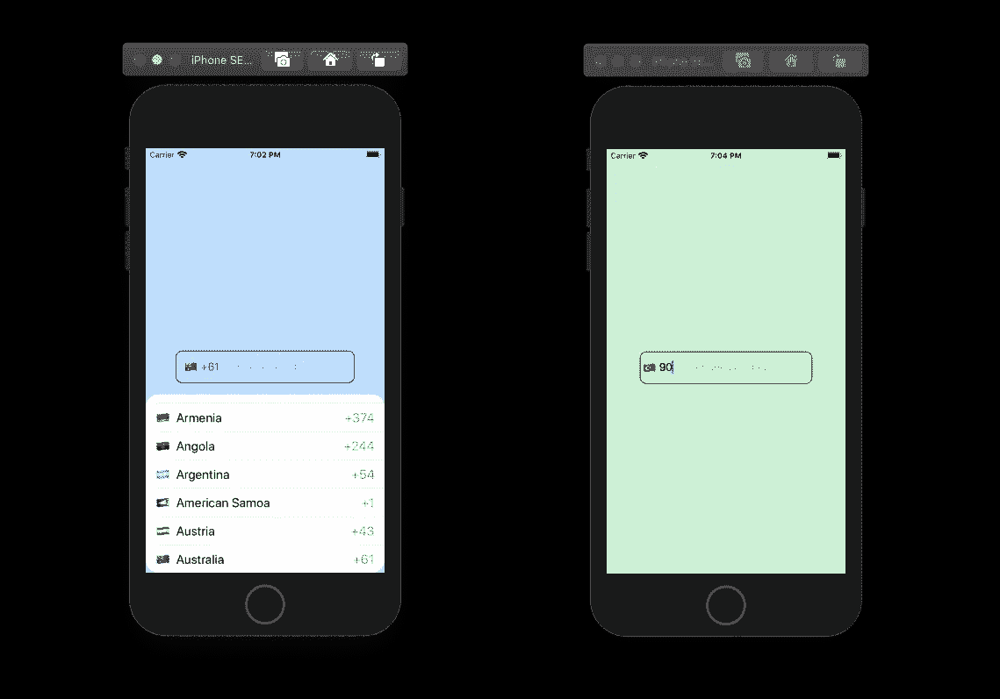
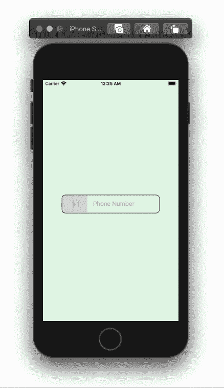
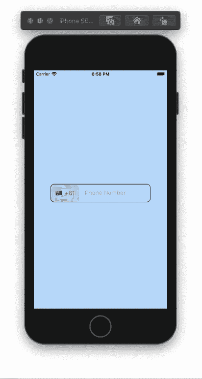

# 在 SwiftUI 中创建带有国家代码和标志的电话号码文本字段

> 原文：<https://betterprogramming.pub/create-phone-number-textfield-with-country-codes-and-flags-in-swiftui-fa3ad981c5f6>

## 向用户询问联系信息的好方法

作者照片。

我们将介绍两种创建显示国家代码及其标志的电话号码视图的方法。第一种方法包含所有国家代码的列表，供用户选择。第二种方法将在用户输入有效的国家代码时显示相关的标志。

# 第一种方法

## 国家代码功能

创建一个视图结构，其中包含我们将拥有的所有国家代码的字典:

要在应用程序中包含完整的国家名称，请添加下面的函数，该函数接收国家代码并返回完整的名称:

要显示国家的国旗，请添加下面的函数，该函数接收国家代码并返回其相关的国旗表情符号:

## 国家代码用户界面

我们需要一个列表视图。通过我国代码字典排序的列表。在列表中，我们将有一个`HStack`包含国家的国旗、名称和代码的文本视图。添加一个`onTapGesture`，它将被点击的行的数据分配给我们的绑定变量。绑定变量有助于我们将所选行的数据获取到下一步要创建的另一个 struct 视图中。为了消除视图，我们将偏移视图的 *y* 位置。创建一个绑定的`y`变量，当点击一行时，该变量将被改变。在列表视图的一半高度和 0:

## 电话号码文本字段用户界面

为国家代码和国旗创建州变量。添加将用于偏移视图的变量`y`。UI 由一个包含文本视图和文本字段的`HStack`组成。文本视图使用一个`onTapGesture`来偏移`y`。在`ZStack`中添加`HStack`，然后在`HStack`下添加我们的`CountryCodes`视图。将`country code`和`flag`状态变量连同`y`变量一起传递给`CountryCodes`视图:

# 第二种方法

## 电话号码文本字段函数

创建一个结构视图，并添加上面的国家代码字典常量。我们将使用之前在这个结构视图中创建的相同的标志函数:

创建下面的函数，每当用户输入国家代码时，从字典中获取国家代码。该函数将获取国家代码，并返回与给定代码匹配的值的第一个键:

## 电话号码文本字段用户界面

创建下面的函数，每当用户输入国家代码时，从字典中获取国家代码。该函数将获取一个国家代码，然后返回字典中值与给定代码匹配的第一个键:

ObservableTextField 是一个可观察的类对象。它包含一个已发布的变量，该变量通过返回 didSet 中的前三位数字来限制用户输入三位以上的数字。

如果你查看国家代码字典，你会发现有多个国家有相同的代码。应用程序将返回它在字典中找到的第一个键。为了避免出现错误的标志，请使用第一种方法，或者允许用户在具有相同代码的标志中进行选择。

感谢阅读。