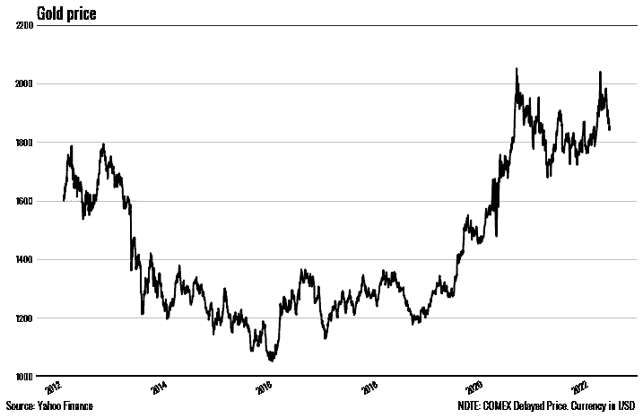
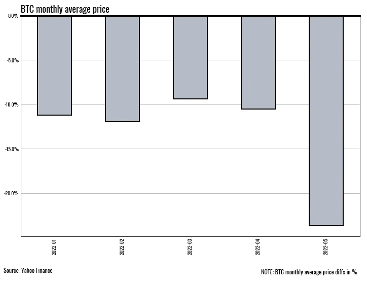

# 用 MatplotLib、Seaborn 和一些熊猫建造美丽的情节

> 原文：<https://betterprogramming.pub/create-plots-like-scott-galloway-911d45b689ca>

## 创造像斯科特·盖洛威那样的情节

地块样本

中型门户网站有大量有趣的作者，他们有自己的风格和技巧。我最钦佩的人之一是斯科特·加洛威(Scott Galloway)，他是一名营销人员、作家和伟大的思想家。他也是一个在媒体上吸引了至少 18.2 万追随者的创造者。所以我决定向他学习一点。

虽然我们的文章主题不同，但我仍然可以从他那里学到一些东西。例如，他在每篇文章中的关键图形。直白、简约、时尚。以下是我注意到的一些常见现象:

*   情节上最少量的无关细节。如果不需要，跳过记号、标签和网格线；
*   使用线条粗细和灰色阴影来突出显示特定的点，或者给出从哪里开始“读图”的提示；
*   对色盲友好；

虽然我不是一个熟练的图形设计师，但我非常擅长编程，所以我尝试用我的方式来做——用 MatplotLib 和 Seaborn。

# 线形图

简单的线图是一种易于使用和清晰易读的工具——难怪 Scott 经常使用它。我能发现的显著特征如下:

*   y 轴限制始终存在。如果没有样本，就不需要用数字来超载绘图；
*   X 轴以更大的厚度突出显示；
*   网格只在水平方向显示；
*   利用情节下方的空间用文字稍微描述一下；

在这个情节的基础上，我使用了一个熊猫生成的图形。我在轴的风格上花了很多心思，因为它们在讲述故事的同时应该包含尽可能少的元素。最后的润色是在左下角和右下角添加解释说明。

一个好看的线图是你在演示中提出重要观点所需要的。

# 直方图

直方图或条形图通常用于表示分组数据，并发送有关高级趋势方向性的信息。在这种情况下，BTC 的月度趋势非常明显😁

以下是斯科特·加洛韦的图表中的几个显著特征:

*   框限于边界线；
*   y 轴也被最小化以仅显示相关数据&以更大的权重突出显示；
*   网格线是水平的，位于方框下方；

该图最棘手的部分是让网格位于条形下方。它有助于了解 CSS 属性 z-index 及其工作原理，因为 MatplotLib 似乎也有一个类似的属性，名为“zorder”。我还想指出，这个图表看起来更好，因为它的“自上而下”的性质，因为你会立即注意到 Y 轴上的负数。

外观时尚的箱线图甚至可以传递最悲伤的金融信息。

# **基于图像的情节**

并不总是关于线条和数字。有时，人们可以通过使用一些关键元素来带来视觉效果。例如，在下面，你会看到一幅整洁的拼贴画，上面有最新的脸书标志，以及该公司多年来是如何改变它们的。

虽然这个模板不能用于您的数据科学项目演示，但它可以是程序员跳过 Photoshop 的使用并在没有设计师参与的情况下自己制作一切的好方法。

灰色调看起来更好。

# 结论

斯科特·加洛韦的图形易于阅读，充满了清晰、简约的视觉效果。他通常用它们来代表营销/经济理念，但它们的风格可能相当普遍。作者成功地使用了它们，这也显示了投入时间和精力在文字的图片上是多么的重要。