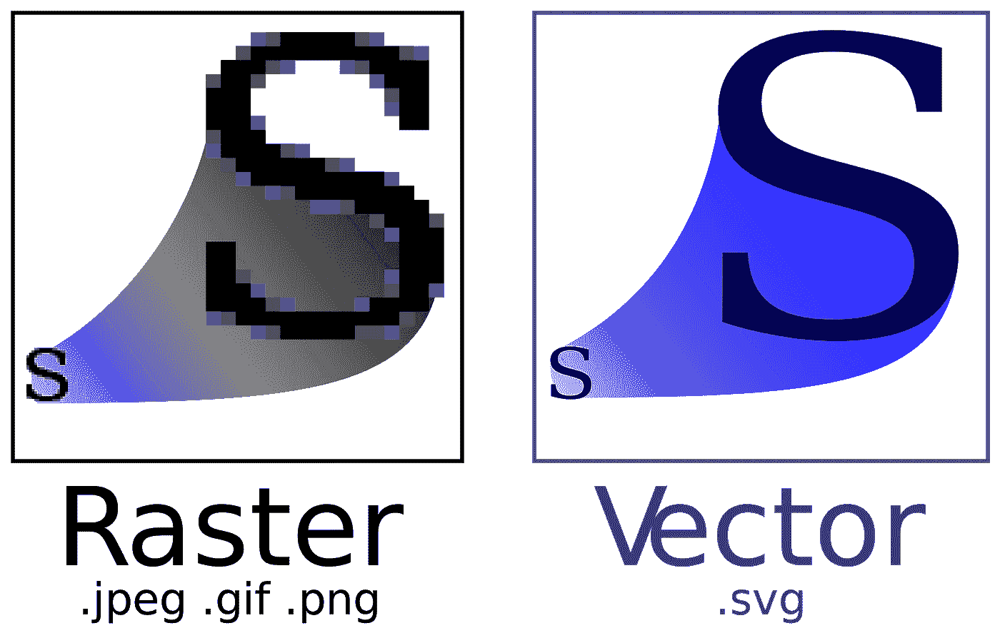
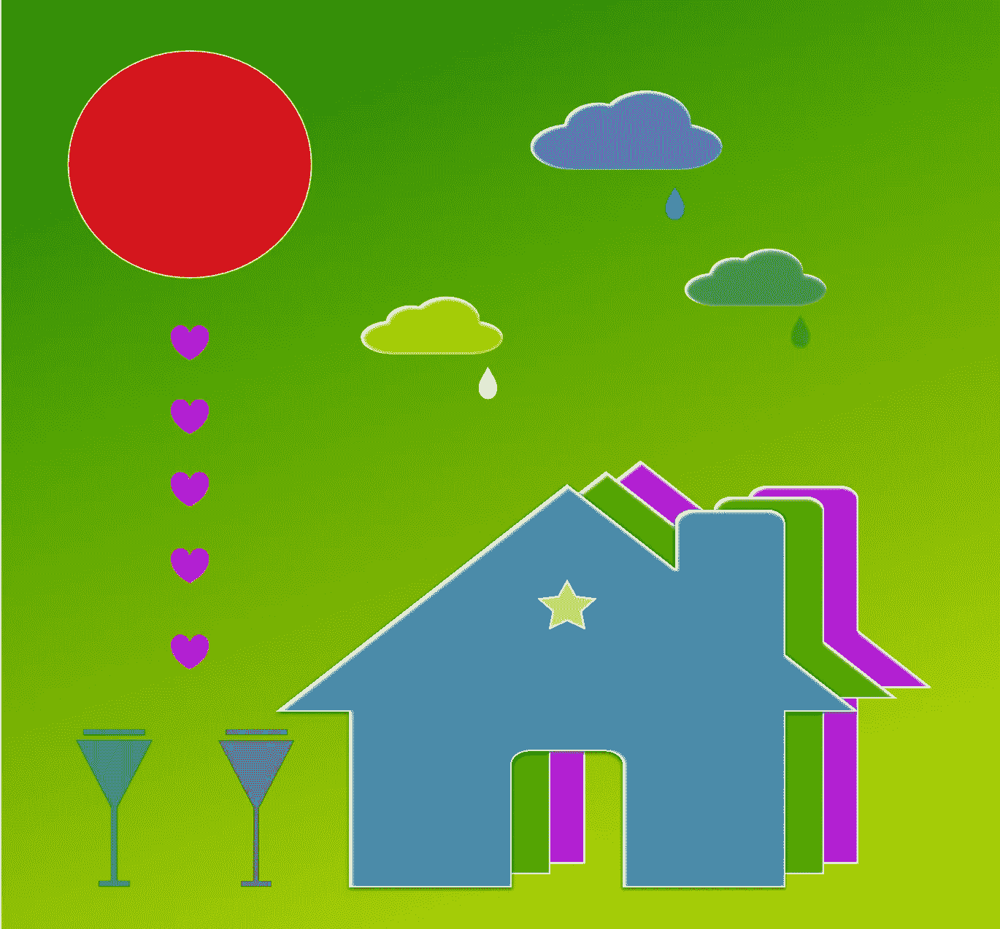

# 创建 React 应用程序和 SVG

> 原文：<https://betterprogramming.pub/create-react-app-and-svgs-70970ac715f2>

## 在 React 应用中显示 SVG 图像的指南



图片来自维基百科

SVG 代表可缩放矢量图形。它以 XML 格式定义了基于矢量的图形。与基于光栅的位图(左上)相比，基于矢量的图像(右上)在放大时会保留形状。此外，由于 XML 文件的性质，它们可以被搜索、索引、编写脚本、压缩，并以[可访问性](https://medium.com/better-programming/10-steps-to-building-web-applications-with-accessibility-a11y-81cd2c1dd499)进行构建。SVG 是网络上广泛使用的图形格式。

# 创建 React 应用程序中的 SVG 徽标

[创建 React 应用](https://medium.com/better-programming/10-fun-facts-about-create-react-app-eb7124aa3785)带有 SVG 徽标:


图片由作者提供。

该标志在`src/log.svg`中定义:

```
<svg  viewBox="0 0 841.9 595.3">      
  <g fill="#61DAFB">
    <path d="M666.3 296.5c0-32.5-40.7-63.3-103.1-82.4 14.4-63.6 8-114.2-20.2-130.4-6.5-3.8-14.1-5.6-22.4-5.6v22.3c4.6 0 8.3.9 11.4 2.6 13.6 7.8 19.5 37.5 14.9 75.7-1.1 9.4-2.9 19.3-5.1 29.4-19.6-4.8-41-8.5-63.5-10.9-13.5-18.5-27.5-35.3-41.6-50 32.6-30.3 63.2-46.9 84-46.9V78c-27.5 0-63.5 19.6-99.9 53.6-36.4-33.8-72.4-53.2-99.9-53.2v22.3c20.7 0 51.4 16.5 84 46.6-14 14.7-28 31.4-41.3 49.9-22.6 2.4-44 6.1-63.6 11-2.3-10-4-19.7-5.2-29-4.7-38.2 1.1-67.9 14.6-75.8 3-1.8 6.9-2.6 11.5-2.6V78.5c-8.4 0-16 1.8-22.6 5.6-28.1 16.2-34.4 66.7-19.9 130.1-62.2 19.2-102.7 49.9-102.7 82.3 0 32.5 40.7 63.3 103.1 82.4-14.4 63.6-8 114.2 20.2 130.4 6.5 3.8 14.1 5.6 22.5 5.6 27.5 0 63.5-19.6 99.9-53.6 36.4 33.8 72.4 53.2 99.9 53.2 8.4 0 16-1.8 22.6-5.6 28.1-16.2 34.4-66.7 19.9-130.1 62-19.1 102.5-49.9 102.5-82.3zm-130.2-66.7c-3.7 12.9-8.3 26.2-13.5 39.5-4.1-8-8.4-16-13.1-24-4.6-8-9.5-15.8-14.4-23.4 14.2 2.1 27.9 4.7 41 7.9zm-45.8 106.5c-7.8 13.5-15.8 26.3-24.1 38.2-14.9 1.3-30 2-45.2 2-15.1 0-30.2-.7-45-1.9-8.3-11.9-16.4-24.6-24.2-38-7.6-13.1-14.5-26.4-20.8-39.8 6.2-13.4 13.2-26.8 20.7-39.9 7.8-13.5 15.8-26.3 24.1-38.2 14.9-1.3 30-2 45.2-2 15.1 0 30.2.7 45 1.9 8.3 11.9 16.4 24.6 24.2 38 7.6 13.1 14.5 26.4 20.8 39.8-6.3 13.4-13.2 26.8-20.7 39.9zm32.3-13c5.4 13.4 10 26.8 13.8 39.8-13.1 3.2-26.9 5.9-41.2 8 4.9-7.7 9.8-15.6 14.4-23.7 4.6-8 8.9-16.1 13-24.1zM421.2 430c-9.3-9.6-18.6-20.3-27.8-32 9 .4 18.2.7 27.5.7 9.4 0 18.7-.2 27.8-.7-9 11.7-18.3 22.4-27.5 32zm-74.4-58.9c-14.2-2.1-27.9-4.7-41-7.9 3.7-12.9 8.3-26.2 13.5-39.5 4.1 8 8.4 16 13.1 24 4.7 8 9.5 15.8 14.4 23.4zM420.7 163c9.3 9.6 18.6 20.3 27.8 32-9-.4-18.2-.7-27.5-.7-9.4 0-18.7.2-27.8.7 9-11.7 18.3-22.4 27.5-32zm-74 58.9c-4.9 7.7-9.8 15.6-14.4 23.7-4.6 8-8.9 16-13 24-5.4-13.4-10-26.8-13.8-39.8 13.1-3.1 26.9-5.8 41.2-7.9zm-90.5 125.2c-35.4-15.1-58.3-34.9-58.3-50.6 0-15.7 22.9-35.6 58.3-50.6 8.6-3.7 18-7 27.7-10.1 5.7 19.6 13.2 40 22.5 60.9-9.2 20.8-16.6 41.1-22.2 60.6-9.9-3.1-19.3-6.5-28-10.2zM310 490c-13.6-7.8-19.5-37.5-14.9-75.7 1.1-9.4 2.9-19.3 5.1-29.4 19.6 4.8 41 8.5 63.5 10.9 13.5 18.5 27.5 35.3 41.6 50-32.6 30.3-63.2 46.9-84 46.9-4.5-.1-8.3-1-11.3-2.7zm237.2-76.2c4.7 38.2-1.1 67.9-14.6 75.8-3 1.8-6.9 2.6-11.5 2.6-20.7 0-51.4-16.5-84-46.6 14-14.7 28-31.4 41.3-49.9 22.6-2.4 44-6.1 63.6-11 2.3 10.1 4.1 19.8 5.2 29.1zm38.5-66.7c-8.6 3.7-18 7-27.7 10.1-5.7-19.6-13.2-40-22.5-60.9 9.2-20.8 16.6-41.1 22.2-60.6 9.9 3.1 19.3 6.5 28.1 10.2 35.4 15.1 58.3 34.9 58.3 50.6-.1 15.7-23 35.6-58.4 50.6zM320.8 78.4z"/>
    <circle cx="420.9" cy="296.5" r="45.7"/>
    <path d="M520.5 78.1z"/>
  </g>
</svg>
```

在根级别，`svg`标签定义了一个 SVG 文档片段，它具有名称空间`http://www.w3.org/2000/svg`和从`(0,0)`点开始的矩形`viewBox`，宽度`841.9`和高度`595.3`。

标签将元素组合在一起。它定义了组的`fill`颜色。第一组是三个重叠的椭圆，由`path`标签定义。`d`属性是一组定义路径的命令。这些命令有两种格式:

*   大写命令是使用绝对值的动作。
*   小写命令是使用相对值的动作。

```
M/m = moveto
L/l = lineto
H/h = horizontal lineto
V/v = vertical lineto
C/c = curveto
S/s = smooth curveto
Q/q = quadratic Bézier curve
T/t = smooth quadratic Bézier curveto
A/a = elliptical Arc
Z/z = closepath
```

第二组定义了`circle`标签，以`(420.9, 296.5)`为中心，半径为`45.7`。第三组定义了另一个不做任何事情的`path`标签。

定义这个 logo 需要 2671 字节。正如本期[所指出的](https://github.com/facebook/create-react-app/issues/6687)，logo SVG 可以简化为 428 字节，定义如下:

```
<svg  viewBox="0 0 841.9 595.3">
  <g fill="none" stroke="#61DAFB" stroke-width="23" >
    <ellipse cx="420.9" cy="296.5" rx="235" ry="91" />
    <ellipse cx="420.9" cy="296.5" rx="235" ry="91" transform="rotate(120 420.9 296.5)"/>
    <ellipse cx="420.9" cy="296.5" rx="235" ry="91" transform="rotate(240 420.9 296.5)"/>
  </g>
  <circle cx="420.9" cy="296.5" r="45.7" fill="#61DAFB"/>
</svg>
```

它是一组没有填充的三个椭圆。这三个椭圆具有相同的中心、x 轴半径和 y 轴半径。第二个椭圆以`(420.9, 296.5)`为中心旋转 120 度。第三个椭圆以`(420.9, 296.5)`为中心旋转 240 度。圆在组外定义，颜色为`fill`，默认`stroke-width`设置为`1`。

# React 中如何使用 SVG？

Create React App 为 SVG 带来便利。您不需要考虑如何配置 webpack 设置。已经设置好了。在 Create React App 中使用 SVG 有多种方式。我们将逐一描述它们。

## 在 JSX 使用 SVG

SVG 可以直接在 JSX 使用。

第 5-7 行定义了一个 SVG，它打印出一个文本:`Today is Sunday`。在 JSX 内部混合 SVG 代码违反了关注点分离，这是一种将计算机程序分成不同关注点的不同部分的设计原则。这种方法有效，但不推荐使用。

## 使用 SVG 作为图像

使用`img`标签是 Create React App 嵌入 logo SVG 的方式，它是在一个单独的文件`src/logo.svg`中定义的。

[该方法](https://create-react-app.dev/docs/adding-images-fonts-and-files)由内置`file-loader`启用，内置`file-loader`由 [webpack.config.js](https://github.com/facebook/create-react-app/blob/66bf7dfc43350249e2f09d138a20840dae8a0a4a/packages/react-scripts/config/webpack.config.js) 配置:

将我们的文本 SVG 放入`src/logo.svg`:

```
<svg  viewBox="0 0 300 100">
  <text x="10" y="20">Today is Sunday</text>
</svg>
```

那么它可以作为 JSX 的一个图像被调用:

在第 2 行，import 语句告诉 webpack 使用这个图像。

在第 7 行，SVG 文件通过`img`标签被用作普通图像，其中`src`指定了一个`url`作为图像的路径。配置的`[file-loader](https://github.com/webpack-contrib/file-loader)`将`./logo.svg`的`import`解析成一个 URL，并将文件发送到输出目录。最终文件名将由 webpack 从其内容哈希中生成。这样，如果图像内容改变，浏览器将不会使用缓存的图像。

`logo.svg`也可以放在`public`文件夹中。那么它不需要被导入。第 5 行可以通过以下方式直接使用它:

这两种方法都可行，但推荐使用导入图像的方法。[在极少数情况下](https://create-react-app.dev/docs/using-the-public-folder)，图像被放入`public`文件夹:

*   构建输出中需要特定的文件名。
*   有成千上万的图像，它们需要被路径动态引用。

## 使用 SVG 作为 React 组件

这种方式是由内置的`[svgr](https://github.com/gregberge/svgr)`实现的，它将 SVG 转换成随时可用的组件。

让我们为`src/logo.svg`运行 SVGR CLI 命令:

```
$ npx @svgr/cli --icon --replace-attr-values "#063855=currentColor" src/logo.svg
npx: installed 161 in 26.523s
import * as React from "react";function SvgLogo(props) {
  return (
    <svg viewBox="0 0 300 100" width="1em" height="1em" {...props}>
      <text x={10} y={20}>
        {"Today is Sunday"}
      </text>
    </svg>
  );
}export default SvgLogo;
```

它生成一个名为`SvgLogo`的 React 组件。webpack 插件为我们完成了这一转换。

这个转换将生成组件命名为`ReactComponent`，它对于每次导入都是惟一的。

在第 2 行中，`ReactComponent`被重命名为`Logo`，在第 6 行中用作 React 组件。

使用 SVG 作为 React 组件具有显著的优势。`ReactComponent`接受允许我们配置 SVG 组件的属性。它还允许一个可访问性的标题。

在上面的代码中，`Logo`被添加了三次。每次(第 7、8 和 9 行)，组件都有自己的标题、颜色和转换。

我们看到的不是枯燥的文本`Today is Sunday`，而是以下丰富多彩的变形文本:


是不是很酷？

## 使用 SVG 作为背景图像

对于前面的彩色转换文本的例子，我们还可以添加一个 SVG 文件作为背景。

我们将`src/index.css`定义为包含以下选择器:

```
div {
  background: url(background.svg)
}
```

背景渐变颜色在`src/background.svg`中定义:

```
<svg >
  <title>Background gradient</title>
  <defs>
    <linearGradient id="g" x1="0%" x2="100%" y1="0%" y2="100%">
      <stop style="stop-color: green;" offset="0"/>
      <stop style="stop-color: yellow;" offset="1"/
    </linearGradient>
  </defs>
  <rect style="fill: url(#g);" width="100%" height="100%"/>
</svg>
```

给 SVG 起个名字是个好习惯。这个线性渐变颜色由`green`和`yellow`组成。

我们丰富多彩的文本变得更加丰富多彩。


# 结论

SVG 对于构建快速的、高性能的和可访问的网页来说是强大的。您可能想知道如何创建复杂的 SVG。有许多编辑可以帮助我们。VSCode 也提供了相当多的扩展。Vectr 是一个免费的在线编辑器。

这是我们为了好玩而画的画。用渐变背景放入`src/logo.svg`看起来很好看。



生成的 SVG 文件有点长。如果你感兴趣，可以打开下图查看 Github gist 中的 256 行代码。

祝你快乐！感谢阅读。我希望这有所帮助。

你可以在这里看到我的其他媒体出版物。