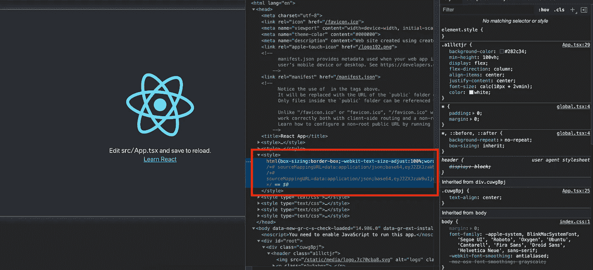
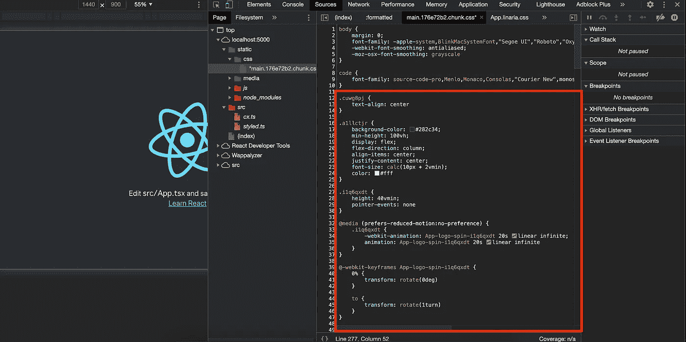

# 使用 Linaria 创建 React 应用程序

> 原文：<https://betterprogramming.pub/create-react-app-with-linaria-9938b3b8e94>

## 向 CRA 介绍 Linaria，JavaScript 中的零运行时 CSS


[https://linaria.dev/](https://linaria.dev/)

JavaScript 中的 CSS 近来在前端开发中越来越受欢迎。

styled-components 是 JS 中 CSS 最著名的库之一，它为许多开发人员带来了很好的 DX，如名称冲突和开箱即用的供应商前缀。但是由于它的解析器，性能上有一些问题。

渲染时，样式组件:

*   解析组件
*   生成 CSS
*   将 CSS 注入 HTML 文件中的样式标记

在某些情况下，整个过程可能会使 React 渲染变慢。

事实上，大多数应用程序甚至不会注意到性能问题，除非有大量由样式化组件组成的组件。

但是，如果你的应用程序变得越来越大，并且 UI 变化很快，就应该考虑它了。

# 利纳里亚

[Linaria](https://github.com/callstack/linaria) 可以为您的需求工作。

Linaria 使用**零运行时**生成 CSS，这意味着 CSS 在构建期间被提取以链接 HTML 中的标签，而不是像样式化组件那样运行时。

Linaria 有一个与 styled-components 非常相似的 API，所以如果你的应用依赖于 styled-components API，你可以顺利地将它们迁移到 Linaria。

这篇文章将带你了解如何向 Linaria 介绍 [create-react-app](https://github.com/facebook/create-react-app) 。

以下是 GitHub 的最终代码:

[](https://github.com/manakuro/create-react-app-with-linaria-example) [## manakuro/create-react-app-with-linaria-示例

### 使用 linaria 创建 react 应用程序示例 GitHub 是 5000 多万开发人员的家园，他们共同工作来托管和审查…

github.com](https://github.com/manakuro/create-react-app-with-linaria-example) 

# 概观

为了快速测试 Linaria，我们将按照以下步骤设置 React 应用程序:

1.  创建 React 应用程序。
2.  设置 [react-app-rewired](https://github.com/timarney/react-app-rewired)
3.  安装 Linaria
4.  建立巴别塔
5.  设置 Webpack 配置

# 创建 React 应用

为了快速开始，我们将使用 [create-react-app](https://github.com/facebook/create-react-app) 来创建一个 react 应用程序:

```
npx create-react-app linaria-app --template typescript
```

安装后，您可以通过运行以下命令来运行 dev 服务器:

```
yarn start
```

您将看到欢迎页面:


欢迎页面

# 2.设置 [react-app-rewired](https://github.com/timarney/react-app-rewired)

接下来，我们将设置 [react-app-rewired](https://github.com/timarney/react-app-rewired) 来覆盖 create-react-app 配置，因为为了使用 Linaria，我们需要在 Webpack 配置中添加加载程序。

还有其他选择，所以你可以选择其中任何一个来适合你的项目。

*   [重新编写](https://github.com/rescripts/rescripts)
*   [react-scripts-rewired](https://github.com/marcopeg/create-react-app/blob/master/packages/react-scripts/README.md)
*   [克拉科](https://github.com/sharegate/craco)

在这一块，我们将使用 [react-app-rewired](https://github.com/timarney/react-app-rewired) 和 [customize-cra](https://github.com/arackaf/customize-cra) ，这是一套 CRA 2.0 兼容的实用程序。

```
yarn add -D customize-cra react-app-rewired
```

我们还将更改`package.json`中的一些脚本:

```
"scripts": {
  "start": "react-app-rewired start",
  "build": "react-app-rewired build",
  "test": "react-app-rewired test --env=jsdom",
  "eject": "react-scripts eject"
},
```

在根文件夹中添加`config-overrides.js`:

现在，我们添加了`useBabelRc`，它允许您在项目中启用`.babelrc`文件。

并在根文件夹中添加`.babelrc`:

# 3.安装 Linaria

现在我们准备定制 Webpack 配置和 Babel 配置。

接下来，我们将设置 Linaria。

安装 Linaria:

```
yarn add @linaria/core @linaria/react @linaria/babel-preset @linaria/shaker
```

# 4.建立巴别塔

接下来，我们将添加 Linaria 预置来转换它们的语法。

将`@linaria`添加到`.babelrc`:

# 5.设置 Webpack 配置

接下来，我们将把 Linaria 加载器添加到 Webpack 配置中。

首先，安装`@linaria/webpack-loader`:

```
yarn add -D @linaria/webpack-loader
```

打开`config-overrides.js`并添加一些代码:

配置-覆盖. js

`addWebpackModuleRule`允许您添加新的模块规则。

在规则中，我们需要添加加载器`@linaria/webpack-loder`作为加载器，并传递一些选项。

`cacheDirectory`是加载程序输出 CSS 文件的目录路径。

在 CRA 中，我们需要将文件夹添加到`src`中以使它们正常工作。

所有的选项都可以在这里看到[。](https://github.com/callstack/linaria/blob/master/docs/BUNDLERS_INTEGRATION.md#options)

# 测试 Linaria

就是这样。我们准备在整个项目中使用 Linaria。

所以，让我们在`App.tsx`中做一些改变:

`styled` API 与样式化组件中的 API 几乎相同。因此，在您的编辑器中，如果支持样式化组件，它可以很好地进行样式化。

# 添加全局样式

最后，我们将通过 Linaria 添加一个全局样式。

为此，我们必须像这样导出`src/index.tsx`文件中的`globals`变量。

index.tsx

所以，在某些情况下，你想要包含你的全局样式或者重置 CSS，比如 [normalize.css](https://github.com/necolas/normalize.css/) 和 [ress.css](https://github.com/filipelinhares/ress/blob/master/ress.css) 。

在这段代码中，我们将添加`styles/global.ts`并导出`ress`来重置默认样式。

添加`ress`文件:

并在`src/index.tsx`中导出:

您会发现样式被提取出来并包含在 HTML 中。



index.html

它似乎工作得很好。

# 生产构建

在开发模式下，create-react-app 不允许您在加载器中提取所有 CSS 文件，这是出于性能方面的考虑。(您可以在 Webpack 配置[中查看此处](https://github.com/facebook/create-react-app/blob/master/packages/react-scripts/config/webpack.config.js#L110)。)

但是对于生产构建，Linaria 会自动提取所有文件，并将它们作为链接标签包含在内，而无需运行时构建。

让我们看看它是如何工作的。

通过以下命令执行生产构建:

```
yarn build
```

之后，你会看到`build`文件夹:

```
File sizes after gzip:43.53 KB  build/static/js/2.5d19e3f9.chunk.js
  1.42 KB   build/static/js/3.886047d3.chunk.js
  1.38 KB   build/static/css/main.176e72b2.chunk.css
  1.19 KB   build/static/js/runtime-main.9f7e67d2.js
  712 B     build/static/js/main.a421ec47.chunk.jsThe project was built assuming it is hosted at /.
You can control this with the homepage field in your package.json.The build folder is ready to be deployed.
You may serve it with a static server:yarn global add serve
  serve -s buildFind out more about deployment here:[https://cra.link/deployment](https://cra.link/deployment)✨  Done in 17.80s.
```

并安装`serve`:

```
npm i -g serve
```

并提供构建文件夹:

```
serve -s build
```

因此您可以在本地访问`http://localhost:5000`。

打开检查器并查看静态文件。您可以找到作为链接标签包含的主 CSS 文件。

有一种风格是在构建时生成的`App.tsx`。



CSS 文件

# 结论

就是这样！我们已经将如何引入 Linaria 转换为创建-反应-应用程序。

最后，这是最终的代码库。

[](https://github.com/manakuro/create-react-app-with-linaria-example) [## manakuro/create-react-app-with-linaria-示例

### 使用 linaria 创建 react 应用程序示例 GitHub 是 5000 多万开发人员的家园，他们共同工作来托管和审查…

github.com](https://github.com/manakuro/create-react-app-with-linaria-example) 

希望对你有帮助。