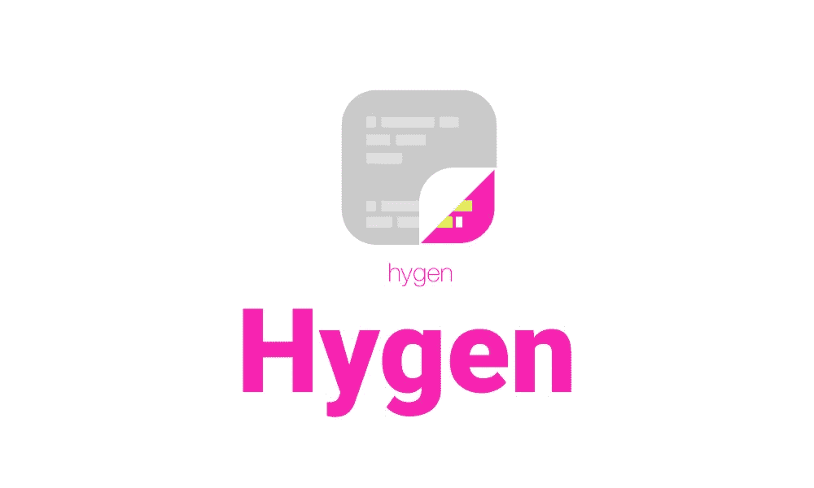
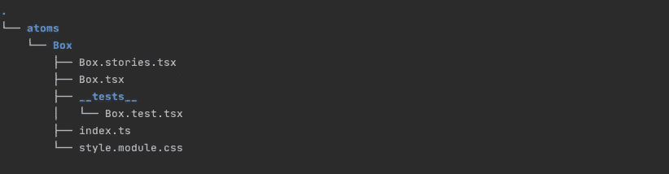
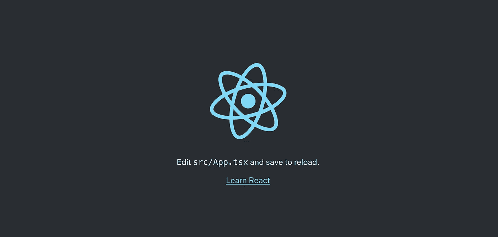
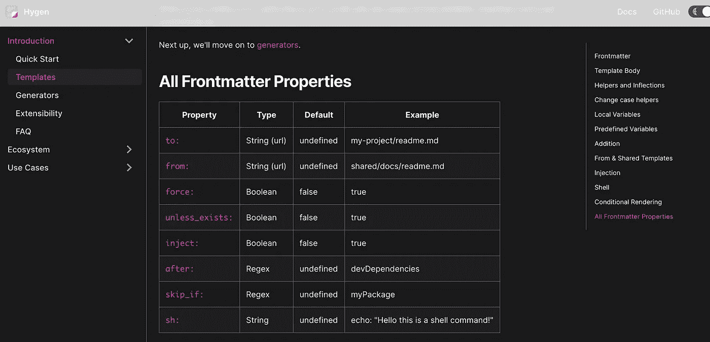

# 使用 Hygen 创建 React 组件

> 原文：<https://betterprogramming.pub/create-react-components-using-hygen-687be39a6913>

## Hygen 是一个自动代码生成器



照片来自 [Hygen](http://www.hygen.io/) 。

在 React 开发中，如果组成一个组件的文件数量持续增长(例如故事书文件、测试文件、CSS 模块)，你会发现手工创建这些文件有点麻烦。

假设一个组件具有这样的结构:



组件结构

Hygen 是一个基于 Node.js 的代码生成器，它允许你通过运行一个交互命令来自动处理常见的代码杂务。

本文将带您了解如何使用 Hygen 高效地创建 React 组件。

以下是 GitHub 的最终代码:

[](https://github.com/manakuro/hygen-example-with-react) [## mana kuro/hygen-示例-反应

### 这个项目是用 Create React App 引导的。在项目目录中，您可以运行:在…中运行应用程序

github.com](https://github.com/manakuro/hygen-example-with-react) 

# 概观

为了测试 Hygen，我们将按照以下步骤设置 React 应用程序:

1.  创建 React 应用程序。
2.  设置 Hygen。
3.  创建模板文件。
4.  创建配置文件。
5.  将脚本添加到`package.json`。

# 1.创建 React 应用

为了快速开始，我们将使用 [create-react-app](https://github.com/facebook/create-react-app) 来创建一个 react 应用程序:

```
npx create-react-app hygen-app --template typescript
```

安装后，您可以通过运行以下命令来运行 dev 服务器:

```
yarn start
```

您将看到欢迎页面:



欢迎页面

# 2.设置 Hygen

接下来，我们将安装 Hygen 并进行设置。

要安装 Hygen:

```
yarn add -D hygen
```

接下来，我们将创建模板文件来创建 React 组件。

默认情况下，Hygen 在项目的任何文件夹级别选择一个`_templates`文件夹来加载模板文件。

在本文中，我们想为它添加一个自定义文件夹。为此，在项目的根目录下添加`.hygen.js`:

```
module.exports = {
  templates: `${__dirname}/.hygen`,
}
```

这将用`.hygen`文件夹替换默认路径(`_templates`)。

并将`new/components`添加到`.hygen`文件夹中:

```
.hygen
└── new
    └── component
```

# 3.创建模板文件

现在我们已经设置了 Hygen，我们将创建以下模板文件:

*   `index.ts`
*   反应组分
*   测试文件
*   故事书文件
*   CSS 模块

## index.ts

首先，我们将为`index.ts`创建一个模板，导出文件夹的所有依赖项。

在`.hygen/new/component`中增加`index.tsx.ejs.t`:

Hygen 使用 Frontmatter 作为模板元数据，使用 EJS 模板引擎作为主体。

在头中，我们放置了`to`属性，用于文件的输出路径。

您可以在文档中检查所有属性[。](http://www.hygen.io/docs/templates/#frontmatter)

[](http://www.hygen.io/docs/templates/#frontmatter)

图片来自 Hygen。

`<%= absPath %>`是 [EJS](https://github.com/mde/ejs) 的标签，输出模板中的值。

在这种情况下，如果我们将`src/components/atoms/Button`赋给`absPath`变量，那么路径将会是`src/components/atoms/Button/index.tsx`。

为了传递变量，我们需要创建`index.js`来配置我们将要覆盖的内容。稍后创建一个配置文件节。

## 反应组分

接下来，我们将为 React 组件创建一个模板。

在`.hygen/new/component`中增加`component.tsx.ejs.t`:

## 测试文件

接下来，我们将为`Test`文件创建一个模板。

在`.hygen/new/component`中增加`test.tsx.ejs.t`:

## 故事书文件

接下来，我们将为故事书文件创建一个模板。

在`.hygen/new/component`中增加`stories.tsx.ejs.t`:

## CSS 模块

接下来，我们将为 CSS 模块创建一个模板。

在`.hygen/new/component`中增加`style.module.css.ejs.t`:

# 4.创建配置文件

既然我们已经设置了所有的模板文件，我们将为 Hygen 创建一个配置文件。

让我们在`.hygen/new/component`中添加`index.js`:

这是一个交互式提示符的配置文件，在执行时会询问您一些问题。您可以在该文件中自定义您想要的任何内容。

`prompt`获取答案数据并返回。正如我上面所说，这将用于 EJS 模板文件。

在这种情况下，`answers`、`path`、`absPath`和`category`被传递到 EJS。

在 GitHub 上可以看到一个高级用例[。](https://github.com/jondot/hygen/blob/404e2350d153e3e1364c443aaa060b68f6212fc7/hygen.io/docs/generators.md)

# 5.将脚本添加到`package.json`

既然我们已经准备好执行 Hygen，我们将把脚本添加到`package.json`:

Hygen 自动映射到文件夹结构并渲染它。在这种情况下，我们必须通过`new component`，这是我们的文件夹结构:

```
.hygen
└── new
    └── component
```

好吧，让我们试试这个。

我们将创建一个`Button`组件:

```
yarn new:component
```

互动提示会出现并回答一些问题:


海根

这在`src/components`文件夹中生成了这些文件:

```
├── components
│   └── atoms
│       └── Button
│           ├── Button.stories.tsx
│           ├── Button.tsx
│           ├── __tests__
│           │   └── Button.test.tsx
│           ├── index.tsx
│           └── style.module.css
```

# 结论

就是这样！我们已经介绍了如何通过使用 Hygen 来自动化 React 开发中的任务。当然，使用 Vue.js 和 Angular 也可以应用到其他项目中。

Hygen 非常灵活，所以您可以定制提示和模板来满足您的需要。

[](https://github.com/jondot/hygen) [## 琼多/海根

### hygen 是存在于您的项目中的简单、快速、可伸缩的代码生成器。✅快速构建临时发电机…

github.com](https://github.com/jondot/hygen) 

最后，这是最终的代码库。这也包括故事书设置，所以你可以检查如何使用它:

[](https://github.com/manakuro/hygen-example-with-react) [## mana kuro/hygen-示例-反应

### 这个项目是用 Create React App 引导的。在项目目录中，您可以运行:在…中运行应用程序

github.com](https://github.com/manakuro/hygen-example-with-react) 

希望这篇文章能帮你找到一些灵感。