# 想要在没有任何服务器的情况下创建 REST APIs？无服务器运行

> 原文：<https://betterprogramming.pub/create-rest-apis-without-any-server-a4059f8ab443>

## 用 DynamoDB、AWS Lambda、API gateway 和无服务器框架构建一个 API


[乔丹·欧宝](https://unsplash.com/@opeleye?utm_source=medium&utm_medium=referral)在 [Unsplash](https://unsplash.com?utm_source=medium&utm_medium=referral) 上的照片

所以你有了创建一个 API 的想法，但是考虑如何管理服务器、数据库和安全性？那么这是给你的一篇文章。

在本文中，我将讨论如何创建自己的 API，而不必担心任何服务器。

答案是无服务器。

无服务器是一种基于云的开发模式，你不需要拥有任何服务器，而是使用可以独立使用的服务。在本教程中，我们将使用 AWS 服务来创建我们自己的 REST API。

> 我们不会在这篇文章中写任何代码，因为这是一篇让你熟悉如何在没有任何服务器的情况下设计 API 的文章。

接下来的事情，在构建 API 的时候会需要我们。

*   **数据库:**你的 API 将从你的数据库返回数据给 API 消费者。
*   **一个 API 端点:**消费者将使用这个端点来调用您的 API 并获得响应。

好了，我们现在来谈谈酷的东西。

# 数据库ˌ资料库

我们将使用 DynamoDb 来存储我们的数据。DynamoDb 是一个非常强大的 NoSQL 数据库，无论数据库有多大，它都能在几毫秒内提供数据。

转到您的 AWS 控制台，搜索 DynamoDb 并创建一个新表，但是等等，在创建一个新表时有一些事情需要知道。在 dynamoDb 中，我们需要为表指定一些键。在 Dynamo DB 中，一个表主要有两个键。

*   **分区键:**这是您的散列键，在表中是唯一的。该键将用于获取该键的任何数据。
*   **排序键:**这是一个键，它将帮助您通过在表上运行查询来获取数据。

让我们创建一个新的 dynamoDb 表

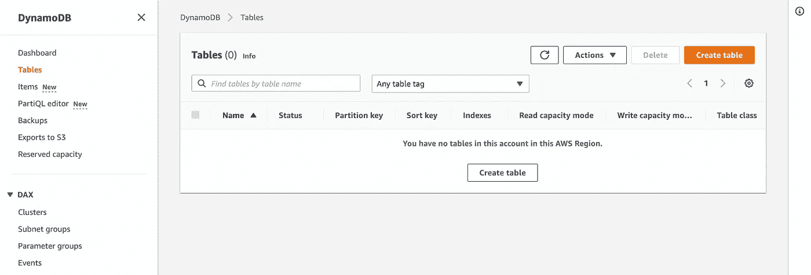

我们将创建一个包含 2 个字段的简单表格。猫名和猫像网址。

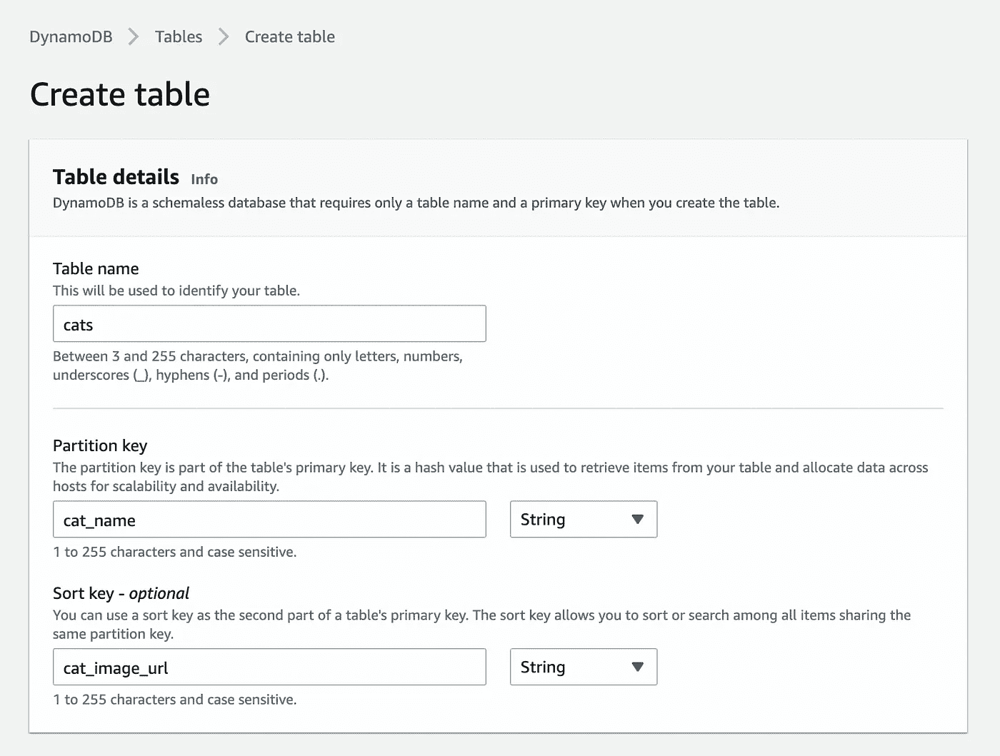

您可以保留其余的默认设置，然后单击“创建表格”

现在我们有了一个数据库表。让我们给这张桌子增加一些项目。现在，我将手动添加一些项目，我们将在 AWS lambda 中查询这些项目。

现在让我们看看，当有人调用我们的 API 时，我们将在哪里运行我们的代码。

# 自动气象站λ

我们将使用 AWS Lambda 为 API 编写代码。Lambda 是 AWS 的一个强大工具，它在一个文件中有一个函数，你可以在这个函数中编写你的代码。

使用 AWS lambda 的好处是它非常便宜。AWS 给你的 lambda 提供了大约 100 万个免费的 API 调用，它会被快速执行，因为*在运行你的 lambda 代码时，AWS 会给它分配资源并执行代码。*如果您使用 Python 编写代码，您可以使用`boto3`库直接连接 dynamoDb 并在其上执行 CRUD 操作。

转到 AWS 控制台中的 AWS Lambda 服务，然后单击“创建函数”

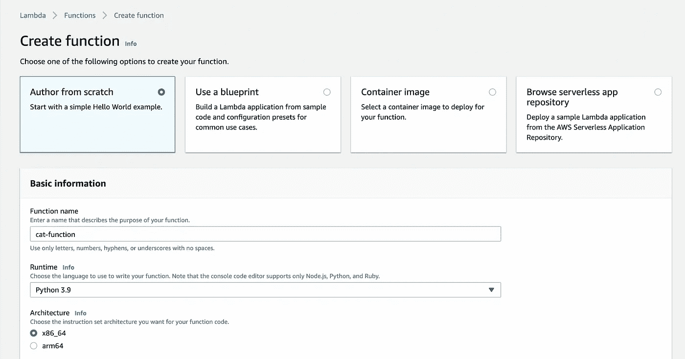

使用默认设置并点击`Create`功能。现在将以下代码添加到 lambda 函数中:

```
import json
import boto3
from boto3.dynamodb.conditions import Keydef lambda_handler(event, context):
    dynamodb = boto3.resource('dynamodb')

    table = dynamodb.Table('cats')     

    resp = table.query(
        KeyConditionExpression=Key('cat_name').eq("HelloCat1")
    )
    return {
        'statusCode': 200,
        'body': json.dumps(resp)
    }
```

这将连接到 dynamo DB 并获取名为:

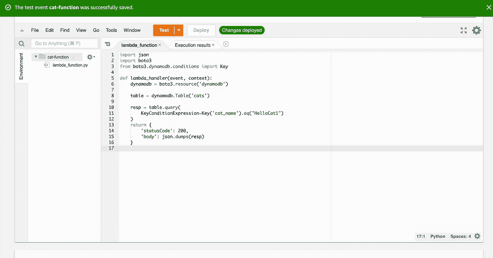

单击 deploy，然后单击 Test，您应该能够看到 lambda 函数的结果:

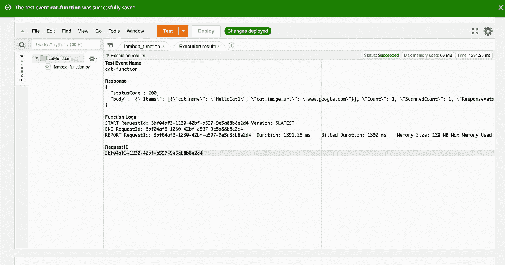

如您所见，我们在 lambda 函数中获得了 dynamoDb 表的结果。

现在我们已经准备好了数据库和代码，但是我们如何向外界公开我们编写的 lambda 函数呢？

# API 网关

AWS 提供了一个名为 API Gateway 的服务，向外界公开资源。

在 AWS 控制台中搜索 API Gateway，你会看到一个创建新资源的选项(这就是我们所说的 API 端点)。创建资源后，您可以配置来执行 lambda 函数。

API gateway 将获得 API 请求体，将调用 lambda 函数，并将获得响应并发送回客户端。您还可以配置其他一些东西，比如如何在 API 网关中处理请求头或响应代码。

创建 API 资源后，AWS 会给你一个 URL 作为 API 端点。

让我们创建 API。转到 API 网关 AWS 服务:

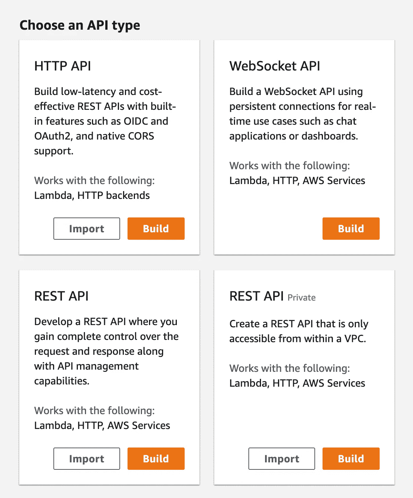

选择 REST API:

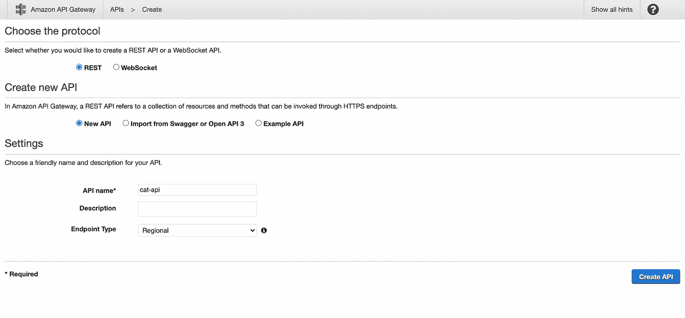

提供详细信息，然后单击创建 API:

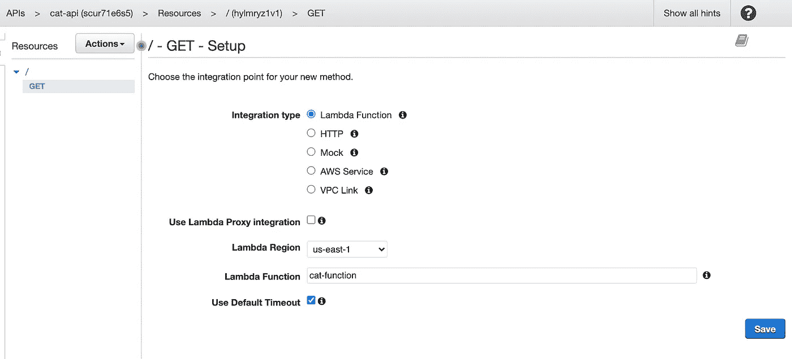

选择 Lambda 函数，然后单击保存。这将创建一个触发 Lambda 函数的端点。

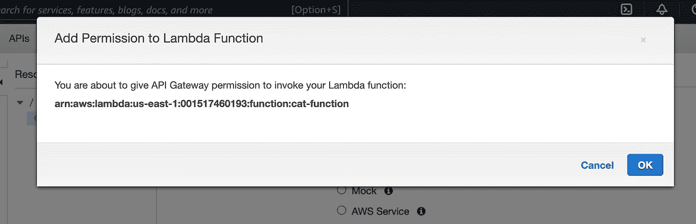

允许调用 lambda 函数的权限:

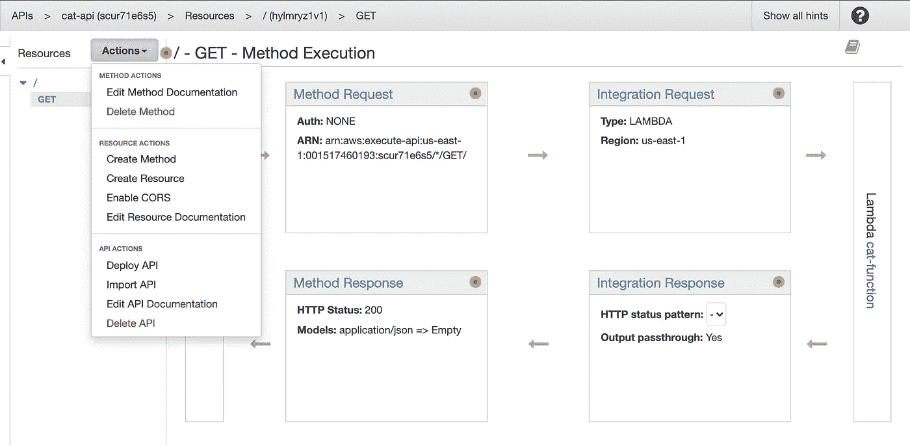

创建 API 后，单击 Actions 选项并选择 Deploy API，这将部署您的 API:

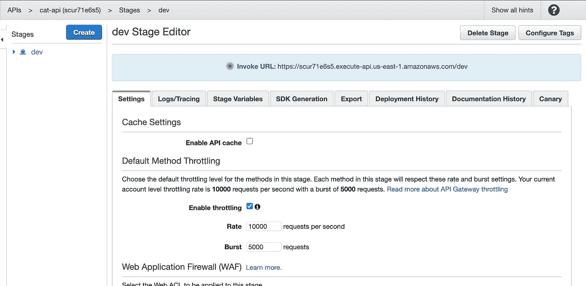

部署 API 之后，您应该能够看到调用 URL，这个 URL 将是您的 API 端点。是时候测试我们的 API 了，去邮递员那里吧

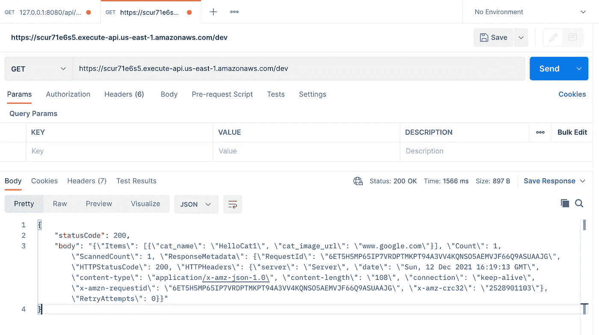

沃拉。！您已经准备好了 REST API。

> 关注我的 [Meta](https://www.instagram.com/manoj_ahi/)

我希望这篇文章对你有用。感谢阅读。如果你喜欢这篇文章，请考虑关注我:)