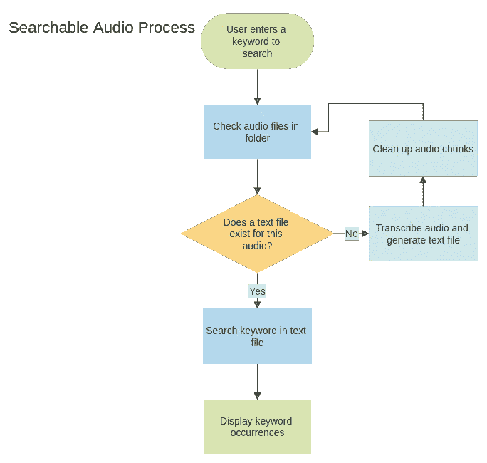
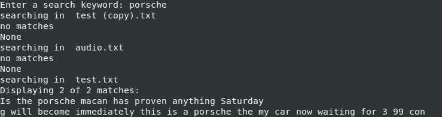
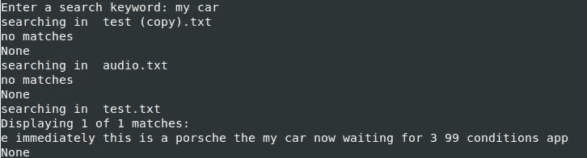

# 使用 Python 创建可搜索的音频

> 原文：<https://betterprogramming.pub/create-searchable-audio-using-python-78b5afc5122>

## 如何使用 Python 和 NLTK 转录音频并使其可搜索


由[凯利·西克玛](https://unsplash.com/@kellysikkema?utm_source=medium&utm_medium=referral)在 [Unsplash](https://unsplash.com?utm_source=medium&utm_medium=referral) 上拍摄的照片

音频内容已经成为流行的通信来源。一个不好的地方是，当你想找东西的时候，你不能只按键盘上的 Control + F 就开始搜索。假设您想要过滤最近的电话，以找到您谈论健康保险的电话。或者你喜欢听播客，想找一个演讲者谈论日本的。

在本教程中，我将向您展示如何转录音频文件，使它们可以搜索。作为一个技术栈，我们将使用 Python 的库，如 NLTK、语音识别等。

我们开始吧！

# 项目流程

首先，让我们来理解这个程序的思想:



程序的工作流程

*   我们将在命令行提示符中输入一个关键字。
*   该计划将试图识别和转录所有可用的音频文件。
*   它会将每个音频的文本写入一个单独的文件。
*   结果将显示包含该关键字的所有文件以及一些上下文。

# 准备代码

我已经将这个项目所需的库导出到一个 [requirements.txt](https://github.com/kirshiyin89/py-searchable-audio/blob/master/requirements.txt) 文件中。可以在本文最后链接的我的 GitHub repo 中找到。在终端中执行以下命令:

```
pip install -r requirements.txt
```

接下来，创建一个新的 Python 文件。导入以下库:

进口货

然后添加以下负责音频处理的代码:

音频转录功能

注意，我们使用`speech_recognition` Python 的库来识别音频。它支持许多音频识别 API。在我们的例子中，我们使用谷歌的[语音识别](https://cloud.google.com/speech-to-text)。每个音频限 60 秒。因此，我们将音频文件切割成更小的块。当您打算处理较大的音频文件时，这很有用。

`transcribe_audio(path)`功能处理音频识别。小音频块将被保存在一个名为`audio_folder`的单独目录中。

请注意，您可以调整`split_on_silence`值以满足您的需求。

`audio_text`变量包含从音频文件中提取的文本。

在将音频文件切割成块并提取文本后，我们通过调用`os.remove(chunk_filename)`进行清理。

接下来，让我们创建另一个函数来打印关键字的上下文。

find_keyword()函数

为了将文本分成有意义的单元，我们使用 NLTK 的`tokenizer`将其标记化。请注意，我们忽略了逗号、句号等。这可以在我们之前定义的行`tokenizer = RegexpTokenizer(r’\w+’)` 中配置。

我们使用 NLTK 的`[concordance](https://www.nltk.org/howto/concordance.html)`特性来显示带有一些上下文的关键字的出现。这样，你就可以决定结果是否符合你的预期。

让我们为关键字搜索创建一个函数:

函数的作用是

`start_search()` 函数以关键字为参数，检查给定路径下的所有`.wav`音频文件。如果相应的文本文件已经存在，我们开始扫描文件。否则，我们调用`transcribe_audio()`函数来处理音频并创建文本文件。这是很有用的，因为我们不想每次搜索新的关键字时都转录音频文件。

最后，让我们创建将在程序启动时执行的`main`函数:

主要功能

编码部分到此为止！

# 测试程序

让我们进入测试部分。我从免费播客网站[下载了一些音频样本。时长从 30 秒到 2 分钟不等。](https://www.thepodcastexchange.ca/audio-samples)

通过执行以下命令启动程序:

```
python3 audio-searcher.py
```

您应该会看到键入关键字的提示:



搜索“保时捷”后的结果

我找“*保时捷*这个词，程序找到 2 个匹配。如你所见，它显示了上下文和关键词，这很棒。

然而，`concordance`只检查单个单词的出现。如果您想要搜索短语，请考虑使用字符串列表:

```
print(text.concordance(keyword.split(' ')))
```

例如，假设您输入“*我的汽车*”。NLTK 将匹配整个短语的出现:



按顺序查找多个单词

虽然语音识别可能不是最好的，但它应该足以给你结果。

顺便说一下，这个项目中的样本是英文的，但谷歌的语音识别支持许多其他语言。改变目标语言非常简单:

```
text = speech_recognizer.recognize_google(audio_file, **language = "hu-HU"**)
```

# 结论

在本教程中，您学习了如何将录音转换为可搜索的文本文件。因此，您可以搜索关键字来识别您正在寻找的音频文件。

该项目的完整代码可以在我的 [GitHub repo](https://github.com/kirshiyin89/py-searchable-audio/tree/master) 中找到。

作为未来的增强，您可以实现一个估计文本中关键字位置的特性。比如发生在哪一分钟，还是在开头，中间，还是结尾。

我希望你已经得到了创建自己的项目的灵感。感谢您的阅读，祝您编码愉快！