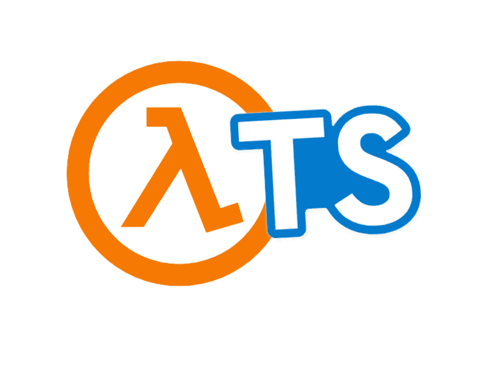
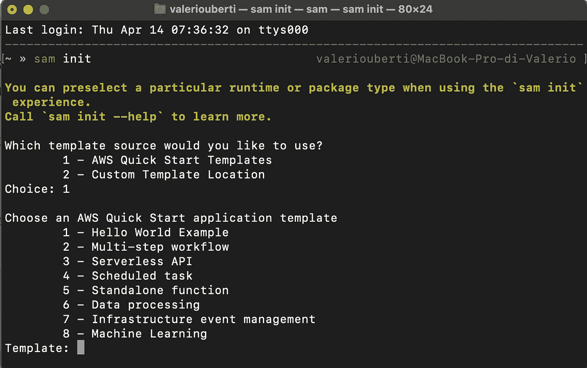
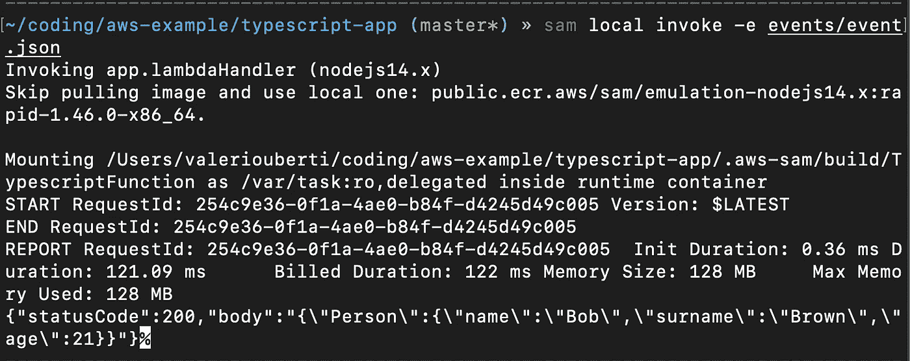

# 使用 TypeScript 创建简单的 AWS Lambda

> 原文：<https://betterprogramming.pub/create-simple-aws-lambda-using-typescript-732c8a4a7a09>

## 为我的 Lambda 函数使用类型脚本



大家好，今天我想谈谈如何使用 TypeScript 编写一个简单的 AWS Lambda。我们知道 NodeJs 是编写 Lambda 函数的常用语言，但是由于缺乏类型检查和代码调试，JavaScript 可能会令人沮丧。

为 lambda 使用 Typescript 有一些好处，比如:

1.  使用 IDE 编程时的代码完成提示
2.  编译时错误检查
3.  关于你的输入和输出结构的知识

好了，说够了。让我们跳到例子！

# 准备

在开始使用 [SAM CLI](https://docs.aws.amazon.com/serverless-application-model/latest/developerguide/serverless-sam-cli-install.html) 工具创建 lambda 项目示例之前:

```
sam init
```

在您的终端中，您应该会看到类似这样的内容:



选择第一个选项，然后再选择一个
当该过程完成时，您应该有一个如下所示的结构化文件夹:

```
├── README.md
├── events
│   └── event.json
├── hello-world
│   ├── app.js
│   ├── package.json
│   └── tests
│       └── unit
│           └── test-handler.js
└── template.yaml
```

首先，从将`hello-word`文件夹重命名为`src`开始，删除`tests`文件夹(本教程我们不会用到)。完成后，进入终端，开始添加一些依赖项。

使用以下命令从 AWS 依赖项开始:

```
npm install aws-sdk
```

之后，是时候键入依赖关系了:

```
npm install --save-dev typescript @types/aws-lambda @types/node
```

1.  `typescript`
2.  `@type/aws-lambda` **，**其中包含用于代码完成和键入检查的 AWS 类型
3.  `@type/node` **、**其中用于内置类型

安装完所有依赖项后，您可以运行:

```
tsc --init
```

这个命令应该创建一个名为`tsconfig.json`的文件，如下所示:

```
{
  "compilerOptions": {
    "module": "CommonJS",
    "target": "ES2017",
    "noImplicitAny": true,
    "preserveConstEnums": true,
    "outDir": "./built",
    "sourceMap": true
  }
}
```

TypeScript 编译器需要`tsconfig.json`来弄清楚如何将 TypeScript 转换成 JavaScript。

## **更改代码**

好了，现在配置完成了，让我们来修改代码。
将`app.js`重命名为`app.ts`，删除里面的代码。

然后，像这样编写 Lamba 处理程序:

```
**import** { 
  APIGatewayProxyEvent, 
  APIGatewayProxyResult } 
**from "aws-lambda/trigger/api-gateway-proxy"**;**export const** *lambdaHandler* = **async** (
   event: **APIGatewayProxyEvent**
): Promise<**APIGatewayProxyResult**> => { **const** queries = **JSON**.stringify(event.**queryStringParameters**); **return** {
    **statusCode**: 200,
    **body**: `Queries: ${queries}`
  }
}
```

这是一个简单的处理程序，它读取我的函数的查询字符串参数，并在输出中显示它们。酷吧？

好的，但不是让我们使用一些 TypeScript 特性来创建一个`Person`接口:

```
**interface** Person {
  name: **string**
  surname: **string**
  age: **number**
}
```

该函数的目的是传递一个输入，该输入是一个`Person`对象，并将包含的信息显示为一个输出。

让我们编码:

```
**import** { 
  APIGatewayProxyEvent, 
  APIGatewayProxyResult } 
**from "aws-lambda/trigger/api-gateway-proxy"**;**interface** Person {
  name: **string**
  surname: **string**
  age: **number**
}**export const** *lambdaHandler* = **async** (
   event: **APIGatewayProxyEvent**
): Promise<**APIGatewayProxyResult**> => { **const** person: Person = **JSON**.parse(event.**body**); **return** {
    **statusCode**: 200,
    **body**: JSON.stringify({'Person' : person})
  }
}
```

## 部署和测试

现在是时候测试 Lambda 函数了。首先，你必须编译 Lambda 并检查是否一切正常。

转到`package.json`文件，将该步骤添加到脚本部分:

```
 .
.
.
"scripts": {
  "compile": "tsc"
},
.
.
.
```

并执行键入:

```
npm run compile
```

如果一切正常，就编译 Lambda 函数。我们来测试一下！转到`template.yml`并调整到适合您的应用程序。我的是这样的:

```
**AWSTemplateFormatVersion**: '2010-09-09'
**Transform**: AWS::Serverless-2016-10-31
**Description**: Sample Lambda Function in Typescript
**Globals**:
  **Function**:
  **Timeout**: 3
**Resources**:
  **TypescriptFunction**:
    **Type**: AWS::Serverless::Function
    **Properties**:
     **CodeUri**: src/built
     **Handler**: app.lambdaHandler
     **Runtime**: nodejs14.x
     **Events**:
      **Typescript**:
       **Type**: Api
        **Properties**:
         **Path**: /hello
         **Method**: get
.
.
.
```

完成跑步后:

```
sam build
```

如果没有显示错误，让我们修改放在`events`文件夹中的文件`event.json`,并替换字段`body`,如下所示:

```
"body": "{\"name\": \"Bob\", \"surname\":\"Brown\",\"age\":21}",
.
.
.
```

在本地机器上运行 Lambda 函数:

```
sam local invoke -e events/event.json
```

如果一切正常，您应该会在终端输出中看到如下内容:



您的 lambda 现在可以部署到 AWS 了。

# 结论

示例代码可在以下位置找到:

[](https://github.com/valeriouberti/aws-lambda-typescript) [## GitHub-valeriouberti/AWS-Lambda-typescript:AWS Lambda 函数的一个简单示例，在…

### Typescript-GitHub-valeriouberti/AWS-Lambda-Typescript 中 AWS Lambda 函数的简单示例:一个简单的…

github.com](https://github.com/valeriouberti/aws-lambda-typescript) 

我发现为我的 Lambda 函数使用 TypeScript 非常简单和有趣。它帮助我避免错误——比如写方法名和在大量 API 文档中搜索。编译器帮助我编写正确的类型，并在部署之前避免潜在的问题。