# 创建一个 Swift 5 静态库

> 原文：<https://betterprogramming.pub/create-swift-5-static-library-f1c7a1be3e45>

## 一个简单快速的分步指南

[法比安·格罗斯](https://unsplash.com/@grohsfabian?utm_source=unsplash&utm_medium=referral&utm_content=creditCopyText)在 [Unsplash](https://unsplash.com/s/photos/tutorial?utm_source=unsplash&utm_medium=referral&utm_content=creditCopyText) 上拍摄的照片

在本文中，我们将考虑为 [Swift 5](https://swift.org/blog/swift-5-released/) 创建一个静态库，并将其集成到另一个项目中。

这篇文章更像是一个循序渐进的指南，没有涉及很多理论和历史话题。它也不打算考虑所有可能使用或创建静态库的情况。

这只是一个简短的基础教程，尽可能简单快速地为 iOS 应用程序创建您的第一个 Swift 静态库。

# 创建静态库项目

让我们首先创建一个库项目。打开 Xcode，选择`Cocoa Touch Static Library`。

给它起个名字，选择`Swift`作为开发语言。在我们的例子中，我们称它为`Networking`,并假设它将包含与后端通信的代码。

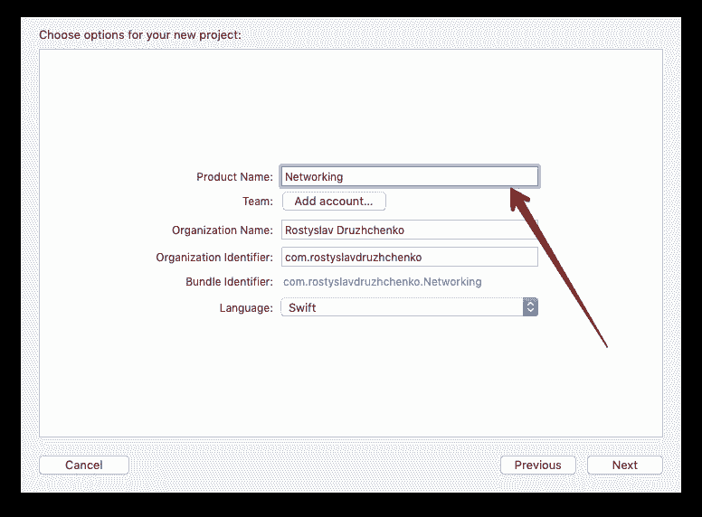

按下`Cmd+N`，选择`Swift file`。

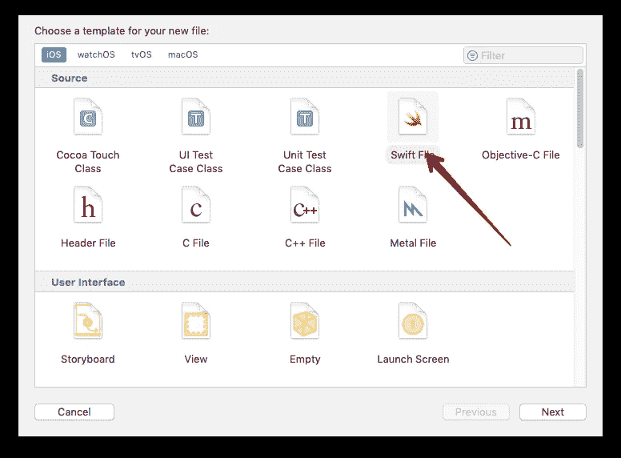

给它一个名字，在我们的例子中，我们将创建一个哑类来与后端 API 的认证部分进行通信，并将其命名为`AuthenticationService`。

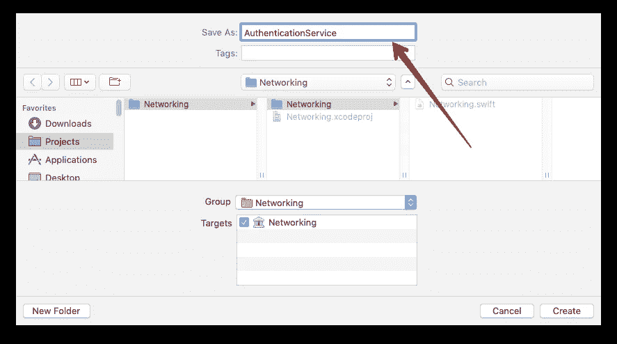

将下面的代码粘贴到创建的文件中:

重要提示:确保你创建了你的类和方法`public`。否则，这些方法和类将无法从您将要使用库的项目中获得。

此外，您必须为`init`编写一个实现，并显式地使其成为`public`。

然后，选择任意一个`Simulator`作为构建目标。

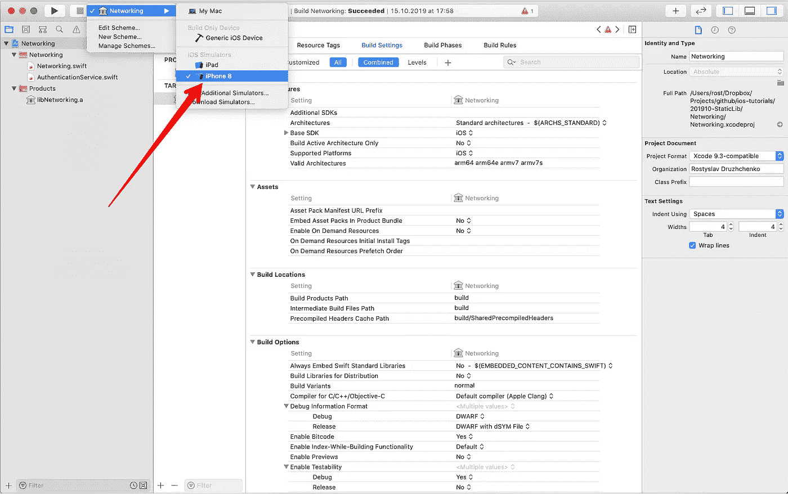

然后，按`Cmd+B`构建项目，在`Products`部分的*项目导航器*中，会找到一个名为`libNetworking.a`的二进制文件。

不介意前缀`lib`，那也行。是苹果提供命名的方式。

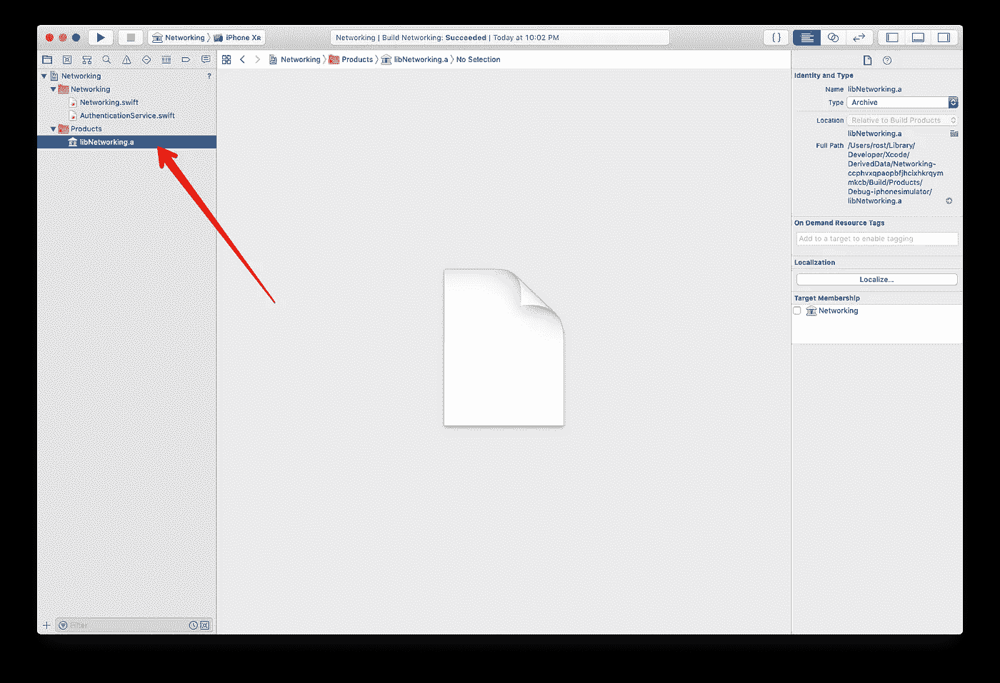

这实际上就是静态库的创建。您已经为模拟器构建了库。您也可以为移动设备构建它，但在本教程中，我们将跳过它，以保持教程简单，并专注于总体思路。

# 集成到另一个项目

好了，现在我们有了一个二进制代码文件，让我们在另一个项目中使用它。

在 Xcode 中，按下`Cmd+Shift+N`，从出现的窗口中选择`Single View Project`。按下`Next`。

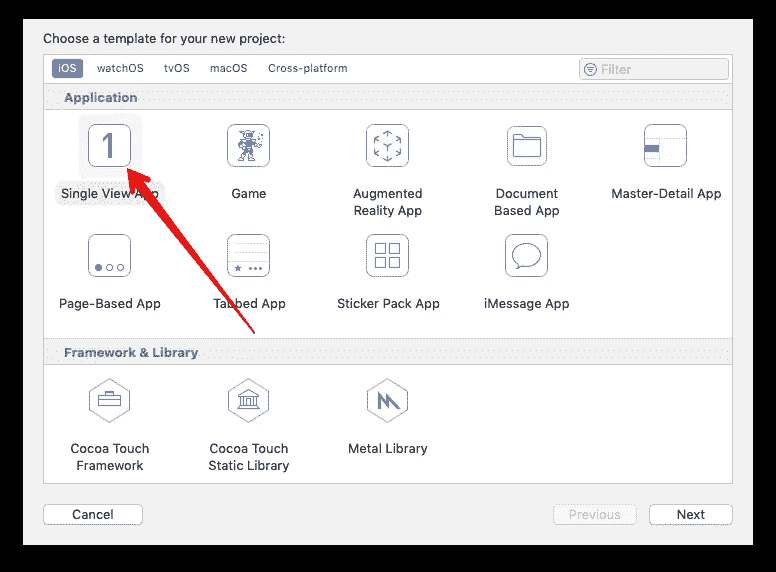

您可以随意命名该项目，例如`SimpleApplication`，然后再次按下`Next`。

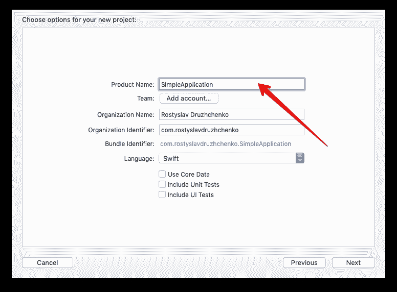

创建项目后，我们就可以集成我们在上一节中创建的库了。

首先，我们需要将编译后的库文件添加到新项目中。为此，在项目导航器中右键单击项目名称并选择`Show in Finder`。

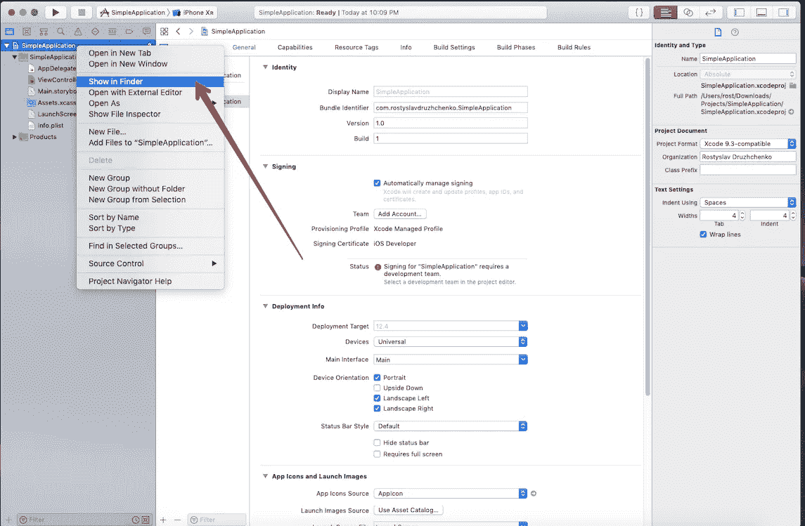

在打开的 Finder 窗口中，在项目的根文件夹中新建一个文件夹，命名为`lib`。

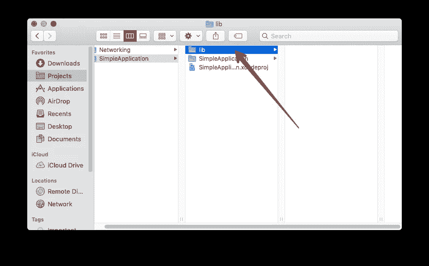

回到 Xcode 中的库项目，在项目导航器中找到文件`libNetworking.a`，右击它，选择`Show in Finder`。

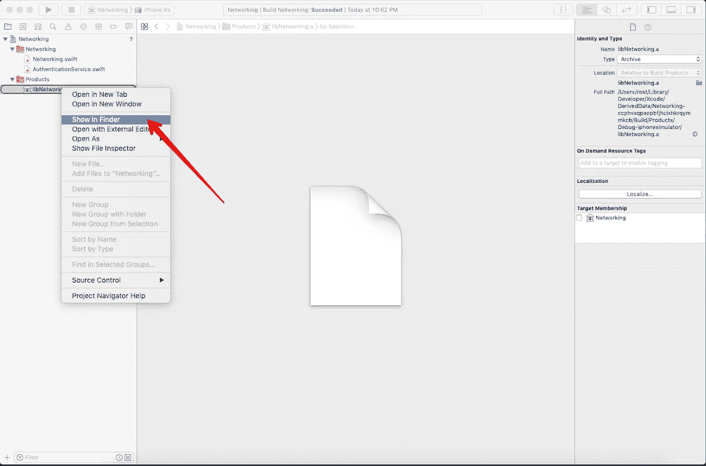

你会在那里找到`libNetworking.a`文件和`Networking.swiftmodule`文件夹。将它们*和*复制并粘贴到`SimpleApplication/lib`文件夹中。

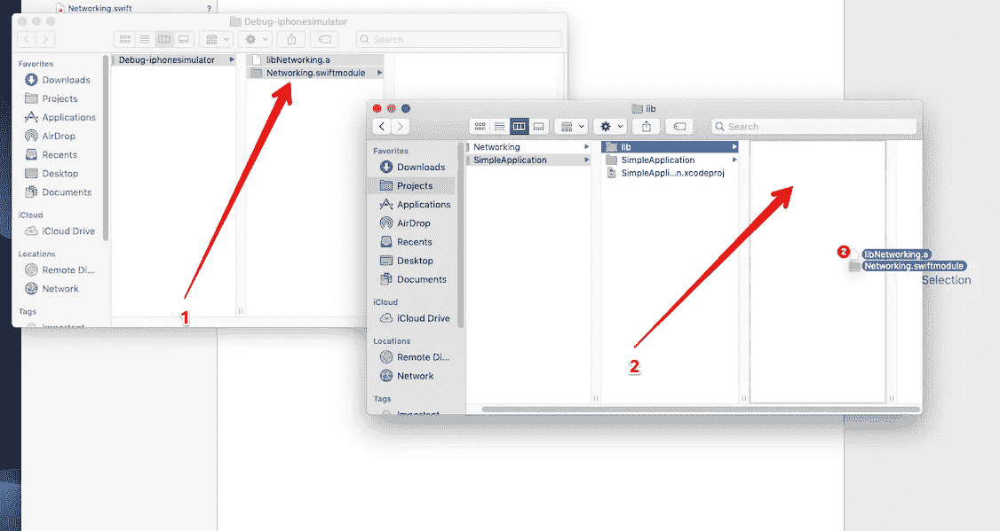

移回 Xcode，再次右击项目名称，选择`Add files to "SimpleApplication"`。

在出现的窗口中，确保选择了`Create Groups`单选按钮，选择`lib`文件夹，然后按`Add`。

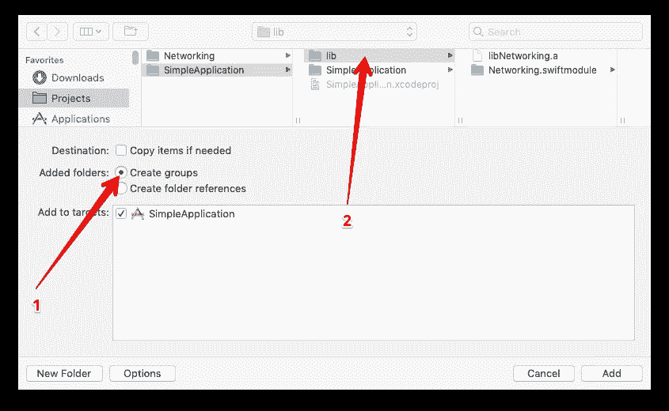

现在你有了新项目的库，Xcode 甚至为你做了一些集成。现在你的任务是检查它是否做得正确，并执行一些额外的步骤。

在项目导航器中选择项目名称，然后选择`General`，选择您的应用目标。

节`Linked Frameworks and Libraries`必须包含一条带有`libNetworking.a`的线。如果没有，按下`+`按钮，手动选择。确保选择了`Required`状态。

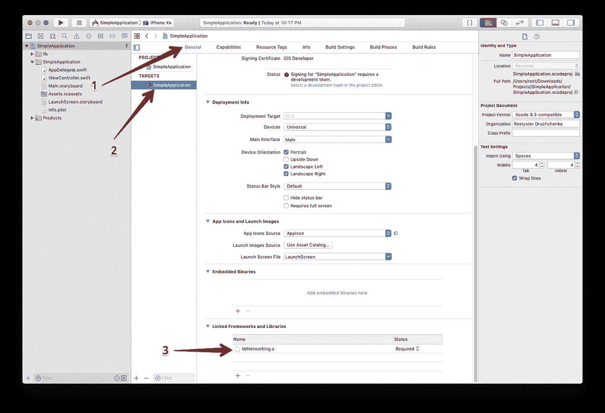

之后，转到`Build Phases`选项卡，展开`Link Binary with Libraries`，确保它包含一条带有`libNetworking.a`的线。如果没有，再次手动添加并将其设置为 required。

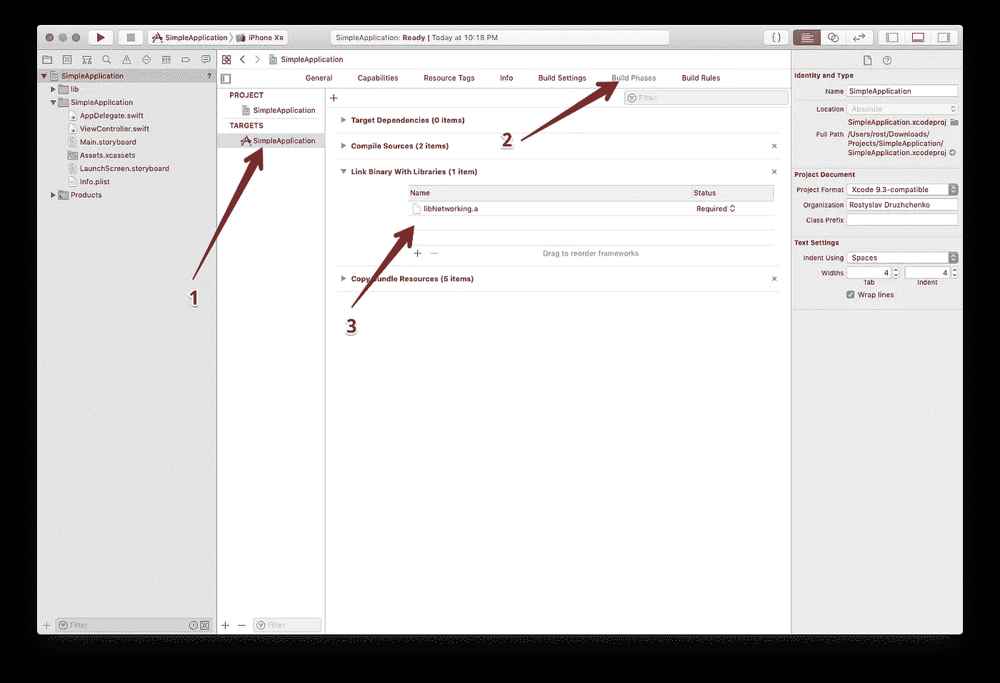

最后，我们到了最后，也可能是最敏感的集成步骤——设置路径。这是一个非常容易出错的步骤，所以要整洁和小心。

在`Build Settings` (1)选项卡中，选择你的目标(2)，选择`All` (3)，和`Combined` (4)。

在右上角的搜索字段(5)中，键入`Search Paths`。从`Library Search Path` (6)复制路径并粘贴到`Import Paths` (7)。

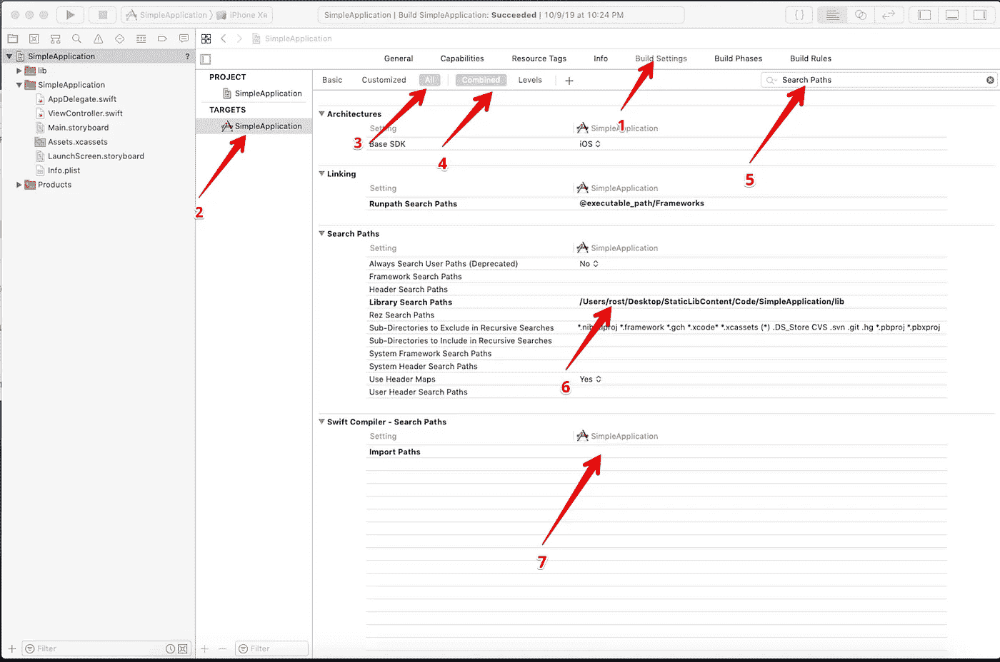

如果`Library Search Path`中没有值，则添加一个新的值`$(PROJECT_DIR)/lib`。对`Import Paths`做同样的操作。

然后，转到您的`ViewController`类并在那里添加代码:

让我们来讨论这一小段代码。

*   `// 1` —导入`Networking`库。这将使你能够在`ViewController`中使用库中的代码。
*   `// 2` —创建属于库的类的实例。
*   `// 3` —调用属于库的方法，并将结果保存到局部变量。当然，我们在这里发送一些虚拟数据并接收一个虚拟响应。
*   最后一个`// 4` —将结果打印到控制台。当您运行您的项目时，您必须看到类似这样的内容:

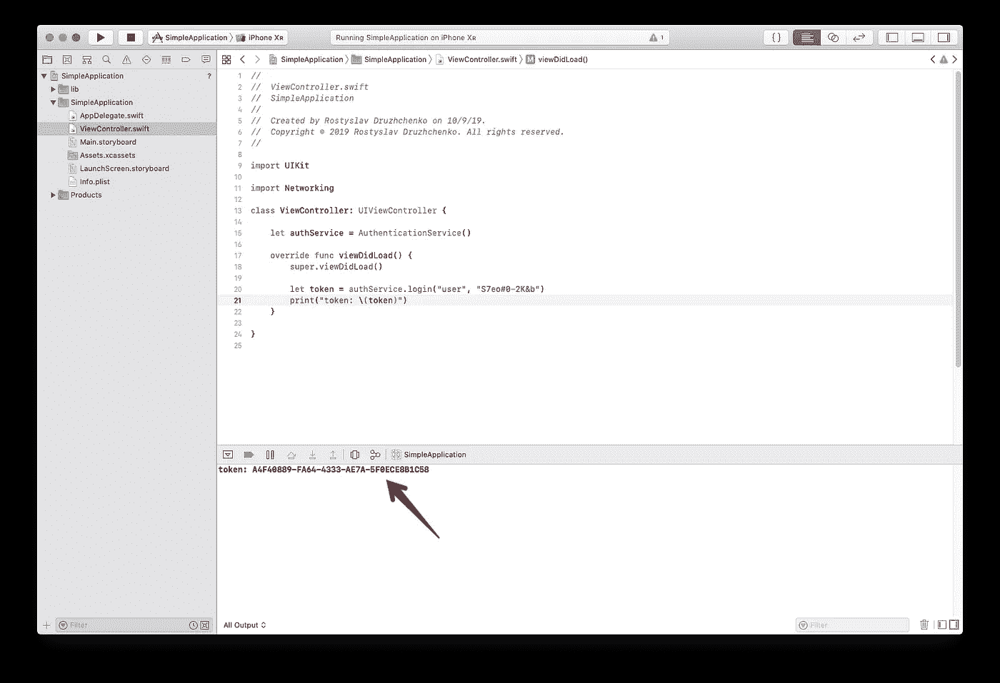

当然，您会看到令牌的另一个值，因为我们对方法进行了编程，以返回一个随机值。

差不多就是这样。现在，您有了一个工作流，可以将代码封装到一个静态库中，并且您可以用现实项目中需要的代码来扩展它。

# 下一步是什么？

正如我们上面提到的，在本文中我们描述了静态库的创建，只针对模拟器。当然，在大多数情况下这是不够的，通常你需要为架构、模拟器和移动设备编译代码。

还有更多。您必须创建一个包含两种架构代码的二进制文件。它被称为`fat`，或者更好地说是`universal`库。这将是下一步要做的事情。

终于结束了。感谢您的阅读，请不要犹豫提出任何与文章中描述的主题相关的问题。

快乐编码。

# 参考

*   [https://github . com/drrost/IOs-tutorials/tree/master/201910-static lib](https://github.com/drrost/ios-tutorials/tree/master/201910-StaticLib)—你可以在这里下载现成的项目源代码。
*   [https://medium . com/better-programming/create-a-swift-5-static-library-part-2-8 bea 54 bb 0 B9 e](https://medium.com/better-programming/create-a-swift-5-static-library-part-2-8bea54bb0b9e)——本教程第二部分。