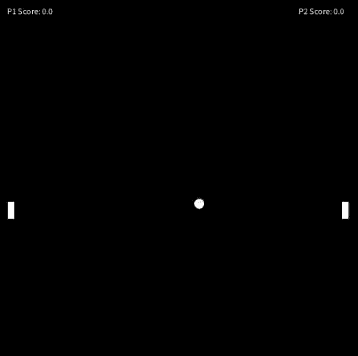
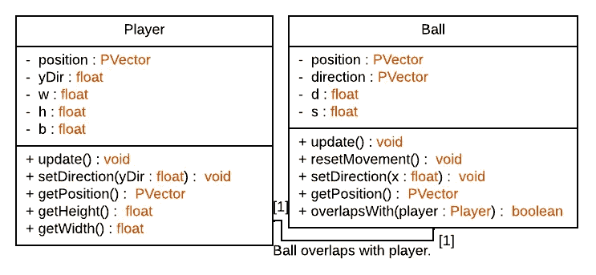
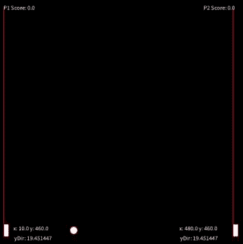
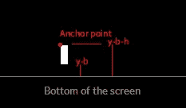
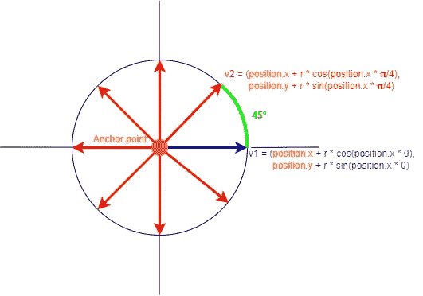
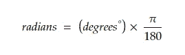
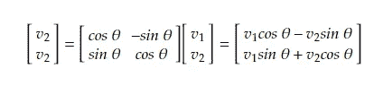
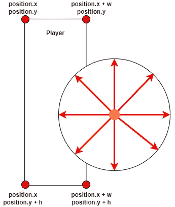

# 用 Java 创建经典的乒乓球游戏

> 原文：<https://betterprogramming.pub/create-the-classic-ping-pong-game-3aea1f7b16e6>

## Java 和处理库教程

一个 GIF 展示了这篇文章中的乒乓球游戏。

你正在寻找一个解释如何重现经典乒乓球游戏的教程吗？然后，不要再看了，本文主要关注使用处理库和 Java 重新创建游戏。我还写了另一篇文章，关于如果你想创建另一个游戏，如何重新创建经典的贪吃蛇游戏。

# 1.下载和安装处理

要下载处理程序，请前往 processing.org/download 的[并选择与首选平台匹配的版本。](https://processing.org/download)

# 2.什么是加工？

Processing 提供了一个图形库和一个集成开发环境(IDE ),它使用编程语言 Java (Wikipedia，2022a)。

# 3.游戏要求

该游戏的要求分为两个不同的部分。第一部分描述了与表现球员、球和环境相关的视觉要求。第二部分描述了不同对象和应用程序应该如何表现的功能需求。

## 3.1 视觉要求

*   玩家对象应该用一个矩形来表示。
*   球对象应该用一个圆来表示。
*   游戏应该包含两个显示每个玩家分数的文本元素。

## 3.1 功能要求

*   玩家对象应该只能在 y 轴上移动。
*   球对象应该能够在 x 轴和 y 轴上移动。
*   如果球对象与玩家对象重叠，它应该在 x 轴上将其方向更改为相反的方向。
*   如果球对象在 y 轴上移动到屏幕之外，它应该将其在 y 轴上的方向改变到相反的方向。
*   如果球对象在 x 轴上移出屏幕，它的位置和方向应该被重置。
*   每当球移出对面的屏幕，一名球员就得一分。
*   第一个播放器应该由键盘控制，第二个播放器由电脑控制。

# 4.游戏对象

该游戏将包含两个不同的类，一个表示球员对象，另一个表示球对象。图 1 显示了包含这两个类的 UML 类图。对于那些从未听说过 UML 类图的人来说，它仅仅是一个包含系统的类、属性、方法和关系的图表(Wikipedia，2022b)。

**图 1:** 一个 UML 类图，展示了乒乓球游戏中使用的两个类。

## 4.1 玩家对象

player 类将用于为两个玩家创建对象，因此，重要的是位置和 y 方向对于每个玩家都是唯一的，但是可以说宽度、高度和边界可以是静态变量，因为所有对象上的值都是相同的。图 2 说明了运动员的定位和他们运动的界限背后的想法。

**图 2:** 一个 GIF 显示了每个玩家的属性以及他们可以移动的路径(红线)。

**4.1.1。玩家属性**

该类需要五个属性(见图 1)，每个属性都有以下用途:

*   `position` —定义玩家 x 和 y 位置的`PVector`。
*   `yDir` —一个`float`，定义玩家移动的方向和速度。
*   `w`—`float`定义玩家矩形的宽度。
*   `h`—`float`定义玩家矩形的高度。
*   `b`—`float`定义玩家移动的边界。

player 类中属性的实现如图 3 所示。

**图 3:** 展示了 player 类中属性的实现。

**4.1.2。玩家方法**

该类还需要五个方法(见图 1)，每个属性都有以下用途:

*   `update()` —一种 void 方法，用于更新与移动、边界检查和绘制可视对象相关的玩家行为。
*   `setDirection(yDir)` —用于更新 y 轴上玩家对象方向的 setter 方法。
*   `getPosition()` —返回玩家对象位置的 getter 方法。
*   `getHeight()` —返回玩家对象高度的 getter 方法。
*   `getWidth()` —返回播放器对象宽度的 getter 方法。

Player 类还需要一个构造函数来设置 y 轴上位置和方向的初始值。构造函数的参数被设计成用`floats`来表示开始位置，在构造函数中它被用来为玩家的位置创建一个新的`PVector`对象的实例。

这将确保玩家对象不会引用内存中的同一个`PVector`对象，如果几个玩家对象在实例化时被赋予同一个`PVector`对象，就会出现这种情况。

方向的 getter 方法允许在类外的对象上设置方向，位置、高度和宽度的 setter 方法允许在类外的对象上读取这些属性(参见图 4 中的实现)。

**图 4:** 显示了播放器构造函数、getter 和 setter 方法的实现。

玩家类中需要的最后一个方法是`update()`方法。图 5 显示了该方法的实现。

**图 5:** 展示了播放器更新方法的实现。

其行为可描述如下:

*   第 10 行——如果`ydir`的值为正，该行将增加玩家的 y 位置，如果`ydir`的值为负，该行将减少玩家的 y 位置。
*   第 14 行—第一行检查玩家的 y 位置是否小于用于定义玩家移动边界的`b`的值。或者换句话说，如果玩家已经到达屏幕顶部的边界。
*   第 16 行——将玩家的 y 位置重置为值`b`,以防止其进一步向屏幕顶部移动。
*   第 19 行——类似于第 14 行的检查，但是检查玩家是否已经到达屏幕的底部。该检查包括玩家的身高和`b`的值，以确保矩形停在正确的位置(参见图 6 的解释)。
*   第 21 行——在屏幕底部重置玩家的 y 位置，以防止其在 y 轴上移出屏幕。

**图 6:** 玩家对象在锚点(position 属性的值)移动，因此它应该在屏幕高度减去`b`和`h`后停止，以确保矩形在其底边到达边界时停止。

玩家类的最后一个例子可以在[这个链接中找到。](https://gist.github.com/niiicolai/132af98673f96ea33671593c769ad389)

## 4.2 球对象

ball 类与 player 类非常相似，但是它可以在 x 轴和 y 轴上移动。图 7 展示了球在移动时位置和方向的值是如何变化的。

**图 7:** 显示球对象属性的 GIF。

**4.1.1。球的属性**

图 1 显示了 ball 类需要四个属性，可以描述如下:

*   `position`—`PVector`定义球的 x 和 y 位置。
*   `direction`—`PVector`定义球运动的方向和速度。
*   `d`—`float`定义了球的圆的直径。
*   `s`—`float`定义球的开始速度。

球的属性的实现可以在图 8 中看到。

**图 8:** 球类中属性的实现。

**4.1.2。球法**

ball 类也应该像 player 类一样有五个方法，如下所述:

*   `update()` —更新球的移动、边界和视觉效果的无效方法。
*   `getPosition()` —返回球的位置的 getter 方法。
*   `resetMovement()` —将球的位置重置到屏幕中心并将其方向重置为随机值的无效方法。
*   `setDirection(x)`—设置球的 x 方向的 setter 方法。
*   `overlapsWith(player)` —如果球与给定球员重叠，布尔方法返回 true。

球的构造函数和方法`getPosition()`、`resetMovement()`、`setDirection(x)`和`update()`的实现如图 9 所示。

**图 9:** 球的构造函数的实现，以及方法 getPosition()、resetMovement()、invertDirectionX()和 update()。

**4.1.2。碰撞方法**

应该在 ball 类中实现的最后一个方法是`overlapsWith(player)`方法。在展示实现之前，我想简单描述一下解决方案背后的数学思想。

图 10 显示了在一个坐标系中绘制的球，锚点位于 origo。锚点等于球的`position`属性。

图中的每个向量/箭头都指向相对于锚点的一个点，该点应该在碰撞检查中使用。可以通过将角度转换为弧度的公式和旋转矩阵来计算这些点。

**图 10:** 图为在一个坐标系内绘制的球。锚点是球的位置，每个向量/箭头指向相对于球的锚点的一个点。每个向量旋转 45 度。

将角度转换为弧度的公式可以定义为(Wikipedia，2022c):

旋转矢量 ***v，*** θ弧度的公式可以定义为(维基百科，2022d):

用上面的公式计算出的点被用来检查其中一个是否在一个球员的角点之间，这意味着球与该球员重叠(见图 11)。

**图 11:** 图中显示了一个球员对象与球对象重叠。它还根据玩家的位置、宽度和高度属性显示每个角点。

图 12 中的第 24 行显示了用于将角度转换为弧度的公式的实现，图 12 中的第 28–29 行显示了用于将 2D 矢量旋转 45 度的旋转矩阵的实现。

图 12 中的第 33–34 行显示了如果点在玩家的角点内，则检查返回 true。

**图 12:** 该图显示了‘overlapsWith(player)’方法的实现。

球类的最后一个例子可以在[这个链接中找到。](https://gist.github.com/niiicolai/b7bf280f984e6902c4a4573db6987864)

# 5.设置处理控制流

应用程序需要三种处理方法，一旦应用程序启动就执行的`setup()`方法(Processing.org，2022a)，每帧执行一次直到停止的`draw()`方法(Processing.org，2022b)，以及当按键被按下时执行的`keyPressed()`方法(Processing.org，2022c)。

## 5.1 全局属性

这个游戏需要几个全局属性来引用球员对象、球对象、速度和球员得分(参见图 13)。

**图 13:** 展示了游戏全局属性的实现。

## 5.2 设置

`setup()`方法用于初始化球员和球实例，并设置屏幕尺寸(参见图 14)。

**图 14:** 展示了游戏的设置方法的实现。

## 5.3 抽签

`draw()`方法用于游戏的重复逻辑。图 15 中的第 20–33 行显示了一个 if-和 else if-语句，用于检查球是否在屏幕之外，如果是，其中一名球员将得到一分，球的位置和方向将被重置。图 14 中的第 36–29 行显示了一个检查，如果其中一个玩家与反转球的 x 方向的球重叠，则该检查评估为真。图 14 中的第 43–58 行显示了计算机如何控制其球员对象(`p2`)的一个小实现，第 61–64 行显示了球员得分文本的实现。

**图 15:** 展示了游戏的 draw 方法的实现。

## 5.4 按键

游戏需要的最后一个代码是用于处理移动`p1`对象的键盘事件的功能(参见图 16)。

**图 16:** 展示了游戏的按键方法的实现。

# 6.摘要

本文中的乒乓球游戏是使用处理库和 Java 创建的。它包含两个类，一个用于表示球员对象的`Player`类和一个用于表示球对象的`Ball`类。

这些类在 Processing 的`setup()` `draw()`和`keyPressed()`方法中一起使用来设置游戏的连续行为和结构。第一个玩家对象可以使用`s`和`w`通过键盘控制，第二个玩家由电脑控制。

完整游戏的例子可以在[这个链接中找到。](https://gist.github.com/niiicolai/246eba2b9d8c76355e5e89b5d8af6d95)

# 文献学

En.wikipedia.org(2022 年)。*处理(编程语言)—维基百科*。[在线]见:<[https://en . Wikipedia . org/wiki/Processing _(programming _ language)](https://en.wikipedia.org/wiki/Processing_(programming_language))>【2022 年 4 月 30 日访问】。

En.wikipedia.org(2022 b)。*类图——维基百科*。[在线]可在:<[https://en.wikipedia.org/wiki/Class_diagram](https://en.wikipedia.org/wiki/Class_diagram)>【2022 年 5 月 16 日访问】。

En.wikipedia.org。*弧度—维基百科*。[在线]可在:<[https://en.wikipedia.org/wiki/Radian](https://en.wikipedia.org/wiki/Radian)>【2022 年 5 月 17 日访问】。

En.wikipedia.org。(2022d)。*旋转矩阵—维基百科*。[在线]可在 https://en.wikipedia.org/wiki/Rotation_matrix>【2022 年 5 月 17 日】的< [找到。](https://en.wikipedia.org/wiki/Rotation_matrix)

Processing.org(2022 年)。设置()[在线]可在:【https://processing.org/reference/setup_.html>【2022 年 4 月 30 日访问】<[获得。](https://processing.org/reference/setup_.html)

Processing.org(2022 b)。draw()[在线]可在:<[https://processing.org/reference/draw_.html](https://processing.org/reference/draw_.html)>【2022 年 4 月 30 日访问】。

Processing.org。keyPressed 在线]可在:<[https://processing.org/reference/keyPressed_.html](https://processing.org/reference/keyPressed_.html)>【2022 年 4 月 30 日获取】。